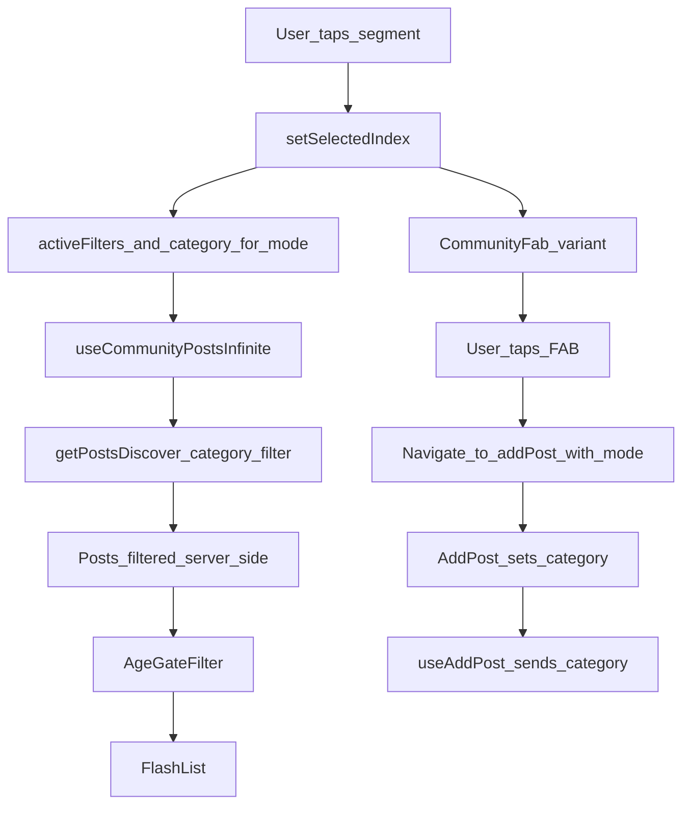

# Community Showcase/Help segmented control plan

## Context & decisions

- **Segmented control package**: `@react-native-segmented-control/segmented-control` is already installed (`package.json`).
- **Docs source**: Context7 doesn’t currently index this scoped package (it only returned unrelated segmented-control libs), so we’ll reference the library’s GitHub README/`index.d.ts` (found via Brave) for prop names (`values`, `selectedIndex`, `onChange`, `tintColor`, `fontStyle`, `activeFontStyle`, etc.).
- **Help post identification**: Use `post.category === "problem_deficiency"`.
- **Per-segment filters**: Showcase and Help Station each keep their own search + filter state.
- **Performance/pagination**: Category filtering is applied in the **data fetching layer** (server-side/PostgREST query) to avoid “empty pages” and broken pagination from client-side filtering.

## UX behavior (what users will experience)

- A segmented switch **inside the green Community header** (below title/search row, above the sheet) with values **Showcase** / **Help Station**.
- Switching segments:
  - Swaps the feed contents (Showcase = standard posts; Help Station = `"problem_deficiency"` posts).
  - Restores that segment’s last used discovery filters (search, sort, photosOnly, mineOnly).
  - Updates the FAB styling/icon to clearly indicate “Help posting mode”.
- Creating a post from Help Station auto-tags the post as `category="problem_deficiency"`.

## Implementation outline

### 1) Add a canonical Help category constant

- Create a small constant (single source of truth) used by feed filtering + post creation.
- Proposed location: [`src/lib/community/post-categories.ts`](src/lib/community/post-categories.ts).
  - Export `COMMUNITY_HELP_CATEGORY = 'problem_deficiency' as const`.

### 2) Header: embed `SegmentedControl` with the requested styling

- Update [`src/components/community/community-header.tsx`](src/components/community/community-header.tsx):
  - Add props:
    - `selectedIndex: number`
    - `onSegmentChange: (index: number) => void`
  - Render `SegmentedControl` inside the header container (below the existing search-row), wrapped with a `View` that provides spacing (`mb-4`).
  - Styling per your spec:
    - **Container background**: `backgroundColor: 'rgba(255, 255, 255, 0.1)'`
    - **Active segment**: `tintColor: '#FFFFFF'`
    - **Inactive text**: via `fontStyle: { color: 'rgba(255, 255, 255, 0.8)' }`
    - **Active text**: via `activeFontStyle: { color: colors.primary[900] }`
  - Values: `['Showcase', 'Help Station']` (sourced from i18n keys).
  - Optional alignment tweak to match your “bg-primary-900 header” intent without changing global header theming:
    - Set Community header background to `colors.primary[900]` in light mode (keep `colors.primary[800] `in dark) instead of `getHeaderColors`.

### 3) Screen state: add segment state + per-segment filter state

- Update [`src/app/(app)/community.tsx`](<src/app/(app)/community.tsx>):
  - Add `const [selectedIndex, setSelectedIndex] = React.useState(0);`.
  - Define `mode` derived from index: `mode = selectedIndex === 1 ? 'help' : 'showcase'`.
  - Replace the single filter state set with **two** filter bundles:
    - `showcaseFilters` and `helpFilters` each containing: `searchText`, `sort`, `photosOnly`, `mineOnly`.
  - Use the active bundle for:
    - `useDebouncedValue(active.searchText.trim(), 200)`
    - `useCommunityData({ query, sort, photosOnly, mineOnly, category, limit })`
    - `hasActiveFilters` / `isDiscoveryActive`
    - `CommunityDiscoveryFilters` props and setters (setters update the active bundle only)
  - Add a mode-derived `category` param passed into `useCommunityData`:
    - **Showcase**: `category: null` (standard posts; avoids `neq` null-exclusion semantics)
    - **Help**: `category: COMMUNITY_HELP_CATEGORY` (help-only)
  - On segment switch:
    - Update `selectedIndex`.
    - (Nice-to-have) scroll list to top for clarity using existing `listRef`.

### 4) Data-layer filtering by category (pagination-safe)

- **Goal**: The hook returns the correct subset already, so pagination cursors/counts match what the user sees.
- Update the data fetching layer to accept and apply category filtering:
  - Update [`src/api/community/types.ts`](src/api/community/types.ts) `CommunityPostsDiscoverParams` to include `category?: string | null`.
  - Update [`src/api/community/client.ts`](src/api/community/client.ts):
    - Extend `DiscoverFilterContext` and `applyDiscoverFilters` to apply category filtering to **both** the count query and the data query:
      - If `category === null`: `is('category', null)`
      - If `typeof category === 'string'`: `eq('category', category)`
    - (Note) We intentionally use `category: null` for Showcase to represent the current “standard feed”. PostgREST `neq` excludes nulls, and combining multiple OR-groups would be brittle with existing `photosOnly` OR logic.
  - Update [`src/api/community/use-posts-infinite.ts`](src/api/community/use-posts-infinite.ts) to accept `category?: string | null` in `Variables` and pass it through to `getPostsDiscover`.
    - Ensure the query key separates results by variables (react-query-kit typically appends `variables`; if it doesn’t, include `category` + filters explicitly in the `queryKey`).
- Add a Supabase migration **for performance** (schema already has `posts.category`):
  - Rationale: `category = 'problem_deficiency'` is likely a **minority** of posts; without a supporting index, Postgres may scan many “Showcase” rows to find a page of Help posts.
  - Add migration file (example name): `supabase/migrations/<timestamp>_add_posts_category_feed_indexes.sql`
  - Suggested indexes (match existing `CONCURRENTLY` patterns used in `supabase/migrations/`):
    - `CREATE INDEX CONCURRENTLY IF NOT EXISTS idx_posts_visible_category_created_at ON public.posts (category, created_at DESC) WHERE deleted_at IS NULL AND hidden_at IS NULL AND category IS NOT NULL;`
    - (Optional, if Help supports `top_7d` sorting) `CREATE INDEX CONCURRENTLY IF NOT EXISTS idx_posts_visible_category_like_count_created_at ON public.posts (category, like_count DESC, created_at DESC) WHERE deleted_at IS NULL AND hidden_at IS NULL AND category IS NOT NULL;`
- Remove any client-side category filtering from the screen; keep **only** age-gating (`filterPosts`) as a UI safety filter.
- Adjust empty state copy for Help mode (optional but recommended):
  - Reuse [`src/components/community/community-empty-state.tsx`](src/components/community/community-empty-state.tsx) by adding a `variant` prop (`'showcase' | 'help'`) so Help can say “Ask for help” instead of “Create post”.

### 5) Context-aware FAB + navigation into “Help posting mode”

- Update [`src/components/community/community-fab.tsx`](src/components/community/community-fab.tsx):
  - Add `mode?: 'showcase' | 'help'`.
  - Showcase (default): current terracotta + `Plus` icon.
  - Help: switch to a clearly distinct color (recommend `bg-info` since Tailwind `sky` is overridden in this repo) and change icon to `HelpCircle`.
  - Update a11y label/hint via i18n depending on mode.
- Update Community screen FAB usage:
  - Pass `mode` to `CommunityFab`.
  - Update `onCreatePress` to route with a param, e.g. `/add-post?mode=help` when in Help, otherwise `/add-post`.

### 6) Add Post screen: auto-apply category for Help mode

- Update [`src/app/feed/add-post.tsx`](src/app/feed/add-post.tsx):
  - Read `mode` from `useLocalSearchParams()`.
  - When `mode === 'help'`, pass `category: COMMUNITY_HELP_CATEGORY` into `useAddPost` variables.
  - Optional: adjust header title/placeholder copy to better guide “clinic” posts.

### 7) i18n (EN + DE)

- Update [`src/translations/en.json`](src/translations/en.json) and [`src/translations/de.json`](src/translations/de.json):
  - Segment labels: Showcase / Help Station
  - FAB labels/hints for help mode
  - Optional help-mode empty state strings

## Data flow (high level)

## Verification checklist (local)

- Ensure segmented control renders and switches index.
- Verify per-segment filters persist when toggling segments.
- Verify Help Station shows only `category="problem_deficiency"` posts.
- Verify FAB icon/color changes and navigates with `mode=help`.
- Verify creating a Help post sends `category` and the post appears in Help feed.
