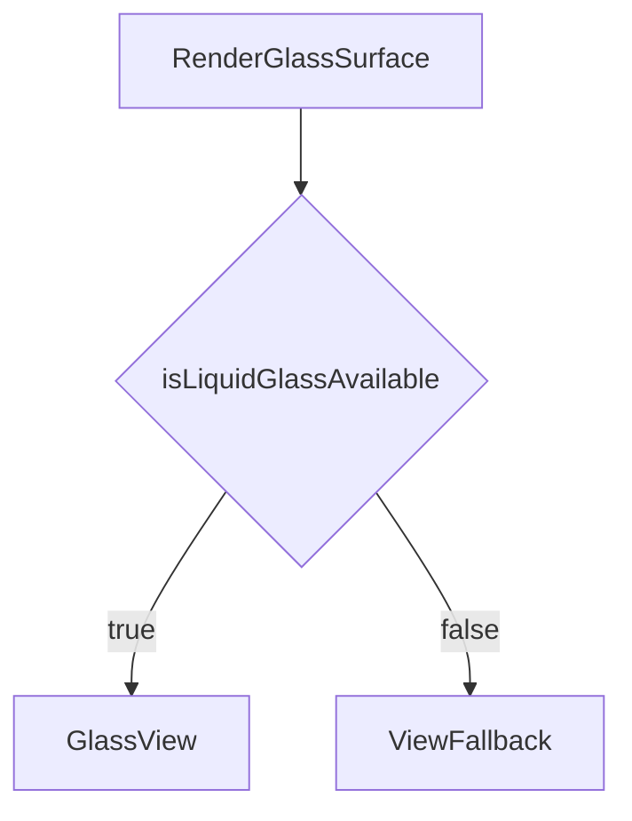

# Expo Liquid Glass rollout (expo-glass-effect)

**Applied rules**: **React Native/Expo Project**, **Nativewind styling**, **Offline-first/Privacy-first (no new network/PII)**.

## Docs + known issues (what we’re planning around)

- **Expo docs (SDK 54)**: [`GlassEffect` / `expo-glass-effect`](https://docs.expo.dev/versions/latest/sdk/glass-effect/)
  - Exports: `GlassView`, `GlassContainer`, `isLiquidGlassAvailable()`.
  - **Availability**: iOS **26+ only**, otherwise falls back to a regular `View`.
  - **Requires** `UIDesignRequiresCompatibility = false` in `Info.plist` (already set in [`app.config.cjs`](app.config.cjs)).
  - **Known issue (doc)**: `isInteractive` **can’t be toggled after mount**; if we ever need to change it, we must remount with a different `key`.
- **Known issues (GitHub)**:
  - **Doesn’t render correctly under parent opacity animations**: [`expo/expo#41024`](https://github.com/expo/expo/issues/41024)
  - **Flicker during screen transitions (expo-router/native tabs)**: [`expo/expo#41025`](https://github.com/expo/expo/issues/41025)

## Product decisions (confirmed)

- **Fallback on Android + iOS < 26**: **plain View** (keep the existing translucent backgrounds).
- **Toasts**: apply the glass background **globally** to all FlashMessage toasts.

## Approach

### 1) Add a single “gate + fallback” wrapper: `GlassSurface`

Create [`src/components/shared/glass-surface.tsx`](src/components/shared/glass-surface.tsx):

- Uses `isLiquidGlassAvailable()` to decide:
  - iOS 26+ (available): render `GlassView`.
  - Otherwise: render a plain `View` fallback.
- Props we’ll standardize:
  - `glassEffectStyle` (e.g. `"clear"` for pills; other styles per Expo docs)
  - `isInteractive` (default `false`; set `true` only for buttons)
  - `style` (RN style, to set `borderRadius`, sizing, padding)
  - `fallbackStyle` + `fallbackClassName` to reuse existing translucent looks.
- **Mitigation built-in**:
  - Never rely on toggling `isInteractive` dynamically; if needed, document using `key`.
  - Prefer glass usage in **static** containers (not under parent opacity animations).

Mermaid (decision point):

### 2) Build `GlassButton` (reusable)

Create [`src/components/ui/glass-button.tsx`](src/components/ui/glass-button.tsx):

- A `Pressable` that renders a `GlassSurface` behind the icon.
- Supports common use cases:
  - circular (back/settings/menu)
  - pill (optional)
- Keeps current accessibility patterns (`accessibilityLabel`, `accessibilityHint`, hitSlop).

### 3) Refactor targets (your list)

#### A) Community/Strains search pills (plus CommunitySearchBar prep)

- Update [`src/components/community/community-header.tsx`](src/components/community/community-header.tsx):
  - Replace the search-bar `Pressable` background (`bg-white/15`) with `GlassSurface` using the same layout.
  - Replace the top-right filter button background with `GlassButton`.

- Update [`src/components/strains/strains-header.tsx`](src/components/strains/strains-header.tsx):
  - Convert the search input row into a “glass pill” container:
    - Wrap the row in `GlassSurface`.
    - Make the `Input` background transparent (so the pill background is the glass).

- Update [`src/components/community/community-search-bar.tsx`](src/components/community/community-search-bar.tsx):
  - Apply the same `GlassSurface` pill container pattern to the `TextInput`.
  - Note: this component is currently not referenced; this is prep so we can drop it in later without rework.

#### B) GlassButton usage for floating back/settings/menu

- Update [`src/components/navigation/screen-header-base.tsx`](src/components/navigation/screen-header-base.tsx):
  - Refactor `HeaderSettingsButton` and `HeaderIconButton` to use `GlassButton` so every screen header action gets the upgrade “for free”.

- Update at least one prominent floating back-button:
  - [`src/components/plants/plant-detail-header.tsx`](src/components/plants/plant-detail-header.tsx) back button (and optionally edit button) → `GlassButton`.

- Update Strain detail floating nav actions:
  - [`src/app/(app)/strains/[slug].tsx`](<src/app/(app)/strains/[slug].tsx>) back/share buttons → `GlassButton` (or `GlassSurface` + Pressable if needed).
  - [`src/components/strains/favorite-button.tsx`](src/components/strains/favorite-button.tsx) `variant="overlay"` background → glass styling.

**Risk note**: the Strain detail nav actions sit under an `Animated.View` that animates `opacity` (scroll fade). Due to [`expo/expo#41024`](https://github.com/expo/expo/issues/41024) the glass may degrade to a normal view there; we’ll validate and, if needed, switch that fade from `opacity` to a transform-based hide (slide/scale) to preserve glass.

#### C) ToastMessage / Snackbar background (FlashMessage)

Create [`src/components/ui/glass-flash-message.tsx`](src/components/ui/glass-flash-message.tsx):

- A custom `MessageComponent` for `react-native-flash-message` that:
  - Uses `GlassSurface` as the container background.
  - Renders `message`, `description`, and the default icon/CTA areas.
  - Preserves accessibility live-region behavior from existing toast utils.

Wire it globally:

- Update [`src/app/_layout.tsx`](src/app/_layout.tsx):
  - `FlashMessage position="top"` → add `MessageComponent={GlassFlashMessage}`.

**Risk note**: if FlashMessage uses opacity animations internally, on iOS 26 the glass may degrade to fallback because of `expo/expo#41024`. That’s acceptable visually (your chosen fallback), but we’ll explicitly verify.

#### D) GlassTag for image overlays

Create [`src/components/ui/glass-tag.tsx`](src/components/ui/glass-tag.tsx):

- A small pill tag with:
  - `label`
  - `tone` (neutral/primary/success/warning/danger)
  - optional left icon
  - uses `GlassSurface` for the background.

Adopt it in one high-visibility overlay:

- [`src/components/strains/strain-card.tsx`](src/components/strains/strain-card.tsx)
  - Replace the `BlurView` overlay wrappers with:
    - either `GlassSurface` as the group container, or
    - `GlassTag` per badge (preferred if you want the “floating chip” look).

- Strain detail hero overlays:
  - [`src/app/(app)/strains/[slug].tsx`](<src/app/(app)/strains/[slug].tsx>) hero race pill (`bg-white/20`) → `GlassTag`/`GlassSurface`.
  - [`src/components/strains/strain-detail-skeleton.tsx`](src/components/strains/strain-detail-skeleton.tsx) replace the `BlurView` title overlay with `GlassSurface` (keeps iOS26 glass, plain View fallback elsewhere).

## Rollout order (minimize risk)

1. **Search pills** (static, low risk): `CommunityHeader`, `StrainsHeader` (plus `CommunitySearchBar` prep).
2. **GlassButton** in headers + one floating back button + Strain detail nav actions (validate the opacity-animated container risk).
3. **GlassTag** on StrainCard overlays + Strain detail hero race pill + StrainDetailSkeleton overlay.
4. **LikeButton overlay prep** (no call site changes yet).
5. **Global FlashMessage** glass background (most likely to hit the Animated opacity issue).

## Verification checklist

- **iOS 26** (device/simulator, built with a toolchain that supports iOS 26):
  - glass pills render as expected
  - header icon buttons and floating back button render
  - toasts render (and don’t flicker badly)
  - navigate between tabs/screens to check `expo/expo#41025` symptoms
- **iOS < 26 + Android**:
  - fallback view styling matches current translucency

Local commands:

- `pnpm lint`
- `pnpm type-check`
- `pnpm test`

## Files we expect to change/add

- Add: [`src/components/shared/glass-surface.tsx`](src/components/shared/glass-surface.tsx)
- Add: [`src/components/ui/glass-button.tsx`](src/components/ui/glass-button.tsx)
- Add: [`src/components/ui/glass-tag.tsx`](src/components/ui/glass-tag.tsx)
- Add: [`src/components/ui/glass-flash-message.tsx`](src/components/ui/glass-flash-message.tsx)
- Update: [`src/components/community/community-header.tsx`](src/components/community/community-header.tsx)
- Update: [`src/components/community/community-search-bar.tsx`](src/components/community/community-search-bar.tsx)
- Update: [`src/components/community/like-button.tsx`](src/components/community/like-button.tsx)
- Update: [`src/components/strains/strains-header.tsx`](src/components/strains/strains-header.tsx)
- Update: [`src/components/navigation/screen-header-base.tsx`](src/components/navigation/screen-header-base.tsx)
- Update: [`src/components/plants/plant-detail-header.tsx`](src/components/plants/plant-detail-header.tsx)
- Update: [`src/app/(app)/strains/[slug].tsx`](<src/app/(app)/strains/[slug].tsx>)
- Update: [`src/components/strains/favorite-button.tsx`](src/components/strains/favorite-button.tsx)
- Update: [`src/app/_layout.tsx`](src/app/_layout.tsx)
- Update: [`src/components/strains/strain-card.tsx`](src/components/strains/strain-card.tsx)
- Update: [`src/components/strains/strain-detail-skeleton.tsx`](src/components/strains/strain-detail-skeleton.tsx)
