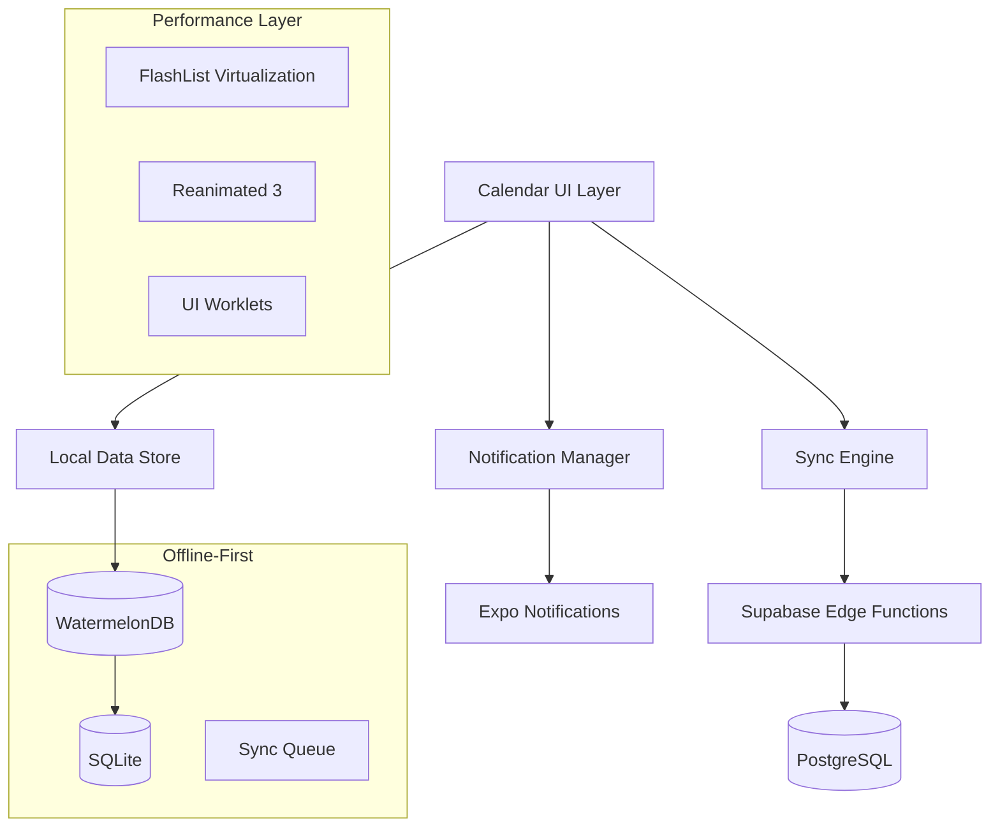
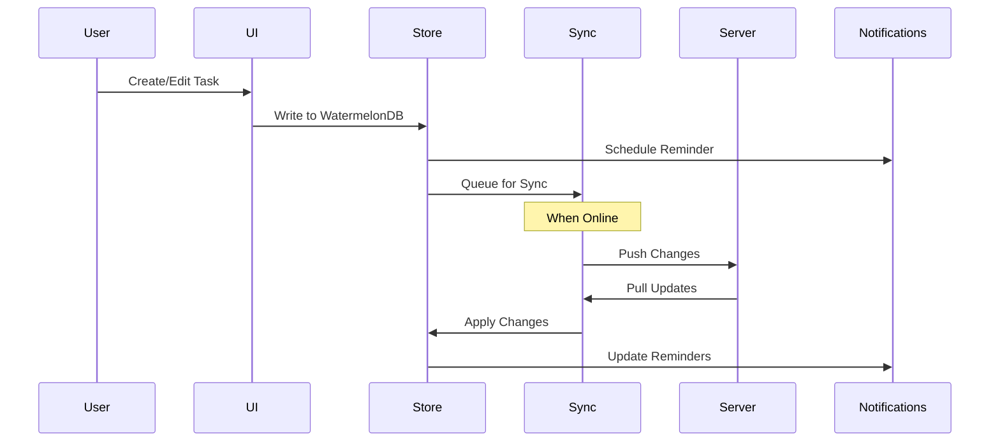
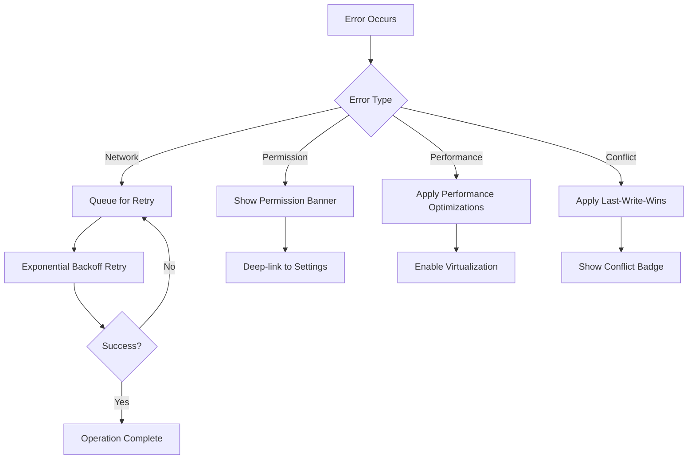

# Design Document

## Overview

Calendar 2.0 is a high-performance, offline-first task management system for cannabis growers. The system provides recurring task scheduling with RFC-5545 RRULE compliance, local push notifications, drag-and-drop rescheduling, and template-based schedule generation. The architecture prioritizes performance for large datasets (1000+ tasks) while maintaining 60fps scrolling and reliable offline functionality.

## Architecture

### High-Level Architecture



### Data Flow Architecture



## Components and Interfaces

```typescript
export type TaskStatus = 'pending' | 'completed' | 'skipped';
```

### Core Components

#### 1. Task Management System

**TaskManager Interface**

```typescript
interface TaskManager {
  createTask(task: CreateTaskInput): Promise<Task>;
  updateTask(id: string, updates: Partial<Task>): Promise<Task>;
  deleteTask(id: string): Promise<void>;
  getTasksByDateRange(start: Date, end: Date): Promise<Task[]>;
  completeTask(id: string): Promise<Task>;
  skipRecurringInstance(id: string, date: Date): Promise<void>;
}

interface Task {
  id: string;
  title: string;
  description?: string;
  // Time fields use DST-safe dual-field representation.
  // Local times are stored as ISO strings with timezone info (e.g. 2025-03-29T02:30:00+02:00).
  // UTC times are stored as ISO UTC strings (e.g. 2025-03-29T00:30:00Z).
  // These match the WatermelonDB schema naming: due_at_local / due_at_utc, reminder_at_local / reminder_at_utc
  dueAtLocal?: string; // ISO with timezone
  dueAtUtc?: string; // ISO UTC
  reminderAtLocal?: string; // ISO with timezone
  reminderAtUtc?: string; // ISO UTC
  timezone?: string; // IANA timezone name (e.g. Europe/Berlin)
  // Recurrence is represented at the Series level (RFC-5545 RRULE + dtstart). Tasks materialized from a series reference the series via seriesId.
  plantId?: string;
  status: 'pending' | 'completed' | 'skipped';
  createdAt: Date;
  updatedAt: Date;
  deletedAt?: Date;
}
```

#### 2. Recurrence Engine

**RRuleEngine Interface**

```typescript
interface RRuleEngine {
  buildIterator(params: {
    series: Series;
    overrides: OccurrenceOverride[];
    range: { start: Date; end: Date };
  }): Iterable<{ local: Date; utc: Date }>;
  validate(rule: string): { ok: boolean; errors?: string[] };
  parseRule(rule: string): RRuleConfig;
}

interface RRuleConfig {
  freq: 'DAILY' | 'WEEKLY'; // v1.1 scope only
  interval: number;
  byweekday?: number[];
  until?: Date;
  count?: number;
  dtstart: Date;
}
```

#### 3. Notification Manager

**NotificationManager Interface**

```typescript
interface NotificationManager {
  scheduleNotification(task: Task): Promise<string>;
  cancelNotification(notificationId: string): Promise<void>;
  rehydrateNotifications(changedTaskIds?: string[]): Promise<void>; // diff-based
  requestPermissions(): Promise<boolean>;
  checkPermissionStatus(): Promise<NotificationPermissionStatus>;
}

interface NotificationPermissionStatus {
  granted: boolean;
  canAskAgain: boolean;
  batteryOptimized: boolean;
}
```

#### 4. Agenda Performance Layer

**AgendaRenderer Interface**

```typescript
interface AgendaRenderer {
  renderDay(date: Date, tasks: Task[]): ReactElement;
  getItemLayout(data: AgendaItem[], index: number): ItemLayout;
  keyExtractor(item: AgendaItem): string;
  onViewableItemsChanged(info: ViewableItemsChangedInfo): void;
}

interface AgendaItem {
  id: string;
  type: 'date-header' | 'task' | 'empty-state';
  date: Date;
  task?: Task;
  height: number;
}
```

#### 5. Drag and Drop System

**DragDropManager Interface**

```typescript
interface DragDropManager {
  startDrag(task: Task, position: Position): void;
  updateDragPosition(position: Position): void;
  completeDrop(targetDate: Date, scope: 'occurrence' | 'series'): Promise<void>;
  cancelDrag(): void;
  enableUndo(originalTask: Task): void;
}

interface Position {
  x: number;
  y: number;
}
```

#### 6. Template System

**TemplateManager Interface**

```typescript
interface TemplateManager {
  applyTemplate(
    templateId: string,
    plantId: string,
    anchorDate: Date,
    idempotencyKey?: string
  ): Promise<Task[]>;
  bulkShiftTasks(taskIds: string[], dayOffset: number): Promise<Task[]>;
  previewTemplateApplication(
    templateId: string,
    startDate: Date
  ): TemplatePreview;
}

interface TemplatePreview {
  tasks: Omit<Task, 'id' | 'createdAt' | 'updatedAt'>[];
  totalCount: number;
  dateRange: { start: Date; end: Date };
}
```

## Data Models

### Database Schema (WatermelonDB)

```typescript
// series table (for recurring task definitions)
class Series extends Model {
  static table = 'series';

  @text('title') title!: string;
  @text('description') description?: string;
  @text('dtstart_local') dtstartLocal!: string; // ISO with timezone
  @text('dtstart_utc') dtstartUtc!: string; // ISO UTC
  @text('timezone') timezone!: string; // Olson timezone
  @text('rrule') rrule!: string; // RFC-5545 RRULE
  @text('until_utc') untilUtc?: string; // ISO UTC
  @number('count') count?: number;
  @text('plant_id') plantId?: string;
  @date('created_at') createdAt!: Date;
  @date('updated_at') updatedAt!: Date;
  @date('deleted_at') deletedAt?: Date;
}

// occurrence_overrides table (for RRULE exceptions)
class OccurrenceOverride extends Model {
  static table = 'occurrence_overrides';

  @text('series_id') seriesId!: string;
  @text('occurrence_local_date') occurrenceLocalDate!: string; // YYYY-MM-DD
  @text('due_at_local') dueAtLocal?: string; // ISO with timezone
  @text('due_at_utc') dueAtUtc?: string; // ISO UTC
  @text('reminder_at_local') reminderAtLocal?: string; // ISO with timezone
  @text('reminder_at_utc') reminderAtUtc?: string; // ISO UTC
  @text('status') status?: 'skip' | 'reschedule' | 'complete';
  @date('created_at') createdAt!: Date;
  @date('updated_at') updatedAt!: Date;
}

// tasks table (materialized occurrences and one-off tasks)
class Task extends Model {
  static table = 'tasks';

  @text('series_id') seriesId?: string; // null for one-off tasks
  @text('title') title!: string;
  @text('description') description?: string;
  // DST-safe dual-field timezone representation for scheduling and notifications.
  // Local fields: ISO strings including timezone offset (e.g. 2025-03-29T02:30:00+02:00)
  // UTC fields: ISO UTC strings (e.g. 2025-03-29T00:30:00Z)
  @text('due_at_local') dueAtLocal!: string; // ISO with timezone
  @text('due_at_utc') dueAtUtc!: string; // ISO UTC
  @text('timezone') timezone!: string; // IANA timezone (e.g. Europe/Berlin)
  @text('reminder_at_local') reminderAtLocal?: string; // ISO with timezone
  @text('reminder_at_utc') reminderAtUtc?: string; // ISO UTC
  @text('plant_id') plantId?: string;
  @text('status') status!: TaskStatus;
  @date('completed_at') completedAt?: Date;
  @json('metadata', sanitizeMetadata) metadata!: TaskMetadata;
  @date('created_at') createdAt!: Date;
  @date('updated_at') updatedAt!: Date;
  @date('deleted_at') deletedAt?: Date;
}

// notification_queue table
class NotificationQueue extends Model {
  static table = 'notification_queue';

  @text('task_id') taskId!: string;
  @text('notification_id') notificationId!: string;
  @text('scheduled_for_local') scheduledForLocal!: string; // ISO with timezone
  @text('scheduled_for_utc') scheduledForUtc!: string; // ISO UTC
  @text('timezone') timezone!: string; // Olson timezone
  @text('status') status!: 'pending' | 'sent' | 'failed';
  @date('created_at') createdAt!: Date;
  @date('updated_at') updatedAt!: Date;
}
```

### Sync Protocol Data Models

```typescript
interface SyncRequest {
  lastPulledAt: number | null;
  schemaVersion: string;
  tables: string[];
  cursor?: string;
}

interface SyncResponse {
  serverTimestamp: number;
  changes: {
    [tableName: string]: {
      created: any[];
      updated: any[];
      deleted: { id: string; deleted_at: string }[];
    };
  };
  hasMore: boolean;
  nextCursor?: string;
  migrationRequired: boolean;
}

interface PushRequest {
  lastPulledAt: number;
  changes: {
    [tableName: string]: {
      created: any[];
      updated: any[];
      deleted: { id: string; deleted_at_client: string }[];
    };
  };
}
```

## Error Handling

### Error Categories and Strategies

#### 1. Network Errors

- **Strategy**: Queue operations for retry with exponential backoff
- **Implementation**: Use sync queue with persistent storage
- **User Experience**: Show offline indicator, allow continued usage

#### 2. Permission Errors

- **Strategy**: Graceful degradation with clear user guidance
- **Implementation**: Permission status tracking with recovery flows
- **User Experience**: Persistent banners with Settings deep-links

#### 3. Performance Errors

- **Strategy**: Progressive loading and virtualization
- **Implementation**: FlashList with optimized rendering
- **User Experience**: Smooth scrolling with loading states

#### 4. Data Conflicts

- **Strategy**: Last-write-wins with conflict indicators
- **Implementation**: Server timestamp comparison
- **User Experience**: Conflict badges with resolution options

### Error Recovery Flows



## Testing Strategy

### Performance Testing

#### 1. Large Dataset Testing

- **Scenario**: 1,500 tasks across 6 months
- **Metrics**: Frame time <16.7ms (95th percentile)
- **Tools**: React Native Performance Monitor, Flipper

#### 2. Memory Usage Testing

- **Scenario**: Extended scrolling sessions
- **Metrics**: Memory growth <10MB over 10 minutes
- **Tools**: Xcode Instruments, Android Studio Profiler

#### 3. Notification Reliability Testing

- **Scenario**: Various device power states
- **Metrics**: Delivery rate >90% within 5 minutes
- **Tools**: Device testing matrix, analytics tracking

### Offline Testing

#### 1. Flight Mode Testing

- **Scenario**: Create/edit/delete tasks while offline
- **Verification**: All changes persist and sync when online
- **Tools**: Network condition simulation

#### 2. Sync Conflict Testing

- **Scenario**: Simultaneous edits on multiple devices
- **Verification**: Last-write-wins resolution works correctly
- **Tools**: Multi-device test setup

#### 3. Data Integrity Testing

- **Scenario**: App crashes during sync operations
- **Verification**: No data corruption or loss
- **Tools**: Automated crash simulation

### Accessibility Testing

#### 1. Screen Reader Testing

- **Tools**: TalkBack (Android), VoiceOver (iOS)
- **Coverage**: All interactive elements have proper labels
- **Focus**: Drag-and-drop accessibility alternatives

#### 2. High Contrast Testing

- **Tools**: Device accessibility settings
- **Coverage**: All UI elements meet WCAG contrast requirements

#### 3. Large Text Testing

- **Tools**: Device text scaling settings
- **Coverage**: UI remains functional at 200% text scale

### Localization Testing

#### 1. German Translation Testing

- **Coverage**: All user-facing strings translated
- **Tools**: i18next syntax validation script
- **Verification**: No hardcoded English strings in production

#### 2. RTL Layout Testing (Future)

- **Preparation**: Flexible layout system for future RTL support
- **Tools**: React Native RTL testing utilities

## Implementation Notes

### Performance Optimizations

#### 1. FlashList Configuration

```typescript
// FlashList v2 optimized configuration
const agendaConfig = {
  // Use consistent item heights for better performance
  getItemType: (item: AgendaItem) => item.type,
  // Let FlashList v2 handle sizing automatically
  // Remove estimatedItemSize, windowSize tweaks per v2 best practices
  removeClippedSubviews: true,
  // Performance targets: 95p frame time <16.7ms, first paint <300ms
};
```

#### 2. Reanimated Worklets

```typescript
const dragGesture = Gesture.Pan()
  .onStart(() => {
    'worklet';
    runOnJS(startDrag)();
  })
  .onUpdate((event) => {
    'worklet';
    translateX.value = event.translationX;
    translateY.value = event.translationY;
  });
```

### Offline-First Implementation

#### 1. WatermelonDB Setup

```typescript
const adapter = new SQLiteAdapter({
  schema: appSchema,
  migrations: migrations,
  jsi: true,
  onSetUpError: (error) => {
    Sentry.captureException(error);
  },
});

const database = new Database({
  adapter,
  modelClasses: [Task, OccurrenceOverride, NotificationQueue],
});
```

#### 2. Sync Engine Implementation

```typescript
const syncEngine = {
  async pullChanges({ lastPulledAt }) {
    const token = await supabase.auth.getSession();
    const response = await fetch('/sync/pull', {
      method: 'POST',
      headers: {
        Authorization: `Bearer ${token.data.session?.access_token}`,
        'Content-Type': 'application/json',
      },
      body: JSON.stringify({
        lastPulledAt,
        tables: ['series', 'tasks', 'occurrence_overrides'],
        schemaVersion: '2025-08-23.v1',
      }),
    });
    return response.json();
  },

  async pushChanges({ changes, lastPulledAt }) {
    const token = await supabase.auth.getSession();
    const response = await fetch('/sync/push', {
      method: 'POST',
      headers: {
        Authorization: `Bearer ${token.data.session?.access_token}`,
        'Content-Type': 'application/json',
        'Idempotency-Key': generateUUID(),
      },
      body: JSON.stringify({ changes, lastPulledAt }),
    });
    return response.json();
  },
};
```

### Notification Implementation

#### 1. Permission Handling

```typescript
const requestNotificationPermissions = async () => {
  if (Platform.OS === 'android' && Platform.Version >= 33) {
    const permission = await PermissionsAndroid.request(
      PermissionsAndroid.PERMISSIONS.POST_NOTIFICATIONS
    );

    if (permission === PermissionsAndroid.RESULTS.DENIED) {
      // Show persistent banner with Settings deep-link
      showPermissionBanner({
        message: 'Enable notifications to receive task reminders',
        action: 'Open Settings',
        onPress: () => Linking.openSettings(),
      });
    }

    return permission === PermissionsAndroid.RESULTS.GRANTED;
  }

  const { status } = await Notifications.requestPermissionsAsync();
  return status === 'granted';
};
```

#### 2. Notification Scheduling

```typescript
// REVIEW (lines ~567-591): Recommendation — Android channelId and dedupe
// - Android: include an explicit `android.channelId` when calling
//   `Notifications.scheduleNotificationAsync` so reminders land on the
//   intended notification channel (importance, grouping, settings).
// - Dedupe: avoid scheduling duplicate notifications by deriving a
//   deterministic identifier (e.g. `${task.id}:${task.reminderAtUtc}`) or
//   checking the `notification_queue` for an existing pending entry before
//   scheduling. This helps when rehydrating notifications after sync.
// Suggested minimal change when scheduling:
//   Notifications.scheduleNotificationAsync({ ..., android: { channelId: 'cultivation.reminders.v1' } })
const scheduleTaskReminder = async (task: Task) => {
  if (!task.reminderAtLocal || !task.reminderAtUtc) return;

  const notificationId = await Notifications.scheduleNotificationAsync({
    content: {
      title: 'Task Reminder',
      body: task.title,
      data: { taskId: task.id },
    },
    trigger: {
      date: new Date(task.reminderAtUtc), // Use UTC for scheduling
    },
  });

  await database.write(async () => {
    await notificationQueue.create((notification) => {
      notification.taskId = task.id;
      notification.notificationId = notificationId;
      notification.scheduledForLocal = task.reminderAtLocal;
      notification.scheduledForUtc = task.reminderAtUtc;
      notification.timezone = task.timezone;
      notification.status = 'pending';
    });
  });
};

// Differential notification re-planning after sync
const rehydrateNotifications = async (changedTaskIds?: string[]) => {
  const existingNotifications = await notificationQueue
    .query(Q.where('status', 'pending'))
    .fetch();

  const tasksToUpdate = changedTaskIds
    ? await tasks.query(Q.where('id', Q.oneOf(changedTaskIds))).fetch()
    : await tasks.query().fetch();

  for (const task of tasksToUpdate) {
    const existing = existingNotifications.find((n) => n.taskId === task.id);
    const shouldSchedule = task.reminderAtUtc && task.status === 'pending';

    if (
      existing &&
      (!shouldSchedule || existing.scheduledForUtc !== task.reminderAtUtc)
    ) {
      // Cancel outdated notification
      await Notifications.cancelScheduledNotificationAsync(
        existing.notificationId
      );
      // WatermelonDB mutations must run inside a write transaction.
      // Wrap the markAsDeleted call in database.write and await it so the
      // deletion executes inside a proper write transaction.
      await database.write(async () => {
        await existing.markAsDeleted();
      });
    }

    if (
      shouldSchedule &&
      (!existing || existing.scheduledForUtc !== task.reminderAtUtc)
    ) {
      // Schedule new/updated notification
      await scheduleTaskReminder(task);
    }
  }
};
```

This design provides a comprehensive foundation for implementing Calendar 2.0 with all the performance, offline-first, and user experience requirements specified in the requirements document.
