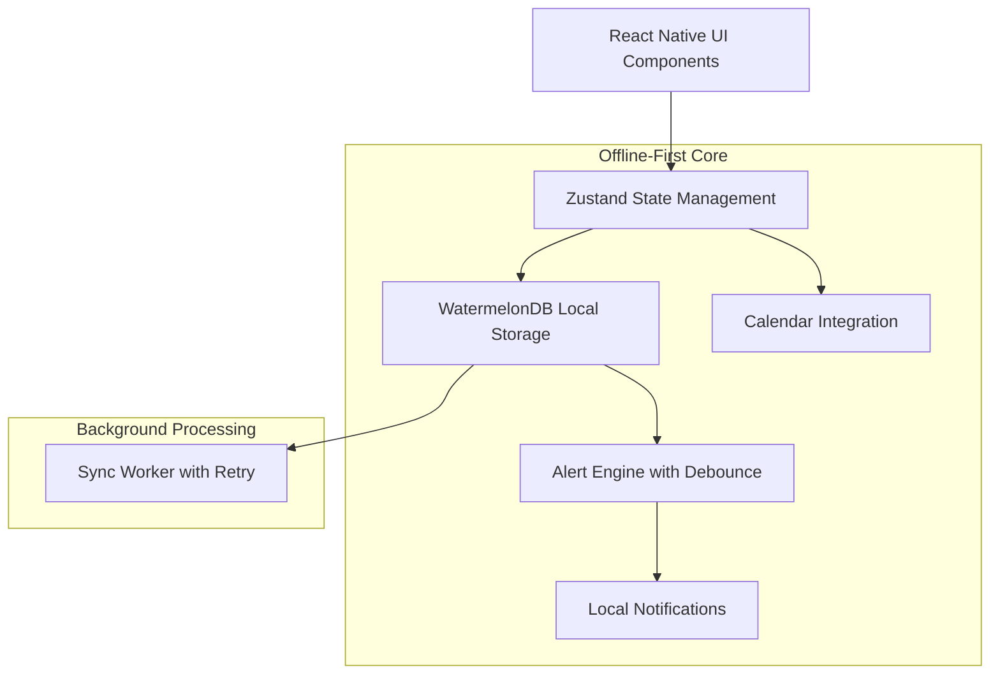
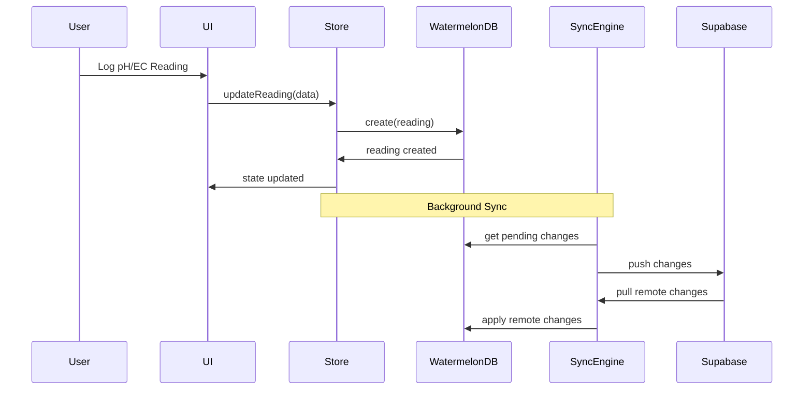
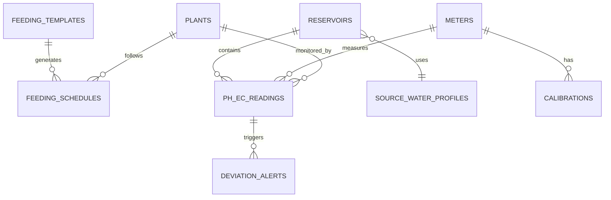

# Design Document: Nutrient Engine and pH/EC System

## Overview

The Nutrient Engine and pH/EC system provides comprehensive feeding management for GrowBro users through an offline-first architecture. The system combines templated feeding schedules, real-time measurement tracking, intelligent diagnostics, and seamless integration with the existing calendar system. Built on WatermelonDB for local storage and Zustand for state management, it ensures reliable operation regardless of network connectivity.

**Important Note**: This feature requires a dev build (not Expo Go) due to WatermelonDB native modules. Use the WatermelonDB Expo config plugin and EAS dev build for implementation.

## Architecture

### High-Level Architecture



### Data Flow Architecture



## Components and Interfaces

### Core Components

#### 1. Feeding Template Engine

**Purpose**: Manages feeding templates and schedule generation

**Key Interfaces**:

```typescript
interface FeedingTemplate {
  id: string;
  name: string;
  medium: GrowingMedium; // soil | coco | hydro
  phases: FeedingPhase[]; // ranges live here per-stage
  createdAt: number; // epoch ms for WatermelonDB
  updatedAt: number;
}

interface FeedingPhase {
  phase: PlantPhase; // seedling | veg | flower | flush
  durationDays: number; // default; user can bulk-shift
  nutrients: NutrientRatio[]; // vendor-agnostic (N-P-K-Ca-Mg-... or ml/L keys)
  phRange: [number, number]; // target pH
  ecRange25c: [number, number]; // target EC @25°C
}
```

**Responsibilities**:

- Template CRUD operations
- Schedule generation from templates
- Per-strain adjustments and customizations
- Integration with calendar task creation

#### 2. Measurement Tracking System

**Purpose**: Handles pH/EC measurement logging and validation

**Key Interfaces**:

```typescript
interface PhEcReading {
  id: string;
  plantId?: string;
  reservoirId?: string;
  measuredAt: number; // epoch ms
  ph: number;
  ecRaw: number; // Raw EC reading
  ec25c: number; // Temperature compensated to 25°C
  tempC: number;
  atcOn: boolean; // Auto Temperature Compensation enabled
  ppmScale: PpmScale; // 500 or 700 scale
  meterId?: string;
  note?: string;
  qualityFlags?: Array<'NO_ATC' | 'CAL_STALE' | 'TEMP_HIGH' | 'OUTLIER'>;
  createdAt: number; // epoch ms
  updatedAt: number;
}

enum PpmScale {
  PPM_500 = '500',
  PPM_700 = '700',
}

// Utility functions for EC/PPM conversion and temperature compensation
export function toEC25(ecRaw: number, tempC: number, beta = 0.02): number {
  // Skip when atcOn=true from meter
  return ecRaw / (1 + beta * (tempC - 25));
}

export function ecToPpm(ecMsCm: number, scale: '500' | '700'): number {
  return Math.round(ecMsCm * (scale === '500' ? 500 : 700));
}
```

**Responsibilities**:

- Temperature compensation calculations
- PPM conversion with scale tracking
- Confidence assessment based on calibration age
- Trend analysis and historical data management

#### 3. Alert and Deviation System

**Purpose**: Monitors readings against targets and triggers alerts

**Key Interfaces**:

```typescript
interface DeviationAlert {
  id: string;
  readingId: string;
  type: AlertType;
  severity: AlertSeverity;
  message: string;
  recommendations: string[];
  recommendationCodes: string[]; // e.g., ['DILUTE_10PCT','ADJUST_PH_DOWN','RECHECK_24H']
  cooldownUntil?: number; // ms epoch to avoid alert thrash
  triggeredAt: number; // epoch ms
  acknowledgedAt?: number;
  resolvedAt?: number;
}

enum AlertType {
  PH_HIGH = 'ph_high',
  PH_LOW = 'ph_low',
  EC_HIGH = 'ec_high',
  EC_LOW = 'ec_low',
  CALIBRATION_STALE = 'calibration_stale',
  TEMP_HIGH = 'temp_high',
}
```

**Responsibilities**:

- Real-time deviation detection
- Local notification triggering
- Correction playbook suggestions
- Alert lifecycle management

#### 4. Diagnostic Engine

**Purpose**: Rule-based classification of nutrient issues

**Key Interfaces**:

```typescript
interface DiagnosticResult {
  id: string;
  plantId: string;
  symptoms: Symptom[];
  classification: NutrientIssue;
  confidence: number;
  recommendations: Recommendation[];
  inputReadingIds?: string[]; // ph_ec_readings that informed classification
  waterProfileId?: string; // to factor alkalinity-driven drift
  confidenceSource: 'rules' | 'ai' | 'hybrid';
  rulesBased: boolean;
  aiOverride?: boolean;
  createdAt: number; // epoch ms
}

interface NutrientIssue {
  type: IssueType;
  nutrient?: string;
  severity: IssueSeverity;
  likelyCauses: string[];
}

enum IssueType {
  DEFICIENCY = 'deficiency',
  TOXICITY = 'toxicity',
  LOCKOUT = 'lockout',
  PH_DRIFT = 'ph_drift',
}
```

**Responsibilities**:

- Symptom analysis and classification
- Rule-based decision making
- AI integration and override handling
- Recommendation generation

#### 5. Calibration Management

**Purpose**: Tracks meter calibration data and quality

**Key Interfaces**:

```typescript
interface Calibration {
  id: string;
  meterId: string;
  type: CalibrationType;
  points: CalibrationPoint[];
  slope: number;
  offset: number;
  tempC: number;
  method?: 'one_point' | 'two_point' | 'three_point';
  validDays?: number; // derive expiresAt = performedAt + validDays*86400e3
  performedAt: number; // epoch ms
  expiresAt: number; // epoch ms
  isValid: boolean;
}

interface CalibrationPoint {
  expected: number;
  measured: number;
  stabilizationTime: number; // seconds
}

enum CalibrationType {
  PH = 'ph',
  EC = 'ec',
}
```

**Responsibilities**:

- Calibration data storage and validation
- Quality assessment and expiration tracking
- Meter performance monitoring
- User calibration reminders

### State Management Architecture

#### Zustand Store Structure

```typescript
interface NutrientEngineState {
  // UI State (avoid loading everything in memory)
  ui: {
    selectedPlantId?: string;
    selectedReservoir?: string;
    measurementMode: MeasurementMode;
  };

  // Offline queue counters only
  pendingActions: {
    pendingReadings: number;
    pendingAlerts: number;
    pendingSyncItems: number;
  };

  // User preferences
  preferences: {
    ppmScale: '500' | '700';
    tempCompensationBeta: number; // 0.019-0.020 %/°C
    alertCooldownMinutes: number;
  };

  // Actions
  actions: {
    // Template actions
    createTemplate: (template: Omit<FeedingTemplate, 'id'>) => Promise<void>;
    updateTemplate: (
      id: string,
      updates: Partial<FeedingTemplate>
    ) => Promise<void>;
    applyTemplate: (templateId: string, plantId: string) => Promise<void>;

    // Reading actions
    logReading: (reading: Omit<PhEcReading, 'id'>) => Promise<void>;
    syncReadings: () => Promise<void>;

    // Alert actions
    acknowledgeAlert: (alertId: string) => Promise<void>;
    resolveAlert: (alertId: string) => Promise<void>;

    // Calibration actions
    recordCalibration: (calibration: Omit<Calibration, 'id'>) => Promise<void>;
    validateCalibration: (meterId: string) => CalibrationStatus;
  };
}
```

## Data Models

### WatermelonDB Schema

```typescript
// Schema definition
const schema = appSchema({
  version: 1,
  tables: [
    tableSchema({
      name: 'feeding_templates',
      columns: [
        { name: 'name', type: 'string' },
        { name: 'medium', type: 'string' },
        { name: 'phases_json', type: 'string' }, // JSON serialized
        { name: 'target_ranges_json', type: 'string' },
        { name: 'is_custom', type: 'boolean' },
        { name: 'created_at', type: 'number' },
        { name: 'updated_at', type: 'number' },
      ],
    }),

    tableSchema({
      name: 'ph_ec_readings',
      columns: [
        { name: 'plant_id', type: 'string', isOptional: true, isIndexed: true },
        {
          name: 'reservoir_id',
          type: 'string',
          isOptional: true,
          isIndexed: true,
        },
        { name: 'measured_at', type: 'number', isIndexed: true },
        { name: 'ph', type: 'number' },
        { name: 'ec_raw', type: 'number' },
        { name: 'ec_25c', type: 'number' },
        { name: 'temp_c', type: 'number' },
        { name: 'atc_on', type: 'boolean' },
        { name: 'ppm_scale', type: 'string' },
        { name: 'meter_id', type: 'string', isOptional: true },
        { name: 'note', type: 'string', isOptional: true },
        { name: 'quality_flags_json', type: 'string', isOptional: true }, // JSON array of flags
        { name: 'created_at', type: 'number', isIndexed: true },
        { name: 'updated_at', type: 'number' },
      ],
    }),

    tableSchema({
      name: 'reservoirs',
      columns: [
        { name: 'name', type: 'string' },
        { name: 'volume_l', type: 'number' },
        { name: 'medium', type: 'string', isIndexed: true },
        { name: 'target_ph_min', type: 'number' },
        { name: 'target_ph_max', type: 'number' },
        { name: 'target_ec_min_25c', type: 'number' },
        { name: 'target_ec_max_25c', type: 'number' },
        { name: 'ppm_scale', type: 'string' },
        { name: 'source_water_profile_id', type: 'string', isOptional: true },
        { name: 'playbook_binding', type: 'string', isOptional: true },
        { name: 'created_at', type: 'number' },
        { name: 'updated_at', type: 'number' },
      ],
    }),

    tableSchema({
      name: 'source_water_profiles',
      columns: [
        { name: 'name', type: 'string' },
        { name: 'baseline_ec_25c', type: 'number' },
        { name: 'alkalinity_mg_per_l_caco3', type: 'number' },
        { name: 'hardness_mg_per_l', type: 'number' },
        { name: 'last_tested_at', type: 'number' },
        { name: 'created_at', type: 'number' },
        { name: 'updated_at', type: 'number' },
      ],
    }),

    tableSchema({
      name: 'calibrations',
      columns: [
        { name: 'meter_id', type: 'string' },
        { name: 'type', type: 'string' },
        { name: 'points_json', type: 'string' },
        { name: 'slope', type: 'number' },
        { name: 'offset', type: 'number' },
        { name: 'temp_c', type: 'number' },
        { name: 'performed_at', type: 'number' },
        { name: 'expires_at', type: 'number' },
        { name: 'is_valid', type: 'boolean' },
        { name: 'created_at', type: 'number' },
        { name: 'updated_at', type: 'number' },
      ],
    }),

    tableSchema({
      name: 'deviation_alerts',
      columns: [
        { name: 'reading_id', type: 'string' },
        { name: 'type', type: 'string' },
        { name: 'severity', type: 'string' },
        { name: 'message', type: 'string' },
        { name: 'recommendations_json', type: 'string' },
        { name: 'triggered_at', type: 'number' },
        { name: 'acknowledged_at', type: 'number', isOptional: true },
        { name: 'resolved_at', type: 'number', isOptional: true },
        { name: 'delivered_at_local', type: 'number', isOptional: true },
        { name: 'synced', type: 'boolean' },
        { name: 'created_at', type: 'number' },
        { name: 'updated_at', type: 'number' },
      ],
    }),

    tableSchema({
      name: 'reservoir_events',
      columns: [
        { name: 'reservoir_id', type: 'string', isIndexed: true },
        { name: 'kind', type: 'string' }, // 'FILL'|'DILUTE'|'ADD_NUTRIENT'|'PH_UP'|'PH_DOWN'|'CHANGE'
        { name: 'delta_ec_25c', type: 'number', isOptional: true },
        { name: 'delta_ph', type: 'number', isOptional: true },
        { name: 'note', type: 'string', isOptional: true },
        { name: 'created_at', type: 'number', isIndexed: true },
        { name: 'updated_at', type: 'number' },
      ],
    }),
  ],
});
```

### Model Relationships



## Error Handling

### Offline Error Handling

1. **Network Unavailable**:

   - Queue all operations locally
   - Show offline indicator in UI
   - Sync when connectivity returns

2. **Sync Conflicts**:

   - Use Last-Write-Wins (LWW) with server timestamps
   - Preserve local data integrity
   - Log conflicts for user review

3. **Data Validation Errors**:
   - Validate at input level
   - Show clear error messages
   - Prevent invalid data persistence

### Measurement Error Handling

1. **Invalid Readings**:

   - Range validation (pH 0-14, EC reasonable limits)
   - Temperature compensation bounds checking
   - Calibration staleness warnings

2. **Meter Communication**:
   - Bluetooth connection timeouts
   - Data parsing errors
   - Fallback to manual entry

## Testing Strategy

### Unit Testing

1. **Utility Functions**:

   - Temperature compensation calculations
   - PPM conversion algorithms
   - Target range validation

2. **State Management**:

   - Zustand store actions
   - Data transformation logic
   - Offline queue management

3. **Data Models**:
   - WatermelonDB model methods
   - Validation functions
   - Relationship integrity

### Integration Testing

1. **Sync Operations**:

   - Offline-to-online sync scenarios
   - Conflict resolution testing
   - Data consistency validation

2. **Calendar Integration**:

   - Task creation from templates
   - Schedule updates from deviations
   - Notification triggering

3. **Alert System**:
   - Deviation detection accuracy
   - Notification delivery
   - Alert lifecycle management

### End-to-End Testing

1. **Complete Workflows**:

   - Template creation to task execution
   - Reading logging to alert resolution
   - Calibration to measurement confidence

2. **Offline Scenarios**:
   - Full offline operation
   - Sync recovery testing
   - Data integrity validation

### Performance Testing

1. **Database Operations**:

   - Large dataset query performance
   - Sync operation efficiency
   - Memory usage optimization

2. **UI Responsiveness**:
   - Real-time chart updates
   - Large list rendering (FlashList)
   - Background sync impact

## Security and Privacy

### Data Protection

1. **Local Storage Security**:

   - **Note**: Full SQLite database encryption requires SQLCipher via expo-sqlite in custom dev build or OP-SQLite with SQLCipher support (not available in Expo Go)
   - For immediate implementation: minimize sensitive payloads in DB and encrypt secrets/blobs as needed
   - Images remain on filesystem with OS protections
   - Plan SQLCipher integration spike if full at-rest encryption is required

2. **Sync Security**:
   - TLS encryption for all API calls
   - Authentication token management
   - Data validation on server

### Privacy Considerations

1. **Data Minimization**:

   - Only collect necessary measurements
   - Optional metadata fields
   - User-controlled data sharing

2. **Consent Management**:
   - Explicit opt-in for cloud sync
   - Granular privacy controls
   - Data export capabilities

## Performance Considerations

### Database Optimization

1. **Indexing Strategy**:

   - Index on frequently queried fields (plant_id, measured_at)
   - Composite indexes for complex queries
   - Regular index maintenance

2. **Data Archiving**:
   - Archive old readings beyond retention period
   - Maintain performance with large datasets
   - User-configurable retention settings

### Memory Management

1. **Lazy Loading**:

   - Load readings on demand
   - Paginated data fetching
   - Efficient list rendering with FlashList

2. **Background Processing**:
   - Sync operations on background thread
   - Temperature compensation calculations
   - Alert processing optimization

### Network Optimization

1. **Efficient Sync**:

   - Delta sync for changed records only
   - Batch operations for multiple changes
   - Compression for large payloads

2. **Offline Resilience**:
   - Robust queue management
   - Retry logic with exponential backoff
   - Graceful degradation of features

## Additional Components

### Sync Worker

**Purpose**: Handles background synchronization with retry logic and exponential backoff

```typescript
interface SyncWorker {
  synchronize(): Promise<void>;
  onSyncStart: (callback: () => void) => void;
  onSyncSuccess: (callback: () => void) => void;
  onSyncError: (callback: (error: Error) => void) => void;
}

// Implementation wraps WatermelonDB synchronize() with retry + exponential backoff
// Include migrationsEnabledAtVersion for migration syncs in production
```

### Alert Engine

**Purpose**: Pure functions for alert evaluation with rate limiting

```typescript
// Pure function for alert evaluation
function evaluateReadingAgainstTargets(
  reading: PhEcReading,
  reservoir: Reservoir
): DeviationAlert | null {
  const DEAD_BAND = { ph: 0.1, ec: 0.1 }; // tune per medium
  const MIN_PERSIST_MS = 5 * 60_000; // must persist 5 min
  const COOLDOWN_MS = 60 * 60_000; // 60 min per-reservoir

  // Only trigger when (outside band by > deadband) AND
  // (persisting >= MIN_PERSIST_MS) AND (now > cooldownUntil)
}
```

## Utility Functions

### EC and Temperature Compensation

```typescript
// EC normalization (linear model; keep β configurable)
export function toEC25(ecRaw: number, tempC: number, beta = 0.02): number {
  // ecRaw in mS/cm, temp in °C. Returns EC normalized to 25°C.
  // Skip when atcOn=true from meter
  return ecRaw / (1 + beta * (tempC - 25));
}

// PPM conversion (view-only)
export function ecToPpm(ecMsCm: number, scale: '500' | '700'): number {
  return Math.round(ecMsCm * (scale === '500' ? 500 : 700));
}

// Confidence score calculation (computed on-the-fly)
export function calculateConfidenceScore(
  reading: PhEcReading,
  calibration?: Calibration
): number {
  let score = 1.0;

  // Reduce score based on calibration age
  if (calibration && calibration.expiresAt < Date.now()) {
    score *= 0.7;
  }

  // Reduce score for high temperature
  if (reading.tempC > 28) {
    score *= 0.8;
  }

  // Reduce score if no ATC
  if (!reading.atcOn) {
    score *= 0.9;
  }

  return Math.max(0, Math.min(1, score));
}
```

## UI/UX Guidelines

### Display Format

- **Units**: Always show "2.0 mS/cm @25°C • 1000 ppm [500] • 22.4°C"
- **Charts**: Use FlashList for reading history lists; show target bands and event annotations on trend charts (7/30/90 day views)
- **Notifications**: On Android 13/14, use flexible local notifications (± few minutes) and prompt for POST_NOTIFICATIONS permission

### Content Guidelines

- Keep all pH/EC advice generic and educational
- Include disclaimers for all dosing/diagnosis content
- Encourage community second opinions for low confidence classifications
- Document that high alkalinity water tends to raise media pH over time; mitigation is buffering/acidification (educational only)

## Migration Strategy

### Database Migrations

```typescript
// Always include migrations file and bump appSchema.version
// Write migration steps to avoid DB reset for existing users
const migrations = schemaMigrations({
  migrations: [
    {
      toVersion: 2,
      steps: [
        addColumns({
          table: 'ph_ec_readings',
          columns: [
            { name: 'quality_flags_json', type: 'string', isOptional: true },
          ],
        }),
        // Remove synced columns - WatermelonDB sync doesn't need per-row flags
      ],
    },
  ],
});
```

## Enhanced Testing Requirements

### Conversion Testing

- EC↔ppm conversion with 500/700 scales
- Verify mid-grow scale switches preserve historical data labels
- Temperature compensation: verify EC normalization to 25°C across 15–30°C inputs
- Assert no double-correction when atcOn=true

### Target Validation

- Defaults reflect soilless pH 5.4–6.4 ranges
- Playbook overrides are respected and applied correctly

### Alkalinity Guardrails

- Seed profile with 120–150 mg/L CaCO₃ → expect "pH drift likely" warning
- Show appropriate mitigation help links

### Notification Testing

- Android 14 device with denied SCHEDULE_EXACT_ALARM → verify degraded but delivered local reminders
- Test user permission prompts for POST_NOTIFICATIONS

### Migration Testing

- Bump schema version; verify no data loss via WatermelonDB migrations
- Test upgrade paths from v1 to v2+ schemas
