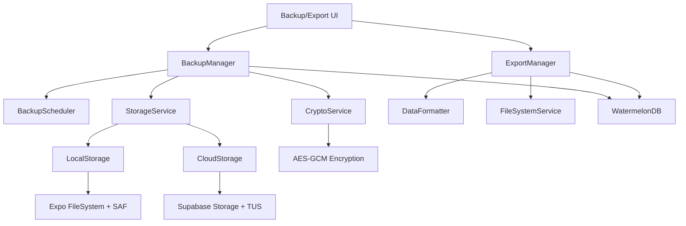

# Design Document

## Overview

The Data Export and Backup system provides GrowBro users with comprehensive data portability and backup capabilities. The system implements two distinct workflows: **GDPR-compliant data exports** for portability and **encrypted backups** for complete data restoration. The architecture leverages React Native/Expo capabilities while respecting mobile platform constraints and WatermelonDB's offline-first design.

### Key Design Principles

- **Separation of Concerns**: Clear distinction between human-readable exports and machine-restorable backups
- **Mobile-First**: Designed for iOS/Android constraints including scoped storage, background limitations, and file system access
- **Offline-First Compatibility**: Seamless integration with WatermelonDB sync protocol
- **Security by Design**: Encrypt-then-zip approach with proper key management
- **Resilient Operations**: Resumable uploads, integrity verification, and graceful failure handling

## Architecture

### High-Level System Components



### Data Flow Architecture

**Export Flow:**

1. User initiates export → ExportManager queries WatermelonDB
2. DataFormatter generates CSV/JSON per entity + manifest
3. FileSystemService packages files using Expo FileSystem
4. System presents via share sheet (iOS) or SAF picker (Android)

**Backup Flow:**

1. BackupScheduler triggers on app foreground/charging/Wi-Fi
2. BackupManager queries changed records since last backup
3. CryptoService encrypts data using AES-GCM-256
4. StorageService uploads via Supabase TUS with resumability

**Restore Flow:**

1. User selects backup file → CryptoService decrypts and validates
2. BackupManager pauses WatermelonDB sync
3. Data imported in batched transactions
4. Sync checkpoints reset and sync re-enabled

## Components and Interfaces

### Core Services

```typescript
enum Cipher {
  XCHACHA20_POLY1305 = 'xchacha20-poly1305',
  AES_256_GCM = 'aes-256-gcm',
}
```

#### BackupManager

```typescript
interface BackupManager {
  createBackup(options: BackupOptions): Promise<BackupResult>;
  restoreBackup(backupFile: string, passphrase: string): Promise<RestoreResult>;
  validateBackup(backupFile: string): Promise<ValidationResult>;
  getBackupHistory(): Promise<BackupHistoryItem[]>;
  scheduleAutomaticBackup(): void;
  pauseSync(): Promise<void>;
  resumeSync(): Promise<void>;
}

interface BackupOptions {
  type: 'full' | 'delta';
  includeMedia: boolean;
  destination: 'local' | 'cloud';
  passphrase: string;
  chunkBytes: number;
  kdf: 'argon2id' | 'scrypt';
  cipher: Cipher;
  compressionLevel: number;
  maxConcurrentUploads: number;
  selectiveRestore?: {
    entities: string[];
    dateRange?: { start: Date; end: Date };
    includeMedia: boolean;
  };
}
```

#### ExportManager

```typescript
interface ExportManager {
  exportData(format: ExportFormat): Promise<ExportResult>;
  generateManifest(): Promise<ManifestData>;
  packageExport(files: ExportFile[]): Promise<string>;
}

interface ExportFormat {
  type: 'human_readable' | 'restorable';
  entities: string[];
  includeMedia: boolean;
  dataMinimization: boolean; // Exclude media URIs/diagnoses by default for GDPR
  csvDelimiter: ',' | ';'; // Excel locale compatibility
  encoding: 'utf8_bom' | 'utf8'; // UTF-8 with BOM for Excel compatibility
}
```

#### CryptoService

```typescript
interface CryptoService {
  encryptWithKey(
    data: Uint8Array,
    key: CryptoKey | Uint8Array,
    iv?: Uint8Array,
    options?: CryptoOptions
  ): Promise<EncryptedData>;
  encryptWithPassphrase(
    data: Uint8Array,
    passphrase: string,
    options?: CryptoOptions
  ): Promise<EncryptedData>;
  decryptWithKey(
    encryptedData: EncryptedData,
    key: CryptoKey | Uint8Array,
    iv: Uint8Array
  ): Promise<Uint8Array>;
  decrypt(
    encryptedData: EncryptedData,
    passphrase: string
  ): Promise<Uint8Array>;
  generateChecksum(data: Uint8Array, algorithm: 'sha256' | 'blake3'): string;
  verifyChecksum(
    data: Uint8Array,
    checksum: string,
    algorithm: string
  ): boolean;
  deriveKey(
    passphrase: string,
    salt: Uint8Array,
    kdfOptions?: { kdf: 'argon2id' | 'scrypt'; iterations?: number }
  ): Promise<Uint8Array>;
  generateManifestSignature(manifest: any, key: Uint8Array): string;
  verifyManifestSignature(
    manifest: any,
    signature: string,
    key: Uint8Array
  ): boolean;
}

interface CryptoOptions {
  kdf: 'argon2id' | 'scrypt';
  cipher: Cipher;
  chunkSize: number;
}

interface EncryptedData {
  ciphertext: Uint8Array;
  iv: Uint8Array;
  authTag: Uint8Array;
  salt: Uint8Array;
}
```

#### StorageService

```typescript
interface StorageService {
  uploadFile(
    file: string,
    destination: StorageDestination
  ): Promise<UploadResult>;
  downloadFile(url: string, destination: string): Promise<DownloadResult>;
  resumeUpload(uploadId: string): Promise<UploadResult>;
  getStorageQuota(): Promise<StorageQuota>;
}

interface StorageDestination {
  type: 'local' | 'supabase';
  path: string;
  resumable: boolean;
}
```

### Data Models

#### Backup Metadata

```typescript
interface BackupMetadata {
  id: string;
  type: 'full' | 'delta';
  createdAt: string;
  appVersion: string;
  dataVersion: string;
  size: number;
  checksum: string;
  mediaCount: number;
  recordCounts: Record<string, number>;
  encrypted: boolean;
  location: 'local' | 'cloud';
  integrity: 'verified' | 'corrupted' | 'unknown';
  kdf: 'argon2id' | 'scrypt';
  kdfParams: KDFParams;
  cipher: Cipher;
  chunkBytes: number;
  hashAlgo: 'sha256' | 'blake3';
  manifestSignature: string;
}

interface KDFParams {
  salt: string;
  iterations?: number; // For scrypt
  memory?: number; // For Argon2id
  parallelism?: number; // For Argon2id
}
```

#### Export Manifest

```typescript
interface ExportManifest {
  type: 'canabro-export';
  version: string;
  createdAt: string;
  appVersion: string;
  timezone: string;
  tables: string[];
  recordCounts: Record<string, number>;
  mediaManifest?: MediaManifest;
  csvDelimiter: ',' | ';';
  encoding: 'utf8_bom' | 'utf8';
  dataMinimization: boolean;
  contentTypes: Record<string, string>; // file -> MIME type mapping
}

interface MediaManifest {
  files: MediaFile[];
  totalSize: number;
  totalCount: number;
}

interface MediaFile {
  recordId: string;
  filename: string;
  uri: string;
  width?: number;
  height?: number;
  size: number;
  hash: string;
}
```

## Data Models

### File Structure Standards

#### Export Package Structure

```
canabro-export_2025-01-15T10:30:00Z_v1.zip
├── manifest.json                 # Export metadata
├── plants.csv                    # Plant records
├── tasks.csv                     # Task records
├── harvests.csv                  # Harvest records
├── inventory.csv                 # Inventory records
├── playbooks.csv                 # Playbook records
├── diagnoses.csv                 # AI diagnosis records
├── export.json                   # Complete JSON snapshot
└── media-manifest.json           # Media file references
```

#### Backup Package Structure

```
backup_2025-01-15T10:30:00Z_full.cbk
├── manifest.json                 # Backup metadata
├── checksums.json               # File integrity checksums
├── data/
│   ├── plants.ndjson           # One record per line
│   ├── tasks.ndjson
│   ├── harvests.ndjson
│   └── ...
└── media/
    ├── media-index.json        # Media file mapping
    ├── a1b2c3d4.jpg           # Content-addressed files
    └── e5f6g7h8.mp4
```

### Database Integration

#### WatermelonDB Sync Management

```typescript
class WatermelonSyncManager {
  async pauseSync(): Promise<void> {
    await this.database.adapter.setLocal('sync_paused', 'true');
    // Stop any ongoing sync operations
  }

  async resumeSync(): Promise<void> {
    await this.database.adapter.setLocal('sync_paused', 'false');
    // Run full pull with server authoritative timestamps to honor LWW
    await this.performFullSyncPull();
  }

  async performFullSyncPull(): Promise<void> {
    // Don't blindly reset to zero - run full pull to avoid clobbering newer server updates
    const serverTimestamp = await this.getServerTimestamp();
    await this.database.adapter.setLocal(
      'last_pulled_at',
      serverTimestamp.toString()
    );
  }

  async createPreRestoreSnapshot(): Promise<string> {
    // Create local point-in-time backup before restore for rollback capability
    // Generate cryptographically secure ephemeral key for this snapshot
    const ephemeralKey = await this.generateEphemeralKey();

    // Wrap the key securely - either with user passphrase or device keystore
    const wrappedKey = await this.wrapEncryptionKey(ephemeralKey);

    // Create backup with ephemeral encryption
    const snapshotId = await this.backupManager.createBackup({
      type: 'full',
      includeMedia: false,
      destination: 'local',
      encryptionKey: ephemeralKey, // Use ephemeral key instead of passphrase
      wrappedKey: wrappedKey, // Store wrapped key for later unwrapping
      ttl: 3600000, // 1 hour TTL for security
      metadata: {
        encrypted: true,
        keyWrapped: true,
        purpose: 'pre-restore-snapshot',
        createdAt: new Date().toISOString(),
      },
    });

    // Schedule cleanup of wrapped key after TTL
    this.scheduleKeyCleanup(snapshotId, wrappedKey, 3600000);

    return snapshotId;
  }

  private async generateEphemeralKey(): Promise<string> {
    // Generate cryptographically secure 256-bit key
    const keyBytes = await this.cryptoService.generateSecureRandomBytes(32);
    return this.cryptoService.bytesToBase64(keyBytes);
  }

  private async wrapEncryptionKey(ephemeralKey: string): Promise<WrappedKey> {
    try {
      // Try device keystore first (more secure)
      return await this.deviceKeyStore.wrapKey(ephemeralKey, {
        purpose: 'snapshot-encryption',
        ttl: 3600000, // 1 hour
      });
    } catch (error) {
      // Fallback to user passphrase wrapping if keystore unavailable
      const userPassphrase = await this.getUserBackupPassphrase();
      if (userPassphrase) {
        return await this.cryptoService.wrapKeyWithPassphrase(
          ephemeralKey,
          userPassphrase,
          { kdf: 'argon2id', iterations: 4 }
        );
      }
      // Final fallback: OS-level data protection without encryption
      return {
        wrapped: false,
        protectionLevel: 'os-data-protection',
        key: ephemeralKey,
      };
    }
  }

  private async scheduleKeyCleanup(
    snapshotId: string,
    wrappedKey: WrappedKey,
    ttlMs: number
  ): Promise<void> {
    // Schedule cleanup in background task
    await this.backgroundTaskScheduler.schedule({
      id: `cleanup-${snapshotId}`,
      type: 'key-cleanup',
      executeAt: Date.now() + ttlMs,
      data: { snapshotId, wrappedKeyId: wrappedKey.id },
      retryPolicy: { maxAttempts: 3 },
    });
  }
}
```

#### Secure Key Management Interfaces

```typescript
interface WrappedKey {
  id: string;
  wrapped: boolean;
  protectionLevel:
    | 'device-keystore'
    | 'passphrase-wrapped'
    | 'os-data-protection';
  wrappedData?: string; // Encrypted key data
  salt?: string; // For passphrase-wrapped keys
  iv?: string; // Initialization vector
  ttl?: number; // Time to live in milliseconds
  createdAt: string;
  purpose: string;
}

interface EphemeralKeyOptions {
  keySize?: number; // Default: 256 bits
  purpose: string;
  ttl?: number; // Default: 1 hour
}

interface KeyCleanupTask {
  snapshotId: string;
  wrappedKeyId: string;
  executeAt: number;
  retryCount: number;
}
```

#### Device KeyStore Service

```typescript
class DeviceKeyStore {
  async wrapKey(
    key: string,
    options: EphemeralKeyOptions
  ): Promise<WrappedKey> {
    const keyId = `snapshot-key-${Date.now()}-${Math.random().toString(36).substr(2, 9)}`;

    try {
      // Use Expo SecureStore or React Native Keychain for device-protected storage
      await SecureStore.setItemAsync(keyId, key, {
        keychainAccessible: SecureStore.WHEN_UNLOCKED_THIS_DEVICE_ONLY,
        requireAuthentication: false, // For automated snapshots
      });

      return {
        id: keyId,
        wrapped: true,
        protectionLevel: 'device-keystore',
        ttl: options.ttl || 3600000,
        createdAt: new Date().toISOString(),
        purpose: options.purpose,
      };
    } catch (error) {
      throw new Error(
        `Failed to store key in device keystore: ${error.message}`
      );
    }
  }

  async unwrapKey(wrappedKey: WrappedKey): Promise<string> {
    if (wrappedKey.protectionLevel !== 'device-keystore') {
      throw new Error('Key is not stored in device keystore');
    }

    try {
      const key = await SecureStore.getItemAsync(wrappedKey.id);
      if (!key) {
        throw new Error('Key not found or expired');
      }
      return key;
    } catch (error) {
      throw new Error(`Failed to retrieve key from keystore: ${error.message}`);
    }
  }

  async deleteKey(wrappedKey: WrappedKey): Promise<void> {
    if (wrappedKey.protectionLevel === 'device-keystore') {
      await SecureStore.deleteItemAsync(wrappedKey.id);
    }
  }
}
```

#### Crypto Service Extensions

```typescript
class CryptoService {
  async generateSecureRandomBytes(length: number): Promise<Uint8Array> {
    // Use react-native-libsodium or Expo Crypto for secure random generation
    if (typeof crypto !== 'undefined' && crypto.getRandomValues) {
      const array = new Uint8Array(length);
      crypto.getRandomValues(array);
      return array;
    }
    // Fallback for React Native environments
    return await this.nativeSecureRandom(length);
  }

  async bytesToBase64(bytes: Uint8Array): Promise<string> {
    // React-Native safe base64 conversion using global btoa
    const binaryString = Array.from(bytes, (byte) =>
      String.fromCharCode(byte)
    ).join('');
    return global.btoa(binaryString);
  }

  async base64ToBytes(base64: string): Promise<Uint8Array> {
    // React-Native safe base64 to bytes conversion using global atob
    const binaryString = global.atob(base64);
    const bytes = new Uint8Array(binaryString.length);
    for (let i = 0; i < binaryString.length; i++) {
      bytes[i] = binaryString.charCodeAt(i);
    }
    return bytes;
  }

  async decryptWithKey(
    encryptedData: EncryptedData,
    key: CryptoKey | Uint8Array,
    iv: Uint8Array
  ): Promise<Uint8Array> {
    // Decrypt using the provided key and IV
    // Implementation would use Web Crypto API or react-native-libsodium
    // This is a placeholder - actual implementation depends on crypto library used
    throw new Error('decryptWithKey not implemented');
  }

  async wrapKeyWithPassphrase(
    key: string,
    passphrase: string,
    options: { kdf: 'argon2id' | 'scrypt'; iterations: number }
  ): Promise<WrappedKey> {
    const salt = await this.generateSecureRandomBytes(32);
    const iv = await this.generateSecureRandomBytes(16);

    // Derive wrapping key using PBKDF2/Argon2
    const wrappingKey = await this.deriveKey(passphrase, salt, options);

    // Convert string key to bytes and encrypt with the derived wrapping key
    const keyBytes = new TextEncoder().encode(key);
    const encryptedKey = await this.encryptWithKey(keyBytes, wrappingKey, iv);

    return {
      id: `wrapped-${Date.now()}`,
      wrapped: true,
      protectionLevel: 'passphrase-wrapped',
      wrappedData: encryptedKey,
      salt: this.bytesToBase64(salt),
      iv: this.bytesToBase64(iv),
      ttl: 3600000, // 1 hour default
      createdAt: new Date().toISOString(),
      purpose: 'snapshot-encryption',
    };
  }

  async unwrapKeyWithPassphrase(
    wrappedKey: WrappedKey,
    passphrase: string
  ): Promise<string> {
    if (wrappedKey.protectionLevel !== 'passphrase-wrapped') {
      throw new Error('Key is not passphrase-wrapped');
    }

    // Re-derive wrapping key
    const salt = await this.base64ToBytes(wrappedKey.salt!);
    const wrappingKey = await this.deriveKey(passphrase, salt, {
      kdf: 'argon2id',
      iterations: 4,
    });

    // Decrypt the ephemeral key using the derived wrapping key
    const decryptedBytes = await this.decryptWithKey(
      wrappedKey.wrappedData!,
      wrappingKey,
      iv
    );
    return new TextDecoder().decode(decryptedBytes);
  }
}
```

#### Background Task Scheduler

```typescript
class BackgroundTaskScheduler {
  async schedule(task: KeyCleanupTask): Promise<void> {
    // Use expo-background-task or react-native-background-task
    // Schedule cleanup task to run after TTL expires
    await BackgroundTask.scheduleTaskAsync({
      taskName: task.id,
      taskType: BackgroundTask.TaskType.BACKGROUND_PROCESSING,
      delay: task.executeAt - Date.now(),
      data: task,
    });
  }

  async executeCleanup(task: KeyCleanupTask): Promise<void> {
    try {
      // Attempt to delete the wrapped key
      const wrappedKey = await this.getWrappedKey(task.wrappedKeyId);
      await this.deviceKeyStore.deleteKey(wrappedKey);

      // Mark snapshot as expired if it exists
      await this.markSnapshotExpired(task.snapshotId);
    } catch (error) {
      // Retry logic for cleanup failures
      if (task.retryCount < 3) {
        task.retryCount++;
        await this.rescheduleCleanup(task);
      } else {
        // Log permanent failure
        await this.logCleanupFailure(task, error);
      }
    }
  }
}
```

#### Backup Manager Interface Updates

```typescript
interface BackupOptions {
  type: 'full' | 'delta';
  includeMedia: boolean;
  destination: 'local' | 'cloud';
  encryptionKey?: string; // Ephemeral key instead of passphrase
  wrappedKey?: WrappedKey; // Wrapped key for later retrieval
  ttl?: number; // Time to live for the backup
  metadata?: {
    encrypted: boolean;
    keyWrapped: boolean;
    purpose: string;
    createdAt: string;
    protectionLevel?:
      | 'device-keystore'
      | 'passphrase-wrapped'
      | 'os-data-protection';
  };
}

class BackupManager {
  async createBackup(options: BackupOptions): Promise<string> {
    const snapshotId = `snapshot-${Date.now()}-${Math.random().toString(36).substr(2, 9)}`;

    // Create backup with appropriate encryption
    if (options.encryptionKey) {
      await this.createEncryptedBackup(snapshotId, options);
    } else {
      await this.createUnencryptedBackup(snapshotId, options);
    }

    // Store metadata with encryption flags
    await this.storeBackupMetadata(snapshotId, options.metadata);

    return snapshotId;
  }

  private async createEncryptedBackup(
    snapshotId: string,
    options: BackupOptions
  ): Promise<void> {
    // Use ephemeral key for encryption
    const encryptedStream = await this.cryptoService.encryptStream(
      await this.getDatabaseStream(),
      options.encryptionKey!,
      { algorithm: 'aes-256-gcm' }
    );

    await this.writeEncryptedBackup(snapshotId, encryptedStream, options);
  }

  private async createUnencryptedBackup(
    snapshotId: string,
    options: BackupOptions
  ): Promise<void> {
    // Create unencrypted backup with OS-level data protection
    const dataStream = await this.getDatabaseStream();

    // Apply OS-level data protection (iOS NSFileProtectionComplete, Android scoped storage)
    await this.applyOSDataProtection(snapshotId);

    await this.writeUnencryptedBackup(snapshotId, dataStream, options);
  }

  private async applyOSDataProtection(snapshotId: string): Promise<void> {
    // iOS: Set NSFileProtectionComplete
    if (Platform.OS === 'ios') {
      await FileSystem.setProtectionLevelAsync(
        `${FileSystem.documentDirectory}backups/${snapshotId}`,
        FileSystem.ProtectionLevel.Complete
      );
    }
    // Android: Use scoped storage with appropriate flags
    // Implementation depends on react-native-scoped-storage or similar
  }

  private async storeBackupMetadata(
    snapshotId: string,
    metadata?: BackupOptions['metadata']
  ): Promise<void> {
    const backupMetadata = {
      id: snapshotId,
      ...metadata,
      protectionLevel: metadata?.protectionLevel || 'os-data-protection',
      encrypted: metadata?.encrypted || false,
      createdAt: new Date().toISOString(),
      expiresAt: metadata?.ttl
        ? new Date(Date.now() + metadata.ttl).toISOString()
        : null,
    };

    await this.metadataStore.save(snapshotId, backupMetadata);
  }
}
```

#### User Passphrase Management

```typescript
class UserPassphraseManager {
  async getUserBackupPassphrase(): Promise<string | null> {
    // Check if user has previously set a backup passphrase
    const storedHint = await SecureStore.getItemAsync('backup-passphrase-hint');
    if (!storedHint) {
      return null; // No passphrase set
    }

    // Prompt user for passphrase (would be handled by UI component)
    // This is a placeholder - actual implementation would show a modal/form
    return await this.promptUserForPassphrase(storedHint);
  }

  async setUserBackupPassphrase(
    passphrase: string,
    hint?: string
  ): Promise<void> {
    // Store only a hint, never the actual passphrase
    if (hint) {
      await SecureStore.setItemAsync('backup-passphrase-hint', hint);
    }

    // Validate passphrase strength
    await this.validatePassphraseStrength(passphrase);

    // Store a hash for verification (not the passphrase itself)
    const hash = await this.cryptoService.hashPassphrase(passphrase);
    await SecureStore.setItemAsync('backup-passphrase-hash', hash);
  }

  private async validatePassphraseStrength(passphrase: string): Promise<void> {
    if (passphrase.length < 12) {
      throw new Error('Passphrase must be at least 12 characters long');
    }
    // Additional strength checks...
  }
}
```

### Delta Backup Query Strategy

```typescript
class DeltaBackupQuery {
  async getChangedRecords(since: Date): Promise<Record<string, any[]>> {
    const tables = ['plants', 'tasks', 'harvests', 'inventory'];
    const changes: Record<string, any[]> = {};

    for (const table of tables) {
      changes[table] = await this.database
        .get(table)
        .query(Q.where('updated_at', Q.gt(since.getTime())))
        .fetch();
    }

    return changes;
  }
}
```

### Streaming and Large File Handling

#### Streaming Encryption Service

```typescript
class StreamingCryptoService {
  async encryptStream(
    inputStream: ReadableStream,
    passphrase: string,
    options: CryptoOptions
  ): Promise<ReadableStream> {
    // Use libsodium secretstream or chunked AES-GCM for large files
    const salt = await this.generateSecureRandomBytes(32);
    const key = await this.deriveKey(passphrase, salt, {
      kdf: options.kdf,
      iterations: 4,
    });
    return new ReadableStream({
      start(controller) {
        // Initialize encryption state
      },
      async pull(controller) {
        // Process chunks without loading entire file into memory
      },
    });
  }
}
```

#### File-Based ZIP Creation Service

**Updated Design**: Due to `react-native-zip-archive` library limitations, we cannot return JavaScript ReadableStreams. The library only supports file-path based zipping operations and cannot produce JS-level streams for on-the-fly processing.

```typescript
interface ZipCreationOptions {
  compressionLevel?: number; // 0-9, default: 6
  password?: string; // For encrypted ZIPs
  destinationPath: string; // Target ZIP file path
}

interface FileEntry {
  sourcePath: string; // File system path to source file
  archivePath: string; // Path within ZIP archive
  compressionMethod?: 'deflate' | 'store';
}

// Required imports for ZIP service
import * as FileSystem from 'expo-file-system';
import { ZipArchive } from 'react-native-zip-archive';
import * as path from 'path';

class FileBasedZipService {
  async createZipArchive(
    files: FileEntry[],
    options: ZipCreationOptions
  ): Promise<string> {
    const { destinationPath, compressionLevel = 6, password } = options;
    let tempDirectory: string | null = null;

    try {
      // Ensure destination directory exists
      await this.ensureDirectoryExists(path.dirname(destinationPath));

      // Create temporary directory to mirror archive structure
      tempDirectory = await this.createTempDirectory();

      // Copy files to temporary directory with correct archive paths
      await this.prepareFilesForArchiving(files, tempDirectory);

      // Use react-native-zip-archive's supported zipFolder API
      const zipResult = await ZipArchive.zipFolder(
        tempDirectory,
        destinationPath,
        password ? { password } : undefined
      );

      // Verify ZIP integrity
      await this.verifyZipIntegrity(destinationPath);

      // Clean up temporary directory on success
      await this.cleanupTempDirectory(tempDirectory);
      tempDirectory = null;

      return destinationPath;
    } catch (error) {
      // Clean up temporary directory on error
      if (tempDirectory) {
        await this.cleanupTempDirectory(tempDirectory);
        tempDirectory = null;
      }

      // Clean up any partial ZIP file
      await this.cleanupPartialZip(destinationPath);

      // Propagate original error message safely
      const errorMessage =
        error instanceof Error ? error.message : String(error);
      throw new Error(`ZIP creation failed: ${errorMessage}`);
    }
  }

  private async ensureDirectoryExists(dirPath: string): Promise<void> {
    try {
      await FileSystem.makeDirectoryAsync(dirPath, { intermediates: true });
    } catch (error) {
      // Directory might already exist, ignore
      if (!error.message.includes('already exists')) {
        throw error;
      }
    }
  }

  private async verifyZipIntegrity(zipPath: string): Promise<void> {
    let tempTestDirectory: string | null = null;

    try {
      // Create a temporary directory for test extraction
      tempTestDirectory = await this.createTempDirectory();

      // Attempt to unzip to the temporary directory to verify integrity
      // This will throw an error if the ZIP is corrupted or invalid
      await ZipArchive.unzip(zipPath, tempTestDirectory);

      // If we reach here, the ZIP is valid - clean up the test directory
      await this.cleanupTempDirectory(tempTestDirectory);
      tempTestDirectory = null;
    } catch (error) {
      // Clean up the test directory if it was created
      if (tempTestDirectory) {
        await this.cleanupTempDirectory(tempTestDirectory);
        tempTestDirectory = null;
      }

      // Clean up any partial/corrupted ZIP file
      await this.cleanupPartialZip(zipPath);

      // Throw a descriptive error
      const errorMessage =
        error instanceof Error
          ? `ZIP integrity check failed: ${error.message}`
          : 'ZIP integrity check failed: Unknown error occurred during verification';

      throw new Error(errorMessage);
    }
  }

  private async cleanupPartialZip(zipPath: string): Promise<void> {
    try {
      await FileSystem.deleteAsync(zipPath, { idempotent: true });
    } catch (error) {
      // Log cleanup failure but don't throw
      console.warn('Failed to cleanup partial ZIP file:', error);
    }
  }

  private async createTempDirectory(): Promise<string> {
    const tempDir = `${FileSystem.cacheDirectory}zip_temp_${Date.now()}`;
    await this.ensureDirectoryExists(tempDir);
    return tempDir;
  }

  private async prepareFilesForArchiving(
    files: FileEntry[],
    tempDirectory: string
  ): Promise<void> {
    for (const file of files) {
      const tempFilePath = path.join(tempDirectory, file.archivePath);

      // Ensure parent directories exist in temp directory
      await this.ensureDirectoryExists(path.dirname(tempFilePath));

      // Copy file to temporary location with archive path structure
      await FileSystem.copyAsync({
        from: file.sourcePath,
        to: tempFilePath,
      });
    }
  }

  private async cleanupTempDirectory(tempDirectory: string): Promise<void> {
    try {
      await FileSystem.deleteAsync(tempDirectory, { idempotent: true });
    } catch (error) {
      // Log cleanup failure but don't throw
      console.warn('Failed to cleanup temporary directory:', error);
    }
  }
}
```

````

#### Platform-Specific Responsibilities

**iOS Platform Layer**:

- Handle NSFileProtectionComplete for created ZIP files
- Manage temporary file cleanup in app sandbox
- Coordinate with background task scheduler for large ZIP operations
- Handle iOS-specific file system permissions and security scoping

**Android Platform Layer**:

- Integrate with Storage Access Framework (SAF) for external storage
- Handle scoped storage permissions for Android 11+
- Manage content URI resolution for ZIP file access
- Coordinate with Android's WorkManager for background ZIP creation

#### Error Handling

```typescript
class ZipErrorHandler {
  async handleZipCreationError(
    error: ZipCreationError,
    context: ZipCreationContext
  ): Promise<RecoveryAction> {
    switch (error.type) {
      case 'insufficient_space':
        return {
          action: 'cleanup_and_retry',
          userMessage:
            'Not enough space for ZIP creation. Clearing temporary files...',
          cleanupStrategy: 'aggressive',
        };
      case 'file_not_found':
        return {
          action: 'retry_missing_files',
          userMessage:
            'Some files are missing. Retrying with available files...',
          missingFiles: error.missingFiles,
        };
      case 'permission_denied':
        return {
          action: 'request_permissions',
          userMessage: 'Storage permission required to create backup.',
          requiredPermissions: ['storage_write'],
        };
      case 'corruption_detected':
        return {
          action: 'recreate_archive',
          userMessage: 'ZIP corruption detected. Recreating archive...',
          retryCount: context.retryCount,
        };
      default:
        return {
          action: 'fail',
          userMessage: 'ZIP creation failed. Please try again.',
        };
    }
  }
}
````

#### Migration Note: ReadableStream Infeasibility

**Why ReadableStream is not viable with react-native-zip-archive**:

1. **Library Architecture**: `react-native-zip-archive` is built around native platform ZIP APIs that operate on complete file paths, not streaming interfaces
2. **Memory Constraints**: Mobile devices have limited memory; streaming large ZIPs could cause OOM errors
3. **Platform Differences**: iOS and Android ZIP APIs don't expose streaming interfaces to JavaScript
4. **Performance Trade-offs**: File-based ZIP creation allows for better native optimization and background processing
5. **Error Recovery**: File-based approach enables better error recovery and partial upload resumption

**Alternative Considered**: Custom native module with InputStream/OutputStream semantics would require:

- Complex native code for both iOS (NSInputStream/NSOutputStream) and Android (FileInputStream/FileOutputStream)
- Custom JNI/Kotlin bridging for Android
- Objective-C/Swift native module for iOS
- Extensive testing across iOS/Android versions
- Maintenance overhead for native code

**Chosen Approach**: File-based API with proper error handling and platform integration provides better reliability and maintainability for backup use cases.

### Background Task Management

#### Opportunistic Backup Scheduler

```typescript
class OpportunisticBackupScheduler {
  async scheduleBackup(): Promise<void> {
    // Use expo-background-task with clear caveats about iOS limitations
    const isCharging = await Battery.getPowerStateAsync();
    const networkState = await Network.getNetworkStateAsync();

    if (
      isCharging.batteryState === Battery.BatteryState.CHARGING &&
      networkState.type === Network.NetworkStateType.WIFI
    ) {
      await this.performBackup();
    } else {
      // Surface failure with notification and "Tap to back up now"
      await this.showBackupReminderNotification();
    }
  }
}
```

## User Experience Design

### Export vs Backup Semantics

#### UI Copy and Distinction

- **Data Export (CSV/JSON)**: "Export your data in human-readable formats for use in other applications"
- **Encrypted Backup (.cbk)**: "Create encrypted backup for complete data restoration"
- **GDPR Portability**: Clearly labeled as "structured, commonly used, machine-readable format"

#### Data Minimization Controls

```typescript
interface DataMinimizationOptions {
  excludeMediaUris: boolean; // Default: true for GDPR exports
  excludeDiagnoses: boolean; // Default: true for privacy
  includePortabilityHelp: boolean; // Link to GDPR Art. 20 explanation
}
```

### Restore Safety and Ergonomics

#### Selective Restore Interface

```typescript
interface SelectiveRestoreOptions {
  entities: string[]; // Choose plants/tasks/harvests/etc.
  dateRange?: { start: Date; end: Date };
  includeMedia: boolean;
  restoreMode: 'replace' | 'merge';
  createPreSnapshot: boolean; // Default: true
}
```

#### Passphrase UX Improvements

- Show hint if saved in SecureStore (without logging entered values)
- Caps lock/locale warnings
- Retry counter with progressive delays
- Clear error messages mapped to specific user guidance

### Backup Retention Policies

#### Policy Presets

```typescript
interface RetentionPolicy {
  name: 'space_saver' | 'balanced' | 'comprehensive';
  fullBackupInterval: 'weekly' | 'monthly';
  deltaCount: number; // Number of deltas between fulls
  retentionDays: number;
  autoCleanup: boolean;
}
```

## Error Handling

### Error Categories and Recovery Strategies

#### File System Errors

- **Android SAF Permission Denied**: Prompt user to re-select destination folder
- **iOS File Protection**: Retry when device is unlocked
- **Storage Full**: Offer cleanup options and alternative destinations

#### Network Errors

- **Upload Interruption**: Resume using TUS protocol with stored upload ID
- **Authentication Failure**: Re-authenticate with Supabase and retry
- **Quota Exceeded**: Notify user and offer backup management options

#### Encryption Errors

- **Invalid Passphrase**: Clear error message with retry option
- **Corruption Detected**: Offer integrity check and suggest new backup
- **Key Derivation Failure**: Fallback to alternative crypto implementation

#### Database Errors

- **Sync Conflict**: Pause restore, show conflict resolution options
- **Schema Mismatch**: Offer migration or version-specific restore
- **Transaction Failure**: Rollback changes and maintain data integrity

### Error Recovery Patterns

```typescript
class ErrorRecoveryService {
  async handleUploadError(
    error: UploadError,
    context: UploadContext
  ): Promise<RecoveryAction> {
    switch (error.type) {
      case 'network_timeout':
        return {
          action: 'retry',
          delay: this.getBackoffDelay(context.retryCount),
          userMessage: 'Connection timed out. Retrying automatically...',
        };
      case 'quota_exceeded':
        return {
          action: 'prompt_cleanup',
          userMessage:
            'Storage quota exceeded. Manage your backups to free space.',
          actionButton: 'Manage Backups',
        };
      case 'authentication_failed':
        return {
          action: 'reauthenticate',
          userMessage: 'Please sign in again to continue backup.',
          redirectTo: 'login',
        };
      case 'file_moved':
        return {
          action: 'reselect_destination',
          userMessage:
            'Backup location no longer accessible. Please choose a new location.',
          actionButton: 'Choose Location',
        };
      case 'device_locked':
        return {
          action: 'wait_unlock',
          userMessage: 'Please unlock your device to continue backup.',
          retryWhenUnlocked: true,
        };
      default:
        return {
          action: 'fail',
          userMessage: this.getUserFriendlyMessage(error),
        };
    }
  }

  private getUserFriendlyMessage(error: UploadError): string {
    // Map technical errors to user-friendly guidance
    const errorMap = {
      ENOSPC: 'Not enough storage space on device',
      EACCES: 'Permission denied. Please check app permissions.',
      ENOENT: 'File or folder not found. Please try again.',
    };
    return (
      errorMap[error.code] || 'An unexpected error occurred. Please try again.'
    );
  }
}
```

## Testing Strategy

### Unit Testing Approach

#### Core Service Testing

- **CryptoService**: Test encryption/decryption roundtrip, checksum validation
- **BackupManager**: Mock WatermelonDB, test sync pause/resume logic
- **ExportManager**: Validate CSV/JSON format compliance, manifest generation
- **StorageService**: Mock file system operations, test resumable upload logic

#### Integration Testing

- **End-to-End Backup/Restore**: Full workflow with test database
- **Platform-Specific File Operations**: Android SAF, iOS file protection
- **Network Resilience**: Simulated connection failures and recovery

### Performance Testing

#### Scalability Benchmarks

- **Large Dataset Export**: 10k records + 2k media files
- **Memory Usage**: Monitor during backup/restore operations
- **Background Processing**: Verify UI responsiveness during operations

#### Mobile Platform Testing

- **Battery Impact**: Measure power consumption during backup operations
- **Storage Efficiency**: Verify compression ratios and deduplication
- **Network Usage**: Monitor data transfer and resumability

### Security Testing

#### Encryption Validation

- **Key Derivation**: Verify Argon2id/scrypt implementation with proper salt and parameters
- **AES-GCM/XChaCha20 Implementation**: Test authentication tag validation and AEAD properties
- **Passphrase Handling**: Ensure no plaintext storage or logging, proper memory clearing
- **Manifest Integrity**: Test HMAC signature verification for tamper detection

#### Data Protection Testing

- **iOS File Protection**: Verify NSFileProtectionComplete enforcement on created files
- **Android Scoped Storage**: Test proper SAF usage with persistable URI permissions
- **Memory Security**: Ensure sensitive data is cleared from memory after use
- **Crypto Library Integration**: Test react-native-libsodium or AES-GCM implementation

### Compatibility Testing

#### Cross-Platform Validation

- **File Format Consistency**: Ensure backups work across iOS/Android
- **Character Encoding**: Test UTF-8 with BOM for Excel compatibility across locales
- **CSV Delimiter Handling**: Verify comma/semicolon delimiter support per locale
- **Timestamp Formats**: Verify ISO-8601 compliance across platforms

#### Excel Integration Testing

- **CSV Round-trip**: Test UTF-8 with BOM opens correctly in Excel
- **Delimiter Recognition**: Verify Excel respects chosen delimiter (comma/semicolon)
- **Character Set Handling**: Test special characters and Unicode in CSV exports

#### Version Compatibility

- **Schema Migration**: Test restore from older app versions with proper migration
- **Cross-Version Restore**: Block incompatible versions with clear error messages
- **Feature Degradation**: Handle missing features gracefully
- **Backward Compatibility**: Ensure export format stability with versioned manifests

### Mobile Platform Testing

#### iOS-Specific Testing

- **Background Task Limits**: Test backup operations under iOS background time constraints
- **File Protection**: Verify NSFileProtectionComplete behavior during device lock
- **App Store Compliance**: Ensure backup functionality meets App Store guidelines

#### Android-Specific Testing

- **Scoped Storage**: Test SAF integration with Android 11+ scoped storage
- **Battery Optimization**: Test backup scheduling with various battery optimization settings
- **Permission Handling**: Verify proper storage permission requests and handling

#### Device Condition Testing

- **Flight Mode**: Test graceful handling of network loss during operations
- **Low Battery**: Verify backup behavior under low battery conditions
- **Device Lock**: Test encryption/decryption when device becomes locked
- **Storage Full**: Test behavior when device storage is nearly full

### Performance Benchmarks

#### Measurable Performance Budgets

- **Package Phase**: ≤5s for 1k records on mid-tier Android
- **Encrypt Phase**: ≤10s for 100MB data on mid-tier Android
- **Upload Time**: Excluded from budget but show progress and ETA
- **Memory Usage**: Stay under 100MB peak during large operations
- **UI Responsiveness**: Maintain 60fps during background operations

## Developer Ergonomics

### .cbk Format Specification

The `.cbk` (CanaBro Backup) format is a documented, stable format for encrypted backups:

```typescript
interface CBKFormat {
  version: '1.0';
  encryption: {
    kdf: 'argon2id' | 'scrypt';
    kdfParams: KDFParams;
    cipher: Cipher;
    chunkSize: number; // Default: 64KB
  };
  integrity: {
    hashAlgorithm: 'sha256' | 'blake3';
    manifestSignature: string; // HMAC with derived key
  };
  structure: {
    manifest: 'manifest.json';
    checksums: 'checksums.json';
    data: 'data/*.ndjson';
    media: 'media/*';
  };
}
```

### CLI Verification Tool

Provide a Node.js CLI tool for power users to validate backups off-device:

```bash
# Verify backup integrity
npx @growbro/backup-verify backup.cbk --passphrase

# Extract manifest without decryption
npx @growbro/backup-verify backup.cbk --manifest-only

# Decrypt specific files
npx @growbro/backup-verify backup.cbk --extract data/plants.ndjson
```

### Implementation Libraries

#### Recommended Expo-Compatible Libraries

- **Encryption**: `react-native-libsodium` with EAS config plugin
- **File System**: `expo-file-system` with StorageAccessFramework
- **Resumable Uploads**: `tus-js-client` for Supabase Storage
- **ZIP Creation**: `react-native-zip-archive` for streaming
- **Secure Storage**: `expo-secure-store` for key hints only

#### EAS Build Configuration

```json
{
  "expo": {
    "plugins": [
      [
        "react-native-libsodium",
        {
          "ios": { "dataProtection": "NSFileProtectionComplete" },
          "android": { "enableScoped": true }
        }
      ]
    ]
  }
}
```

### Monitoring and Telemetry

#### Privacy-Safe Metrics

```typescript
interface BackupTelemetry {
  // No PII - only operational metrics
  operation: 'export' | 'backup' | 'restore';
  duration: number;
  dataSize: number;
  mediaCount: number;
  platform: 'ios' | 'android';
  success: boolean;
  errorCode?: string; // Generic error categories only
  appVersion: string;
}
```

Send to Sentry with user opt-in for improving backup reliability without exposing user data.
