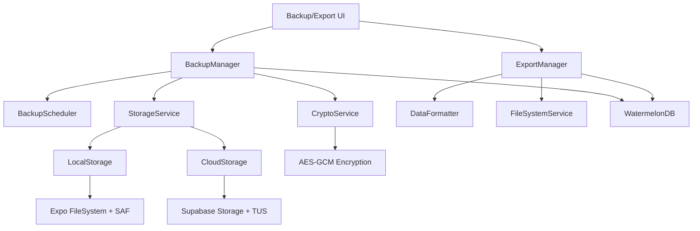

# Design Document

## Overview

The Data Export and Backup system provides GrowBro users with comprehensive data portability and backup capabilities. The system implements two distinct workflows: **GDPR-compliant data exports** for portability and **encrypted backups** for complete data restoration. The architecture leverages React Native/Expo capabilities while respecting mobile platform constraints and WatermelonDB's offline-first design.

### Key Design Principles

- **Separation of Concerns**: Clear distinction between human-readable exports and machine-restorable backups
- **Mobile-First**: Designed for iOS/Android constraints including scoped storage, background limitations, and file system access
- **Offline-First Compatibility**: Seamless integration with WatermelonDB sync protocol
- **Security by Design**: Encrypt-then-zip approach with proper key management
- **Resilient Operations**: Resumable uploads, integrity verification, and graceful failure handling

## Architecture

### High-Level System Components



### Data Flow Architecture

**Export Flow:**

1. User initiates export → ExportManager queries WatermelonDB
2. DataFormatter generates CSV/JSON per entity + manifest
3. FileSystemService packages files using Expo FileSystem
4. System presents via share sheet (iOS) or SAF picker (Android)

**Backup Flow:**

1. BackupScheduler triggers on app foreground/charging/Wi-Fi
2. BackupManager queries changed records since last backup
3. CryptoService encrypts data using AES-GCM-256
4. StorageService uploads via Supabase TUS with resumability

**Restore Flow:**

1. User selects backup file → CryptoService decrypts and validates
2. BackupManager pauses WatermelonDB sync
3. Data imported in batched transactions
4. Sync checkpoints reset and sync re-enabled

## Components and Interfaces

### Core Services

#### BackupManager

```typescript
interface BackupManager {
  createBackup(options: BackupOptions): Promise<BackupResult>;
  restoreBackup(backupFile: string, passphrase: string): Promise<RestoreResult>;
  validateBackup(backupFile: string): Promise<ValidationResult>;
  getBackupHistory(): Promise<BackupHistoryItem[]>;
  scheduleAutomaticBackup(): void;
  pauseSync(): Promise<void>;
  resumeSync(): Promise<void>;
}

interface BackupOptions {
  type: 'full' | 'delta';
  includeMedia: boolean;
  destination: 'local' | 'cloud';
  passphrase: string;
  chunkBytes: number;
  kdf: 'argon2id' | 'scrypt';
  cipher: 'xchacha20' | 'aes-gcm';
  compressionLevel: number;
  maxConcurrentUploads: number;
  selectiveRestore?: {
    entities: string[];
    dateRange?: { start: Date; end: Date };
    includeMedia: boolean;
  };
}
```

#### ExportManager

```typescript
interface ExportManager {
  exportData(format: ExportFormat): Promise<ExportResult>;
  generateManifest(): Promise<ManifestData>;
  packageExport(files: ExportFile[]): Promise<string>;
}

interface ExportFormat {
  type: 'human_readable' | 'restorable';
  entities: string[];
  includeMedia: boolean;
  dataMinimization: boolean; // Exclude media URIs/diagnoses by default for GDPR
  csvDelimiter: ',' | ';'; // Excel locale compatibility
  encoding: 'utf8_bom' | 'utf8'; // UTF-8 with BOM for Excel compatibility
}
```

#### CryptoService

```typescript
interface CryptoService {
  encrypt(
    data: Buffer,
    passphrase: string,
    options: CryptoOptions
  ): Promise<EncryptedData>;
  decrypt(encryptedData: EncryptedData, passphrase: string): Promise<Buffer>;
  generateChecksum(data: Buffer, algorithm: 'sha256' | 'blake3'): string;
  verifyChecksum(data: Buffer, checksum: string, algorithm: string): boolean;
  deriveKey(
    passphrase: string,
    salt: Buffer,
    kdf: 'argon2id' | 'scrypt'
  ): Promise<Buffer>;
  generateManifestSignature(manifest: any, key: Buffer): string;
  verifyManifestSignature(
    manifest: any,
    signature: string,
    key: Buffer
  ): boolean;
}

interface CryptoOptions {
  kdf: 'argon2id' | 'scrypt';
  cipher: 'xchacha20' | 'aes-gcm';
  chunkSize: number;
}

interface EncryptedData {
  ciphertext: Buffer;
  iv: Buffer;
  authTag: Buffer;
  salt: Buffer;
}
```

#### StorageService

```typescript
interface StorageService {
  uploadFile(
    file: string,
    destination: StorageDestination
  ): Promise<UploadResult>;
  downloadFile(url: string, destination: string): Promise<DownloadResult>;
  resumeUpload(uploadId: string): Promise<UploadResult>;
  getStorageQuota(): Promise<StorageQuota>;
}

interface StorageDestination {
  type: 'local' | 'supabase';
  path: string;
  resumable: boolean;
}
```

### Data Models

#### Backup Metadata

```typescript
interface BackupMetadata {
  id: string;
  type: 'full' | 'delta';
  createdAt: string;
  appVersion: string;
  dataVersion: string;
  size: number;
  checksum: string;
  mediaCount: number;
  recordCounts: Record<string, number>;
  encrypted: boolean;
  location: 'local' | 'cloud';
  integrity: 'verified' | 'corrupted' | 'unknown';
  kdf: 'argon2id' | 'scrypt';
  kdfParams: KDFParams;
  cipher: 'xchacha20' | 'aes-gcm';
  chunkBytes: number;
  hashAlgo: 'sha256' | 'blake3';
  manifestSignature: string;
}

interface KDFParams {
  salt: string;
  iterations?: number; // For scrypt
  memory?: number; // For Argon2id
  parallelism?: number; // For Argon2id
}
```

#### Export Manifest

```typescript
interface ExportManifest {
  type: 'canabro-export';
  version: string;
  createdAt: string;
  appVersion: string;
  timezone: string;
  tables: string[];
  recordCounts: Record<string, number>;
  mediaManifest?: MediaManifest;
  csvDelimiter: ',' | ';';
  encoding: 'utf8_bom' | 'utf8';
  dataMinimization: boolean;
  contentTypes: Record<string, string>; // file -> MIME type mapping
}

interface MediaManifest {
  files: MediaFile[];
  totalSize: number;
  totalCount: number;
}

interface MediaFile {
  recordId: string;
  filename: string;
  uri: string;
  width?: number;
  height?: number;
  size: number;
  hash: string;
}
```

## Data Models

### File Structure Standards

#### Export Package Structure

```
canabro-export_2025-01-15T10:30:00Z_v1.zip
├── manifest.json                 # Export metadata
├── plants.csv                    # Plant records
├── tasks.csv                     # Task records
├── harvests.csv                  # Harvest records
├── inventory.csv                 # Inventory records
├── playbooks.csv                 # Playbook records
├── diagnoses.csv                 # AI diagnosis records
├── export.json                   # Complete JSON snapshot
└── media-manifest.json           # Media file references
```

#### Backup Package Structure

```
backup_2025-01-15T10:30:00Z_full.cbk
├── manifest.json                 # Backup metadata
├── checksums.json               # File integrity checksums
├── data/
│   ├── plants.ndjson           # One record per line
│   ├── tasks.ndjson
│   ├── harvests.ndjson
│   └── ...
└── media/
    ├── media-index.json        # Media file mapping
    ├── a1b2c3d4.jpg           # Content-addressed files
    └── e5f6g7h8.mp4
```

### Database Integration

#### WatermelonDB Sync Management

```typescript
class WatermelonSyncManager {
  async pauseSync(): Promise<void> {
    await this.database.adapter.setLocal('sync_paused', 'true');
    // Stop any ongoing sync operations
  }

  async resumeSync(): Promise<void> {
    await this.database.adapter.setLocal('sync_paused', 'false');
    // Run full pull with server authoritative timestamps to honor LWW
    await this.performFullSyncPull();
  }

  async performFullSyncPull(): Promise<void> {
    // Don't blindly reset to zero - run full pull to avoid clobbering newer server updates
    const serverTimestamp = await this.getServerTimestamp();
    await this.database.adapter.setLocal(
      'last_pulled_at',
      serverTimestamp.toString()
    );
  }

  async createPreRestoreSnapshot(): Promise<string> {
    // Create local point-in-time backup before restore for rollback capability
    return await this.backupManager.createBackup({
      type: 'full',
      includeMedia: false,
      destination: 'local',
      passphrase: 'pre-restore-snapshot',
    });
  }
}
```

#### Delta Backup Query Strategy

```typescript
class DeltaBackupQuery {
  async getChangedRecords(since: Date): Promise<Record<string, any[]>> {
    const tables = ['plants', 'tasks', 'harvests', 'inventory'];
    const changes: Record<string, any[]> = {};

    for (const table of tables) {
      changes[table] = await this.database
        .get(table)
        .query(Q.where('updated_at', Q.gt(since.getTime())))
        .fetch();
    }

    return changes;
  }
}
```

### Streaming and Large File Handling

#### Streaming Encryption Service

```typescript
class StreamingCryptoService {
  async encryptStream(
    inputStream: ReadableStream,
    passphrase: string,
    options: CryptoOptions
  ): Promise<ReadableStream> {
    // Use libsodium secretstream or chunked AES-GCM for large files
    const key = await this.deriveKey(passphrase, options.kdf);
    return new ReadableStream({
      start(controller) {
        // Initialize encryption state
      },
      async pull(controller) {
        // Process chunks without loading entire file into memory
      },
    });
  }
}
```

#### Progressive ZIP Creation

```typescript
class StreamingZipService {
  async createZipStream(files: FileEntry[]): Promise<ReadableStream> {
    // Use react-native-zip-archive to write entries incrementally
    // Avoid JS-only zippers that buffer fully in memory
    return new ReadableStream({
      async pull(controller) {
        // Add files to zip one by one, streaming content
      },
    });
  }
}
```

### Background Task Management

#### Opportunistic Backup Scheduler

```typescript
class OpportunisticBackupScheduler {
  async scheduleBackup(): Promise<void> {
    // Use expo-background-task with clear caveats about iOS limitations
    const isCharging = await Battery.getPowerStateAsync();
    const networkState = await Network.getNetworkStateAsync();

    if (
      isCharging.batteryState === Battery.BatteryState.CHARGING &&
      networkState.type === Network.NetworkStateType.WIFI
    ) {
      await this.performBackup();
    } else {
      // Surface failure with notification and "Tap to back up now"
      await this.showBackupReminderNotification();
    }
  }
}
```

## User Experience Design

### Export vs Backup Semantics

#### UI Copy and Distinction

- **Data Export (CSV/JSON)**: "Export your data in human-readable formats for use in other applications"
- **Encrypted Backup (.cbk)**: "Create encrypted backup for complete data restoration"
- **GDPR Portability**: Clearly labeled as "structured, commonly used, machine-readable format"

#### Data Minimization Controls

```typescript
interface DataMinimizationOptions {
  excludeMediaUris: boolean; // Default: true for GDPR exports
  excludeDiagnoses: boolean; // Default: true for privacy
  includePortabilityHelp: boolean; // Link to GDPR Art. 20 explanation
}
```

### Restore Safety and Ergonomics

#### Selective Restore Interface

```typescript
interface SelectiveRestoreOptions {
  entities: string[]; // Choose plants/tasks/harvests/etc.
  dateRange?: { start: Date; end: Date };
  includeMedia: boolean;
  restoreMode: 'replace' | 'merge';
  createPreSnapshot: boolean; // Default: true
}
```

#### Passphrase UX Improvements

- Show hint if saved in SecureStore (without logging entered values)
- Caps lock/locale warnings
- Retry counter with progressive delays
- Clear error messages mapped to specific user guidance

### Backup Retention Policies

#### Policy Presets

```typescript
interface RetentionPolicy {
  name: 'space_saver' | 'balanced' | 'comprehensive';
  fullBackupInterval: 'weekly' | 'monthly';
  deltaCount: number; // Number of deltas between fulls
  retentionDays: number;
  autoCleanup: boolean;
}
```

## Error Handling

### Error Categories and Recovery Strategies

#### File System Errors

- **Android SAF Permission Denied**: Prompt user to re-select destination folder
- **iOS File Protection**: Retry when device is unlocked
- **Storage Full**: Offer cleanup options and alternative destinations

#### Network Errors

- **Upload Interruption**: Resume using TUS protocol with stored upload ID
- **Authentication Failure**: Re-authenticate with Supabase and retry
- **Quota Exceeded**: Notify user and offer backup management options

#### Encryption Errors

- **Invalid Passphrase**: Clear error message with retry option
- **Corruption Detected**: Offer integrity check and suggest new backup
- **Key Derivation Failure**: Fallback to alternative crypto implementation

#### Database Errors

- **Sync Conflict**: Pause restore, show conflict resolution options
- **Schema Mismatch**: Offer migration or version-specific restore
- **Transaction Failure**: Rollback changes and maintain data integrity

### Error Recovery Patterns

```typescript
class ErrorRecoveryService {
  async handleUploadError(
    error: UploadError,
    context: UploadContext
  ): Promise<RecoveryAction> {
    switch (error.type) {
      case 'network_timeout':
        return {
          action: 'retry',
          delay: this.getBackoffDelay(context.retryCount),
          userMessage: 'Connection timed out. Retrying automatically...',
        };
      case 'quota_exceeded':
        return {
          action: 'prompt_cleanup',
          userMessage:
            'Storage quota exceeded. Manage your backups to free space.',
          actionButton: 'Manage Backups',
        };
      case 'authentication_failed':
        return {
          action: 'reauthenticate',
          userMessage: 'Please sign in again to continue backup.',
          redirectTo: 'login',
        };
      case 'file_moved':
        return {
          action: 'reselect_destination',
          userMessage:
            'Backup location no longer accessible. Please choose a new location.',
          actionButton: 'Choose Location',
        };
      case 'device_locked':
        return {
          action: 'wait_unlock',
          userMessage: 'Please unlock your device to continue backup.',
          retryWhenUnlocked: true,
        };
      default:
        return {
          action: 'fail',
          userMessage: this.getUserFriendlyMessage(error),
        };
    }
  }

  private getUserFriendlyMessage(error: UploadError): string {
    // Map technical errors to user-friendly guidance
    const errorMap = {
      ENOSPC: 'Not enough storage space on device',
      EACCES: 'Permission denied. Please check app permissions.',
      ENOENT: 'File or folder not found. Please try again.',
    };
    return (
      errorMap[error.code] || 'An unexpected error occurred. Please try again.'
    );
  }
}
```

## Testing Strategy

### Unit Testing Approach

#### Core Service Testing

- **CryptoService**: Test encryption/decryption roundtrip, checksum validation
- **BackupManager**: Mock WatermelonDB, test sync pause/resume logic
- **ExportManager**: Validate CSV/JSON format compliance, manifest generation
- **StorageService**: Mock file system operations, test resumable upload logic

#### Integration Testing

- **End-to-End Backup/Restore**: Full workflow with test database
- **Platform-Specific File Operations**: Android SAF, iOS file protection
- **Network Resilience**: Simulated connection failures and recovery

### Performance Testing

#### Scalability Benchmarks

- **Large Dataset Export**: 10k records + 2k media files
- **Memory Usage**: Monitor during backup/restore operations
- **Background Processing**: Verify UI responsiveness during operations

#### Mobile Platform Testing

- **Battery Impact**: Measure power consumption during backup operations
- **Storage Efficiency**: Verify compression ratios and deduplication
- **Network Usage**: Monitor data transfer and resumability

### Security Testing

#### Encryption Validation

- **Key Derivation**: Verify Argon2id/scrypt implementation with proper salt and parameters
- **AES-GCM/XChaCha20 Implementation**: Test authentication tag validation and AEAD properties
- **Passphrase Handling**: Ensure no plaintext storage or logging, proper memory clearing
- **Manifest Integrity**: Test HMAC signature verification for tamper detection

#### Data Protection Testing

- **iOS File Protection**: Verify NSFileProtectionComplete enforcement on created files
- **Android Scoped Storage**: Test proper SAF usage with persistable URI permissions
- **Memory Security**: Ensure sensitive data is cleared from memory after use
- **Crypto Library Integration**: Test react-native-libsodium or AES-GCM implementation

### Compatibility Testing

#### Cross-Platform Validation

- **File Format Consistency**: Ensure backups work across iOS/Android
- **Character Encoding**: Test UTF-8 with BOM for Excel compatibility across locales
- **CSV Delimiter Handling**: Verify comma/semicolon delimiter support per locale
- **Timestamp Formats**: Verify ISO-8601 compliance across platforms

#### Excel Integration Testing

- **CSV Round-trip**: Test UTF-8 with BOM opens correctly in Excel
- **Delimiter Recognition**: Verify Excel respects chosen delimiter (comma/semicolon)
- **Character Set Handling**: Test special characters and Unicode in CSV exports

#### Version Compatibility

- **Schema Migration**: Test restore from older app versions with proper migration
- **Cross-Version Restore**: Block incompatible versions with clear error messages
- **Feature Degradation**: Handle missing features gracefully
- **Backward Compatibility**: Ensure export format stability with versioned manifests

### Mobile Platform Testing

#### iOS-Specific Testing

- **Background Task Limits**: Test backup operations under iOS background time constraints
- **File Protection**: Verify NSFileProtectionComplete behavior during device lock
- **App Store Compliance**: Ensure backup functionality meets App Store guidelines

#### Android-Specific Testing

- **Scoped Storage**: Test SAF integration with Android 11+ scoped storage
- **Battery Optimization**: Test backup scheduling with various battery optimization settings
- **Permission Handling**: Verify proper storage permission requests and handling

#### Device Condition Testing

- **Flight Mode**: Test graceful handling of network loss during operations
- **Low Battery**: Verify backup behavior under low battery conditions
- **Device Lock**: Test encryption/decryption when device becomes locked
- **Storage Full**: Test behavior when device storage is nearly full

### Performance Benchmarks

#### Measurable Performance Budgets

- **Package Phase**: ≤5s for 1k records on mid-tier Android
- **Encrypt Phase**: ≤10s for 100MB data on mid-tier Android
- **Upload Time**: Excluded from budget but show progress and ETA
- **Memory Usage**: Stay under 100MB peak during large operations
- **UI Responsiveness**: Maintain 60fps during background operations

## Developer Ergonomics

### .cbk Format Specification

The `.cbk` (CanaBro Backup) format is a documented, stable format for encrypted backups:

```typescript
interface CBKFormat {
  version: '1.0';
  encryption: {
    kdf: 'argon2id' | 'scrypt';
    kdfParams: KDFParams;
    cipher: 'xchacha20-poly1305' | 'aes-256-gcm';
    chunkSize: number; // Default: 64KB
  };
  integrity: {
    hashAlgorithm: 'sha256' | 'blake3';
    manifestSignature: string; // HMAC with derived key
  };
  structure: {
    manifest: 'manifest.json';
    checksums: 'checksums.json';
    data: 'data/*.ndjson';
    media: 'media/*';
  };
}
```

### CLI Verification Tool

Provide a Node.js CLI tool for power users to validate backups off-device:

```bash
# Verify backup integrity
npx @growbro/backup-verify backup.cbk --passphrase

# Extract manifest without decryption
npx @growbro/backup-verify backup.cbk --manifest-only

# Decrypt specific files
npx @growbro/backup-verify backup.cbk --extract data/plants.ndjson
```

### Implementation Libraries

#### Recommended Expo-Compatible Libraries

- **Encryption**: `react-native-libsodium` with EAS config plugin
- **File System**: `expo-file-system` with StorageAccessFramework
- **Resumable Uploads**: `tus-js-client` for Supabase Storage
- **ZIP Creation**: `react-native-zip-archive` for streaming
- **Secure Storage**: `expo-secure-store` for key hints only

#### EAS Build Configuration

```json
{
  "expo": {
    "plugins": [
      [
        "react-native-libsodium",
        {
          "ios": { "dataProtection": "NSFileProtectionComplete" },
          "android": { "enableScoped": true }
        }
      ]
    ]
  }
}
```

### Monitoring and Telemetry

#### Privacy-Safe Metrics

```typescript
interface BackupTelemetry {
  // No PII - only operational metrics
  operation: 'export' | 'backup' | 'restore';
  duration: number;
  dataSize: number;
  mediaCount: number;
  platform: 'ios' | 'android';
  success: boolean;
  errorCode?: string; // Generic error categories only
  appVersion: string;
}
```

Send to Sentry with user opt-in for improving backup reliability without exposing user data.
