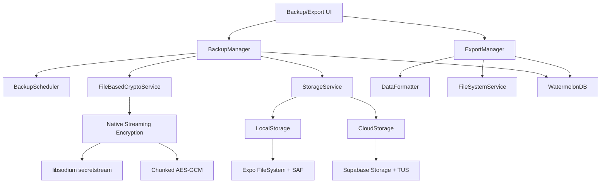

# Design Document

## Overview

The Data Export and Backup system provides GrowBro users with comprehensive data portability and backup capabilities. The system implements two distinct workflows: **GDPR-compliant data exports** for portability and **encrypted backups** for complete data restoration. The architecture leverages React Native/Expo capabilities while respecting mobile platform constraints and WatermelonDB's offline-first design.

### Key Design Principles

- **Separation of Concerns**: Clear distinction between human-readable exports and machine-restorable backups
- **Mobile-First**: Designed for iOS/Android constraints including scoped storage, background limitations, and file system access
- **Offline-First Compatibility**: Seamless integration with WatermelonDB sync protocol
- **Security by Design**: Encrypt-then-zip approach with proper key management
- **Resilient Operations**: Resumable uploads, integrity verification, and graceful failure handling

## Architecture

### High-Level System Components



### Data Flow Architecture

**Export Flow:**

1. User initiates export → ExportManager queries WatermelonDB
2. DataFormatter generates CSV/JSON per entity + manifest
3. FileSystemService packages files using Expo FileSystem
4. System presents via share sheet (iOS) or SAF picker (Android)

**Backup Flow:**

1. BackupScheduler triggers on app foreground/charging/Wi-Fi
2. BackupManager exports WatermelonDB to temporary file
3. FileBasedCryptoService encrypts file using native streaming (libsodium/AES-GCM)
4. StorageService uploads encrypted file via Supabase TUS with resumability
5. Temporary files cleaned up with proper error handling

**Restore Flow:**

1. User selects backup file → FileBasedCryptoService decrypts file using native streaming
2. BackupManager validates decrypted file integrity and format
3. BackupManager pauses WatermelonDB sync
4. Decrypted database file imported in batched transactions
5. Sync checkpoints reset and sync re-enabled
6. Temporary decrypted files cleaned up securely

## Components and Interfaces

### Core Services

```typescript
enum Cipher {
  XCHACHA20_POLY1305 = 'xchacha20-poly1305',
  AES_256_GCM = 'aes-256-gcm',
}
```

#### BackupManager

```typescript
interface BackupManager {
  createBackup(options: BackupOptions): Promise<BackupResult>;
  restoreBackup(backupFile: string, passphrase: string): Promise<RestoreResult>;
  validateBackup(backupFile: string): Promise<ValidationResult>;
  getBackupHistory(): Promise<BackupHistoryItem[]>;
  scheduleAutomaticBackup(): void;
  pauseSync(): Promise<void>;
  resumeSync(): Promise<void>;
}

interface BackupOptions {
  type: 'full' | 'delta';
  includeMedia: boolean;
  destination: 'local' | 'cloud';

  // Encryption options - mutually exclusive: use either passphrase OR encryptionKey/wrappedKey
  // For passphrase-based encryption (traditional approach)
  passphrase?: string;

  // For key-based encryption (ephemeral/session keys)
  encryptionKey?: string; // Ephemeral key instead of passphrase
  wrappedKey?: WrappedKey; // Wrapped key for later retrieval

  // Crypto parameters (applicable to both encryption methods)
  chunkBytes?: number;
  kdf?: 'argon2id' | 'scrypt';
  cipher?: Cipher;
  compressionLevel?: number;
  maxConcurrentUploads?: number;

  // Backup lifecycle and metadata
  ttl?: number; // Time to live for the backup
  metadata?: {
    encrypted: boolean;
    keyWrapped: boolean;
    purpose: string;
    createdAt: string;
    protectionLevel?:
      | 'device-keystore'
      | 'passphrase-wrapped'
      | 'os-data-protection';
  };

  // Selective restore options
  selectiveRestore?: {
    entities: string[];
    dateRange?: { start: Date; end: Date };
    includeMedia: boolean;
  };
}

interface BackupResult {
  id: string; // The snapshot ID
  createdAt: Date; // When the backup was created
  size?: number; // Size of the backup in bytes (optional)
  type: 'full' | 'delta'; // Type of backup
  encrypted: boolean; // Whether the backup is encrypted
}
```

#### ExportManager

```typescript
interface ExportManager {
  exportData(format: ExportFormat): Promise<ExportResult>;
  generateManifest(): Promise<ManifestData>;
  packageExport(files: ExportFile[]): Promise<string>;
}

interface ExportFormat {
  type: 'human_readable' | 'restorable';
  entities: string[];
  includeMedia: boolean;
  dataMinimization: boolean; // Exclude media URIs/diagnoses by default for GDPR
  csvDelimiter: ',' | ';'; // Excel locale compatibility
  encoding: 'utf8_bom' | 'utf8'; // UTF-8 with BOM for Excel compatibility
}
```

#### CryptoService

```typescript
interface CryptoService {
  encryptWithKey(
    data: Uint8Array,
    key: CryptoKey | Uint8Array,
    iv?: Uint8Array,
    options?: CryptoOptions
  ): Promise<EncryptedData>;
  encryptWithPassphrase(
    data: Uint8Array,
    passphrase: string,
    options?: CryptoOptions
  ): Promise<EncryptedData>;
  decryptWithKey(
    encryptedBytes: Uint8Array | EncryptedData,
    key: CryptoKey | Uint8Array,
    iv?: Uint8Array
  ): Promise<Uint8Array>;
  decrypt(
    encryptedData: EncryptedData,
    passphrase: string
  ): Promise<Uint8Array>;
  generateChecksum(data: Uint8Array, algorithm: 'sha256' | 'blake3'): string;
  verifyChecksum(
    data: Uint8Array,
    checksum: string,
    algorithm: 'sha256' | 'blake3'
  ): boolean;
  deriveKey(
    passphrase: string,
    salt: Uint8Array,
    kdfOptions?:
      | {
          kdf: 'argon2id';
          iterations?: number;
          memory?: number;
          parallelism?: number;
        }
      | { kdf: 'scrypt'; N: number; r: number; p: number }
  ): Promise<Uint8Array>;
  generateManifestSignature(manifest: any, key: Uint8Array): string;
  verifyManifestSignature(
    manifest: any,
    signature: string,
    key: Uint8Array
  ): boolean;
  // Hash a user passphrase for secure storage/verification
  hashPassphrase(passphrase: string): Promise<string>; // e.g., Argon2id PHC string or PBKDF2-HMAC-SHA256
}

interface CryptoOptions {
  kdfOptions:
    | {
        kdf: 'argon2id';
        iterations?: number;
        memory?: number;
        parallelism?: number;
      }
    | { kdf: 'scrypt'; N: number; r: number; p: number };
  cipher: Cipher;
  chunkSize: number;
}

interface EncryptedData {
  ciphertext: Uint8Array;
  iv: Uint8Array;
  authTag: Uint8Array;
  salt: Uint8Array;
  cipher: Cipher; // Encryption algorithm used
}
```

#### StorageService

```typescript
interface StorageService {
  uploadFile(
    file: string,
    destination: StorageDestination
  ): Promise<UploadResult>;
  downloadFile(url: string, destination: string): Promise<DownloadResult>;
  resumeUpload(uploadId: string): Promise<UploadResult>;
  getStorageQuota(): Promise<StorageQuota>;
}

interface StorageDestination {
  type: 'local' | 'supabase';
  path: string;
  resumable: boolean;
}
```

### Data Models

#### Backup Metadata

```typescript
interface BackupMetadata {
  id: string;
  type: 'full' | 'delta';
  createdAt: string;
  appVersion: string;
  dataVersion: string;
  size: number;
  checksum: string;
  mediaCount: number;
  recordCounts: Record<string, number>;
  encrypted: boolean;
  location: 'local' | 'cloud';
  integrity: 'verified' | 'corrupted' | 'unknown';
  kdf: 'argon2id' | 'scrypt';
  kdfParams: KDFParams;
  cipher: Cipher;
  chunkBytes: number;
  hashAlgo: 'sha256' | 'blake3';
  manifestSignature: string;
}

interface KDFParams {
  salt: string;
  iterations?: number; // For scrypt
  memory?: number; // For Argon2id
  parallelism?: number; // For Argon2id
}
```

#### Export Manifest

```typescript
interface ExportManifest {
  type: 'canabro-export';
  version: string;
  createdAt: string;
  appVersion: string;
  timezone: string;
  tables: string[];
  recordCounts: Record<string, number>;
  mediaManifest?: MediaManifest;
  csvDelimiter: ',' | ';';
  encoding: 'utf8_bom' | 'utf8';
  dataMinimization: boolean;
  contentTypes: Record<string, string>; // file -> MIME type mapping
}

interface MediaManifest {
  files: MediaFile[];
  totalSize: number;
  totalCount: number;
}

interface MediaFile {
  recordId: string;
  filename: string;
  uri: string;
  width?: number;
  height?: number;
  size: number;
  hash: string;
}
```

## Data Models

### File Structure Standards

#### Export Package Structure

```text
canabro-export_2025-01-15T10:30:00Z_v1.zip
├── manifest.json                 # Export metadata
├── plants.csv                    # Plant records
├── tasks.csv                     # Task records
├── harvests.csv                  # Harvest records
├── inventory.csv                 # Inventory records
├── playbooks.csv                 # Playbook records
├── diagnoses.csv                 # AI diagnosis records
├── export.json                   # Complete JSON snapshot
└── media-manifest.json           # Media file references
```

#### Backup Package Structure

```text
backup_2025-01-15T10:30:00Z_full.cbk
├── manifest.json                 # Backup metadata
├── checksums.json               # File integrity checksums
├── data/
│   ├── plants.ndjson           # One record per line
│   ├── tasks.ndjson
│   ├── harvests.ndjson
│   └── ...
└── media/
    ├── media-index.json        # Media file mapping
    ├── a1b2c3d4.jpg           # Content-addressed files
    └── e5f6g7h8.mp4
```

### Database Integration

#### WatermelonDB Sync Management

```typescript
class WatermelonSyncManager {
  async pauseSync(): Promise<void> {
    await this.database.adapter.setLocal('sync_paused', 'true');
    // Stop any ongoing sync operations
  }

  async resumeSync(): Promise<void> {
    await this.database.adapter.setLocal('sync_paused', 'false');
    // Run full pull with server authoritative timestamps to honor LWW
    await this.performFullSyncPull();
  }

  async performFullSyncPull(): Promise<void> {
    // Don't blindly reset to zero - run full pull to avoid clobbering newer server updates
    const serverTimestamp = await this.getServerTimestamp();
    await this.database.adapter.setLocal(
      'last_pulled_at',
      serverTimestamp.toString()
    );
  }

  async createPreRestoreSnapshot(): Promise<string> {
    // Create local point-in-time backup before restore for rollback capability
    // Generate cryptographically secure ephemeral key for this snapshot
    const ephemeralKey = await this.generateEphemeralKey();

    // Wrap the key securely - either with user passphrase or device keystore
    const wrappedKey = await this.wrapEncryptionKey(ephemeralKey);

    // Create backup with ephemeral encryption
    const { id: snapshotId } = await this.backupManager.createBackup({
      type: 'full',
      includeMedia: false,
      destination: 'local',
      encryptionKey: ephemeralKey, // Use ephemeral key instead of passphrase
      wrappedKey: wrappedKey, // Store wrapped key for later unwrapping
      ttl: 3600000, // 1 hour TTL for security
      metadata: {
        encrypted: true,
        keyWrapped: true,
        purpose: 'pre-restore-snapshot',
        createdAt: new Date().toISOString(),
      },
    });

    // Schedule cleanup of wrapped key after TTL
    this.scheduleKeyCleanup(snapshotId, wrappedKey, 3600000);

    return snapshotId;
  }

  private async generateEphemeralKey(): Promise<string> {
    // Generate cryptographically secure 256-bit key
    const keyBytes = await this.cryptoService.generateSecureRandomBytes(32);
    return this.cryptoService.bytesToBase64(keyBytes);
  }

  private async wrapEncryptionKey(ephemeralKey: string): Promise<WrappedKey> {
    try {
      // Try device keystore first (more secure)
      return await this.deviceKeyStore.wrapKey(ephemeralKey, {
        purpose: 'snapshot-encryption',
        ttl: 3600000, // 1 hour
      });
    } catch (error) {
      // Fallback to user passphrase wrapping if keystore unavailable
      const userPassphrase = await this.getUserBackupPassphrase();
      if (userPassphrase) {
        return await this.cryptoService.wrapKeyWithPassphrase(
          ephemeralKey,
          userPassphrase,
          { kdf: 'argon2id', iterations: 4 }
        );
      }
      // Final fallback: OS-level data protection without encryption
      return {
        id: `os-protected-${Date.now()}-${Math.random().toString(36).substr(2, 9)}`,
        wrapped: false,
        protectionLevel: 'os-data-protection',
        plaintextKey: ephemeralKey,
        ttl: 3600000, // 1 hour default
        createdAt: new Date().toISOString(),
        purpose: 'snapshot-encryption',
      };
    }
  }

  private async scheduleKeyCleanup(
    snapshotId: string,
    wrappedKey: WrappedKey,
    ttlMs: number
  ): Promise<void> {
    // Schedule cleanup in background task
    await this.backgroundTaskScheduler.schedule({
      id: `cleanup-${snapshotId}`,
      type: 'key-cleanup',
      executeAt: Date.now() + ttlMs,
      data: { snapshotId, wrappedKeyId: wrappedKey.id },
      retryPolicy: { maxAttempts: 3 },
    });
  }
}
```

#### Secure Key Management Interfaces

```typescript
interface WrappedKey {
  id: string;
  wrapped: boolean;
  protectionLevel:
    | 'device-keystore'
    | 'passphrase-wrapped'
    | 'os-data-protection';
  wrappedData?: string; // Serialized JSON containing encrypted key data and IV {data: base64, iv: base64}
  plaintextKey?: string; // Used when wrapped === false
  salt?: string; // For passphrase-wrapped keys
  ttl?: number; // Time to live in milliseconds
  createdAt: string;
  purpose: string;
}

interface EphemeralKeyOptions {
  keySize?: number; // Default: 256 bits
  purpose: string;
  ttl?: number; // Default: 1 hour
}

interface KeyCleanupTask {
  snapshotId: string;
  wrappedKeyId: string;
  executeAt: number;
  retryCount: number;
}
```

#### Device KeyStore Service

```typescript
class DeviceKeyStore {
  async wrapKey(
    key: string,
    options: EphemeralKeyOptions
  ): Promise<WrappedKey> {
    const keyId = `snapshot-key-${Date.now()}-${Math.random().toString(36).substr(2, 9)}`;

    try {
      // Use Expo SecureStore or React Native Keychain for device-protected storage
      await SecureStore.setItemAsync(keyId, key, {
        keychainAccessible: SecureStore.WHEN_UNLOCKED_THIS_DEVICE_ONLY,
        requireAuthentication: false, // For automated snapshots
      });

      return {
        id: keyId,
        wrapped: true,
        protectionLevel: 'device-keystore',
        ttl: options.ttl || 3600000,
        createdAt: new Date().toISOString(),
        purpose: options.purpose,
      };
    } catch (error) {
      throw new Error(
        `Failed to store key in device keystore: ${error.message}`
      );
    }
  }

  async unwrapKey(wrappedKey: WrappedKey): Promise<string> {
    if (wrappedKey.protectionLevel !== 'device-keystore') {
      throw new Error('Key is not stored in device keystore');
    }

    try {
      const key = await SecureStore.getItemAsync(wrappedKey.id);
      if (!key) {
        throw new Error('Key not found or expired');
      }
      return key;
    } catch (error) {
      throw new Error(`Failed to retrieve key from keystore: ${error.message}`);
    }
  }

  async deleteKey(wrappedKey: WrappedKey): Promise<void> {
    if (wrappedKey.protectionLevel === 'device-keystore') {
      await SecureStore.deleteItemAsync(wrappedKey.id);
    }
  }
}
```

#### Crypto Service Extensions

```typescript
class CryptoService {
  async generateSecureRandomBytes(length: number): Promise<Uint8Array> {
    // Use react-native-libsodium or Expo Crypto for secure random generation
    if (typeof crypto !== 'undefined' && crypto.getRandomValues) {
      const array = new Uint8Array(length);
      crypto.getRandomValues(array);
      return array;
    }
    // Fallback for React Native environments
    return await this.nativeSecureRandom(length);
  }

  /**
   * Private method to generate secure random bytes using native libraries.
   * Attempts to use react-native-libsodium first, then falls back to expo-crypto.
   * Throws a clear error if neither provider is available.
   *
   * @param length - The number of random bytes to generate
   * @returns Promise resolving to a Uint8Array of the requested length
   * @throws Error if no secure random provider is available
   */
  private async nativeSecureRandom(length: number): Promise<Uint8Array> {
    try {
      // First attempt: react-native-libsodium (preferred)
      const libsodium = await import('react-native-libsodium');
      if (libsodium && libsodium.sodium) {
        const randomBytes = libsodium.sodium.randombytes_buf(length);
        return new Uint8Array(randomBytes);
      }
    } catch (error) {
      // Log the error but continue to fallback
      console.warn('react-native-libsodium not available for secure random generation:', error);
    }

    try {
      // Second attempt: expo-crypto fallback
      const { getRandomBytesAsync } = await import('expo-crypto');
      if (getRandomBytesAsync) {
        const randomBytes = await getRandomBytesAsync(length);
        // Convert to Uint8Array if not already
        return randomBytes instanceof Uint8Array ? randomBytes : new Uint8Array(randomBytes);
      }
    } catch (error) {
      // Log the error but continue to error handling
      console.warn('expo-crypto not available for secure random generation:', error);
    }

    // If we reach here, neither provider was available
    throw new Error(
      'Secure random generation requires a native crypto provider.\n' +
        'Install and configure one of: react-native-libsodium (preferred) or expo-crypto.\n' +
        'For Expo managed workflow: `npx expo install react-native-libsodium expo-crypto`\n' +
        'For bare React Native: `npm install react-native-libsodium expo-crypto && cd ios && pod install`\n' +
        'For EAS Build ensure native modules are included in your build configuration.'
    );
  }

  async bytesToBase64(bytes: Uint8Array): Promise<string> {
    // Cross-platform base64 conversion using react-native-quick-base64
    const { encode } = await import('react-native-quick-base64');
    return encode(bytes);
  }

  async base64ToBytes(base64: string): Promise<Uint8Array> {
    // Cross-platform base64 to bytes conversion using react-native-quick-base64
    const { decode } = await import('react-native-quick-base64');
    return decode(base64);
  }

  /**
   * Decrypts encrypted data using the provided key.
   *
   * This method supports two usage patterns:
   * 1. Raw bytes + IV: decryptWithKey(encryptedBytes, key, iv)
   * 2. EncryptedData object: decryptWithKey(encryptedDataObject, key) - extracts data/iv internally
   *
   * Uses AES-256-GCM for authenticated encryption (confidentiality + integrity).
   * Supports both CryptoKey and Uint8Array key formats for flexibility.
   *
   * @param encryptedBytes - Either raw encrypted bytes (Uint8Array) or an EncryptedData object
   * @param key - The decryption key (CryptoKey or Uint8Array)
   * @param iv - Optional initialization vector (required when passing raw bytes)
   * @returns Promise resolving to decrypted bytes
   * @throws Error if decryption fails or parameters are invalid
   */
  async decryptWithKey(
    encryptedBytes: Uint8Array | EncryptedData,
    key: CryptoKey | Uint8Array,
    iv?: Uint8Array
  ): Promise<Uint8Array> {
    try {
      let data: Uint8Array;
      let actualIv: Uint8Array;

      // Handle dual input types
      if (encryptedBytes instanceof Uint8Array) {
        // Raw bytes + iv pattern
        if (!iv) {
          throw new Error('IV is required when passing raw encrypted bytes');
        }
        data = encryptedBytes;
        actualIv = iv;
      } else {
        // EncryptedData object pattern - extract data and iv
        if (!encryptedBytes.iv) {
          throw new Error('IV is required in EncryptedData object');
        }
        actualIv = encryptedBytes.iv;

        // Handle different encryption formats
        if (encryptedBytes.cipher === Cipher.AES_256_GCM) {
          // WebCrypto AES-GCM format: concatenate ciphertext with authTag
          if (!encryptedBytes.authTag) {
            throw new Error('authTag is required for AES-GCM decryption');
          }
          data = new Uint8Array(
            encryptedBytes.ciphertext.length + encryptedBytes.authTag.length
          );
          data.set(encryptedBytes.ciphertext);
          data.set(encryptedBytes.authTag, encryptedBytes.ciphertext.length);
        } else if (encryptedBytes.cipher === Cipher.XCHACHA20_POLY1305) {
          // Use libsodium-based XChaCha20-Poly1305 decryption
          return await this.decryptXChaCha20Poly1305(encryptedBytes.ciphertext, key, actualIv);
        } else {
          throw new Error(`Unsupported cipher: ${encryptedBytes.cipher}`);
        }
      }

      // Decrypt using AES-GCM via platform-capable abstraction. This
      // encapsulates WebCrypto usage and a native/bridge fallback for
      // React Native / Expo environments where crypto.subtle may be
      // missing or incomplete.
      return await this.decryptAesGcm(data, key, actualIv);
    } catch (error) {
      // Provide specific error messages for different failure modes
      if (error instanceof Error) {
        if (error.name === 'OperationError') {
          throw new Error(
            'Decryption failed: Invalid key, IV, or corrupted data'
          );
        }
        if (error.name === 'InvalidAccessError') {
          throw new Error(
            'Decryption failed: Key is not suitable for AES-GCM decryption'
          );
        }
      }
      throw new Error(
        `Decryption failed: ${error instanceof Error ? error.message : 'Unknown error'}`
      );
    }
  }

  /**
   * Decrypt XChaCha20-Poly1305 ciphertext with a given key and IV using libsodium.
   *
   * This method uses react-native-libsodium to perform XChaCha20-Poly1305 authenticated
   * decryption. The key is normalized to a Uint8Array if necessary, and the method
   * uses sodium.crypto_aead_xchacha20poly1305_ietf_decrypt with null additional data.
   *
   * @param data - Uint8Array containing the ciphertext (authTag is included in ciphertext)
   * @param key - The decryption key (CryptoKey or Uint8Array)
   * @param iv - Uint8Array nonce/initialization vector
   * @returns Promise resolving to decrypted plaintext bytes
   * @throws Error if libsodium is not available or decryption fails
   * @private
   */
  private async decryptXChaCha20Poly1305(
    data: Uint8Array,
    key: CryptoKey | Uint8Array,
    iv: Uint8Array
  ): Promise<Uint8Array> {
    try {
      // Normalize key to Uint8Array
      let keyBytes: Uint8Array;
      if (key instanceof Uint8Array) {
        keyBytes = key;
      } else {
        // Extract raw bytes from CryptoKey if needed
        throw new Error('CryptoKey not supported for XChaCha20-Poly1305 - use Uint8Array key');
      }

      // Ensure libsodium is available
      if (!sodium) {
        throw new Error('react-native-libsodium is required for XChaCha20-Poly1305 decryption');
      }

      // Perform authenticated decryption
      const plaintext = sodium.crypto_aead_xchacha20poly1305_ietf_decrypt(
        null, // additional data (null for no AD)
        data, // ciphertext
        null, // auth tag (included in ciphertext for libsodium)
        iv, // nonce
        keyBytes // key
      );

      return plaintext;
    } catch (error) {
      if (error instanceof Error) {
        if (error.message.includes('libsodium') || error.message.includes('sodium')) {
          throw new Error('react-native-libsodium is required for XChaCha20-Poly1305 decryption');
        }
      }
      throw new Error(
        `XChaCha20-Poly1305 decryption failed: ${error instanceof Error ? error.message : 'Unknown error'}`
      );
    }
  }

  /**
   * Decrypt AES-GCM ciphertext with a given key and IV.
   *
   * This method first checks for WebCrypto (crypto.subtle). If available
   * and complete (importKey + decrypt), it will use WebCrypto. Otherwise
   * it attempts to route to a native fallback (a bridging module or
   * a community native crypto library). If no supported fallback is
   * available it throws a clear error describing the required dependency
   * for React Native / Expo.
   *
   * Inputs/Outputs contract:
   * - data: Uint8Array containing ciphertext (and authTag concatenated for WebCrypto)
   * - key: either a CryptoKey (WebCrypto) or raw Uint8Array of key bytes
   * - iv: Uint8Array initialization vector
   * - returns: Promise resolving to decrypted plaintext Uint8Array
   */
  async decryptAesGcm(
    data: Uint8Array,
    key: CryptoKey | Uint8Array,
    iv: Uint8Array
  ): Promise<Uint8Array> {
    // Prefer WebCrypto when available and complete
    const hasWebCrypto =
      typeof crypto !== 'undefined' &&
      !!crypto.subtle &&
      typeof crypto.subtle.importKey === 'function' &&
      typeof crypto.subtle.decrypt === 'function';

    if (hasWebCrypto) {
      // If caller passed raw key bytes, import to CryptoKey for WebCrypto
      let cryptoKey: CryptoKey;
      if (key instanceof Uint8Array) {
        cryptoKey = await crypto.subtle.importKey('raw', key, 'AES-GCM', false, [
          'decrypt',
        ]);
      } else {
        cryptoKey = key;
      }

      const decrypted = await crypto.subtle.decrypt(
        { name: 'AES-GCM', iv },
        cryptoKey,
        data
      );

      return new Uint8Array(decrypted);
    }

    // WebCrypto not available - attempt to use a native fallback.
    // The implementation below is intentionally permissive: projects may
    // provide any of the common native crypto libraries exposed to JS.
    // Try a few well-known candidates dynamically and call a consistent API.
    try {
      // Prefer an injected/native bridge if available on this service
      // (e.g., when CryptoService is extended or constructed with a native shim)
      // @ts-ignore - optional runtime property
      if (this.nativeCrypto && typeof this.nativeCrypto.decryptAesGcm === 'function') {
        // nativeCrypto.decryptAesGcm expects (dataBase64, keyBase64, ivBase64)
        const { decryptAesGcm } = this.nativeCrypto;
        const toBase64 = async (b: Uint8Array) => {
          const { encode } = await import('react-native-quick-base64');
          return encode(b);
        };
        const plaintextBase64 = await decryptAesGcm(
          await toBase64(data),
          await toBase64(key instanceof Uint8Array ? key : new Uint8Array()),
          await toBase64(iv)
        );
        const { decode } = await import('react-native-quick-base64');
        return decode(plaintextBase64);
      }

      // Try react-native-quick-crypto (or similar). These libraries differ in API;
      // projects should adapt this block to call their chosen native implementation.
      // We attempt to import commonly used packages and call a reasonable API shape.
      try {
        // Example: react-native-quick-crypto exposes a 'crypto' with 'aesGcmDecrypt'
        // This is a best-effort probe; adjust as needed for your chosen lib.
        // eslint-disable-next-line @typescript-eslint/no-var-requires
        // @ts-ignore
        const quickCrypto = await import('react-native-quick-crypto');
        if (quickCrypto && typeof quickCrypto.aesGcmDecrypt === 'function') {
          const plaintext = await quickCrypto.aesGcmDecrypt(data, key, iv);
          return plaintext instanceof Uint8Array ? plaintext : new Uint8Array(plaintext);
        }
      } catch (e) {
        // ignore and try next option
      }

      try {
        // react-native-libsodium - preferred native implementation
        // @ts-ignore
        const libsodium = await import('react-native-libsodium');
        if (libsodium && libsodium.sodium) {
          const { sodium } = libsodium;

          // Extract ciphertext and authTag from concatenated data
          // AES-GCM authTag is typically 16 bytes at the end
          const authTagLength = 16;
          if (data.length < authTagLength) {
            throw new Error('Invalid encrypted data: too short for AES-GCM');
          }

          const ciphertext = data.slice(0, data.length - authTagLength);
          const authTag = data.slice(data.length - authTagLength);
          const keyBytes = key instanceof Uint8Array ? key : new Uint8Array();

          // Use DETACHED API with separate tag
          const decrypted = sodium.crypto_aead_aes256gcm_decrypt_detached(
            null,              // nsec
            ciphertext,        // c (without tag)
            authTag,           // mac (tag)
            null,              // ad
            iv,                // npub (12 bytes)
            keyBytes           // key (32 bytes)
          );

          return new Uint8Array(decrypted);
        }
      } catch (e) {
        // ignore and try next option
      }

      try {
        // react-native-simple-crypto
        // @ts-ignore
        const simpleCrypto = await import('react-native-simple-crypto');
        if (
          simpleCrypto &&
          simpleCrypto.RNCrypto &&
          typeof simpleCrypto.RNCrypto.decrypt === 'function'
        ) {
          // simple-crypto usually expects objects; adapt as required by the lib you pick
          // Placeholder example - real usage will depend on the library
          // @ts-ignore
          const plaintextBytes = await simpleCrypto.RNCrypto.decrypt(
            /* algorithm */ 'AES-GCM',
            /* key */ key instanceof Uint8Array ? key : new Uint8Array(),
            /* iv */ iv,
            /* ciphertext */ data
          );
          return plaintextBytes instanceof Uint8Array
            ? plaintextBytes
            : new Uint8Array(plaintextBytes);
        }
      } catch (e) {
        // ignore
      }
    } catch (error) {
      // Fall through to throwing a descriptive error below
    }

    // If we reach here, no suitable crypto implementation was available.
    throw new Error(
      'AES-GCM decryption requires WebCrypto (crypto.subtle) or a native crypto fallback.\n' +
        'On React Native / Expo install and configure one of: react-native-libsodium (preferred), react-native-quick-crypto, react-native-simple-crypto,\n' +
        'or provide a native shim exposing decryptAesGcm(dataBase64, keyBase64, ivBase64).\n' +
        'For Expo managed workflow consider using a dev-client with the native module or use EAS build.\n' +
        'Example: `npm install react-native-libsodium && cd ios && pod install` and follow its setup docs.\n' +
        'For EAS Build ensure the native module is included in your build configuration.'
    );
  }

  async wrapKeyWithPassphrase(
    key: string,
    passphrase: string,
    options: { kdf: 'argon2id' | 'scrypt'; iterations: number }
  ): Promise<WrappedKey> {
    const salt = await this.generateSecureRandomBytes(32);
    const iv = await this.generateSecureRandomBytes(12); // 12 bytes for AES-GCM

    // Derive wrapping key using PBKDF2/Argon2
    const wrappingKey = await this.deriveKey(passphrase, salt, options);

    // Convert string key to bytes and encrypt with the derived wrapping key
    const keyBytes = new TextEncoder().encode(key);
    const encryptedKey = await this.encryptWithKey(keyBytes, wrappingKey, iv, {
      cipher: Cipher.AES_256_GCM,
      kdfOptions: options,
      chunkSize: 64 * 1024, // 64KB chunks
    });

    // Serialize encrypted data components separately as base64
    const encryptedData = {
      ciphertext: await this.bytesToBase64(encryptedKey.ciphertext),
      authTag: await this.bytesToBase64(encryptedKey.authTag),
      iv: await this.bytesToBase64(iv),
    };

    return {
      id: `wrapped-${Date.now()}`,
      wrapped: true,
      protectionLevel: 'passphrase-wrapped',
      wrappedData: JSON.stringify(encryptedData),
      salt: await this.bytesToBase64(salt),
      ttl: 3600000, // 1 hour default
      createdAt: new Date().toISOString(),
      purpose: 'snapshot-encryption',
    };
  }

  async unwrapKeyWithPassphrase(
    wrappedKey: WrappedKey,
    passphrase: string
  ): Promise<string> {
    if (wrappedKey.protectionLevel !== 'passphrase-wrapped') {
      throw new Error('Key is not passphrase-wrapped');
    }

    try {
      // Parse the serialized encrypted data to extract components
      const encryptedData = JSON.parse(wrappedKey.wrappedData!);
      const ciphertext = await this.base64ToBytes(encryptedData.ciphertext);
      const authTag = await this.base64ToBytes(encryptedData.authTag);
      const iv = await this.base64ToBytes(encryptedData.iv);

      // Re-derive wrapping key from passphrase
      const salt = await this.base64ToBytes(wrappedKey.salt!);
      const wrappingKey = await this.deriveKey(passphrase, salt, {
        kdf: 'argon2id',
        iterations: 4,
      });

      // Reconstruct the encrypted data object for decryption
      const encryptedKeyData: EncryptedData = {
        ciphertext,
        authTag,
        iv,
        salt: await this.base64ToBytes(wrappedKey.salt!),
        cipher: Cipher.AES_256_GCM,
      };

      // Decrypt the ephemeral key using the derived wrapping key
      const decryptedBytes = await this.decryptWithKey(
        encryptedKeyData,
        wrappingKey
      );

      return new TextDecoder().decode(decryptedBytes);
    } catch (error) {
      // Provide specific error context for key unwrapping failures
      if (
        error instanceof Error &&
        error.message.includes('Decryption failed')
      ) {
        throw new Error(
          `Key unwrapping failed: Invalid passphrase or corrupted key data`
        );
      }
      throw new Error(
        `Key unwrapping failed: ${error instanceof Error ? error.message : 'Unknown error'}`
      );
    }
  }
}

### Platform support & testing notes

- Supported platforms:
  - **Web**: Full WebCrypto (crypto.subtle) is required and preferred. The implementation uses WebCrypto for AES-GCM import/decrypt when available and complete.
  - **React Native / Expo**: WebCrypto is not guaranteed. Projects must provide a native fallback. The implementation prioritizes `react-native-libsodium` for its comprehensive crypto support, but also supports `react-native-quick-crypto`, `react-native-simple-crypto`, or a custom bridging module exposing `decryptAesGcm(dataBase64, keyBase64, ivBase64)`.

- Testing steps:
  1. **Web**: Run the app in a browser environment; verify exports/restores work end-to-end using browser devtools network and console logs. Unit test `decryptAesGcm` by stubbing `crypto.subtle` to ensure the WebCrypto path is exercised and handles failures gracefully.
  2. **React Native (managed Expo)**: Build a dev client or EAS build that includes the native crypto module; install and configure `react-native-libsodium` (preferred) or alternative; run on device/emulator and verify backup creation and restore flow. If running in Expo Go without native modules, tests should expect the clear, descriptive error advising to install a native fallback.
  3. **CI**: For RN-specific tests, use a device farm or emulator image that includes the native module (or mock the native shim in Jest). Add unit tests covering both WebCrypto and fallback branches by mocking `crypto.subtle` and the native module. Test libsodium integration specifically for AES-GCM auth tag handling.

- **Platform-specific considerations**:
  - **Expo Go**: Limited to WebCrypto when available; will show clear error for native crypto requirements
  - **Expo Development Client**: Supports native modules; use for testing libsodium integration
  - **EAS Build**: Ensure native crypto modules are included in build configuration
  - **Bare React Native**: Full native module support; libsodium recommended for best performance

Ensure the app documents the required dependency and provides guidance in the README or installation docs for installing and configuring the native crypto module when targeting React Native / Expo.
```

#### Background Task Scheduler

```typescript
import * as TaskManager from 'expo-task-manager';
import * as BackgroundFetch from 'expo-background-fetch';

class BackgroundTaskScheduler {
  private static readonly CLEANUP_TASK_NAME = 'key-cleanup-task';

  constructor(private deviceKeyStore: DeviceKeyStore) {
    // Define the task handler
    TaskManager.defineTask(
      BackgroundTaskScheduler.CLEANUP_TASK_NAME,
      async (taskData: TaskManager.TaskManagerTaskBody) => {
        try {
          // Check for and execute any pending cleanup tasks
          await this.processPendingTasks();
        } catch (error) {
          console.error('Background cleanup task failed:', error);
          throw error; // Re-throw to mark task as failed
        }
      }
    );
  }

  async schedule(task: KeyCleanupTask): Promise<void> {
    // Store the task for later execution by the background task handler
    await this.storePendingTask(task);

    // Register the task if not already registered
    await BackgroundFetch.registerTaskAsync(
      BackgroundTaskScheduler.CLEANUP_TASK_NAME,
      {
        minimumInterval: 15 * 60, // 15 minutes minimum interval
        stopOnTerminate: false,
        startOnBoot: true,
      }
    );
  }

  private async storePendingTask(task: KeyCleanupTask): Promise<void> {
    // Store task in persistent storage for retrieval by the handler
    // This creates a queue of pending tasks that the handler will process
    const taskId = `${task.snapshotId}-${task.wrappedKeyId}`;
    const taskData = {
      id: taskId,
      task,
      storedAt: Date.now(),
    };

    // Implementation would depend on the storage solution used
    // For example: await AsyncStorage.setItem(`pending-cleanup-${taskId}`, JSON.stringify(taskData));
  }

  private async processPendingTasks(): Promise<void> {
    // Retrieve and process all pending cleanup tasks that are ready for execution
    const pendingTasks = await this.getPendingTasks();

    for (const task of pendingTasks) {
      if (Date.now() >= task.executeAt) {
        try {
          await this.executeCleanup(task);
          await this.removePendingTask(task);
        } catch (error) {
          console.error(
            `Failed to execute cleanup for task ${task.snapshotId}:`,
            error
          );
          // Continue processing other tasks even if one fails
        }
      }
    }
  }

  private async getPendingTasks(): Promise<KeyCleanupTask[]> {
    // Retrieve all pending tasks from storage
    // Implementation would depend on the storage solution used
    // This would typically scan for all keys matching a pattern
    return [];
  }

  private async removePendingTask(task: KeyCleanupTask): Promise<void> {
    // Remove the completed task from storage
    const taskId = `${task.snapshotId}-${task.wrappedKeyId}`;
    // Implementation would depend on the storage solution used
    // For example: await AsyncStorage.removeItem(`pending-cleanup-${taskId}`);
  }

  async executeCleanup(task: KeyCleanupTask): Promise<void> {
    try {
      // Attempt to delete the wrapped key
      const wrappedKey = await this.getWrappedKey(task.wrappedKeyId);
      await this.deviceKeyStore.deleteKey(wrappedKey);

      // Mark snapshot as expired if it exists
      await this.markSnapshotExpired(task.snapshotId);
    } catch (error) {
      // Retry logic for cleanup failures
      if (task.retryCount < 3) {
        task.retryCount++;
        await this.rescheduleCleanup(task);
      } else {
        // Log permanent failure
        await this.logCleanupFailure(task, error);
      }
    }
  }

  private async getWrappedKey(wrappedKeyId: string): Promise<WrappedKey> {
    // Retrieve wrapped key from storage
    // Implementation would depend on the storage solution used
    throw new Error('Method not implemented');
  }

  private async markSnapshotExpired(snapshotId: string): Promise<void> {
    // Mark snapshot as expired in the database
    // Implementation would depend on the database solution used
    throw new Error('Method not implemented');
  }

  private async rescheduleCleanup(task: KeyCleanupTask): Promise<void> {
    // Reschedule the cleanup task with exponential backoff
    const delay = Math.min(3600000, task.retryCount * 300000); // Max 1 hour, 5 min increments
    task.executeAt = Date.now() + delay;
    await this.schedule(task);
  }

  private async logCleanupFailure(
    task: KeyCleanupTask,
    error: any
  ): Promise<void> {
    // Log the permanent cleanup failure
    console.error(
      `Cleanup task failed permanently for snapshot ${task.snapshotId}:`,
      error
    );
    // Implementation could include sending to error reporting service
  }

  // Reference to device key store (injected via constructor)
  private deviceKeyStore: DeviceKeyStore;
}
```

#### Backup Manager Interface Updates

```typescript
// Required imports for BackupManager
import * as FileSystem from 'expo-file-system';
import {
  FileBasedCryptoService,
  FileEncryptionResult,
} from './FileBasedCryptoService';

interface BackupManagerDependencies {
  cryptoService: FileBasedCryptoService;
  database: any; // WatermelonDB instance
  metadataStore: any; // Metadata storage interface
  deviceKeyStore: DeviceKeyStore; // Device key store for key management
}

// Uses the unified BackupOptions interface defined above

class BackupManager {
  constructor(private deps: BackupManagerDependencies) {}

  private get cryptoService(): FileBasedCryptoService {
    return this.deps.cryptoService;
  }

  private get database(): any {
    return this.deps.database;
  }

  private get metadataStore(): any {
    return this.deps.metadataStore;
  }

  private get deviceKeyStore(): any {
    return this.deps.deviceKeyStore;
  }

  async createBackup(options: BackupOptions): Promise<BackupResult> {
    const snapshotId = `snapshot-${Date.now()}-${Math.random().toString(36).substr(2, 9)}`;

    // Create backup with appropriate encryption
    if (options.encryptionKey || options.wrappedKey) {
      await this.createKeyEncryptedBackup(snapshotId, options);
    } else if (options.passphrase) {
      await this.createEncryptedBackup(snapshotId, options);
    } else {
      await this.createUnencryptedBackup(snapshotId, options);
    }

    // Store metadata with encryption flags
    await this.storeBackupMetadata(snapshotId, options.metadata, options.ttl);

    // Determine if backup is encrypted
    const encrypted = !!(
      options.encryptionKey ||
      options.wrappedKey ||
      options.passphrase
    );

    return {
      id: snapshotId,
      createdAt: new Date(),
      type: options.type,
      encrypted,
    };
  }

  private async createEncryptedBackup(
    snapshotId: string,
    options: BackupOptions
  ): Promise<void> {
    let tempDatabasePath: string | null = null;
    let encryptedPath: string | null = null;

    try {
      // Export database to temporary file
      tempDatabasePath = await this.exportDatabaseToFile(snapshotId);

      // Generate output path for encrypted backup
      const backupDir = await this.getBackupDirectory();
      encryptedPath = `${backupDir}/${snapshotId}.gbenc`;

      // Encrypt the database file using file-based encryption
      const encryptionResult = await this.cryptoService.encryptFile(
        tempDatabasePath,
        encryptedPath,
        {
          passphrase: options.passphrase!, // Assume passphrase is provided for encryption
          kdf: 'argon2id',
          kdfIterations: 4,
          cipher: Cipher.AES_256_GCM,
          chunkSize: 64 * 1024, // 64KB chunks
        }
      );

      // Clean up temporary database file on success
      if (tempDatabasePath) {
        await this.safeDeleteFile(tempDatabasePath);
        tempDatabasePath = null;
      }

      // Store encryption metadata
      await this.storeEncryptionMetadata(snapshotId, encryptionResult);
    } catch (error) {
      // Clean up temporary files on error
      if (tempDatabasePath) {
        await this.safeDeleteFile(tempDatabasePath).catch(() => {});
      }
      if (encryptedPath) {
        await this.safeDeleteFile(encryptedPath).catch(() => {});
      }

      // Propagate original error with context
      const errorMessage =
        error instanceof Error ? error.message : String(error);
      throw new Error(`Encrypted backup creation failed: ${errorMessage}`);
    }
  }

  private async createKeyEncryptedBackup(
    snapshotId: string,
    options: BackupOptions
  ): Promise<void> {
    let tempDatabasePath: string | null = null;
    let encryptedPath: string | null = null;
    let encryptionKey: string | null = null;

    try {
      // Export database to temporary file
      tempDatabasePath = await this.exportDatabaseToFile(snapshotId);

      // Generate output path for encrypted backup
      const backupDir = await this.getBackupDirectory();
      encryptedPath = `${backupDir}/${snapshotId}.gbenc`;

      // Handle encryption key - unwrap if wrapped, use directly if provided
      if (options.wrappedKey) {
        // Unwrap the key using appropriate method based on protection level
        if (options.wrappedKey.protectionLevel === 'device-keystore') {
          encryptionKey = await this.deviceKeyStore.unwrapKey(
            options.wrappedKey
          );
        } else if (
          options.wrappedKey.protectionLevel === 'passphrase-wrapped'
        ) {
          // Would need passphrase to unwrap - this should be handled by caller
          throw new Error(
            'Passphrase-wrapped key requires passphrase for unwrapping'
          );
        } else {
          // For OS-data-protection or other cases
          if (options.wrappedKey.wrapped === false) {
            // Use plaintext key directly when not wrapped
            encryptionKey = options.wrappedKey.plaintextKey!;
          } else {
            // For wrapped keys, deserialize and decrypt the EncryptedData
            if (options.wrappedKey.wrappedData) {
              // Deserialize the EncryptedData from wrappedData
              const encryptedData = JSON.parse(options.wrappedKey.wrappedData);

              // Use appropriate unwrap routine based on protection level
              if (options.wrappedKey.protectionLevel === 'os-data-protection') {
                // For OS-protected keys, unwrap using OS decryption
                encryptionKey = await this.unwrapOSProtectedKey(encryptedData);
              } else {
                // For other protection levels, attempt generic unwrap
                encryptionKey = await this.unwrapEncryptedData(encryptedData);
              }
            } else {
              throw new Error(
                'Wrapped key provided but no wrappedData available for unwrapping'
              );
            }
          }
        }
      } else if (options.encryptionKey) {
        encryptionKey = options.encryptionKey;
      } else {
        throw new Error(
          'Either encryptionKey or wrappedKey must be provided for key-based encryption'
        );
      }

      // Convert string key to Uint8Array for crypto operations
      const keyBytes = await this.cryptoService.base64ToBytes(encryptionKey);

      // Encrypt the database file using key-based encryption
      const encryptionResult = await this.cryptoService.encryptFileWithKey(
        tempDatabasePath,
        encryptedPath,
        {
          key: keyBytes,
          cipher: options.cipher || Cipher.AES_256_GCM,
          chunkSize: options.chunkBytes || 64 * 1024, // 64KB chunks
        }
      );

      // Clean up temporary database file on success
      if (tempDatabasePath) {
        await this.safeDeleteFile(tempDatabasePath);
        tempDatabasePath = null;
      }

      // Store encryption metadata with key-based flags
      await this.storeKeyEncryptionMetadata(
        snapshotId,
        encryptionResult,
        options.wrappedKey
      );

      // Clear the encryption key from memory
      if (encryptionKey) {
        // Use cryptoService to securely clear the key
        await this.cryptoService.secureClearString(encryptionKey);
        encryptionKey = null;
      }
    } catch (error) {
      // Secure cleanup - clear key from memory first
      if (encryptionKey) {
        await this.cryptoService
          .secureClearString(encryptionKey)
          .catch(() => {});
        encryptionKey = null;
      }

      // Clean up temporary files on error
      if (tempDatabasePath) {
        await this.safeDeleteFile(tempDatabasePath).catch(() => {});
      }
      if (encryptedPath) {
        await this.safeDeleteFile(encryptedPath).catch(() => {});
      }

      // Propagate original error with context
      const errorMessage =
        error instanceof Error ? error.message : String(error);
      throw new Error(`Key-encrypted backup creation failed: ${errorMessage}`);
    }
  }

  private async createUnencryptedBackup(
    snapshotId: string,
    options: BackupOptions
  ): Promise<void> {
    let tempDatabasePath: string | null = null;
    let backupPath: string | null = null;

    try {
      // Export database to temporary file
      tempDatabasePath = await this.exportDatabaseToFile(snapshotId);

      // Generate output path for unencrypted backup
      const backupDir = await this.getBackupDirectory();
      backupPath = `${backupDir}/${snapshotId}.db`;

      // Copy database file to backup location
      await this.atomicCopyFile(tempDatabasePath, backupPath);

      // Apply OS-level data protection
      await this.applyOSDataProtection(snapshotId);

      // Clean up temporary database file on success
      if (tempDatabasePath) {
        await this.safeDeleteFile(tempDatabasePath);
        tempDatabasePath = null;
      }
    } catch (error) {
      // Clean up temporary files on error
      if (tempDatabasePath) {
        await this.safeDeleteFile(tempDatabasePath).catch(() => {});
      }
      if (backupPath) {
        await this.safeDeleteFile(backupPath).catch(() => {});
      }

      // Propagate original error with context
      const errorMessage =
        error instanceof Error ? error.message : String(error);
      throw new Error(`Unencrypted backup creation failed: ${errorMessage}`);
    }
  }

  private async applyOSDataProtection(snapshotId: string): Promise<void> {
    // Configure iOS data protection via native means:
    // - Set NSFileProtection attributes in Xcode project (Info.plist/entitlements)
    // - Apply protection when writing files in native code
    // - Reference Apple docs: https://developer.apple.com/documentation/uikit/protecting_app_data
    // - Consider React Native native modules for NSFileProtection support
    //
    // Android: Use scoped storage with appropriate flags
    // Implementation depends on react-native-scoped-storage or similar
  }

  private async exportDatabaseToFile(snapshotId: string): Promise<string> {
    // Export WatermelonDB to a temporary file
    const tempDir = await this.getTempDirectory();
    const tempPath = `${tempDir}/db-export-${snapshotId}.db`;

    try {
      // Use WatermelonDB's export functionality
      await this.database.exportToFile(tempPath);
      return tempPath;
    } catch (error) {
      await this.safeDeleteFile(tempPath).catch(() => {});
      const errorMessage =
        error instanceof Error ? error.message : String(error);
      throw new Error(`Database export failed: ${errorMessage}`);
    }
  }

  private async getBackupDirectory(): Promise<string> {
    const backupDir = `${FileSystem.documentDirectory}backups/`;
    await this.ensureDirectoryExists(backupDir);
    return backupDir;
  }

  private async getTempDirectory(): Promise<string> {
    const tempDir = `${FileSystem.cacheDirectory}backup-temp/`;
    await this.ensureDirectoryExists(tempDir);
    return tempDir;
  }

  private async atomicCopyFile(
    sourcePath: string,
    targetPath: string
  ): Promise<void> {
    // Use OS-level atomic move operation for copying
    const tempTarget = `${targetPath}.tmp`;
    await FileSystem.copyAsync({ from: sourcePath, to: tempTarget });
    await FileSystem.moveAsync({ from: tempTarget, to: targetPath });
  }

  private async safeDeleteFile(filePath: string): Promise<void> {
    try {
      const fileInfo = await FileSystem.getInfoAsync(filePath);
      if (fileInfo.exists) {
        await FileSystem.deleteAsync(filePath);
      }
    } catch {
      // Ignore deletion errors
    }
  }

  private async storeEncryptionMetadata(
    snapshotId: string,
    encryptionResult: FileEncryptionResult
  ): Promise<void> {
    const encryptionMetadata = {
      snapshotId,
      salt: Array.from(encryptionResult.salt),
      algorithm: encryptionResult.algorithm,
      checksum: encryptionResult.checksum,
      encryptedAt: new Date().toISOString(),
    };

    await this.metadataStore.save(
      `${snapshotId}-encryption`,
      encryptionMetadata
    );
  }

  private async storeKeyEncryptionMetadata(
    snapshotId: string,
    encryptionResult: FileEncryptionResult,
    wrappedKey?: WrappedKey
  ): Promise<void> {
    const encryptionMetadata = {
      snapshotId,
      salt: Array.from(encryptionResult.salt),
      algorithm: encryptionResult.algorithm,
      checksum: encryptionResult.checksum,
      encryptedAt: new Date().toISOString(),
      encryptionType: 'key-based',
      wrappedKeyId: wrappedKey?.id,
      protectionLevel: wrappedKey?.protectionLevel,
      keyWrapped: !!wrappedKey,
    };

    await this.metadataStore.save(
      `${snapshotId}-encryption`,
      encryptionMetadata
    );
  }

  private async ensureDirectoryExists(dirPath: string): Promise<void> {
    try {
      await FileSystem.makeDirectoryAsync(dirPath, { intermediates: true });
    } catch (error) {
      // Directory might already exist, ignore
      if (!error.message.includes('already exists')) {
        throw error;
      }
    }
  }

  private async storeBackupMetadata(
    snapshotId: string,
    metadata?: BackupOptions['metadata'],
    ttl?: number
  ): Promise<void> {
    const backupMetadata = {
      id: snapshotId,
      ...metadata,
      protectionLevel: metadata?.protectionLevel || 'os-data-protection',
      encrypted: metadata?.encrypted || false,
      createdAt: new Date().toISOString(),
      expiresAt: ttl ? new Date(Date.now() + ttl).toISOString() : null,
    };

    await this.metadataStore.save(snapshotId, backupMetadata);
  }

  private async unwrapOSProtectedKey(encryptedData: any): Promise<string> {
    // Deserialize the OS-protected EncryptedData and unwrap using platform-specific decryption
    // This would use platform APIs to decrypt data protected by OS data protection
    // Implementation depends on react-native-keychain or platform-specific secure enclave access

    if (encryptedData.protectionLevel !== 'os-data-protection') {
      throw new Error(
        `Invalid protection level for OS unwrap: ${encryptedData.protectionLevel}`
      );
    }

    // Platform-specific unwrapping logic would go here
    // For iOS: Use Keychain Services or NSFileProtection
    // For Android: Use Android Keystore or scoped storage decryption

    throw new Error('OS-protected key unwrapping not yet implemented');
  }

  private async unwrapEncryptedData(encryptedData: any): Promise<string> {
    // Generic unwrapping for other protection levels
    // This handles cases where the protection level doesn't have specific unwrap logic

    if (!encryptedData.ciphertext || !encryptedData.algorithm) {
      throw new Error('Invalid EncryptedData format: missing required fields');
    }

    // Attempt to decrypt using available decryption methods
    // This is a fallback for protection levels that don't have dedicated unwrap routines

    throw new Error(
      `No unwrap routine available for protection level: ${encryptedData.protectionLevel || 'unknown'}`
    );
  }
}
```

#### User Passphrase Management

```typescript
interface CryptoService {
  hashPassphrase(passphrase: string): Promise<string>;
}

class UserPassphraseManager {
  private cryptoService: CryptoService;

  constructor(cryptoService: CryptoService) {
    this.cryptoService = cryptoService;
  }

  async getUserBackupPassphrase(): Promise<string | null> {
    // Check if user has previously set a backup passphrase
    const storedHint = await SecureStore.getItemAsync('backup-passphrase-hint');
    if (!storedHint) {
      return null; // No passphrase set
    }

    // Prompt user for passphrase (would be handled by UI component)
    // This is a placeholder - actual implementation would show a modal/form
    return await this.promptUserForPassphrase(storedHint);
  }

  async setUserBackupPassphrase(
    passphrase: string,
    hint?: string
  ): Promise<void> {
    // Store only a hint, never the actual passphrase
    if (hint) {
      await SecureStore.setItemAsync('backup-passphrase-hint', hint);
    }

    // Validate passphrase strength
    await this.validatePassphraseStrength(passphrase);

    // Store a hash for verification (not the passphrase itself)
    const hash = await this.cryptoService.hashPassphrase(passphrase);
    await SecureStore.setItemAsync('backup-passphrase-hash', hash);
  }

  private async validatePassphraseStrength(passphrase: string): Promise<void> {
    if (passphrase.length < 12) {
      throw new Error('Passphrase must be at least 12 characters long');
    }
    // Additional strength checks...
  }
}

// Example instantiation with crypto service dependency
const cryptoService: CryptoService = {
  async hashPassphrase(passphrase: string): Promise<string> {
    // Implementation would use Argon2id or similar KDF
    // This is a placeholder - actual implementation would hash the passphrase
    return 'hashed-passphrase-placeholder';
  },
};

const passphraseManager = new UserPassphraseManager(cryptoService);
```

### Delta Backup Query Strategy

```typescript
class DeltaBackupQuery {
  async getChangedRecords(since: Date): Promise<Record<string, any[]>> {
    const tables = ['plants', 'tasks', 'harvests', 'inventory'];
    const changes: Record<string, any[]> = {};

    for (const table of tables) {
      changes[table] = await this.database
        .get(table)
        .query(Q.where('updated_at', Q.gt(since.getTime())))
        .fetch();
    }

    return changes;
  }
}
```

### Streaming and Large File Handling

#### File-Based Encryption Service

```typescript
interface FileEncryptionOptions {
  passphrase: string;
  salt?: Uint8Array;
  kdf?: 'argon2id' | 'scrypt';
  kdfIterations?: number;
  cipher?: Cipher;
  chunkSize?: number;
  tempDirectory?: string;
}

interface FileKeyEncryptionOptions {
  key: Uint8Array;
  cipher?: Cipher;
  chunkSize?: number;
  tempDirectory?: string;
}

interface FileEncryptionResult {
  outputPath: string;
  salt: Uint8Array;
  algorithm: string;
  checksum: string;
}

class FileBasedCryptoService {
  async encryptFile(
    inputPath: string,
    outputPath: string,
    options: FileEncryptionOptions
  ): Promise<FileEncryptionResult> {
    let tempOutputPath: string | null = null;

    try {
      // Generate secure random salt if not provided
      const salt = options.salt || (await this.generateSecureRandomBytes(32));

      // Derive encryption key from passphrase
      const key = await this.deriveKey(options.passphrase, salt, {
        kdf: options.kdf || 'argon2id',
        iterations: options.kdfIterations || 4,
      });

      // Create temporary output file to ensure atomic operation
      const tempDir = options.tempDirectory || (await this.getTempDirectory());
      tempOutputPath = await this.createTempFile(tempDir, 'backup-encrypted');

      // Initialize encryption header with metadata
      const header = await this.createEncryptionHeader(salt, options);
      await this.writeEncryptionHeader(tempOutputPath, header);

      // Stream encryption using native-level piping or libsodium secretstream
      await this.streamEncryptFile(
        inputPath,
        tempOutputPath,
        key,
        options.chunkSize || 64 * 1024, // 64KB chunks
        options.cipher || Cipher.AES_256_GCM
      );

      // Generate checksum of encrypted data
      const checksum = await this.generateFileChecksum(
        tempOutputPath,
        'sha256'
      );

      // Atomically move temp file to final location
      await this.atomicMoveFile(tempOutputPath, outputPath);
      tempOutputPath = null;

      return {
        outputPath,
        salt,
        algorithm: options.cipher || Cipher.AES_256_GCM,
        checksum,
      };
    } catch (error) {
      // Clean up temporary file on error
      if (tempOutputPath) {
        await this.safeDeleteFile(tempOutputPath).catch(() => {});
      }

      // Clean up partial output file
      await this.safeDeleteFile(outputPath).catch(() => {});

      // Propagate original error with context
      const errorMessage =
        error instanceof Error ? error.message : String(error);
      throw new Error(`File encryption failed: ${errorMessage}`);
    }
  }

  async encryptFileWithKey(
    inputPath: string,
    outputPath: string,
    options: FileKeyEncryptionOptions
  ): Promise<FileEncryptionResult> {
    let tempOutputPath: string | null = null;

    try {
      // Use the provided key directly (no key derivation needed)
      const key = options.key;

      // Generate a random salt for metadata consistency (not used for key derivation)
      const salt = await this.generateSecureRandomBytes(32);

      // Create temporary output file to ensure atomic operation
      const tempDir = options.tempDirectory || (await this.getTempDirectory());
      tempOutputPath = await this.createTempFile(tempDir, 'backup-encrypted');

      // Initialize encryption header with metadata (adapted for key-based encryption)
      const header = await this.createKeyEncryptionHeader(salt, options);
      await this.writeEncryptionHeader(tempOutputPath, header);

      // Stream encryption using the provided key
      await this.streamEncryptFileWithKey(
        inputPath,
        tempOutputPath,
        key,
        options.chunkSize || 64 * 1024, // 64KB chunks
        options.cipher || Cipher.AES_256_GCM
      );

      // Generate checksum of encrypted data
      const checksum = await this.generateFileChecksum(
        tempOutputPath,
        'sha256'
      );

      // Atomically move temp file to final location
      await this.atomicMoveFile(tempOutputPath, outputPath);
      tempOutputPath = null;

      return {
        outputPath,
        salt,
        algorithm: options.cipher || Cipher.AES_256_GCM,
        checksum,
      };
    } catch (error) {
      // Clean up temporary file on error
      if (tempOutputPath) {
        await this.safeDeleteFile(tempOutputPath).catch(() => {});
      }

      // Clean up partial output file
      await this.safeDeleteFile(outputPath).catch(() => {});

      // Propagate original error with context
      const errorMessage =
        error instanceof Error ? error.message : String(error);
      throw new Error(`Key-based file encryption failed: ${errorMessage}`);
    }
  }

  private async streamEncryptFile(
    inputPath: string,
    outputPath: string,
    key: Uint8Array,
    chunkSize: number,
    cipher: Cipher
  ): Promise<void> {
    // Use native-level file streaming with libsodium secretstream or chunked encryption
    // Implementation would use React Native native modules for efficient file I/O

    if (cipher === Cipher.XCHACHA20_POLY1305) {
      // Use libsodium secretstream for authenticated encryption
      await this.nativeSecretStreamEncrypt(
        inputPath,
        outputPath,
        key,
        chunkSize
      );
    } else {
      // Use chunked AES-GCM encryption
      await this.nativeChunkedEncrypt(inputPath, outputPath, key, chunkSize);
    }
  }

  private async streamEncryptFileWithKey(
    inputPath: string,
    outputPath: string,
    key: Uint8Array,
    chunkSize: number,
    cipher: Cipher
  ): Promise<void> {
    // Use native-level file streaming with the provided key
    // Similar to streamEncryptFile but uses key directly without derivation

    if (cipher === Cipher.XCHACHA20_POLY1305) {
      // Use libsodium secretstream for authenticated encryption
      await this.nativeSecretStreamEncryptWithKey(
        inputPath,
        outputPath,
        key,
        chunkSize
      );
    } else {
      // Use chunked AES-GCM encryption with provided key
      await this.nativeChunkedEncryptWithKey(
        inputPath,
        outputPath,
        key,
        chunkSize
      );
    }
  }

  private async nativeSecretStreamEncrypt(
    inputPath: string,
    outputPath: string,
    key: Uint8Array,
    chunkSize: number
  ): Promise<void> {
    // Native implementation using libsodium secretstream
    // - Initialize secretstream with key
    // - Read input file in chunks
    // - Encrypt each chunk with authentication
    // - Write encrypted chunks to output file
    // - Handle final chunk with TAG_FINAL
    throw new Error('Native libsodium secretstream implementation required');
  }

  private async nativeChunkedEncrypt(
    inputPath: string,
    outputPath: string,
    key: Uint8Array,
    chunkSize: number
  ): Promise<void> {
    // Native implementation using chunked AES-GCM
    // - Generate unique IV for each chunk
    // - Read input file in chunks
    // - Encrypt each chunk with AES-GCM
    // - Write IV + encrypted chunk to output file
    // - Maintain chunk index for IV derivation
    throw new Error('Native chunked AES-GCM implementation required');
  }

  private async nativeSecretStreamEncryptWithKey(
    inputPath: string,
    outputPath: string,
    key: Uint8Array,
    chunkSize: number
  ): Promise<void> {
    // Native implementation using libsodium secretstream with provided key
    // - Initialize secretstream with key
    // - Read input file in chunks
    // - Encrypt each chunk with authentication
    // - Write encrypted chunks to output file
    // - Handle final chunk with TAG_FINAL
    throw new Error(
      'Native libsodium secretstream with key implementation required'
    );
  }

  private async nativeChunkedEncryptWithKey(
    inputPath: string,
    outputPath: string,
    key: Uint8Array,
    chunkSize: number
  ): Promise<void> {
    // Native implementation using chunked AES-GCM with provided key
    // - Generate unique IV for each chunk
    // - Read input file in chunks
    // - Encrypt each chunk with AES-GCM using provided key
    // - Write IV + encrypted chunk to output file
    // - Maintain chunk index for IV derivation
    throw new Error('Native chunked AES-GCM with key implementation required');
  }

  async secureClearString(str: string): Promise<void> {
    // Securely clear a string from memory by overwriting it
    // This helps prevent sensitive data from remaining in memory
    if (typeof str === 'string' && str.length > 0) {
      // Overwrite the string with random data
      const randomData = await this.generateSecureRandomBytes(str.length * 2);
      const randomStr = await this.bytesToBase64(randomData);
      // The original string reference is now overwritten with random data
      // Note: In JavaScript, strings are immutable, so this creates a new string
      // In practice, the original string will be garbage collected
      str = randomStr;
    }
  }

  private async createEncryptionHeader(
    salt: Uint8Array,
    options: FileEncryptionOptions
  ): Promise<Uint8Array> {
    // Create header with format:
    // [MAGIC(4)][VERSION(1)][CIPHER(1)][KDF(1)][SALT_LEN(1)][SALT(N)]
    const magic = new Uint8Array([0x47, 0x42, 0x45, 0x4e]); // 'GBEN' for GrowBro Encrypted
    const version = new Uint8Array([0x01]); // Version 1
    const cipher = new Uint8Array([
      options.cipher === Cipher.XCHACHA20_POLY1305 ? 0x01 : 0x02,
    ]);
    const kdf = new Uint8Array([options.kdf === 'scrypt' ? 0x01 : 0x02]);
    const saltLen = new Uint8Array([salt.length]);

    const header = new Uint8Array(4 + 1 + 1 + 1 + 1 + salt.length);
    let offset = 0;

    header.set(magic, offset);
    offset += 4;
    header.set(version, offset);
    offset += 1;
    header.set(cipher, offset);
    offset += 1;
    header.set(kdf, offset);
    offset += 1;
    header.set(saltLen, offset);
    offset += 1;
    header.set(salt, offset);

    return header;
  }

  private async createKeyEncryptionHeader(
    salt: Uint8Array,
    options: FileKeyEncryptionOptions
  ): Promise<Uint8Array> {
    // Create header for key-based encryption:
    // [MAGIC(4)][VERSION(1)][CIPHER(1)][ENCRYPTION_TYPE(1)][SALT_LEN(1)][SALT(N)]
    const magic = new Uint8Array([0x47, 0x42, 0x45, 0x4e]); // 'GBEN' for GrowBro Encrypted
    const version = new Uint8Array([0x01]); // Version 1
    const cipher = new Uint8Array([
      options.cipher === Cipher.XCHACHA20_POLY1305 ? 0x01 : 0x02,
    ]);
    const encryptionType = new Uint8Array([0x03]); // 0x03 for key-based encryption
    const saltLen = new Uint8Array([salt.length]);

    const header = new Uint8Array(4 + 1 + 1 + 1 + 1 + salt.length);
    let offset = 0;

    header.set(magic, offset);
    offset += 4;
    header.set(version, offset);
    offset += 1;
    header.set(cipher, offset);
    offset += 1;
    header.set(encryptionType, offset);
    offset += 1;
    header.set(saltLen, offset);
    offset += 1;
    header.set(salt, offset);

    return header;
  }

  private async toBase64(bytes: Uint8Array): Promise<string> {
    // Use react-native-quick-base64 for fast, cross-platform base64 encoding
    const { encode } = await import('react-native-quick-base64');
    return encode(bytes);
  }

  private async writeEncryptionHeader(
    filePath: string,
    header: Uint8Array
  ): Promise<void> {
    // Convert header bytes to a Base64 string and write them to the file
    // so they are actually persisted at the start of the file.
    const base64Header = await this.toBase64(header);
    await FileSystem.writeAsStringAsync(filePath, base64Header, {
      encoding: FileSystem.EncodingType.Base64,
    });
  }

  private async atomicMoveFile(
    sourcePath: string,
    targetPath: string
  ): Promise<void> {
    // Use OS-level atomic move operation
    await FileSystem.moveAsync({ from: sourcePath, to: targetPath });
  }

  private async safeDeleteFile(filePath: string): Promise<void> {
    try {
      const fileInfo = await FileSystem.getInfoAsync(filePath);
      if (fileInfo.exists) {
        await FileSystem.deleteAsync(filePath);
      }
    } catch {
      // Ignore deletion errors
    }
  }

  private async generateFileChecksum(
    filePath: string,
    algorithm: string
  ): Promise<string> {
    // Generate checksum of file contents
    // Implementation would use native crypto APIs
    return 'checksum-placeholder';
  }
}
```

#### File-Based ZIP Creation Service

**File Path-Based Design**: The encryption system now uses file paths instead of WHATWG ReadableStreams, which are not reliably supported in React Native. The new design implements streaming via native-level piping using libsodium secretstream or chunked AES-GCM encryption, providing better performance and reliability for mobile platforms.

**Key Benefits of File Path-Based Design**:

- **Native Performance**: Uses native-level file I/O for optimal performance
- **Memory Efficiency**: Processes files in chunks without loading entire files into memory
- **React Native Compatibility**: Avoids unreliable WHATWG ReadableStream support
- **Atomic Operations**: Uses temporary files and atomic moves for data integrity
- **Robust Error Handling**: Comprehensive cleanup on failure with proper error propagation
- **Platform Optimization**: Leverages platform-specific file system optimizations

```typescript
interface ZipCreationOptions {
  compressionLevel?: number; // 0-9, default: 6
  password?: string; // For encrypted ZIPs
  destinationPath: string; // Target ZIP file path
}

interface FileEntry {
  sourcePath: string; // File system path to source file
  archivePath: string; // Path within ZIP archive
  compressionMethod?: 'deflate' | 'store';
}

// Required imports for ZIP service
import * as FileSystem from 'expo-file-system';
import { zip, unzip } from 'react-native-zip-archive';
// Required import for XChaCha20-Poly1305 decryption
import { sodium } from 'react-native-libsodium';

// URL-safe path helper for Expo/RN compatibility (works with forward-slash paths)
const PathHelper = {
  join: (...segments: string[]): string => {
    // Normalize all segments and join with forward slashes
    return segments
      .map((segment) => segment.replace(/^[\/\\]+|[\/\\]+$/g, '')) // Remove leading/trailing slashes
      .filter((segment) => segment.length > 0) // Remove empty segments
      .join('/');
  },

  dirname: (path: string): string => {
    // Remove trailing slashes and find last forward slash
    const normalizedPath = path.replace(/[\/\\]+$/, '');
    const lastSlashIndex = normalizedPath.lastIndexOf('/');

    if (lastSlashIndex === -1) {
      return '.'; // No directory component
    }

    const dirname = normalizedPath.substring(0, lastSlashIndex);
    return dirname || '/'; // Return root if empty
  },
};

class FileBasedZipService {
  async createZipArchive(
    files: FileEntry[],
    options: ZipCreationOptions
  ): Promise<string> {
    const { destinationPath, compressionLevel = 6, password } = options;
    let tempDirectory: string | null = null;

    try {
      // Ensure destination directory exists
      await this.ensureDirectoryExists(PathHelper.dirname(destinationPath));

      // Create temporary directory to mirror archive structure
      tempDirectory = await this.createTempDirectory();

      // Copy files to temporary directory with correct archive paths
      await this.prepareFilesForArchiving(files, tempDirectory);

      // Use react-native-zip-archive's supported zip API
      const zipResult = await zip(
        tempDirectory,
        destinationPath,
        password ? { password } : undefined
      );

      // Verify ZIP integrity
      await this.verifyZipIntegrity(destinationPath);

      // Clean up temporary directory on success
      await this.cleanupTempDirectory(tempDirectory);
      tempDirectory = null;

      return destinationPath;
    } catch (error) {
      // Clean up temporary directory on error
      if (tempDirectory) {
        await this.cleanupTempDirectory(tempDirectory);
        tempDirectory = null;
      }

      // Clean up any partial ZIP file
      await this.cleanupPartialZip(destinationPath);

      // Propagate original error message safely
      const errorMessage =
        error instanceof Error ? error.message : String(error);
      throw new Error(`ZIP creation failed: ${errorMessage}`);
    }
  }

  private async ensureDirectoryExists(dirPath: string): Promise<void> {
    try {
      await FileSystem.makeDirectoryAsync(dirPath, { intermediates: true });
    } catch (error) {
      // Directory might already exist, ignore
      if (!error.message.includes('already exists')) {
        throw error;
      }
    }
  }

  private async verifyZipIntegrity(zipPath: string): Promise<void> {
    let tempTestDirectory: string | null = null;

    try {
      // Create a temporary directory for test extraction
      tempTestDirectory = await this.createTempDirectory();

      // Attempt to unzip to the temporary directory to verify integrity
      // This will throw an error if the ZIP is corrupted or invalid
      await unzip(zipPath, tempTestDirectory);

      // If we reach here, the ZIP is valid - clean up the test directory
      await this.cleanupTempDirectory(tempTestDirectory);
      tempTestDirectory = null;
    } catch (error) {
      // Clean up the test directory if it was created
      if (tempTestDirectory) {
        await this.cleanupTempDirectory(tempTestDirectory);
        tempTestDirectory = null;
      }

      // Clean up any partial/corrupted ZIP file
      await this.cleanupPartialZip(zipPath);

      // Throw a descriptive error
      const errorMessage =
        error instanceof Error
          ? `ZIP integrity check failed: ${error.message}`
          : 'ZIP integrity check failed: Unknown error occurred during verification';

      throw new Error(errorMessage);
    }
  }

  private async cleanupPartialZip(zipPath: string): Promise<void> {
    try {
      await FileSystem.deleteAsync(zipPath, { idempotent: true });
    } catch (error) {
      // Log cleanup failure but don't throw
      console.warn('Failed to cleanup partial ZIP file:', error);
    }
  }

  private async createTempDirectory(): Promise<string> {
    const tempDir = `${FileSystem.cacheDirectory}zip_temp_${Date.now()}`;
    await this.ensureDirectoryExists(tempDir);
    return tempDir;
  }

  private async prepareFilesForArchiving(
    files: FileEntry[],
    tempDirectory: string
  ): Promise<void> {
    for (const file of files) {
      const tempFilePath = PathHelper.join(tempDirectory, file.archivePath);

      // Ensure parent directories exist in temp directory
      await this.ensureDirectoryExists(PathHelper.dirname(tempFilePath));

      // Copy file to temporary location with archive path structure
      await FileSystem.copyAsync({
        from: file.sourcePath,
        to: tempFilePath,
      });
    }
  }

  private async cleanupTempDirectory(tempDirectory: string): Promise<void> {
    try {
      await FileSystem.deleteAsync(tempDirectory, { idempotent: true });
    } catch (error) {
      // Log cleanup failure but don't throw
      console.warn('Failed to cleanup temporary directory:', error);
    }
  }
}
```

````

#### Platform-Specific Responsibilities

**iOS Platform Layer**:

- Handle NSFileProtectionComplete for created ZIP files
- Manage temporary file cleanup in app sandbox
- Coordinate with background task scheduler for large ZIP operations
- Handle iOS-specific file system permissions and security scoping

**Android Platform Layer**:

- Integrate with Storage Access Framework (SAF) for external storage
- Handle scoped storage permissions for Android 11+
- Manage content URI resolution for ZIP file access
- Coordinate with Android's WorkManager for background ZIP creation

#### Error Handling

```typescript
class ZipErrorHandler {
  async handleZipCreationError(
    error: ZipCreationError,
    context: ZipCreationContext
  ): Promise<RecoveryAction> {
    switch (error.type) {
      case 'insufficient_space':
        return {
          action: 'cleanup_and_retry',
          userMessage:
            'Not enough space for ZIP creation. Clearing temporary files...',
          cleanupStrategy: 'aggressive',
        };
      case 'file_not_found':
        return {
          action: 'retry_missing_files',
          userMessage:
            'Some files are missing. Retrying with available files...',
          missingFiles: error.missingFiles,
        };
      case 'permission_denied':
        return {
          action: 'request_permissions',
          userMessage: 'Storage permission required to create backup.',
          requiredPermissions: ['storage_write'],
        };
      case 'corruption_detected':
        return {
          action: 'recreate_archive',
          userMessage: 'ZIP corruption detected. Recreating archive...',
          retryCount: context.retryCount,
        };
      default:
        return {
          action: 'fail',
          userMessage: 'ZIP creation failed. Please try again.',
        };
    }
  }
}
````

#### Migration Note: File Path-Based Design Implementation

**Why File Paths instead of ReadableStream**:

1. **React Native Compatibility**: WHATWG ReadableStream is not reliably supported across React Native versions and platforms
2. **Native Performance**: Direct file path operations leverage platform-optimized file I/O APIs
3. **Memory Efficiency**: Chunked file processing prevents memory issues with large database files
4. **Atomic Operations**: File-based approach enables atomic writes and better error recovery
5. **Platform Integration**: Native modules can implement streaming at the OS level using platform APIs
6. **Simplified Architecture**: Reduces complexity by working with established file system patterns

**Native Streaming Implementation**:

The new design implements streaming at the native level using:

- **libsodium secretstream**: For authenticated encryption with chunked processing
- **Chunked AES-GCM**: For high-performance encryption with unique IVs per chunk
- **Native File I/O**: Platform-optimized file reading/writing operations
- **Memory-Mapped Files**: Where supported for efficient large file handling

**Benefits of File Path-Based API**:

- **Reliability**: No dependency on JavaScript streaming APIs that may not work consistently
- **Performance**: Native-level streaming provides better throughput than JS-level processing
- **Resource Management**: Proper cleanup of temporary files and error recovery
- **Platform Optimization**: Leverages iOS/Android file system optimizations
- **Future-Proof**: Works consistently across React Native versions and platform updates

### Background Task Management

#### Opportunistic Backup Scheduler

```typescript
class OpportunisticBackupScheduler {
  async scheduleBackup(): Promise<void> {
    // Use expo-background-task with clear caveats about iOS limitations
    const isCharging = await Battery.getPowerStateAsync();
    const networkState = await Network.getNetworkStateAsync();

    if (
      isCharging.batteryState === Battery.BatteryState.CHARGING &&
      networkState.type === Network.NetworkStateType.WIFI
    ) {
      await this.performBackup();
    } else {
      // Surface failure with notification and "Tap to back up now"
      await this.showBackupReminderNotification();
    }
  }
}
```

## User Experience Design

### Export vs Backup Semantics

#### UI Copy and Distinction

- **Data Export (CSV/JSON)**: "Export your data in human-readable formats for use in other applications"
- **Encrypted Backup (.cbk)**: "Create encrypted backup for complete data restoration"
- **GDPR Portability**: Clearly labeled as "structured, commonly used, machine-readable format"

#### Data Minimization Controls

```typescript
interface DataMinimizationOptions {
  excludeMediaUris: boolean; // Default: true for GDPR exports
  excludeDiagnoses: boolean; // Default: true for privacy
  includePortabilityHelp: boolean; // Link to GDPR Art. 20 explanation
}
```

### Restore Safety and Ergonomics

#### Selective Restore Interface

```typescript
interface SelectiveRestoreOptions {
  entities: string[]; // Choose plants/tasks/harvests/etc.
  dateRange?: { start: Date; end: Date };
  includeMedia: boolean;
  restoreMode: 'replace' | 'merge';
  createPreSnapshot: boolean; // Default: true
}
```

#### Passphrase UX Improvements

- Show hint if saved in SecureStore (without logging entered values)
- Caps lock/locale warnings
- Retry counter with progressive delays
- Clear error messages mapped to specific user guidance

### Backup Retention Policies

#### Policy Presets

```typescript
interface RetentionPolicy {
  name: 'space_saver' | 'balanced' | 'comprehensive';
  fullBackupInterval: 'weekly' | 'monthly';
  deltaCount: number; // Number of deltas between fulls
  retentionDays: number;
  autoCleanup: boolean;
}
```

## Error Handling

### Error Categories and Recovery Strategies

#### File System Errors

- **Android SAF Permission Denied**: Prompt user to re-select destination folder
- **iOS File Protection**: Retry when device is unlocked
- **Storage Full**: Offer cleanup options and alternative destinations

#### Network Errors

- **Upload Interruption**: Resume using TUS protocol with stored upload ID
- **Authentication Failure**: Re-authenticate with Supabase and retry
- **Quota Exceeded**: Notify user and offer backup management options

#### Encryption Errors

- **Invalid Passphrase**: Clear error message with retry option
- **Corruption Detected**: Offer integrity check and suggest new backup
- **Key Derivation Failure**: Fallback to alternative crypto implementation

#### Database Errors

- **Sync Conflict**: Pause restore, show conflict resolution options
- **Schema Mismatch**: Offer migration or version-specific restore
- **Transaction Failure**: Rollback changes and maintain data integrity

### Error Recovery Patterns

```typescript
class ErrorRecoveryService {
  async handleUploadError(
    error: UploadError,
    context: UploadContext
  ): Promise<RecoveryAction> {
    switch (error.type) {
      case 'network_timeout':
        return {
          action: 'retry',
          delay: this.getBackoffDelay(context.retryCount),
          userMessage: 'Connection timed out. Retrying automatically...',
        };
      case 'quota_exceeded':
        return {
          action: 'prompt_cleanup',
          userMessage:
            'Storage quota exceeded. Manage your backups to free space.',
          actionButton: 'Manage Backups',
        };
      case 'authentication_failed':
        return {
          action: 'reauthenticate',
          userMessage: 'Please sign in again to continue backup.',
          redirectTo: 'login',
        };
      case 'file_moved':
        return {
          action: 'reselect_destination',
          userMessage:
            'Backup location no longer accessible. Please choose a new location.',
          actionButton: 'Choose Location',
        };
      case 'device_locked':
        return {
          action: 'wait_unlock',
          userMessage: 'Please unlock your device to continue backup.',
          retryWhenUnlocked: true,
        };
      default:
        return {
          action: 'fail',
          userMessage: this.getUserFriendlyMessage(error),
        };
    }
  }

  private getUserFriendlyMessage(error: UploadError): string {
    // Map technical errors to user-friendly guidance
    const errorMap = {
      ENOSPC: 'Not enough storage space on device',
      EACCES: 'Permission denied. Please check app permissions.',
      ENOENT: 'File or folder not found. Please try again.',
    };
    return (
      errorMap[error.code] || 'An unexpected error occurred. Please try again.'
    );
  }
}
```

## Testing Strategy

### Unit Testing Approach

#### Core Service Testing

- **CryptoService**: Test encryption/decryption roundtrip, checksum validation
- **BackupManager**: Mock WatermelonDB, test sync pause/resume logic
- **ExportManager**: Validate CSV/JSON format compliance, manifest generation
- **StorageService**: Mock file system operations, test resumable upload logic

#### Integration Testing

- **End-to-End Backup/Restore**: Full workflow with test database
- **Platform-Specific File Operations**: Android SAF, iOS file protection
- **Network Resilience**: Simulated connection failures and recovery

### Performance Testing

#### Scalability Benchmarks

- **Large Dataset Export**: 10k records + 2k media files
- **Memory Usage**: Monitor during backup/restore operations
- **Background Processing**: Verify UI responsiveness during operations

#### Mobile Platform Testing

- **Battery Impact**: Measure power consumption during backup operations
- **Storage Efficiency**: Verify compression ratios and deduplication
- **Network Usage**: Monitor data transfer and resumability

### Security Testing

#### Encryption Validation

- **Key Derivation**: Verify Argon2id/scrypt implementation with proper salt and parameters
- **AES-GCM/XChaCha20 Implementation**: Test authentication tag validation and AEAD properties
- **Passphrase Handling**: Ensure no plaintext storage or logging, proper memory clearing
- **Manifest Integrity**: Test HMAC signature verification for tamper detection

#### Data Protection Testing

- **iOS File Protection**: Verify NSFileProtectionComplete enforcement on created files
- **Android Scoped Storage**: Test proper SAF usage with persistable URI permissions
- **Memory Security**: Ensure sensitive data is cleared from memory after use
- **Crypto Library Integration**: Test react-native-libsodium AES-GCM implementation including auth tag validation, WebCrypto fallback, and native bridge error handling

### Compatibility Testing

#### Cross-Platform Validation

- **File Format Consistency**: Ensure backups work across iOS/Android
- **Character Encoding**: Test UTF-8 with BOM for Excel compatibility across locales
- **CSV Delimiter Handling**: Verify comma/semicolon delimiter support per locale
- **Timestamp Formats**: Verify ISO-8601 compliance across platforms

#### Excel Integration Testing

- **CSV Round-trip**: Test UTF-8 with BOM opens correctly in Excel
- **Delimiter Recognition**: Verify Excel respects chosen delimiter (comma/semicolon)
- **Character Set Handling**: Test special characters and Unicode in CSV exports

#### Version Compatibility

- **Schema Migration**: Test restore from older app versions with proper migration
- **Cross-Version Restore**: Block incompatible versions with clear error messages
- **Feature Degradation**: Handle missing features gracefully
- **Backward Compatibility**: Ensure export format stability with versioned manifests

### Mobile Platform Testing

#### iOS-Specific Testing

- **Background Task Limits**: Test backup operations under iOS background time constraints
- **File Protection**: Verify NSFileProtectionComplete behavior during device lock
- **App Store Compliance**: Ensure backup functionality meets App Store guidelines

#### Android-Specific Testing

- **Scoped Storage**: Test SAF integration with Android 11+ scoped storage
- **Battery Optimization**: Test backup scheduling with various battery optimization settings
- **Permission Handling**: Verify proper storage permission requests and handling

#### Device Condition Testing

- **Flight Mode**: Test graceful handling of network loss during operations
- **Low Battery**: Verify backup behavior under low battery conditions
- **Device Lock**: Test encryption/decryption when device becomes locked
- **Storage Full**: Test behavior when device storage is nearly full

### Performance Benchmarks

#### Measurable Performance Budgets

- **Package Phase**: ≤5s for 1k records on mid-tier Android
- **Encrypt Phase**: ≤10s for 100MB data on mid-tier Android
- **Upload Time**: Excluded from budget but show progress and ETA
- **Memory Usage**: Stay under 100MB peak during large operations
- **UI Responsiveness**: Maintain 60fps during background operations

## Developer Ergonomics

### .cbk Format Specification

The `.cbk` (CanaBro Backup) format is a documented, stable format for encrypted backups:

```typescript
interface CBKFormat {
  version: '1.0';
  encryption: {
    kdf: 'argon2id' | 'scrypt';
    kdfParams: KDFParams;
    cipher: Cipher;
    chunkSize: number; // Default: 64KB
  };
  integrity: {
    hashAlgorithm: 'sha256' | 'blake3';
    manifestSignature: string; // HMAC with derived key
  };
  structure: {
    manifest: 'manifest.json';
    checksums: 'checksums.json';
    data: 'data/*.ndjson';
    media: 'media/*';
  };
}
```

### CLI Verification Tool

Provide a Node.js CLI tool for power users to validate backups off-device:

```bash
# Verify backup integrity
npx @growbro/backup-verify backup.cbk --passphrase

# Extract manifest without decryption
npx @growbro/backup-verify backup.cbk --manifest-only

# Decrypt specific files
npx @growbro/backup-verify backup.cbk --extract data/plants.ndjson
```

### Implementation Libraries

#### Recommended Expo-Compatible Libraries

- **Encryption**: `react-native-libsodium` (preferred) with EAS config plugin for AES-GCM/XChaCha20 support
- **File System**: `expo-file-system` with StorageAccessFramework
- **Resumable Uploads**: `tus-js-client` for Supabase Storage
- **ZIP Creation**: `react-native-zip-archive` for streaming
- **Secure Storage**: `expo-secure-store` for key hints only

#### EAS Build Configuration

```json
{
  "expo": {
    "plugins": [
      [
        "react-native-libsodium",
        {
          "ios": { "dataProtection": "NSFileProtectionComplete" },
          "android": { "enableScoped": true }
        }
      ]
    ]
  }
}
```

### Monitoring and Telemetry

#### Privacy-Safe Metrics

```typescript
interface BackupTelemetry {
  // No PII - only operational metrics
  operation: 'export' | 'backup' | 'restore';
  duration: number;
  dataSize: number;
  mediaCount: number;
  platform: 'ios' | 'android';
  success: boolean;
  errorCode?: string; // Generic error categories only
  appVersion: string;
}
```

Send to Sentry with user opt-in for improving backup reliability without exposing user data.

---

## Appendix: Key Separation, Manifest Integrity & Path Utilities (Merged)

The following normative requirements were consolidated from a duplicate spec draft. They are now authoritative and MUST be implemented in addition to the core design above. (Rules applied: Code Style, Separation of Concerns, Security)

### A. Key Derivation & Separation

Implement distinct subkeys for encryption and MAC operations. Keys MUST be 32 bytes and derived via a labeled KDF (Argon2id master → HKDF expand or libsodium crypto_kdf) to prevent reuse.

```typescript
interface KeyDerivationResult {
  encryptionKey: Uint8Array; // 32 bytes
  macKey: Uint8Array; // 32 bytes
  salt: Uint8Array; // ≥16 bytes
}

function deriveKeysHKDF(
  passphrase: string,
  salt: Uint8Array
): KeyDerivationResult {
  const master = HKDF.extract(passphrase, salt);
  return {
    encryptionKey: HKDF.expand(master, 'ENCRYPTION', 32),
    macKey: HKDF.expand(master, 'MANIFEST_HMAC', 32),
    salt,
  };
}
```

Constraints:

1. Never reuse one subkey for both encryption and authentication.
2. Labels MUST be exactly: `ENCRYPTION`, `MANIFEST_HMAC`.
3. Reject key length ≠ 32 bytes.

### B. Export Manifest Fields

Augment manifest schema to explicitly enumerate subkey labels used for the export to support auditability.

```typescript
interface ExportManifest {
  version: string;
  createdAt: string;
  kdf: 'HKDF-SHA256' | 'argon2id+HKDF' | 'crypto_kdf';
  salt: string; // base64
  subkeys: { name: 'enc' | 'mac'; label: string; len: number }[];
  signature: { algorithm: 'HMAC-SHA256'; subkeyLabel: string; value: string };
  // existing fields ...
}
```

### C. Manifest Integrity Verification

Create canonical JSON (stable key order, exclude `signature`) and HMAC with `macKey`.

```typescript
function verifyManifestIntegrity(
  manifest: ExportManifest,
  macKey: Uint8Array
): boolean {
  const canonical = createCanonicalManifest(manifest); // excludes signature
  const h = hmacSha256(macKey, canonical);
  return timingSafeEqual(h, base64.decode(manifest.signature.value));
}
```

### D. Tamper & Key Reuse Tests

Add tests:

1. Distinct encryption vs MAC keys.
2. Tampering with any manifest field invalidates HMAC.
3. Attempting to call MAC with encryptionKey throws `Key separation violation`.

### E. PathHelper URI Scheme Preservation

The previous draft introduced a defect note: standard path helpers stripped leading slashes in `file:///` URIs. Implement safe join/dirname that preserve URI schemes.

Regex: `/^([a-zA-Z]+:(?:\/\/?))(.*)$/`

Required behaviors:

1. Preserve triple slash for `file:///` roots.
2. Preserve authority form `file://server/share`.
3. Treat plain relative paths unchanged.

Illustrative tests:

```typescript
expect(joinPath('file:///', 'foo', 'bar')).toBe('file:///foo/bar');
expect(dirname('file:///foo/bar/file.txt')).toBe('file:///foo/bar');
expect(joinPath('/usr', 'local')).toBe('/usr/local');
```

### F. Exit Criteria (Supplemental)

- Key separation enforced & unit tests pass.
- Manifest includes explicit subkey metadata.
- HMAC verification rejects any field tampering.
- PathHelper test matrix passes for `file:///`, `file://`, absolute & relative paths.

---

End of merged appendix.
