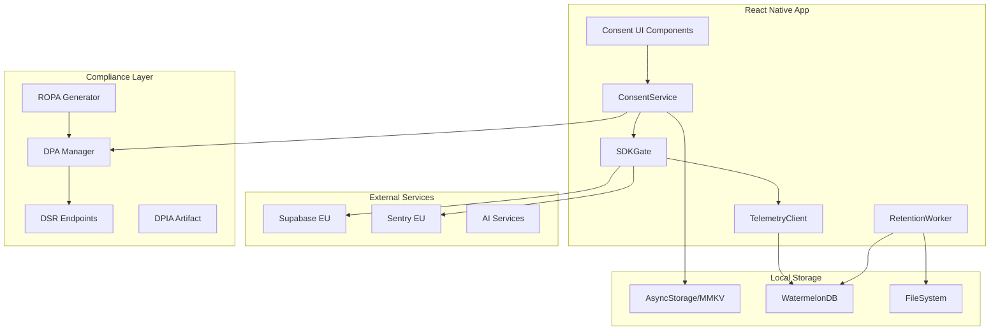
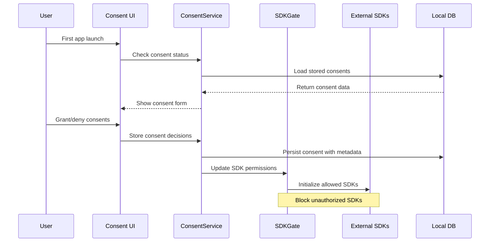

# Design Document

## Overview

The Privacy Consent and Telemetry system provides a comprehensive GDPR-compliant consent management solution for GrowBro. The design implements granular consent controls, automated data retention, international transfer compliance, and seamless integration with existing React Native infrastructure. The system follows privacy-by-design principles and ensures regulatory compliance across EU jurisdictions.

## Architecture

### High-Level Architecture



### Data Flow Architecture



## Components and Interfaces

### Core Services

#### ConsentService

```typescript
interface ConsentService {
  // Core consent management
  getConsents(): Promise<ConsentState>;
  hasConsent(purpose: ConsentPurpose): boolean;
  setConsent(
    purpose: ConsentPurpose,
    value: boolean,
    metadata?: ConsentMetadata
  ): Promise<void>;
  withdrawConsent(purpose: ConsentPurpose, reason?: string): Promise<void>;

  // Consent lifecycle
  onChange(callback: (consents: ConsentState) => void): () => void;
  isConsentRequired(): boolean;
  getConsentVersion(): string;

  // SDK permission facade (delegates to SDKGate)
  isSDKAllowed(sdkName: string): boolean;

  // Compliance helpers
  exportConsentHistory(): Promise<ConsentAuditLog[]>;
  validateConsents(): Promise<ValidationResult>;
}

interface ConsentState {
  telemetry: boolean;
  experiments: boolean;
  aiTraining: boolean;
  crashDiagnostics: boolean;
  version: string;
  timestamp: Date;
  locale: string;
}

// GDPR Lawful Basis enum (Article 6)
enum LawfulBasis {
  CONSENT = 'consent-6.1.a', // Article 6(1)(a) - Consent
  CONTRACT = 'contract-6.1.b', // Article 6(1)(b) - Contract performance
  LEGAL_OBLIGATION = 'legal-obligation-6.1.c', // Article 6(1)(c) - Legal obligation
  VITAL_INTERESTS = 'vital-interests-6.1.d', // Article 6(1)(d) - Vital interests
  PUBLIC_TASK = 'public-task-6.1.e', // Article 6(1)(e) - Public task
  LEGITIMATE_INTERESTS = 'legitimate-interests-6.1.f', // Article 6(1)(f) - Legitimate interests
}

interface ConsentMetadata {
  uiSurface: 'first-run' | 'settings' | 'feature-prompt';
  policyVersion: string; // linkable to current privacy text
  controllerIdentity: string; // e.g., company legal name

  // GDPR compliance audit fields
  lawfulBasis: LawfulBasis; // GDPR Article 6 lawful basis for processing
  justificationId: string; // Unique ID of the justification/policy clause (e.g., "POL-2024-001")
  region: string; // ISO 3166-1 alpha-2 region code (e.g., "DE", "FR", "GB", "US")

  // ipAddress: never store here (data minimisation)
}
```

#### SDKGate

```typescript
interface SDKGate {
  // SDK lifecycle management - block init, not only requests
  initializeSDK(sdkName: string, purpose: ConsentPurpose): Promise<void>; // no-op if !consents[purpose]
  blockSDK(sdkName: string): void;
  isSDKAllowed(sdkName: string): boolean;

  // Network request filtering (safety net)
  interceptNetworkCall(request: NetworkRequest): Promise<NetworkRequest | null>;

  // SDK inventory (transparent to users)
  getSDKInventory(): SDKInventoryItem[];
  updateSDKStatus(sdkName: string, status: SDKStatus): void;
}

interface SDKInventoryItem {
  name: string;
  purpose: ConsentPurpose;
  region: 'EU' | 'US' | 'Global';
  dpaLink: string;
  initialized: boolean;
  lastActivity?: Date;
}
```

#### TelemetryClient

```typescript
interface TelemetryClient {
  // Event tracking
  track(event: TelemetryEvent): Promise<void>;
  identify(userId: string, traits?: UserTraits): Promise<void>;

  // Queue management
  flush(): Promise<void>;
  clearQueue(): Promise<void>;

  // Privacy controls
  setDataMinimization(enabled: boolean): void;
  rotatePseudonymousId(): void;
}

interface TelemetryEvent {
  name: string;
  properties: Record<string, TelemetryValue>;
  timestamp: Date;
  sessionId: string;
  userId?: string; // Pseudonymous only
}

// Strict schema validation - minimise by construction
type TelemetryValue = number | boolean | Date; // remove string to prevent free text
// or enforce allowlisted strings (enums) only
// Explicitly forbidden: free text, image URIs, precise locations
```

### UI Components

#### ConsentModal

```typescript
interface ConsentModalProps {
  isVisible: boolean;
  onComplete: (consents: ConsentDecisions) => void;
  mode: 'first-run' | 'settings-update';
  locale: 'en' | 'de';
}

interface ConsentDecisions {
  telemetry: boolean;
  experiments: boolean;
  aiTraining: boolean;
  crashDiagnostics: boolean;
  acceptedAt: Date;
}
```

#### PrivacySettings

```typescript
interface PrivacySettingsProps {
  currentConsents: ConsentState;
  onConsentChange: (purpose: ConsentPurpose, value: boolean) => void;
  onDataExport: () => void;
  onAccountDeletion: () => void;
}
```

### Data Models

#### Consent Storage Schema

```typescript
interface StoredConsent {
  id: string;
  purpose: ConsentPurpose;
  granted: boolean;
  timestamp: Date;
  version: string;
  uiSurface: string;
  policyVersion: string;
  controllerIdentity: string;
  withdrawnAt?: Date;
  withdrawalReason?: string;
}

interface ConsentAuditLog {
  id: string;
  userId: string;
  action: 'grant' | 'withdraw' | 'update';
  purpose: ConsentPurpose;
  timestamp: Date;
  metadata: ConsentMetadata; // Includes GDPR compliance audit fields (lawfulBasis, justificationId, region)
}
```

#### Retention Policy Schema

```typescript
interface RetentionPolicy {
  dataType: DataType;
  purpose: ConsentPurpose;
  retentionPeriod: number; // days
  deletionMethod: 'hard-delete' | 'anonymize' | 'aggregate';
  cascadeRules: string[];
}

enum DataType {
  TELEMETRY_RAW = 'telemetry_raw',
  TELEMETRY_AGGREGATED = 'telemetry_aggregated',
  CRASH_LOGS = 'crash_logs',
  TRAINING_IMAGES = 'training_images',
  INFERENCE_IMAGES = 'inference_images',
  USER_PROFILE = 'user_profile',
}

// Explicit retention windows (baseline)
const DEFAULT_RETENTION: RetentionPolicy[] = [
  {
    dataType: DataType.TELEMETRY_RAW,
    purpose: 'telemetry',
    retentionPeriod: 90,
    deletionMethod: 'aggregate',
    cascadeRules: ['drop-ids'],
  },
  {
    dataType: DataType.CRASH_LOGS,
    purpose: 'crashDiagnostics',
    retentionPeriod: 180,
    deletionMethod: 'anonymize',
    cascadeRules: ['strip-PII'],
  },
  {
    dataType: DataType.INFERENCE_IMAGES,
    purpose: 'aiDiagnosis',
    retentionPeriod: 1,
    deletionMethod: 'hard-delete',
    cascadeRules: ['fs', 'bucket'],
  },
  {
    dataType: DataType.TRAINING_IMAGES,
    purpose: 'aiTraining',
    retentionPeriod: 365,
    deletionMethod: 'hard-delete',
    cascadeRules: ['fs', 'bucket'],
  },
];
```

## Error Handling

### Consent Validation Errors

```typescript
enum ConsentError {
  INVALID_PURPOSE = 'INVALID_PURPOSE',
  CONSENT_REQUIRED = 'CONSENT_REQUIRED',
  WITHDRAWAL_FAILED = 'WITHDRAWAL_FAILED',
  SDK_BLOCKED = 'SDK_BLOCKED',
  RETENTION_VIOLATION = 'RETENTION_VIOLATION',
}

interface ConsentErrorHandler {
  handleConsentError(error: ConsentError, context: ErrorContext): void;
  recoverFromSDKBlock(sdkName: string): Promise<void>;
  escalateComplianceIssue(issue: ComplianceIssue): void;
}
```

### Graceful Degradation

- **No Consent**: Core app functionality remains available
- **Partial Consent**: Features gracefully disable with user-friendly messaging
- **SDK Failures**: Fallback to local-only functionality
- **Network Issues**: Queue operations for later sync

## Testing Strategy

### Unit Testing

#### Consent Logic Tests

```typescript
describe('ConsentService', () => {
  test('should block SDK initialization without consent', async () => {
    const service = new ConsentService();
    await service.setConsent('telemetry', false);

    expect(service.isSDKAllowed('analytics')).toBe(false);
  });

  test('should cascade consent withdrawal', async () => {
    const service = new ConsentService();
    await service.withdrawConsent('telemetry', 'user-request');

    expect(mockAnalyticsSDK.stop).toHaveBeenCalled();
    expect(mockTelemetryQueue.clear).toHaveBeenCalled();
  });
});
```

#### Retention Policy Tests

```typescript
describe('RetentionWorker', () => {
  test('should delete expired telemetry data', async () => {
    const worker = new RetentionWorker();
    const expiredData = createExpiredTelemetryData();

    await worker.processRetention();

    expect(await db.telemetry.count()).toBe(0);
    expect(auditLog).toContainEqual(
      expect.objectContaining({
        action: 'retention-delete',
        dataType: 'telemetry_raw',
      })
    );
  });
});
```

### Integration Testing

#### End-to-End Consent Flow

```typescript
describe('Consent E2E', () => {
  test('first-run consent flow', async () => {
    // Launch app for first time
    await app.launch({ newInstance: true });

    // Verify consent modal appears
    await expect(element(by.id('consent-modal'))).toBeVisible();

    // Reject all non-essential
    await element(by.id('reject-all-btn')).tap();

    // Verify app remains functional
    await expect(element(by.id('main-screen'))).toBeVisible();

    // Verify no analytics calls
    expect(mockAnalyticsSDK.track).not.toHaveBeenCalled();
  });
});
```

### Compliance Testing

#### GDPR Validation Tests

```typescript
describe('GDPR Compliance', () => {
  test('zero-traffic pre-consent: no SDK network calls before opt-in', async () => {
    const networkSpy = jest.spyOn(global, 'fetch');

    await app.launch({ newInstance: true });
    await element(by.id('reject-all-btn')).tap();

    // Assert no analytics/crash/experiments calls made
    expect(networkSpy).not.toHaveBeenCalledWith(
      expect.stringContaining('analytics')
    );
    expect(networkSpy).not.toHaveBeenCalledWith(
      expect.stringContaining('sentry')
    );
  });

  test('withdrawal propagation: immediate SDK disable and deletion jobs', async () => {
    await consentService.setConsent('telemetry', true);
    await consentService.withdrawConsent('telemetry', 'user-request');

    // Verify immediate stop
    expect(mockAnalyticsSDK.stop).toHaveBeenCalled();
    expect(mockTelemetryQueue.clear).toHaveBeenCalled();

    // Verify deletion job scheduled
    expect(mockDeletionService.scheduleErasure).toHaveBeenCalledWith({
      purpose: 'telemetry',
      userId: expect.any(String),
    });
  });

  test('retention verification: daily purge logs show counts', async () => {
    const retentionWorker = new RetentionWorker();
    await retentionWorker.processRetention();

    const auditLogs = await db.auditLogs
      .where('action', 'retention-delete')
      .fetch();
    expect(auditLogs).toContainEqual(
      expect.objectContaining({
        dataType: 'telemetry_raw',
        purgedCount: expect.any(Number),
      })
    );
  });

  test('should provide data export within 30 days', async () => {
    const exportRequest = await privacyService.requestDataExport();

    expect(exportRequest.estimatedCompletion).toBeLessThanOrEqual(
      addDays(new Date(), 30)
    );
  });

  test('should validate deletion cascades', async () => {
    await privacyService.deleteUserAccount(userId);

    const remainingData = await db.findUserData(userId);
    expect(remainingData).toHaveLength(0);
  });
});
```

### Performance Testing

#### SDK Initialization Impact

- Measure app startup time with/without consent
- Validate deferred SDK loading doesn't block UI
- Test consent storage performance under load

#### Data Retention Performance

- Validate retention jobs complete within SLA
- Test cascade deletion performance
- Monitor memory usage during bulk operations

## Implementation Considerations

### Privacy by Design

1. **Data Minimization**: Collect only necessary data with schema validation
2. **Purpose Limitation**: Strict purpose binding for all data collection
3. **Storage Limitation**: Automated retention with audit trails
4. **Transparency**: Clear, accessible privacy controls
5. **Security**: Encrypted storage for sensitive consent data

### Regulatory Compliance

#### GDPR Requirements

- Article 7: Consent conditions and withdrawal
- Article 13/14: Information to be provided
- Article 17: Right to erasure
- Article 20: Right to data portability
- Article 30: Records of processing activities

#### Technical Safeguards

- EU region preference for all processors
- Standard Contractual Clauses (SCCs) for transfers
- Data Processing Impact Assessment (DPIA) completion
- Regular compliance audits and validation

### Vendor Integration

#### Supabase Configuration

```typescript
const supabaseConfig = {
  url: process.env.SUPABASE_URL_EU, // eu-west-1 region
  anonKey: process.env.SUPABASE_ANON_KEY,
  options: {
    db: { schema: 'public' },
    auth: { persistSession: true },
    global: { headers: { 'x-gdpr-compliant': 'true' } },
  },
};
```

#### Sentry Configuration

```typescript
// Initialize Sentry only when crashDiagnostics consent is true
Sentry.init({
  dsn: process.env.SENTRY_DSN_EU,
  enabled: consentService.getConsents().crashDiagnostics === true,
  sendDefaultPii: false, // never auto-capture IP/cookies
  beforeSend: (event) => scrubPersonalData(event), // client-side scrub
  integrations: [], // Start with no integrations
});

// Later, if telemetry is enabled:
if (consentService.getConsents().telemetry) {
  Sentry.addIntegration(
    new Sentry.ReactNativeTracing({
      enableUserInteractionTracing: true,
    })
  );
}
```

#### DPA Manager Configuration

```typescript
interface ProcessorConfig {
  processor: string;
  region: 'EU' | 'US' | 'Global';
  dpaUrl: string;
  sccModule?: string; // SCC 2021/914 module ID
  tiaDocId?: string; // Transfer Impact Assessment reference
}

const PROCESSOR_CONFIGS: ProcessorConfig[] = [
  {
    processor: 'Supabase',
    region: 'EU',
    dpaUrl: 'https://supabase.com/legal/dpa',
    sccModule: 'SCC-2021-914-Module-2',
    tiaDocId: 'TIA-SUP-2024-001',
  },
  {
    processor: 'Sentry',
    region: 'EU',
    dpaUrl: 'https://sentry.io/legal/dpa/',
    sccModule: 'SCC-2021-914-Module-2',
    tiaDocId: 'TIA-SEN-2024-001',
  },
];

// Expose processor transparency endpoint
app.get('/legal/processors.json', (req, res) => {
  res.json(
    PROCESSOR_CONFIGS.map((config) => ({
      name: config.processor,
      region: config.region,
      dpaLink: config.dpaUrl,
    }))
  );
});
```

This design provides a robust, compliant, and user-friendly privacy management system that integrates seamlessly with GrowBro's existing React Native architecture while meeting all GDPR requirements and industry best practices.

### DPIA and Compliance Artifacts

#### Data Protection Impact Assessment

```typescript
interface DPIAConfig {
  version: string;
  aiModelVersion: string;
  completedAt: Date;
  signedOff: boolean;
  mitigations: DPIAMitigation[];
}

interface DPIAMitigation {
  risk: string;
  severity: 'low' | 'medium' | 'high';
  mitigation: string;
  implemented: boolean;
}

// CI check to block release without DPIA
const validateDPIA = () => {
  const dpia = loadDPIAConfig();
  const currentModelVersion = process.env.AI_MODEL_VERSION;

  if (!dpia.signedOff || dpia.aiModelVersion !== currentModelVersion) {
    throw new Error('DPIA required for AI model version change');
  }
};
```

#### Records of Processing Activities (ROPA)

```typescript
// Auto-generated from code annotations
interface ROPARecord {
  purpose: ConsentPurpose;
  lawfulBasis: string;
  dataCategories: string[];
  recipients: string[];
  retentionPeriod: number;
  transfers: TransferRecord[];
}

// Code annotation example
/**
 * @ropa-purpose telemetry
 * @ropa-lawful-basis consent-6.1.a
 * @ropa-data-categories device-info,usage-patterns
 * @ropa-recipients supabase-eu,internal-analytics
 * @ropa-retention 90-days
 */
const trackUserAction = (action: string) => {
  // Implementation
};
```

This comprehensive design addresses all the critical gaps identified in your feedback, ensuring full GDPR compliance with proper consent management, data minimization, international transfer safeguards, and robust audit capabilities.
