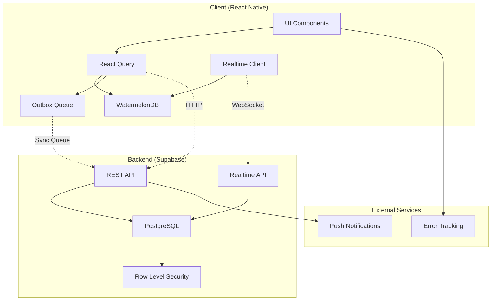
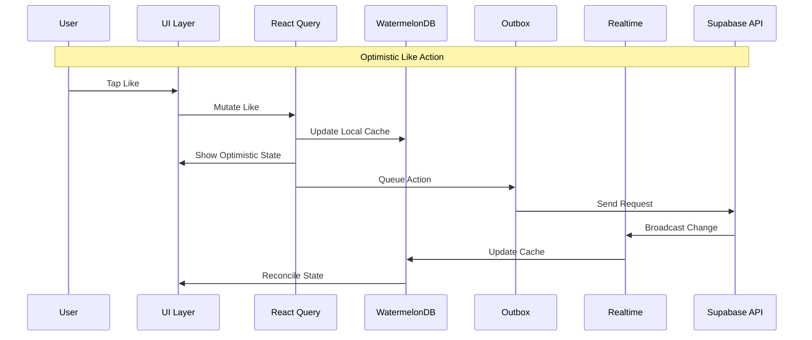

# Design Document

## Overview

The Community Feed Improvements feature enhances GrowBro's social capabilities by implementing a robust, offline-first community platform with real-time interactions, optimistic UI updates, and comprehensive moderation tools. The design leverages WatermelonDB for offline-first architecture, Supabase Realtime for live updates, and React Query for optimistic mutations.

The system supports likes, comments, real-time updates, content moderation, and user profiles while maintaining excellent performance and reliability in both online and offline scenarios.

## Architecture

### High-Level Architecture



### Data Flow Architecture



## Components and Interfaces

### Core Components

#### 1. Community Feed Container

- **Purpose**: Main container managing feed state and real-time subscriptions
- **Responsibilities**:
  - Feed pagination and infinite scroll
  - Real-time subscription management
  - Offline/online state handling
  - Error boundary and retry logic

#### 2. Post Component

- **Purpose**: Individual post display with interaction capabilities
- **Responsibilities**:
  - Post content rendering
  - Like/unlike optimistic updates
  - Comment thread management
  - Author profile linking

#### 3. Comment System

- **Purpose**: Nested comment display and interaction
- **Responsibilities**:
  - Comment threading and pagination
  - Optimistic comment creation
  - Real-time comment updates
  - Comment moderation UI

#### 4. Realtime Manager

- **Purpose**: WebSocket connection and event handling
- **Responsibilities**:
  - Connection state management
  - Event deduplication
  - Reconnection with exponential backoff
  - Self-echo detection

#### 5. Outbox Queue Manager

- **Purpose**: Offline action queuing and synchronization
- **Responsibilities**:
  - FIFO queue management
  - Retry logic with exponential backoff
  - Conflict resolution
  - Sync status reporting

### Interface Definitions

```typescript
// Core Data Models
interface Post {
  id: string;
  user_id: string;
  body: string;
  media_uri?: string;
  created_at: string;
  updated_at: string;
  deleted_at?: string;
  hidden_at?: string;
  moderation_reason?: string;
  undo_expires_at?: string; // NEW - server-owned 15s undo timer
  // derived (client/UI-only, not persisted in DB)
  like_count: number;
  comment_count: number;
  user_has_liked: boolean;
}

interface PostComment {
  id: string;
  post_id: string;
  user_id: string;
  body: string;
  created_at: string;
  updated_at: string;
  deleted_at?: string;
  hidden_at?: string; // NEW - align with DB schema
  undo_expires_at?: string; // NEW - server-owned 15s undo timer
}

interface PostLike {
  post_id: string;
  user_id: string;
  created_at: string;
}

// Outbox Queue Entry - Canonical Definition
interface OutboxEntry {
  id: string;
  op: 'LIKE' | 'UNLIKE' | 'COMMENT' | 'DELETE_POST' | 'DELETE_COMMENT';
  payload: any;
  client_tx_id: string;
  idempotency_key: string;
  created_at: string;
  retries: number;
  next_retry_at?: string;
  status: 'pending' | 'failed' | 'confirmed';
}

// Realtime Event (Supabase Postgres Changes format)
interface RealtimeEvent<T> {
  schema: 'public';
  table: 'posts' | 'post_comments' | 'post_likes';
  eventType: 'INSERT' | 'UPDATE' | 'DELETE';
  commit_timestamp: string; // server commit time
  new: T | null; // row after change
  old: Partial<T> | null; // row before change
  // Optional passthrough from client via triggers or headers
  client_tx_id?: string;
}
```

### API Interfaces

```typescript
// Community API Service
interface CommunityAPI {
  // Posts
  getPost(postId: string): Promise<Post>;
  getPosts(cursor?: string, limit?: number): Promise<PaginatedResponse<Post>>;
  createPost(
    data: CreatePostData,
    idempotencyKey?: string,
    clientTxId?: string
  ): Promise<Post>;
  deletePost(
    postId: string,
    idempotencyKey?: string,
    clientTxId?: string
  ): Promise<{ undo_expires_at: string }>;
  undoDeletePost(
    postId: string,
    idempotencyKey?: string,
    clientTxId?: string
  ): Promise<Post>; // 409 if expired

  // Likes
  likePost(
    postId: string,
    idempotencyKey?: string,
    clientTxId?: string
  ): Promise<void>;
  unlikePost(
    postId: string,
    idempotencyKey?: string,
    clientTxId?: string
  ): Promise<void>;

  // Comments
  getComments(
    postId: string,
    cursor?: string
  ): Promise<PaginatedResponse<PostComment>>;
  createComment(
    data: CreateCommentData,
    idempotencyKey?: string,
    clientTxId?: string
  ): Promise<PostComment>;
  deleteComment(
    commentId: string,
    idempotencyKey?: string,
    clientTxId?: string
  ): Promise<void>;

  // Profiles
  getUserProfile(userId: string): Promise<UserProfile>;
  getUserPosts(
    userId: string,
    cursor?: string
  ): Promise<PaginatedResponse<Post>>;
}
```

## Data Models

### Database Schema

```sql
-- Posts table
CREATE TABLE posts (
  id UUID PRIMARY KEY DEFAULT gen_random_uuid(),
  user_id UUID NOT NULL REFERENCES auth.users(id),
  body TEXT NOT NULL CHECK (length(body) <= 2000),
  media_uri TEXT,
  created_at TIMESTAMPTZ DEFAULT now(),
  updated_at TIMESTAMPTZ DEFAULT now(),
  deleted_at TIMESTAMPTZ,
  hidden_at TIMESTAMPTZ,
  moderation_reason TEXT,
  undo_expires_at TIMESTAMPTZ
);

-- Comments table
CREATE TABLE post_comments (
  id UUID PRIMARY KEY DEFAULT gen_random_uuid(),
  post_id UUID NOT NULL REFERENCES posts(id) ON DELETE CASCADE,
  user_id UUID NOT NULL REFERENCES auth.users(id),
  body TEXT NOT NULL CHECK (length(body) <= 500),
  created_at TIMESTAMPTZ DEFAULT now(),
  updated_at TIMESTAMPTZ DEFAULT now(),
  deleted_at TIMESTAMPTZ,
  hidden_at TIMESTAMPTZ,
  undo_expires_at TIMESTAMPTZ
);

-- Likes table
CREATE TABLE post_likes (
  post_id UUID NOT NULL REFERENCES posts(id) ON DELETE CASCADE,
  user_id UUID NOT NULL REFERENCES auth.users(id),
  created_at TIMESTAMPTZ DEFAULT now(),
  PRIMARY KEY (post_id, user_id)
);

-- Reports table
CREATE TABLE reports (
  id UUID PRIMARY KEY DEFAULT gen_random_uuid(),
  target_type TEXT NOT NULL CHECK (target_type IN ('post', 'comment')),
  target_id UUID NOT NULL,
  reporter_id UUID NOT NULL REFERENCES auth.users(id),
  reason TEXT NOT NULL,
  created_at TIMESTAMPTZ DEFAULT now(),
  status TEXT DEFAULT 'pending' CHECK (status IN ('pending', 'reviewed', 'resolved'))
);

-- Moderation audit table
CREATE TABLE moderation_audit (
  id UUID PRIMARY KEY DEFAULT gen_random_uuid(),
  actor_id UUID NOT NULL REFERENCES auth.users(id),
  action TEXT NOT NULL,
  target_type TEXT NOT NULL,
  target_id UUID NOT NULL,
  reason TEXT,
  created_at TIMESTAMPTZ DEFAULT now()
);
```

### Indexes and Performance

```sql
-- Performance indexes
CREATE INDEX idx_posts_created_at ON posts (created_at DESC)
  WHERE deleted_at IS NULL AND hidden_at IS NULL;

CREATE INDEX idx_post_comments_post_created ON post_comments (post_id, created_at)
  WHERE deleted_at IS NULL AND hidden_at IS NULL;

CREATE INDEX idx_posts_user_created ON posts (user_id, created_at DESC)
  WHERE deleted_at IS NULL AND hidden_at IS NULL;

-- Realtime subscription indexes
CREATE INDEX idx_posts_updated_at ON posts (updated_at);
CREATE INDEX idx_post_comments_updated_at ON post_comments (updated_at);
CREATE INDEX idx_post_likes_updated_at ON post_likes (created_at);

-- Counter optimization indexes
CREATE INDEX IF NOT EXISTS idx_post_likes_post ON post_likes (post_id);
CREATE INDEX IF NOT EXISTS idx_post_comments_post ON post_comments (post_id)
  WHERE deleted_at IS NULL AND hidden_at IS NULL;

-- Database triggers for updated_at consistency (LWW requirement)
CREATE EXTENSION IF NOT EXISTS moddatetime SCHEMA extensions;

CREATE TRIGGER handle_updated_at BEFORE UPDATE ON posts
  FOR EACH ROW EXECUTE PROCEDURE extensions.moddatetime(updated_at);

CREATE TRIGGER handle_updated_at BEFORE UPDATE ON post_comments
  FOR EACH ROW EXECUTE PROCEDURE extensions.moddatetime(updated_at);

-- Enable realtime replication for tables
ALTER PUBLICATION supabase_realtime ADD TABLE posts, post_comments, post_likes;
```

### WatermelonDB Schema

```typescript
// WatermelonDB Models
export const postsSchema = tableSchema({
  name: 'posts',
  columns: [
    { name: 'user_id', type: 'string' },
    { name: 'body', type: 'string' },
    { name: 'media_uri', type: 'string', isOptional: true },
    { name: 'created_at', type: 'number' },
    { name: 'updated_at', type: 'number' },
    { name: 'deleted_at', type: 'number', isOptional: true },
    { name: 'hidden_at', type: 'number', isOptional: true },
    { name: 'moderation_reason', type: 'string', isOptional: true },
    { name: 'undo_expires_at', type: 'number', isOptional: true }, // NEW
    // Note: like_count, comment_count, user_has_liked are derived client fields
    // They are computed from relationships, not stored in DB
  ],
});

export const postCommentsSchema = tableSchema({
  name: 'post_comments',
  columns: [
    { name: 'post_id', type: 'string', isIndexed: true },
    { name: 'user_id', type: 'string' },
    { name: 'body', type: 'string' },
    { name: 'created_at', type: 'number' },
    { name: 'updated_at', type: 'number' },
    { name: 'deleted_at', type: 'number', isOptional: true },
    { name: 'hidden_at', type: 'number', isOptional: true }, // NEW - align with DB
    { name: 'undo_expires_at', type: 'number', isOptional: true }, // NEW
  ],
});

export const outboxSchema = tableSchema({
  name: 'outbox',
  columns: [
    { name: 'op', type: 'string' },
    { name: 'payload', type: 'string' }, // JSON string
    { name: 'client_tx_id', type: 'string' },
    { name: 'idempotency_key', type: 'string' },
    { name: 'created_at', type: 'number' },
    { name: 'retries', type: 'number' },
    { name: 'next_retry_at', type: 'number', isOptional: true },
    { name: 'status', type: 'string' },
  ],
});
```

## Error Handling

### Error Categories and Strategies

#### 1. Network Errors

- **Strategy**: Optimistic UI with rollback on failure
- **Implementation**: React Query error boundaries with toast notifications
- **Retry Logic**: Exponential backoff for transient failures

#### 2. Validation Errors

- **Strategy**: Client-side validation with server confirmation
- **Implementation**: Zod schemas for input validation
- **User Feedback**: Inline error messages with correction guidance

#### 3. Conflict Errors

- **Strategy**: Last-write-wins with user notification
- **Implementation**: Server timestamp comparison
- **Resolution**: Automatic reconciliation with conflict logging

#### 4. Rate Limiting

- **Strategy**: Client-side throttling with server enforcement
- **Implementation**: Token bucket algorithm
- **User Feedback**: Temporary disable with countdown timer

### Error Recovery Patterns

```typescript
// Optimistic Update Error Recovery
const useLikePost = () => {
  return useMutation({
    mutationFn: likePost,
    onMutate: async (postId) => {
      // Cancel outgoing refetches
      await queryClient.cancelQueries(['posts']);

      // Snapshot previous value
      const previousPosts = queryClient.getQueryData(['posts']);

      // Optimistically update
      queryClient.setQueryData(['posts'], (old) =>
        updatePostLikeCount(old, postId, true)
      );

      return { previousPosts };
    },
    onError: (err, postId, context) => {
      // Rollback on error
      queryClient.setQueryData(['posts'], context.previousPosts);
      showErrorToast('Failed to like post');
    },
    onSettled: () => {
      // Always refetch after error or success
      queryClient.invalidateQueries(['posts']);
    },
  });
};
```

## Testing Strategy

### Unit Testing

- **Components**: React Testing Library for UI interactions
- **Hooks**: Custom hook testing with mock providers
- **Services**: Jest mocks for API and database operations
- **Utilities**: Pure function testing for data transformations

### Integration Testing

- **API Integration**: Mock Supabase client with realistic responses
- **Database Operations**: In-memory WatermelonDB for sync testing
- **Real-time Events**: Mock WebSocket events and state changes

### End-to-End Testing

- **Offline Scenarios**: Flight mode testing with Maestro
- **Real-time Updates**: Multi-device simulation
- **Performance Testing**: Large dataset handling (1000+ posts)
- **Error Recovery**: Network interruption and reconnection

### Testing Scenarios

```typescript
// Example Test Cases
describe('Community Feed', () => {
  it('should handle optimistic like with network failure', async () => {
    // Mock network failure
    mockAPI.likePost.mockRejectedValue(new Error('Network error'));

    // Perform like action
    fireEvent.press(screen.getByTestId('like-button'));

    // Verify optimistic update
    expect(screen.getByText('1 like')).toBeInTheDocument();

    // Wait for error and rollback
    await waitFor(() => {
      expect(screen.getByText('0 likes')).toBeInTheDocument();
    });

    // Verify error toast
    expect(screen.getByText('Failed to like post')).toBeInTheDocument();
  });

  it('should sync outbox on connectivity restore', async () => {
    // Simulate offline state
    mockNetInfo.isConnected = false;

    // Perform actions while offline
    fireEvent.press(screen.getByTestId('like-button'));
    fireEvent.press(screen.getByTestId('comment-submit'));

    // Verify outbox entries
    const outboxEntries = await database.collections
      .get('outbox')
      .query()
      .fetch();
    expect(outboxEntries).toHaveLength(2);

    // Restore connectivity
    mockNetInfo.isConnected = true;
    act(() => mockNetInfo.triggerConnectivityChange());

    // Verify sync completion
    await waitFor(() => {
      expect(mockAPI.likePost).toHaveBeenCalled();
      expect(mockAPI.createComment).toHaveBeenCalled();
    });
  });
});
```

```typescript
// Type-level checks: ensure all mutating CommunityAPI methods accept
// optional idempotencyKey and clientTxId parameters. These snippets are
// intended to be type-checked by TypeScript in editors or CI; they do not
// execute at runtime in this document.
function _typeChecks(mockAPI: CommunityAPI) {
  // Should accept calls without idempotency params
  mockAPI.likePost('post-1');
  mockAPI.unlikePost('post-1');
  mockAPI.createComment({ postId: 'post-1', body: 'hi' });
  mockAPI.createPost({ body: 'hello' } as any);

  // Should also accept optional idempotencyKey and clientTxId
  mockAPI.likePost('post-1', 'idem-key-1', 'client-tx-1');
  mockAPI.unlikePost('post-1', 'idem-key-2', 'client-tx-2');
  mockAPI.createComment(
    { postId: 'post-1', body: 'hi' },
    'idem-key-3',
    'client-tx-3'
  );
  mockAPI.createPost({ body: 'hello' } as any, 'idem-key-4', 'client-tx-4');

  // delete variants
  mockAPI.deletePost('post-1');
  mockAPI.deletePost('post-1', 'idem-key-5');
  mockAPI.deleteComment('comment-1');
  mockAPI.deleteComment('comment-1', 'idem-key-6', 'client-tx-6');
}
```

### Performance Testing

```typescript
// Performance Benchmarks
describe('Performance', () => {
  it('should render 1000 posts without frame drops', async () => {
    const largeFeed = generateMockPosts(1000);

    const startTime = performance.now();
    render(<CommunityFeed initialData={largeFeed} />);
    const renderTime = performance.now() - startTime;

    expect(renderTime).toBeLessThan(100); // 100ms threshold

    // Verify smooth scrolling
    const scrollView = screen.getByTestId('feed-scroll');
    fireEvent.scroll(scrollView, { nativeEvent: { contentOffset: { y: 5000 } } });

    // Should maintain 60fps (16.67ms per frame)
    expect(getFrameDrops()).toBeLessThan(5);
  });
});
```

This design provides a comprehensive foundation for implementing the community feed improvements with robust offline-first capabilities, real-time updates, and excellent user experience patterns.

### Realtime Event Handling

#### Subscription Setup

```typescript
// Realtime subscription with proper filtering
const setupRealtimeSubscriptions = (postId?: string) => {
  const channel = supabase.channel('community-feed');

  // Posts subscription
  channel.on(
    'postgres_changes',
    {
      event: '*',
      schema: 'public',
      table: 'posts',
    },
    handlePostChange
  );

  // Comments subscription (filtered by post if viewing single post)
  const commentFilter = postId ? `post_id=eq.${postId}` : undefined;
  channel.on(
    'postgres_changes',
    {
      event: '*',
      schema: 'public',
      table: 'post_comments',
      filter: commentFilter,
    },
    handleCommentChange
  );

  // Likes subscription
  channel.on(
    'postgres_changes',
    {
      event: '*',
      schema: 'public',
      table: 'post_likes',
    },
    handleLikeChange
  );

  return channel.subscribe();
};
```

#### Deduplication and LWW Logic

```typescript
// Deduplication gate with pluggable key extractor and timestamp field
type KeyExtractor<T> = (row: T) => string;

// Timestamp store for tracking last-applied commit_timestamp per composite key
// Used for post_likes to ensure proper ordering of events
const lastAppliedTimestamps = new Map<string, string>();

/**
 * Decide whether an incoming realtime row should be applied on top of a
 * local row. By default this uses an `id` key and the `updated_at` field for
 * Last-Write-Wins ordering, but callers may provide a custom key extractor
 * and/or a different timestamp field (for example `commit_timestamp`).
 *
 * For post_likes, uses a persistent timestamp store instead of row-based timestamps.
 */
function shouldApply<T>(
  incoming: T,
  local?: T,
  getKey: KeyExtractor<T> = (r: any) => (r as any).id,
  timestampField: string = 'updated_at',
  eventTimestamp?: string,
  usePersistentTimestamps: boolean = false
): boolean {
  if (!local) return true;

  const key = getKey(incoming);

  let incomingTs: Date;
  let localTs: Date;

  if (usePersistentTimestamps && eventTimestamp) {
    // For post_likes: use persistent timestamp store
    incomingTs = new Date(eventTimestamp);
    const storedTimestamp = lastAppliedTimestamps.get(key);
    localTs = storedTimestamp ? new Date(storedTimestamp) : new Date(0);
  } else {
    // Default behavior: use eventTimestamp if provided, otherwise extract from incoming object
    incomingTs = eventTimestamp
      ? new Date(eventTimestamp)
      : new Date((incoming as any)[timestampField]);
    localTs = new Date((local as any)[timestampField]);
  }

  // If either timestamp is missing or unparsable, conservatively allow apply
  if (isNaN(incomingTs.getTime()) || isNaN(localTs.getTime())) return true;

  return incomingTs > localTs;
}

// Realtime event handler with deduplication and table-specific handling
function handleRealtimeEvent<T>(
  event: RealtimeEvent<T>,
  options?: {
    getKey?: KeyExtractor<T>;
    timestampField?: string;
    table?: string;
  }
) {
  const { eventType, new: newRow, old: oldRow, client_tx_id } = event;

  if (!newRow) return;

  const getKey = options?.getKey ?? ((r: any) => (r as any).id);
  const timestampField = options?.timestampField ?? 'updated_at';
  const table = options?.table;

  const key = getKey(newRow);

  // Special-case: post_likes uses a composite key and commit_timestamp.
  // INSERT/DELETE on post_likes should be treated as toggle operations
  // (apply/remove) instead of relying on an `id` + `updated_at` LWW check.
  if (table === 'post_likes') {
    // Composite key expected to be `${post_id}:${user_id}` provided by caller
    const local = cache.get(key);

    // Use commit_timestamp for ordering when available
    const should = shouldApply(
      newRow as any,
      local as any,
      getKey as any,
      'commit_timestamp',
      event.commit_timestamp,
      true // usePersistentTimestamps
    );
    if (!should) {
      console.log('Dropping stale event (post_likes):', key);
      return;
    }

    // Handle self-echo confirmation
    if (client_tx_id && outbox.has(client_tx_id)) {
      // Preserve timestamp bookkeeping for this composite key before
      // confirming our own outbox entry. Use the event commit timestamp
      // (or the row's commit timestamp if present) so later stale events
      // won't be applied out of order.
      const commitTs =
        event.commit_timestamp || (newRow as any).commit_timestamp;
      if (commitTs) lastAppliedTimestamps.set(key, commitTs);

      outbox.confirm(client_tx_id);
      console.log('Confirmed outbox entry:', client_tx_id);
      return;
    }

    // Treat INSERT as a "like" (add) and DELETE as an "unlike" (remove).
    // If an INSERT arrives but the local cache already has the like, ignore it.
    switch (eventType) {
      case 'INSERT':
        if (!local) {
          // Ensure the stored row has a stable id equal to the composite key
          cache.upsert({ ...(newRow as any), id: key });
        }
        break;
      case 'DELETE':
        if (local) cache.remove(key);
        break;
    }

    // Store the last applied timestamp for this composite key
    lastAppliedTimestamps.set(key, event.commit_timestamp);

    queryClient.invalidateQueries(['posts']);
    return;
  }

  // Default behavior for rows that have an `id` + `updated_at` style schema
  const localRow = cache.get(key);
  if (
    !shouldApply(newRow as any, localRow as any, getKey as any, timestampField)
  ) {
    console.log('Dropping stale event:', key);
    return;
  }

  // Handle self-echo confirmation
  if (client_tx_id && outbox.has(client_tx_id)) {
    // Ensure we record the commit timestamp for this key before confirming
    // the outbox entry. This prevents later, older events from overwriting
    // our just-applied state due to missing timestamp bookkeeping.
    const commitTs = event.commit_timestamp || (newRow as any).commit_timestamp;
    if (commitTs) lastAppliedTimestamps.set(key, commitTs);

    outbox.confirm(client_tx_id);
    console.log('Confirmed outbox entry:', client_tx_id);
    return; // Don't re-apply our own change
  }

  // Apply the change
  switch (eventType) {
    case 'INSERT':
    case 'UPDATE':
      cache.upsert(newRow);
      break;
    case 'DELETE':
      cache.remove(key);
      break;
  }

  // Trigger UI update
  queryClient.invalidateQueries(['posts']);
}
```

#### Outbox Management with Idempotency

```typescript
// Enhanced outbox entry processing
// Note: OutboxEntry interface is defined in the Interface Definitions section above

// Outbox processor with exponential backoff
class OutboxProcessor {
  private readonly MAX_RETRIES = 5;
  private readonly BASE_DELAY = 1000; // 1 second
  private readonly MAX_DELAY = 32000; // 32 seconds

  async processEntry(entry: OutboxEntry): Promise<void> {
    try {
      // Always include idempotency key and client transaction ID
      const headers = {
        'Idempotency-Key': entry.idempotency_key,
        'X-Client-Tx-Id': entry.client_tx_id,
      };

      await this.executeOperation(entry.op, entry.payload, headers);

      // Mark as confirmed (will be cleaned up by realtime event)
      await this.updateEntryStatus(entry.id, 'confirmed');
    } catch (error) {
      if (entry.retries >= this.MAX_RETRIES) {
        await this.updateEntryStatus(entry.id, 'failed');
        this.showRetryUI(entry);
      } else {
        const delay = Math.min(
          this.BASE_DELAY * Math.pow(2, entry.retries),
          this.MAX_DELAY
        );

        await this.scheduleRetry(entry.id, delay);
      }
    }
  }

  private async executeOperation(op: string, payload: any, headers: any) {
    switch (op) {
      case 'LIKE':
        return api.likePost(
          payload.postId,
          headers['Idempotency-Key'],
          headers['X-Client-Tx-Id']
        );
      case 'UNLIKE':
        return api.unlikePost(
          payload.postId,
          headers['Idempotency-Key'],
          headers['X-Client-Tx-Id']
        );
      case 'COMMENT':
        return api.createComment(
          payload,
          headers['Idempotency-Key'],
          headers['X-Client-Tx-Id']
        );
      // ... other operations
    }
  }
}
```

### Row Level Security Policies

```sql
-- Posts: public read, owner write/delete
CREATE POLICY "Posts are viewable by everyone" ON posts
  FOR SELECT TO authenticated
  USING (deleted_at IS NULL AND hidden_at IS NULL);

CREATE POLICY "Users can insert their own posts" ON posts
  FOR INSERT TO authenticated
  WITH CHECK (auth.uid() = user_id);

CREATE POLICY "Users can update their own posts" ON posts
  FOR UPDATE TO authenticated
  USING (auth.uid() = user_id)
  WITH CHECK (auth.uid() = user_id);

CREATE POLICY "Users can delete their own posts" ON posts
  FOR DELETE TO authenticated
  USING (auth.uid() = user_id);

-- Comments: similar pattern
CREATE POLICY "Comments are viewable by everyone" ON post_comments
  FOR SELECT TO authenticated
  USING (deleted_at IS NULL AND hidden_at IS NULL);

CREATE POLICY "Users can insert their own comments" ON post_comments
  FOR INSERT TO authenticated
  WITH CHECK (auth.uid() = user_id);

CREATE POLICY "Users can update their own comments" ON post_comments
  FOR UPDATE TO authenticated
  USING (auth.uid() = user_id);

CREATE POLICY "Users can delete their own comments" ON post_comments
  FOR DELETE TO authenticated
  USING (auth.uid() = user_id);

-- Likes: users can only manage their own likes
CREATE POLICY "Users can manage their own likes" ON post_likes
  FOR ALL TO authenticated
  USING (auth.uid() = user_id)
  WITH CHECK (auth.uid() = user_id);

-- Moderation policies (admin/mod roles only)
CREATE POLICY "Moderators can hide content" ON posts
  FOR UPDATE TO authenticated
  USING (
    -- Ensure the caller is an admin or moderator. We check both the top-level
    -- JWT 'role' claim and the app_metadata.roles array for flexible role membership.
    auth.jwt() ->> 'role' IN ('admin', 'moderator')
    OR (auth.jwt() -> 'app_metadata' -> 'roles')::text LIKE '%moderator%'
    OR (auth.jwt() -> 'app_metadata' -> 'roles')::text LIKE '%admin%'
  )
  WITH CHECK (
    -- Enforce that after the UPDATE the row is actually marked as hidden or
    -- has a moderation reason. This checks the row *after* the change and
    -- prevents regular updates from making posts hidden without moderator role.
    (
      hidden_at IS NOT NULL OR moderation_reason IS NOT NULL
    )
    -- Redundantly validate the actor's role in WITH CHECK as well (optional).
    AND (
      auth.jwt() ->> 'role' IN ('admin', 'moderator')
      OR (auth.jwt() -> 'app_metadata' -> 'roles')::text LIKE '%moderator%'
      OR (auth.jwt() -> 'app_metadata' -> 'roles')::text LIKE '%admin%'
    )
  );
```

### Performance Monitoring and Health Checks

```typescript
// Performance metrics tracking
interface CommunityMetrics {
  realtime_latency_p50: number;
  realtime_latency_p95: number;
  websocket_reconnects_per_hour: number;
  outbox_depth_current: number;
  outbox_failed_mutations_per_day: number;
  deduplication_drops_per_minute: number;
  undo_usage_rate: number;
}

// Health check implementation
class CommunityHealthMonitor {
  private metrics: CommunityMetrics = {
    realtime_latency_p50: 0,
    realtime_latency_p95: 0,
    websocket_reconnects_per_hour: 0,
    outbox_depth_current: 0,
    outbox_failed_mutations_per_day: 0,
    deduplication_drops_per_minute: 0,
    undo_usage_rate: 0,
  };

  trackRealtimeLatency(eventTimestamp: string) {
    const latency = Date.now() - new Date(eventTimestamp).getTime();
    this.updateLatencyMetrics(latency);

    // Alert if P95 > 3000ms
    if (this.metrics.realtime_latency_p95 > 3000) {
      if (ConsentManager.telemetryEnabled()) {
        Sentry.captureMessage('High realtime latency detected', 'warning');
      }
    }
  }

  trackOutboxDepth() {
    const depth = outbox.getPendingCount();
    this.metrics.outbox_depth_current = depth;

    // Alert if outbox is backing up
    if (depth > 50) {
      if (ConsentManager.telemetryEnabled()) {
        Sentry.captureMessage('Outbox depth high', 'warning', {
          extra: { outbox_depth: depth },
        });
      }
    }
  }

  // Periodic reconciliation to catch drift
  async reconcileCounters() {
    const posts = await database.collections.get('posts').query().fetch();

    for (const post of posts) {
      const serverPost = await api.getPost(post.id);

      if (post.like_count !== serverPost.like_count) {
        console.warn('Counter drift detected:', {
          postId: post.id,
          local: post.like_count,
          server: serverPost.like_count,
        });

        // Update local cache
        await post.update((post) => {
          post.like_count = serverPost.like_count;
        });
      }
    }
  }
}
```
