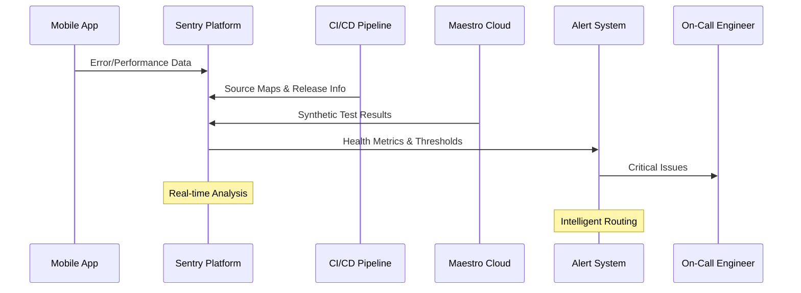
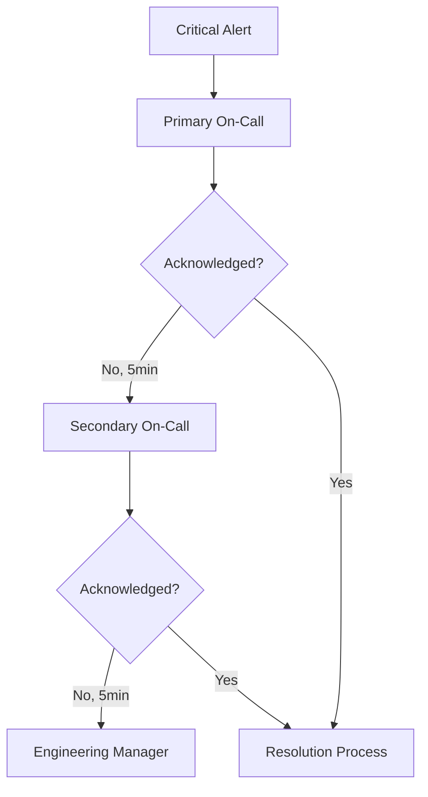

# Design Document

## Overview

The observability and quality monitoring system for GrowBro provides comprehensive application health monitoring, performance tracking, and quality assurance through Sentry integration, automated CI gates, and synthetic testing. The system ensures high reliability and optimal user experience while maintaining development velocity through automated quality checks and proactive issue detection.

The architecture follows a multi-layered approach:

- **Client-side monitoring** via Sentry React Native SDK with comprehensive error tracking, performance monitoring, and session replay
- **CI/CD quality gates** that prevent problematic releases through automated checks and health validations
- **Synthetic monitoring** using Maestro for proactive issue detection across critical user flows
- **Alerting and escalation** with intelligent routing based on severity and impact

## Architecture

### High-Level System Architecture

```mermaid
graph TB
    subgraph "Mobile App"
        RN[React Native App]
        SDK[Sentry SDK]
        RN --> SDK
    end

    subgraph "CI/CD Pipeline"
        BUILD[EAS Build]
        GATES[Quality Gates]
        UPLOAD[Source Map Upload]
        BUILD --> GATES
        GATES --> UPLOAD
    end

    subgraph "Monitoring Infrastructure"
        SENTRY[Sentry Platform]
        MAESTRO[Maestro Cloud]
        ALERTS[Sentry Alerts (with integrations)]

        SENTRY --> ALERTS
        MAESTRO --> SENTRY
    end

    subgraph "Notification Systems"
        PAGER[PagerDuty/Opsgenie]
        SLACK[Slack]
        EMAIL[Email]

        ALERTS --> PAGER
        ALERTS --> SLACK
        ALERTS --> EMAIL
    end

    SDK --> SENTRY
    UPLOAD --> SENTRY
    BUILD --> MAESTRO
```

### Data Flow Architecture



## Components and Interfaces

### 1. Sentry SDK Integration

**Purpose**: Comprehensive client-side monitoring and error tracking

**Production-Grade Configuration**:

```typescript
import * as Sentry from '@sentry/react-native';
import { reactNavigationIntegration } from '@sentry/react-native';

Sentry.init({
  dsn: process.env.EXPO_PUBLIC_SENTRY_DSN,
  environment: process.env.EXPO_PUBLIC_ENV, // 'staging' | 'production'
  release: `${process.env.EXPO_PUBLIC_APP}-${process.env.EXPO_PUBLIC_VERSION}`,
  dist: process.env.EXPO_PUBLIC_BUILD_ID,

  // Performance & profiling
  tracesSampleRate: process.env.EXPO_PUBLIC_ENV === 'production' ? 0.2 : 1.0,
  profilesSampleRate: process.env.EXPO_PUBLIC_ENV === 'production' ? 0.1 : 1.0,

  // Session Replay (mobile)
  replaysSessionSampleRate: 0.05,
  replaysOnErrorSampleRate: 1.0,

  // Navigation & TTI/TTFD
  integrations: [
    reactNavigationIntegration({ enableTimeToInitialDisplay: true }),
  ],

  // Privacy
  sendDefaultPii: false,
  beforeSend(event) {
    // Redact extra contexts here if needed
    return event;
  },
});
```

**Mobile Vitals & ANR Tracking**:

- Track Slow Frames and Frozen Frames for UI jank detection
- Monitor Android ANR rates against Google Play's 0.47% DAU threshold
- Enable first-class Mobile Vitals in Sentry for comprehensive performance insights

**Key Features**:

- Automatic crash and error reporting with full symbolication
- Performance monitoring for critical user flows
- Session replay with privacy-first configuration
- Custom breadcrumbs and context tags
- ANR (Application Not Responding) detection

### 2. CI/CD Quality Gates

**Purpose**: Prevent problematic releases through automated validation

**Gate Sequence**:

1. **Prerequisite Validation**

   - Verify Sentry configuration (DSN, environment, release, dist)
   - Confirm React Native build artifacts (Hermes bytecode, native symbols)
   - Validate environment-specific settings

2. **Source Map Upload Verification**

   - Upload JavaScript source maps via Sentry CLI
   - Upload iOS dSYMs and Android ProGuard mappings
   - Verify server-side processing with `--wait` flag
   - Fail build if upload unsuccessful

3. **Historical Health Check**
   - Query Sentry Sessions API for previous release metrics
   - Block deployment if crash-free sessions < 99.9% or crash-free users < 99.95%
   - Validate ANR rates and performance thresholds

**Production CI Implementation**:

```bash
# Complete symbolication pipeline - fail build if any step fails
npx sentry-cli releases new "$RELEASE"
npx sentry-cli releases set-commits "$RELEASE" --auto

# iOS dSYMs / Android mappings handled by native build steps (SAGP / Xcode)
# RN Hermes/EAS Update sourcemaps:
npx sentry-expo-upload-sourcemaps dist --release "$RELEASE" --url https://sentry.io
npx sentry-cli releases finalize "$RELEASE" --wait

# Quality gates
node scripts/validate-prerequisites.js  # Gate A: prerequisites
node scripts/validate-previous-health.js  # Gate B: prior health
node scripts/setup-rollout-monitoring.js  # Gate C: staged rollout
```

**Quality Gate Details**:

- **Gate A (Build-time)**: Assert release/dist/environment present; confirm Sentry processed sourcemaps/symbols (--wait)
- **Gate B (Pre-promote)**: Query Sentry Sessions API for previous prod release + Play ANR; block if below SLOs
- **Gate C (Staged rollout)**: Auto-pause if new release crosses SLOs for ≥30min AND adoption >10%

### 3. Performance Monitoring

**Purpose**: Track and optimize critical user experience metrics

**Monitored Transactions**:

- **App Lifecycle**: Cold start, warm start, background/foreground transitions
- **Navigation**: Screen transitions, deep linking, tab switching
- **Core Features**: Plant assessment, harvest workflow, sync operations
- **Data Operations**: WatermelonDB queries, image processing, API calls

**Mobile Vitals Integration**:

- Slow frames (>16ms render time)
- Frozen frames (>700ms render time)
- Frame delay distribution
- Memory usage patterns

**Custom Instrumentation**:

```typescript
// Performance tracking for critical flows
interface PerformanceTracker {
  trackAppStart(): void;
  trackNavigation(from: string, to: string): void;
  trackSync(operation: 'pull' | 'push', duration: number): void;
  trackAIAssessment(imageSize: number, processingTime: number): void;
  trackDatabaseQuery(table: string, operation: string, duration: number): void;
}
```

### 4. Session Replay System

**Purpose**: Understand user behavior and reproduce issues effectively

**Privacy-First Configuration**:

- Aggressive masking by default for all text inputs
- Explicit blocklist for sensitive screens (auth, payments)
- Server-side PII scrubbing with configurable rules
- EU data residency compliance when required

**Sampling Strategy**:

- 5% of normal sessions for baseline behavior analysis
- 100% of error sessions for issue reproduction
- Intelligent storage management with retention policies

### 5. Synthetic Monitoring with Maestro

**Purpose**: Proactive detection of critical flow failures

**Test Flows**:

1. **App Start Flow**: Launch → Authentication → Agenda render
2. **Offline Sync Flow**: Toggle offline → Create task → Sync verification
3. **AI Assessment Flow**: Camera access → Photo capture → Analysis result

**Maestro Cloud Integration**:

```yaml
# Example Maestro flow
appId: com.growbro.app
---
- launchApp
- tapOn: 'Login'
- inputText: '${TEST_EMAIL}'
- tapOn: 'Password'
- inputText: '${TEST_PASSWORD}'
- tapOn: 'Sign In'
- assertVisible: "Today's Tasks"
- takeScreenshot: 'successful_login'
```

**Monitoring Configuration**:

- Production: Hourly execution
- Staging: Every 15 minutes
- Failure alerting via Sentry Cron Monitors
- Artifact collection (screenshots, logs) on failure

### 6. Alert Management System

**Purpose**: Intelligent routing and escalation of critical issues

**Alert Categories**:

- **Critical**: Crash-free metrics below SLO, synthetic test failures, ANR spikes
- **High**: Performance degradation, error rate increases
- **Medium**: Quota warnings, configuration issues
- **Low**: Informational updates, trend notifications

**Escalation Matrix**:



## Data Models

### Release Health Metrics

```typescript
interface ReleaseHealthMetrics {
  releaseVersion: string;
  environment: string;
  timestamp: Date;

  // Core metrics
  crashFreeUsers: number; // Percentage (target: ≥99.95%)
  crashFreeSessions: number; // Percentage (target: ≥99.9%)
  anrRate: number; // Percentage (target: <0.47%)

  // Performance metrics
  slowFrames: number; // Percentage (target: <5%)
  frozenFrames: number; // Percentage (target: <0.1%)
  coldStartP95: number; // Milliseconds (target: <2000ms)

  // Adoption metrics
  totalUsers: number;
  totalSessions: number;
  adoptionRate: number;
}
```

### Performance Transaction Data

```typescript
interface PerformanceTransaction {
  transactionName: string;
  operation: string;
  startTime: Date;
  duration: number;

  // Context
  userId?: string;
  deviceModel: string;
  osVersion: string;
  appVersion: string;

  // Measurements
  measurements: {
    [key: string]: number;
  };

  // Tags
  tags: {
    environment: string;
    release: string;
    [key: string]: string;
  };
}
```

### Synthetic Test Results

```typescript
interface SyntheticTestResult {
  testId: string;
  flowName: string;
  environment: string;
  timestamp: Date;

  status: 'passed' | 'failed' | 'timeout';
  duration: number;

  // Failure details
  failureReason?: string;
  failureStep?: string;
  screenshots: string[];
  logs: string[];

  // Performance metrics
  stepDurations: { [step: string]: number };
  networkRequests: NetworkRequest[];
}
```

## Error Handling

### Error Classification and Routing

**Automatic Grouping**:

- Stack trace fingerprinting for crash deduplication
- Custom fingerprinting rules for known issue patterns
- Machine learning-based similar issue detection

**Priority Assignment**:

```typescript
interface ErrorPriority {
  level: 'critical' | 'high' | 'medium' | 'low';
  factors: {
    userImpact: number; // Number of affected users
    frequency: number; // Occurrences per hour
    newness: boolean; // First seen in current release
    regression: boolean; // Previously resolved issue
  };
}
```

### Incident Response Workflow

1. **Detection**: Automated threshold monitoring
2. **Alerting**: Intelligent routing based on severity
3. **Triage**: On-call engineer assessment
4. **Mitigation**: Rollback, feature flags, or hotfix
5. **Resolution**: Root cause analysis and fix deployment
6. **Post-mortem**: Documentation and process improvement

## Testing Strategy

### Unit Testing for Monitoring Components

**Sentry Integration Tests**:

```typescript
describe('Sentry Integration', () => {
  it('should initialize with correct configuration', () => {
    // Test SDK initialization
  });

  it('should capture errors with proper context', () => {
    // Test error reporting
  });

  it('should track performance transactions', () => {
    // Test performance monitoring
  });
});
```

**Quality Gate Tests**:

```typescript
describe('CI Quality Gates', () => {
  it('should fail build when sourcemaps missing', () => {
    // Test sourcemap validation
  });

  it('should block deployment on health threshold breach', () => {
    // Test health check validation
  });
});
```

### Integration Testing

**Maestro Synthetic Tests**:

- End-to-end user flow validation
- Cross-platform compatibility testing
- Performance regression detection
- Offline functionality verification

**Sentry Integration Tests**:

- Error reporting accuracy
- Performance data collection
- Session replay functionality
- Alert trigger validation

### Load and Performance Testing

**Quota Management**:

- Test sampling rate effectiveness under load
- Validate rate limiting and spike protection
- Ensure graceful degradation during incidents

**Alert System Testing**:

- Escalation timing validation
- Notification delivery testing
- False positive rate monitoring

## Implementation Phases

### Phase 1: Core Sentry Integration

- SDK configuration and initialization
- Basic error tracking and crash reporting
- Source map upload automation
- Release health monitoring setup

### Phase 2: Performance and Quality Gates

- Performance monitoring implementation
- CI/CD quality gate integration
- Historical health validation
- Basic alerting setup

### Phase 3: Advanced Monitoring

- Session replay configuration
- Synthetic testing with Maestro
- Advanced alerting and escalation
- Dashboard and SLO tracking

### Phase 4: Optimization and Scaling

- Sampling optimization
- Cost management and quota tuning
- Advanced analytics and insights
- Automated remediation workflows

## Production SLOs and Rollout Guardrails

### Service Level Objectives

| Area                | SLO (Production) | Action                                                         |
| ------------------- | ---------------- | -------------------------------------------------------------- |
| Crash-free sessions | ≥ 99.9%          | Metric alert; pause rollout if breached 30min at >10% adoption |
| Crash-free users    | ≥ 99.95%         | Same as above                                                  |
| ANR rate (overall)  | < 0.47% DAU      | Alert; block promotion; pause rollout                          |
| Slow frames         | < 5%             | Performance alert + profiling deep dive                        |
| Frozen frames       | < 0.1%           | Performance alert + profiling deep dive                        |
| Cold start p95      | < 2000ms         | Performance alert; investigate startup spans                   |

### Enhanced Observability Context

**Custom Tags for Debugging**:

- `user_tier`, `device_tier`, `offline_queue_len`
- `db_write_batch`, `playbook_id`, `ai_model_version`

**Enhanced Breadcrumbs**:

- Navigation events, network state changes
- Connectivity/battery status changes
- Sync operation checkpoints
- Custom app-specific events with `beforeBreadcrumb` filtering

### Privacy and Compliance

**EU Data Residency**:

- Host Sentry data in EU region (Germany) for GDPR compliance
- Configure org-wide server-side PII scrubbing rules
- Implement Advanced Scrubbing for custom fields

**Session Replay Privacy**:

- `sendDefaultPii=false` enforced
- Aggressive masking for all text inputs by default
- Explicit blocklist for auth/payment screens
- QA masking validation checklist for DSR/PIA compliance

### Synthetic Monitoring Enhancement

**Maestro Cloud Integration**:

- **Staging**: Every 15 minutes
- **Production**: Hourly (cost-optimized)
- **Failure Handling**: Post results as Sentry Cron Monitor check-ins
- **Artifacts**: Screenshots and logs attached to failure alerts
- **Stability**: Require testIDs, fixture accounts, 1 retry before alerting

### Alert Routing and Escalation

**Alert Types**:

- **Metric Alerts**: Crash-free %, ANR rate, slow/frozen frames, p95 latency
- **Issue Alerts**: Error bursts, regressions, new issues

**Routing Configuration**:

- **Critical**: PagerDuty/Opsgenie with SMS and phone calls
- **Non-critical**: Slack and email notifications
- **Escalation**: 5-minute no-ack → secondary on-call
- **Process**: Weekly alert review for threshold tuning and noise reduction

### Distributed Tracing

**End-to-End Visibility**:

- Propagate Sentry trace headers (`sentry-trace`, `baggage`) to Supabase Edge Functions
- Connect mobile spans with backend spans for complete request tracing
- Enable tracing in Supabase functions to accept and continue traces

### Quota Management and Sampling

**Environment-Specific Sampling**:

- **Production**: `tracesSampleRate=0.2`, `profilesSampleRate=0.1`
- **Staging**: `tracesSampleRate=1.0`, `profilesSampleRate=1.0`
- **Replay**: `replaysSessionSampleRate=0.05`, `replaysOnErrorSampleRate=1.0`

**Spike Protection**:

- Configure Sentry rate limits and spike protection
- Implement dynamic sampling during incidents to avoid quota burn
- Monitor quota usage and adjust sampling rates proactively
