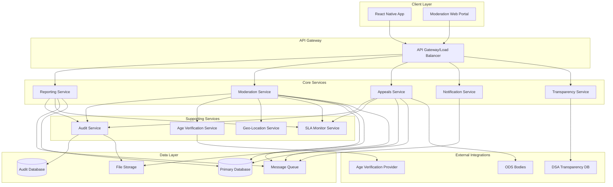

# Design Document

## Overview

The Community Moderation DSA Notice-and-Action system is a comprehensive content moderation platform designed to comply with the EU Digital Services Act while maintaining efficient, scalable operations for GrowBro's community features. The system implements a complete notice-and-action workflow from initial content reporting through appeals and transparency reporting.

The architecture follows a microservices pattern with event-driven communication, ensuring scalability, auditability, and compliance with strict SLA requirements. The system integrates seamlessly with GrowBro's existing React Native application while providing robust backend services for moderation workflows.

## DSA Compliance Mapping

This design implements specific DSA articles through dedicated system components:

| DSA Article   | Requirement             | System Component                   | Implementation                                                                                                        |
| ------------- | ----------------------- | ---------------------------------- | --------------------------------------------------------------------------------------------------------------------- |
| Art. 16       | Notice-and-Action       | Reporting Service                  | Mandatory report fields (explanation, contentLocator, reporterContact, goodFaithDeclaration), easy electronic channel |
| Art. 17       | Statement of Reasons    | Moderation Service                 | Automated SoR generation to users + Commission Transparency Database submission                                       |
| Art. 20       | Internal Complaints     | Appeals Service                    | Timely, non-discriminatory, free human review with reviewer rotation                                                  |
| Art. 21       | Out-of-Court Dispute    | Appeals Service                    | Integration with certified ODS bodies, 90-day target resolution                                                       |
| Art. 22       | Trusted Flaggers        | Moderation Service                 | Priority intake lane with distinct badges and quality analytics                                                       |
| Art. 23       | Measures Against Misuse | Audit Service + Moderation Service | Repeat offender detection, graduated enforcement, manifestly unfounded reporter tracking                              |
| Arts. 15 & 24 | Transparency Reporting  | Transparency Service               | Annual reports + real-time SoR submission to Commission DB                                                            |
| Art. 24(5)    | SoR Database Submission | Moderation Service                 | Redacted SoR export to Commission Transparency Database                                                               |
| Art. 28       | Protection of Minors    | Age Verification Service           | Privacy-preserving age verification + age-appropriate content controls                                                |

## Architecture

### High-Level System Architecture



### Service Architecture Patterns

**Event-Driven Architecture**: All services communicate through message queues to ensure loose coupling and reliable processing. Critical events (reports, decisions, appeals) are published to dedicated topics with guaranteed delivery.

**CQRS Pattern**: Separate read and write models for moderation data, with optimized read views for queue management and reporting while maintaining transactional consistency for decisions.

**Audit-First Design**: Every action generates immutable audit events before business logic execution, ensuring complete traceability even in failure scenarios.

## Components and Interfaces

### 1. Reporting Service

**Purpose**: Handles content reporting intake, validation, and initial processing.

**Key Components**:

- Report Intake API with DSA-compliant field validation
- Content Snapshot Manager for immutable evidence preservation
- Duplicate Detection Engine using content hashing
- Priority Classification Engine for trusted flaggers and illegal content

**Interfaces**:

```typescript
interface ReportingService {
  submitReport(report: ContentReportInput): Promise<ReportSubmissionResult>;
  getReportStatus(reportId: string): Promise<ReportStatus>;
  validateReportData(report: ContentReportInput): ValidationResult;
  captureContentSnapshot(contentId: string): Promise<ContentSnapshot>;
}

interface ContentReportInput {
  contentId: string;
  reportType: 'illegal' | 'policy_violation';
  legalReference?: string; // e.g., DE StGB §..., EU regulation...
  jurisdiction?: string; // required if illegal
  contentLocator: string; // permalink/ID at time of report
  explanation: string; // "sufficiently substantiated"
  reporterContact: ContactInfo; // may be pseudonymous per policy
  goodFaithDeclaration: boolean;
  evidenceUrls?: string[];
  contentHash: string; // cryptographic hash of content at report time
}

interface ContentReport {
  id: string;
  contentId: string;
  reporterId: string; // normalized from reporterContact or pseudonymous ID
  reportType: 'illegal' | 'policy_violation';
  legalReference?: string; // e.g., DE StGB §..., EU regulation...
  jurisdiction?: string; // required if illegal
  contentLocator: string; // permalink/ID at time of report
  explanation: string; // "sufficiently substantiated"
  reporterContact: ContactInfo; // may be pseudonymous per policy
  goodFaithDeclaration: boolean;
  evidenceUrls?: string[];
  contentHash: string; // cryptographic hash of content at report time
  contentSnapshot?: ContentSnapshot;
  status: ReportStatus;
  priority: number;
  trustedFlagger: boolean; // Art. 22 priority lane
  createdAt: Date;
  updatedAt: Date;
  slaDeadline: Date;
}
```

### 2. Moderation Service

**Purpose**: Core moderation workflow management, decision-making, and action execution.

**Key Components**:

- Queue Management System with priority lanes and SLA tracking
- Decision Engine with policy catalog integration
- Action Executor for content and account actions
- Statement of Reasons Generator for DSA compliance

**Interfaces**:

```typescript
interface ModerationService {
  getModeratorQueue(
    moderatorId: string,
    filters: QueueFilters
  ): Promise<ModerationQueue>;
  claimReport(reportId: string, moderatorId: string): Promise<ClaimResult>;
  makeDecision(decision: ModerationDecision): Promise<DecisionResult>;
  generateStatementOfReasons(
    decision: ModerationDecision
  ): Promise<StatementOfReasons>;
  executeAction(action: ModerationAction): Promise<ActionResult>;
}

interface ModerationDecision {
  reportId: string;
  moderatorId: string;
  action:
    | 'no_action'
    | 'quarantine'
    | 'geo_block'
    | 'remove'
    | 'suspend_user'
    | 'rate_limit'
    | 'shadow_ban';
  policyViolations: string[];
  reasoning: string;
  evidence: string[];
  requiresSupervisorApproval: boolean;
}

interface StatementOfReasons {
  decisionId: string;
  decisionGround: 'illegal' | 'terms';
  legalReference?: string;
  contentType: 'post' | 'comment' | 'image' | 'profile' | string;
  factsAndCircumstances: string;
  automatedDetection: boolean;
  automatedDecision: boolean;
  territorialScope?: string[]; // e.g., ['DE','AT']
  redress: Array<'internal_appeal' | 'ods' | 'court'>;
  transparencyDbId?: string; // returned by EC DB
  createdAt: Date;
}

/**
 * Redacted Statement of Reasons for DSA Transparency Database submission (Art. 24(5))
 *
 * This interface represents a Statement of Reasons that has been processed through
 * comprehensive PII scrubbing while preserving aggregated/anonymized data required
 * for transparency reporting. The original SoR is retained internally under Row-Level
 * Security (RLS) while only this redacted variant crosses system boundaries.
 */
interface RedactedSoR {
  // Preserved non-PII fields
  decisionId: string;
  decisionGround: 'illegal' | 'terms';
  legalReference?: string;
  contentType: 'post' | 'comment' | 'image' | 'profile' | string;
  automatedDetection: boolean;
  automatedDecision: boolean;
  territorialScope?: string[]; // e.g., ['DE','AT']
  redress: Array<'internal_appeal' | 'ods' | 'court'>;
  transparencyDbId?: string; // returned by EC DB
  createdAt: Date;

  // Redacted fields are omitted from this shape. The list of removed fields
  // is recorded in `scrubbingMetadata.redactedFields` for auditability.

  // Preserved aggregated/anonymized summaries
  aggregatedData: {
    reportCount: number; // Count of related reports (anonymized)
    evidenceType: 'text' | 'image' | 'video' | 'mixed'; // Categorized evidence type
    contentAge: 'new' | 'recent' | 'archived'; // Age categorization
    jurisdictionCount: number; // Number of affected jurisdictions
    hasTrustedFlagger: boolean; // Whether trusted flagger was involved
  };

  // Pseudonymized actor identifiers (deterministic hashing with environment-specific salt)
  pseudonymizedReporterId: string;
  pseudonymizedModeratorId: string;
  pseudonymizedDecisionId: string; // For correlation without exposing original IDs

  // Audit trail for scrubbing process
  scrubbingMetadata: {
    scrubbedAt: Date;
    scrubbingVersion: string; // Version of scrubbing algorithm used
    redactedFields: string[]; // List of all redacted fields for auditability
    environmentSaltVersion: string; // Version of salt used for pseudonymization
  };
}
```

### 3. Appeals Service

**Purpose**: Manages the appeals process for moderated content and account actions.

**Key Components**:

- Appeal Intake System with eligibility validation
- Human Review Assignment with conflict-of-interest prevention
- Decision Reversal Engine for upheld appeals
- ODS Integration for external dispute resolution

**Interfaces**:

```typescript
interface AppealsService {
  submitAppeal(appeal: Appeal): Promise<AppealSubmissionResult>;
  getAppealStatus(appealId: string): Promise<AppealStatus>;
  assignReviewer(appealId: string): Promise<ReviewerAssignment>;
  processAppealDecision(decision: AppealDecision): Promise<AppealResult>;
  escalateToODS(appealId: string, odsBody: string): Promise<ODSEscalation>;
}

interface Appeal {
  originalDecisionId: string;
  userId: string;
  counterArguments: string;
  supportingEvidence: string[];
  appealType: 'content_removal' | 'account_action' | 'geo_restriction';
}
```

### 4. Audit Service

**Purpose**: Maintains comprehensive, immutable audit trails for all moderation activities.

**Key Components**:

- Immutable Event Logger with cryptographic signatures
- Audit Trail Query Engine for compliance reporting
- Data Retention Manager with GDPR compliance
- Access Control Logger for audit trail access

**Interfaces**:

```typescript
interface AuditService {
  logEvent(event: AuditEvent): Promise<void>;
  queryAuditTrail(query: AuditQuery): Promise<AuditTrail>;
  verifyIntegrity(eventId: string): Promise<IntegrityResult>;
  scheduleRetention(eventId: string, retentionPeriod: Duration): Promise<void>;
}

interface AuditEvent {
  eventType: string;
  actorId: string;
  targetId: string;
  timestamp: Date;
  metadata: Record<string, any>;
  signature: string;
}
```

### 5. Age Verification Service

**Purpose**: Handles privacy-preserving age verification and age-gating enforcement compatible with EU Age-Verification Blueprint and future EUDI wallet.

**Key Components**:

- Age Attribute Verifier using privacy-preserving over-18 attribute (no raw ID storage)
- Content Age-Gating Engine with safety-by-design principles
- One-time Verification Token Manager for reusable credentials
- Consent-based Fallback System (no device fingerprinting without ePrivacy consent)

**Interfaces**:

```typescript
interface AgeVerificationService {
  verifyAgeAttribute(
    userId: string,
    ageAttribute: AgeAttribute
  ): Promise<VerificationToken>;
  checkAgeGating(userId: string, contentId: string): Promise<AccessResult>;
  detectSuspiciousActivity(
    userId: string,
    signals: SuspiciousSignals,
    hasConsent: boolean
  ): Promise<void>;
  issueVerificationToken(userId: string): Promise<ReusableToken>;
  validateToken(tokenId: string): Promise<{ isValid: boolean; error?: string }>;
  getAppealWindowDays(): number; // Configurable, default ≥ 7
}
```

### 6. Geo-Location Service

**Purpose**: Manages geographic content filtering and regional compliance with privacy-first location detection.

**Key Components**:

- IP Geolocation Engine (default, no consent required)
- GPS Location Service (explicit consent + clear user benefit only)
- Regional Content Filter with SoR-integrated geo-blocking
- Legal Compliance Manager with "why/where" user notifications

**Interfaces**:

```typescript
interface GeoLocationService {
  detectUserLocationIP(request: IPLocationRequest): Promise<LocationResult>;
  requestGPSLocation(
    userId: string,
    purpose: string,
    hasConsent: boolean
  ): Promise<LocationResult>;
  checkContentAvailability(
    contentId: string,
    location: Location
  ): Promise<AvailabilityResult>;
  applyGeoRestriction(
    contentId: string,
    restrictedRegions: string[],
    includeInSoR: boolean
  ): Promise<void>;
  notifyGeoRestriction(
    userId: string,
    contentId: string,
    regions: string[]
  ): Promise<void>;
  setVpnBlocking(enabled: boolean): Promise<void>; // Config-driven VPN/proxy block
  getDecisionTtlMs(): number; // Cache TTL (default 1h)
}
```

## Data Models

### Core Entities

**Moderation Decision**

```typescript
interface ModerationDecision {
  id: string;
  reportId: string;
  moderatorId: string;
  supervisorId?: string;
  action: ModerationAction;
  policyViolations: PolicyViolation[];
  reasoning: string;
  evidence: Evidence[];
  statementOfReasons: StatementOfReasons;
  status: DecisionStatus;
  createdAt: Date;
  executedAt?: Date;
}
```

**Appeal**

```typescript
interface Appeal {
  id: string;
  originalDecisionId: string;
  userId: string;
  appealType: AppealType;
  counterArguments: string;
  supportingEvidence: Evidence[];
  reviewerId?: string;
  decision?: AppealDecision;
  status: AppealStatus;
  submittedAt: Date;
  deadline: Date;
  resolvedAt?: Date;
  odsEscalation?: ODSEscalation;
}
```

**Audit Event**

```typescript
interface AuditEvent {
  id: string;
  eventType: string;
  actorId: string;
  actorType: 'user' | 'moderator' | 'system';
  targetId: string;
  targetType: string;
  action: string;
  metadata: Record<string, any>;
  timestamp: Date;
  signature: string;
  retentionUntil: Date;
}
```

**Trusted Flagger**

```typescript
interface TrustedFlagger {
  id: string;
  organizationName: string;
  contactInfo: ContactInfo;
  specialization: string[]; // e.g., ['terrorism', 'csam', 'hate_speech']
  status: 'active' | 'suspended' | 'revoked';
  qualityMetrics: {
    accuracyRate: number;
    averageHandlingTime: number;
    totalReports: number;
    upheldDecisions: number;
  };
  certificationDate: Date;
  reviewDate: Date;
  createdAt: Date;
}
```

**Repeat Offender Tracking**

```typescript
interface RepeatOffenderRecord {
  id: string;
  userId: string;
  violationType: string;
  violationCount: number;
  escalationLevel: 'warning' | 'temporary_suspension' | 'permanent_ban';
  lastViolationDate: Date;
  suspensionHistory: SuspensionRecord[];
  manifestlyUnfoundedReports: number; // Art. 23 misuse tracking
  status: 'active' | 'suspended' | 'banned';
  createdAt: Date;
  updatedAt: Date;
}
```

**SoR Export Queue**

```typescript
interface SoRExportQueue {
  id: string;
  statementOfReasonsId: string;
  idempotencyKey: string; // Unique key for idempotent operations
  status: 'pending' | 'retry' | 'submitted' | 'failed' | 'dlq';
  attempts: number;
  lastAttempt?: Date;
  transparencyDbResponse?: string;
  errorMessage?: string;
  createdAt: Date;
}
```

**Database Migration: SoR Export Queue Table**

```sql
-- Create SoR export queue table for DSA transparency database submissions
-- Implements idempotent queue operations with atomic upsert support

CREATE TABLE IF NOT EXISTS sor_export_queue (
  id UUID PRIMARY KEY DEFAULT gen_random_uuid(),
  statement_id UUID NOT NULL,
  idempotency_key TEXT NOT NULL,
  status TEXT NOT NULL CHECK (status IN ('pending', 'retry', 'submitted', 'failed', 'dlq')),
  attempts INTEGER NOT NULL DEFAULT 0,
  last_attempt TIMESTAMPTZ,
  transparency_db_response TEXT,
  error_message TEXT,
  created_at TIMESTAMPTZ NOT NULL DEFAULT NOW(),
  updated_at TIMESTAMPTZ NOT NULL DEFAULT NOW()
);

-- Enforce uniqueness on statement_id to prevent duplicate queue entries
-- This ensures idempotency at the database level
ALTER TABLE sor_export_queue ADD CONSTRAINT sor_export_queue_statement_id_unique UNIQUE (statement_id);

-- Index for efficient retry/visibility queries
-- Supports queries filtering by status with ordering by attempts and last_attempt
CREATE INDEX IF NOT EXISTS idx_sor_export_queue_status_attempts_last_attempt
ON sor_export_queue (status, attempts, last_attempt);

-- Index for idempotency key lookups (used in conflict resolution)
CREATE INDEX IF NOT EXISTS idx_sor_export_queue_idempotency_key
ON sor_export_queue (idempotency_key);

-- Updated at trigger
CREATE OR REPLACE FUNCTION update_sor_export_queue_updated_at()
RETURNS TRIGGER AS $$
BEGIN
  NEW.updated_at = NOW();
  RETURN NEW;
END;
$$ LANGUAGE plpgsql;

CREATE TRIGGER trigger_update_sor_export_queue_updated_at
  BEFORE UPDATE ON sor_export_queue
  FOR EACH ROW
  EXECUTE FUNCTION update_sor_export_queue_updated_at();
```

### Database Schema Design

**Primary Database (PostgreSQL)**

- Optimized for transactional consistency and complex queries
- Partitioned by month for SoRs, audit events, and reports
- Indexed for common query patterns (user lookups, SLA monitoring, trusted flagger queries)
- Row-level security for data isolation
- Dedicated tables for trusted flaggers and repeat offender tracking (Art. 22/23)
- SoR export queue with DLQ for failed Commission DB submissions

**Audit Database (Separate PostgreSQL Instance)**

- Append-only WORM storage with object lock compatibility
- Cryptographic signatures with public hash chain for integrity proofs
- Automated backup and archival processes
- Restricted access with comprehensive logging
- PII scrubbing pipeline before SoR exports (Art. 24(5) compliance)

### PII Scrubbing Process (Art. 24(5) Compliance)

**Overview**: The PII scrubbing pipeline implements comprehensive data minimization for DSA transparency reporting while preserving analytical value through aggregated/anonymized data. Original Statement of Reasons (SoR) are retained internally under Row-Level Security (RLS) while only redacted variants cross system boundaries.

**Redaction Map**:

- **Free-text fields**: `factsAndCircumstances`, `explanation`, `reasoning`, `counterArguments`, `description`, `metadata`
- **Direct PII fields**: `reporterContact`, `personalIdentifiers`, `contactInfo`
- **Actor identifiers**: `reporterId`, `moderatorId`, `userId` (replaced with pseudonyms)
- **Content locators**: `contentLocator`, `evidenceUrls`
- **Evidence data**: `evidence`, `supportingEvidence`
- **Location/IP data**: `ipAddress`, `locationData`

**Pseudonymization Algorithm**:

- **Method**: HMAC-SHA256 with environment-specific salt
- **Deterministic**: Same input always produces same pseudonym within environment
- **Environment isolation**: Different environments use different salts, ensuring cross-environment unlinkability
- **Salt composition**: `${NODE_ENV}-${context}-${PII_SCRUBBING_SALT}`
- **Output format**: 16-character hexadecimal string
- **Salt versioning**: Tracked via `PII_SALT_VERSION` environment variable

**Aggregation Strategy**:

- **Report counts**: Anonymized total count of related reports
- **Evidence categorization**: Categorized as 'text', 'image', 'video', or 'mixed'
- **Content age**: Categorized as 'new' (<24h), 'recent' (<7d), or 'archived' (≥7d)
- **Jurisdiction scope**: Count of affected territories
- **Trusted flagger involvement**: Boolean indicator

**Audit Trail**:

- **Scrubbing timestamp**: Exact time of redaction
- **Algorithm version**: Version of scrubbing implementation
- **Redacted fields list**: Complete enumeration of removed fields
- **Salt version**: Version of pseudonymization salt used

**Data Retention**:

The previous wording that retained the original Statement of Reasons (SoR) "indefinitely" conflicts with data minimization and storage limitation principles (GDPR Art. 5(1)(e)). This section defines a purpose-bound retention policy, legal-hold exceptions, and concrete operational controls to ensure compliance while preserving transparency and investigatory needs.

- Purpose-bound retention windows:

  - Original (unredacted) SoR and related moderation records: retained for a default of 5 years from the decision execution date, unless a shorter statutory requirement applies. This retention period is tied to the legitimate purposes of (1) meeting Transparency & Impact Assessment (TIA) recordkeeping needs, (2) defense against legal claims, and (3) internal safety and repeat-offender analysis. The 5-year baseline balances regulatory, evidentiary, and operational needs; it must be reviewed annually by the Data Protection Officer (DPO).
  - Redacted SoR variants exported to the Commission Transparency Database: retained according to the Commission DB rules (as a boundary transfer) and local export logs stored for 2 years to support audits and reproducibility.
  - Audit events (cryptographically signed) and integrity proofs stored in the Audit Database: retained for 7 years to support forensic investigations and regulatory requests. Shorter retention may be applied where legally allowed.

- Legal-hold and exception handling:

  - Active legal holds override the scheduled retention policy for specific records (decision IDs, report IDs, content snapshots) and must specify scope, legal basis, and a review cadence. Legal-hold metadata is recorded in the Audit Database and includes owner, reason, start date, and expected review date.
  - Security incidents, criminal investigations (official request), or other legitimately justified regulatory investigations may extend retention on a per-case basis. Each extension requires a documented legal justification and approval by the DPO or Counsel and is time-boxed and logged.

- Operational processes (implementation-level):

  - Automated scheduled purge jobs: a daily scheduled job will scan for expired records and enqueue deletions. Purge windows are configurable; initial rollout uses a 30-day grace window after expiry (i.e., records with retentionUntil <= now - 30 days are deleted) to allow for operator review and emergency intervention.
  - Deletion mechanics: deletions are implemented as a two-stage process — (1) logical tombstone (mark as deleted, remove access via RLS and application-layer checks) and (2) irreversible physical removal after a 14-day tombstone review period. Tombstone creation triggers an audit event capturing actor, scope, retention policy, and TTL.
  - Backfill / restore procedures: when a legitimate restore is required (e.g., error recovery, overturned appeal, or Court order), a documented backfill process can restore records only from secure backups. Restores require an approved change request, re-application of RLS controls, and generation of audit events for the restore action. Restored records inherit the original retention policy or a new retentionUntil if explicitly specified.
  - Audit logging for deletions and restores: every purge, tombstone, and restore operation must record an immutable audit event that includes operator ID (or system actor), target IDs, retention policy applied, legal-hold flags, and justification. Audit events are shipped to the Audit Database (WORM-style) and their integrity signatures recorded.

- Boundary transfers and redaction rules (preserved):

  - Redacted SoR rules remain in effect for any boundary transfer (Art. 24(5)). Only redacted variants cross system boundaries (e.g., Commission DB). Original/unredacted SoRs never leave the primary data environment except under explicit, documented legal process (e.g., court order), and only subject to strict export controls and RLS.

- Timeline and ownership:

  - Implementation timeline: the automated retention and purge pipeline, audit-event capture for retention actions, and legal-hold metadata stores must be implemented within 6 weeks from approval of this spec. A 30-day pilot on a non-production dataset is recommended before full rollout.
  - Policy owner and reviewers: the DPO is the owner of the retention policy and is responsible for annual review. Engineering ownership for implementation and scheduled jobs: Moderation Platform Team (owner: Lead, Moderation Platform). Legal/Counsel must be involved for legal-hold procedures and retention extensions.

- Compliance notes and review cadence:
  - The DPO must review the baseline retention periods and legal-hold processes annually or when laws/regulatory guidance change. All retention changes require documented business justification and must be recorded in the Audit Database.

This operationalized retention policy preserves the ability to meet TIA/transparency needs while aligning with GDPR's storage limitation principle and adding safeguards for deletion, restore, and legal exceptions.

**File Storage (S3-Compatible)**

- Content snapshots with cryptographic hashing and immutability
- Evidence files with secure access controls
- Automated lifecycle management for retention compliance
- Encryption at rest and in transit
- Versioning for content snapshot integrity

## Error Handling

### Error Classification

**System Errors**

- Database connectivity issues
- External service failures (DSA DB, ODS bodies)
- Message queue failures
- File storage unavailability

**Business Logic Errors**

- Invalid report submissions
- Policy violation misclassifications
- SLA deadline breaches
- Appeal eligibility failures

**Compliance Errors**

- DSA submission failures
- Audit trail integrity violations
- Data retention policy breaches
- Privacy regulation violations

### Error Handling Strategies

**Circuit Breaker Pattern with SoR Exporter**

```typescript
import { createHmac } from 'crypto';

class DSASubmissionCircuitBreaker {
  private failureCount = 0;
  private lastFailureTime?: Date;
  private state: 'closed' | 'open' | 'half-open' = 'closed';
  private retryableOperation: RetryableOperation;

  constructor(retryableOperation: RetryableOperation) {
    this.retryableOperation = retryableOperation;
  }

  /**
   * Idempotently adds a Statement of Reasons to the export queue.
   *
   * This method ensures that repeated calls with the same statement_id and idempotency_key
   * do not create duplicate queue entries. If a queue item already exists for the given
   * statement_id, it returns the existing item without modification.
   *
   * The upsert operation is atomic and uses database-native conflict handling to prevent
   * race conditions in concurrent environments.
   *
   * @param statement - The Statement of Reasons to queue for export
   * @param idempotencyKey - Unique key to ensure idempotent operations
   * @returns Promise<SoRExportQueue> - The existing or newly created queue item
   */
  private async addToExportQueue(
    statement: StatementOfReasons,
    idempotencyKey: string
  ): Promise<SoRExportQueue> {
    // Atomic upsert: insert new row or return existing if conflict on statement_id
    const result = await this.db.query(
      `
      INSERT INTO sor_export_queue (
        statement_id,
        idempotency_key,
        status,
        attempts,
        created_at
      ) VALUES (?, ?, 'pending', 0, ?)
      ON CONFLICT (statement_id)
      DO UPDATE SET
        -- No-op update to return existing row without modification
        statement_id = EXCLUDED.statement_id
      RETURNING *
    `,
      [statement.id, idempotencyKey, new Date()]
    );

    return result[0]; // Return the queue item (existing or new)
  }

  private async markForRetry(statementId: string): Promise<void> {
    // Mark statement for retry by updating queue status
    await this.updateQueueItem(statementId, {
      status: 'retry',
      lastAttempt: new Date(),
    });
  }

  private async moveToDeadLetterQueue(
    statementId: string,
    errorMessage: string
  ): Promise<void> {
    // Move statement to dead letter queue
    await this.updateQueueItem(statementId, {
      status: 'dlq',
      errorMessage: errorMessage,
      lastAttempt: new Date(),
    });
  }

  private async updateTransparencyDbId(
    statementId: string,
    transparencyDbId: string
  ): Promise<void> {
    // Store the Commission DB response ID
    await this.db.update(
      'statements_of_reasons',
      { transparency_db_id: transparencyDbId },
      { id: statementId }
    );
  }

  async submitToTransparencyDB(statement: StatementOfReasons): Promise<void> {
    // Add to export queue first (idempotent)
    const idempotencyKey = `dsa-submission-${statement.id}`;
    await this.addToExportQueue(statement, idempotencyKey);

    if (this.state === 'open') {
      if (this.shouldAttemptReset()) {
        this.state = 'half-open';
      } else {
        // Queue for later retry, don't fail the moderation decision
        await this.markForRetry(statement.id);
        return;
      }
    }

    // Get current attempt count from queue
    const currentAttempts = await this.getAttemptCount(statement.id);
    const maxAttempts = this.getMaxAttempts();

    if (currentAttempts >= maxAttempts) {
      // Exceeded max attempts, move to DLQ
      await this.moveToDeadLetterQueue(
        statement.id,
        'Max retry attempts exceeded'
      );
      return;
    }

    try {
      // PII scrubbing before submission (Art. 24(5))
      const redactedSoR = await this.scrubPII(statement);
      const response = await this.retryableOperation.executeWithRetry(
        () => this.dsaClient.submit(redactedSoR),
        maxAttempts - currentAttempts - 1, // Remaining attempts
        this.getBaseDelay()
      );

      // Store Commission DB response ID
      await this.updateTransparencyDbId(statement.id, response.id);
      await this.resetAttemptCount(statement.id); // Reset on success
      this.reset();
    } catch (error) {
      await this.incrementAttemptCount(statement.id);

      if (this.isPermanentError(error)) {
        // Permanent error, move to DLQ immediately
        await this.moveToDeadLetterQueue(statement.id, error.message);
      } else {
        // Transient error, mark for retry
        await this.markForRetry(statement.id);
        this.recordFailure();
      }
      // Allow graceful degradation - continue flow without bubbling exception
    }
  }

  private async scrubPII(statement: StatementOfReasons): Promise<RedactedSoR> {
    // Comprehensive PII scrubbing per Art. 24(5) requirements
    // Original SoR retained under RLS; only redacted variant crosses boundaries

    // Get related data for aggregation (anonymized counts and categories)
    // Normalize any derived/joined evidence types into `evidenceTypes` so
    // categorizeEvidenceType can read the actual list instead of falling back
    // to 'mixed' when the field is missing.
    const rawRelatedReports = await this.getRelatedReports(
      statement.decisionId
    );
    const relatedReports = rawRelatedReports.map((r: any) => ({
      ...r,
      // support DB column name `evidence_types` (snake_case) or already
      // normalized `evidenceTypes` (camelCase). Coerce to an array of strings.
      evidenceTypes:
        r.evidenceTypes ||
        r.evidence_types ||
        r.evidence_types_json ||
        null ||
        [],
    }));

    const aggregatedData = await this.computeAggregatedData(
      statement,
      relatedReports
    );

    // Get actor IDs from related reports if not present on the statement
    // Prefer explicit actor IDs if provided by callers; otherwise derive from related reports.
    const reporterIdFromReports = relatedReports.find(
      (r) => r.reporter_id
    )?.reporter_id;
    const moderatorIdFromReports = relatedReports.find(
      (r) => r.moderator_id
    )?.moderator_id;

    const reporterId =
      (statement as any).reporterId ?? reporterIdFromReports ?? 'unknown';
    const moderatorId =
      (statement as any).moderatorId ?? moderatorIdFromReports ?? 'system';

    // Pseudonymize actor identifiers deterministically using HMAC-SHA256
    const pseudonymizedReporterId = this.pseudonymizeIdentifier(
      reporterId,
      'reporter'
    );
    const pseudonymizedModeratorId = this.pseudonymizeIdentifier(
      moderatorId,
      'moderator'
    );
    const pseudonymizedDecisionId = this.pseudonymizeIdentifier(
      statement.decisionId,
      'decision'
    );

    // Build a set of fields to redact (names only). We'll omit them from the
    // returned object rather than including them with undefined values.
    const redactedFieldNames = new Set([
      'factsAndCircumstances',
      'explanation',
      'reasoning',
      'reporterContact',
      'personalIdentifiers',
      'contactInfo',
      'reporterId',
      'moderatorId',
      'userId',
      'contentLocator',
      'evidence',
      'supportingEvidence',
      'evidenceUrls',
      'ipAddress',
      'locationData',
      'counterArguments',
      'description',
      'metadata',
    ]);

    // Redact recursively by omitting fields
    const redact = (obj: any): any => {
      if (!obj || typeof obj !== 'object') return obj;
      if (Array.isArray(obj)) return obj.map(redact);
      const out: Record<string, any> = {};
      for (const [k, v] of Object.entries(obj)) {
        if (redactedFieldNames.has(k)) continue; // omit
        out[k] = typeof v === 'object' && v !== null ? redact(v) : v;
      }
      return out;
    };

    const redactedStatement = redact(statement);

    // Apply aggregation privacy rule: suppress small counts (k-anonymity)
    const safeAggregatedData = this.applySuppressionToAggregates(
      aggregatedData,
      { k: 5 }
    );

    const redactedSoR: RedactedSoR = {
      // Preserve non-PII fields explicitly
      decisionId: statement.decisionId,
      decisionGround: statement.decisionGround,
      legalReference: statement.legalReference,
      contentType: statement.contentType,
      automatedDetection: statement.automatedDetection,
      automatedDecision: statement.automatedDecision,
      territorialScope: statement.territorialScope,
      redress: statement.redress,
      transparencyDbId: statement.transparencyDbId,
      createdAt: statement.createdAt,

      // Aggregated/anonymized data (suppressed for low counts)
      aggregatedData: safeAggregatedData,

      // Pseudonymized identifiers
      pseudonymizedReporterId,
      pseudonymizedModeratorId,
      pseudonymizedDecisionId,

      // Scrubbing audit trail
      scrubbingMetadata: {
        scrubbedAt: new Date(),
        scrubbingVersion: '1.0.0',
        redactedFields: Array.from(redactedFieldNames),
        environmentSaltVersion: this.getEnvironmentSaltVersion(),
        aggregationSuppression: { k: 5 },
      },
    };

    return redactedSoR;
  }

  /**
   * Deterministic pseudonymization using HMAC-SHA256 with environment-specific salt
   * Same input always produces same pseudonym within environment, different across environments
   */
  private pseudonymizeIdentifier(identifier: string, context: string): string {
    const salt = this.getEnvironmentSpecificSalt(context);
    const hmac = createHmac('sha256', salt);
    hmac.update(identifier);
    // Return a short, URL-safe pseudonym. Truncate for readability.
    return hmac.digest('hex').substring(0, 16); // 16-character pseudonym
  }

  /**
   * Environment-specific salt for pseudonymization
   * Ensures same actor maps consistently within environment but differently across environments
   */
  private getEnvironmentSpecificSalt(context: string): string {
    const baseSalt = process.env.PII_SCRUBBING_SALT; // required
    if (!baseSalt) throw new Error('missing PII_SCRUBBING_SALT');
    return baseSalt; // derive context/env via HMAC input, not key
  }

  /**
   * Get current salt version for auditability
   */
  private getEnvironmentSaltVersion(): string {
    return process.env.PII_SALT_VERSION || 'v1.0';
  }

  /**
   * Recursively apply redaction map to remove PII from nested objects
   */
  private applyRedactionMap(
    obj: any,
    redactionMap: Record<string, undefined>
  ): any {
    // Deprecated in favor of omission-based redaction implemented inline in scrubPII.
    // Keep for backward compatibility but implement omission semantics.
    if (!obj || typeof obj !== 'object') return obj;
    if (Array.isArray(obj))
      return obj.map((v) => this.applyRedactionMap(v, redactionMap));
    const out: Record<string, any> = {};
    for (const [k, v] of Object.entries(obj)) {
      if (Object.prototype.hasOwnProperty.call(redactionMap, k)) continue; // omit
      out[k] =
        typeof v === 'object' && v !== null
          ? this.applyRedactionMap(v, redactionMap)
          : v;
    }
    return out;
  }

  /**
   * Compute aggregated/anonymized data for transparency reporting
   */
  private async computeAggregatedData(
    statement: StatementOfReasons,
    relatedReports: any[]
  ): Promise<RedactedSoR['aggregatedData']> {
    return {
      reportCount: relatedReports.length,
      evidenceType: this.categorizeEvidenceType(relatedReports),
      contentAge: this.categorizeContentAge(statement.createdAt),
      jurisdictionCount: statement.territorialScope?.length || 1,
      hasTrustedFlagger: relatedReports.some((r) => r.trustedFlagger),
    };
  }

  /**
   * Categorize evidence types for aggregated reporting
   */
  private categorizeEvidenceType(
    reports: any[]
  ): 'text' | 'image' | 'video' | 'mixed' {
    const types = reports.flatMap((r) => r.evidenceTypes || []);
    const hasText = types.includes('text');
    const hasImage = types.includes('image');
    const hasVideo = types.includes('video');

    if (hasText && !hasImage && !hasVideo) return 'text';
    if (!hasText && hasImage && !hasVideo) return 'image';
    if (!hasText && !hasImage && hasVideo) return 'video';
    return 'mixed';
  }

  /**
   * Categorize content age for aggregated reporting
   */
  private categorizeContentAge(createdAt: Date): 'new' | 'recent' | 'archived' {
    const ageInHours = (Date.now() - createdAt.getTime()) / (1000 * 60 * 60);

    if (ageInHours < 24) return 'new';
    if (ageInHours < 168) return 'recent'; // 7 days
    return 'archived';
  }

  /**
   * Get related reports for aggregation (without exposing PII)
   */
  private async getRelatedReports(decisionId: string): Promise<any[]> {
    // Query reports related to this decision, excluding PII fields
    // Also fetch reporter/moderator IDs for pseudonymization (internal-only)
    // NOTE: include a derived/aggregated evidence_types array so downstream
    // aggregation logic (categorizeEvidenceType) has access to actual evidence
    // types instead of falling back to 'mixed'. This assumes there is a
    // report_evidence table linking report_id -> evidence_type (text|image|video)
    // and uses a string_agg / array_agg depending on DB flavor. Here we use
    // a generic SQL that returns evidence_types as a JSON/array-compatible
    // field named evidence_types.
    return await this.db.query(
      `
      SELECT
        r.id,
        r.report_type,
        r.trusted_flagger,
        r.reporter_id,
        r.moderator_id,
        r.created_at,
        -- aggregate evidence types for the report into an array
        COALESCE(evidence_agg.evidence_types, ARRAY[]::text[]) AS evidence_types
      FROM reports r
      LEFT JOIN (
        SELECT
          re.report_id,
          array_agg(DISTINCT re.evidence_type) AS evidence_types
        FROM report_evidence re
        WHERE re.evidence_type IS NOT NULL
        GROUP BY re.report_id
      ) AS evidence_agg ON evidence_agg.report_id = r.id
      WHERE r.decision_id = $1
    `,
      [decisionId]
    );
  }

  /**
   * Apply simple suppression to aggregated data to enforce k-anonymity for small counts.
   * This is a lightweight approach; replace with DP mechanisms if stronger guarantees are required.
   */
  private applySuppressionToAggregates(aggregates: any, opts: { k: number }) {
    const out = { ...aggregates };
    if (typeof out.reportCount === 'number' && out.reportCount < opts.k) {
      out.reportCount = 'suppressed';
    }
    // jurisdictionCount suppression
    if (
      typeof out.jurisdictionCount === 'number' &&
      out.jurisdictionCount < opts.k
    ) {
      out.jurisdictionCount = 'suppressed';
    }
    return out;
  }

  private async getAttemptCount(statementId: string): Promise<number> {
    const queueItem = await this.getQueueItem(statementId);
    return queueItem?.attempts || 0;
  }

  private async incrementAttemptCount(statementId: string): Promise<void> {
    const currentAttempts = await this.getAttemptCount(statementId);
    await this.updateQueueItem(statementId, { attempts: currentAttempts + 1 });
  }

  private async resetAttemptCount(statementId: string): Promise<void> {
    await this.updateQueueItem(statementId, { attempts: 0 });
  }

  private getMaxAttempts(): number {
    return 3; // Configurable threshold for max retry attempts
  }

  private getBaseDelay(): number {
    return 1000; // Base delay in milliseconds for exponential backoff
  }

  // Public accessor for circuit breaker state
  getState(): 'closed' | 'open' | 'half-open' {
    return this.state;
  }

  // Public method to check if error is permanent (was previously private)
  isPermanentError(error: any): boolean {
    // Classify errors as permanent vs transient
    // Permanent errors that should not be retried
    const permanentErrorCodes = [
      400, // Bad Request
      401, // Unauthorized
      403, // Forbidden
      404, // Not Found
      422, // Unprocessable Entity
    ];

    const permanentErrorMessages = [
      'invalid_data',
      'authentication_failed',
      'insufficient_permissions',
      'resource_not_found',
      'validation_error',
    ];

    // Check HTTP status code
    if (error.status && permanentErrorCodes.includes(error.status)) {
      return true;
    }

    // Check error message/code
    if (error.code && permanentErrorMessages.includes(error.code)) {
      return true;
    }

    if (
      error.message &&
      permanentErrorMessages.some((msg) =>
        error.message.toLowerCase().includes(msg.toLowerCase())
      )
    ) {
      return true;
    }

    // Default to transient for network errors, timeouts, server errors
    return false;
  }

  private async getQueueItem(
    statementId: string
  ): Promise<SoRExportQueue | null> {
    // Implementation to retrieve queue item from database
    const res = await this.db.query(
      'SELECT * FROM sor_export_queue WHERE statement_id = $1 LIMIT 1',
      [statementId]
    );
    return res.rows?.[0] ?? null;
  }

  private async updateQueueItem(
    statementId: string,
    updates: Partial<SoRExportQueue>
  ): Promise<void> {
    // Implementation to update queue item in database
    await this.db.update('sor_export_queue', updates, {
      statement_id: statementId,
    });
  }

  // Circuit breaker state management methods
  recordFailure(): void {
    this.failureCount++;
    this.lastFailureTime = new Date();

    // Open circuit breaker if failure threshold exceeded
    if (this.failureCount >= this.getFailureThreshold()) {
      this.state = 'open';
    }
  }

  reset(): void {
    this.failureCount = 0;
    this.lastFailureTime = undefined;
    this.state = 'closed';
  }

  shouldAttemptReset(): boolean {
    if (this.state !== 'open') {
      return false;
    }

    // Check if enough time has passed to attempt reset
    const resetTimeout = this.getResetTimeout();
    if (!this.lastFailureTime) {
      return true;
    }

    const timeSinceLastFailure = Date.now() - this.lastFailureTime.getTime();
    return timeSinceLastFailure >= resetTimeout;
  }

  private getFailureThreshold(): number {
    return 5; // Configurable failure threshold
  }

  private getResetTimeout(): number {
    return 60000; // 60 seconds reset timeout
  }
}
```

**Retry with Exponential Backoff**

```typescript
class RetryableOperation {
  private circuitBreaker: DSASubmissionCircuitBreaker;

  constructor(circuitBreaker: DSASubmissionCircuitBreaker) {
    this.circuitBreaker = circuitBreaker;
  }

  async executeWithRetry<T>(
    operation: () => Promise<T>,
    maxRetries: number = 3,
    baseDelay: number = 1000
  ): Promise<T> {
    for (let attempt = 0; attempt <= maxRetries; attempt++) {
      try {
        const result = await operation();

        // Reset circuit breaker on successful operation
        if (this.circuitBreaker.getState() === 'half-open') {
          this.circuitBreaker.reset();
        }

        return result;
      } catch (error) {
        // Check if error is retryable (transient)
        if (!this.isRetryable(error) || attempt === maxRetries) {
          throw error;
        }

        // Record failure in circuit breaker for transient errors
        this.circuitBreaker.recordFailure();

        // Calculate exponential backoff delay
        const delay = baseDelay * Math.pow(2, attempt);
        await this.sleep(delay);
      }
    }
  }

  private isRetryable(error: any): boolean {
    // Use the circuit breaker's error classification
    return !this.circuitBreaker.isPermanentError(error);
  }

  private async sleep(ms: number): Promise<void> {
    return new Promise((resolve) => setTimeout(resolve, ms));
  }
}
```

**Graceful Degradation**

- Queue operations continue even if transparency reporting fails
- Local audit logging maintains integrity during external service outages
- Manual fallback procedures for critical SLA-bound operations
- User notifications continue with reduced functionality during system issues

## Moderator Console

The Moderator Console is a dedicated web interface for content moderation teams, separate from the main React Native application.

### Key Features

**SoR Preview Pane**

- Real-time Statement of Reasons generation preview
- DSA compliance validation before submission
- Template selection for common violation types

**Policy Catalog Deep-Links**

- Direct links to specific policy sections from queue items
- Contextual policy guidance based on content type
- Version-controlled policy updates with change notifications

**Trusted Flagger Dashboard**

- Dedicated priority lane with distinct visual badges
- Quality analytics and performance metrics
- Periodic review workflows for trusted flagger status

**SLA Monitoring Dashboard**

- Real-time queue status with color-coded SLA indicators
- Escalation alerts at 75% and 90% SLA thresholds
- Performance metrics and compliance reporting

**Audit Trail Viewer**

- Comprehensive moderation history for each piece of content
- Immutable event logging with integrity verification
- Export capabilities for compliance reporting

## Testing Strategy

### Unit Testing

**Service Layer Testing**

```typescript
describe('ModerationService', () => {
  it('should generate DSA-compliant Statement of Reasons', async () => {
    const decision: ModerationDecision = {
      reportId: 'report-123',
      action: 'remove',
      policyViolations: ['illegal-content-terrorism'],
      reasoning: 'Content promotes terrorist activities',
    };

    const statement =
      await moderationService.generateStatementOfReasons(decision);

    expect(statement).toMatchObject({
      factsAndCircumstances: expect.any(String),
      decisionGround: expect.any(String),
      automatedDetection: expect.any(Boolean),
      redress: expect.arrayContaining(['internal_appeal', 'ods']),
    });
  });
});
```

**Data Model Validation**

```typescript
describe('ContentReportInput validation', () => {
  it('should require jurisdiction for illegal content reports', () => {
    const reportInput: ContentReportInput = {
      contentId: 'content-123',
      reportType: 'illegal',
      explanation: 'Contains illegal content',
      contentLocator: 'https://example.com/content/123',
      reporterContact: { email: 'reporter@example.com' },
      goodFaithDeclaration: true,
      contentHash: 'abc123',
      // Missing jurisdiction - should fail validation
    };

    const validation = validateContentReport(reportInput);
    expect(validation.isValid).toBe(false);
    expect(validation.errors).toContain(
      'jurisdiction_required_for_illegal_content'
    );
  });
});
```

### Integration Testing

**End-to-End Workflow Testing**

```typescript
describe('Notice and Action Workflow', () => {
  it('should complete full workflow from report to decision', async () => {
    // Submit report
    const report = await reportingService.submitReport(mockReport);
    expect(report.id).toBeDefined();

    // Process in moderation queue
    const queue = await moderationService.getModeratorQueue('mod-1', {});
    expect(queue.items).toContainEqual(
      expect.objectContaining({ reportId: report.id })
    );

    // Make decision
    const decision = await moderationService.makeDecision({
      reportId: report.id,
      action: 'remove',
      reasoning: 'Violates community guidelines',
    });

    // Verify audit trail
    const auditTrail = await auditService.queryAuditTrail({
      targetId: report.id,
      eventTypes: ['report_submitted', 'decision_made'],
    });
    expect(auditTrail.events).toHaveLength(2);
  });
});
```

**SLA Compliance Testing**

```typescript
describe('SLA Monitoring', () => {
  it('should alert when reports approach SLA deadlines', async () => {
    const report = await createMockReport({ priority: 'high' });

    // Fast-forward time to 75% of SLA deadline
    jest.advanceTimersByTime(18 * 60 * 60 * 1000); // 18 hours for 24-hour SLA

    const alerts = await slaMonitor.checkPendingReports();
    expect(alerts).toContainEqual(
      expect.objectContaining({
        reportId: report.id,
        alertType: 'sla_warning_75_percent',
      })
    );
  });
});
```

### Performance Testing

**Load Testing Scenarios**

- 10,000 concurrent report submissions
- 1,000 moderators accessing queues simultaneously
- Transparency report generation with 1M+ records
- Appeal processing under high load

**Stress Testing**

- Database connection pool exhaustion
- Message queue backlog handling
- File storage bandwidth limits
- External service timeout scenarios

### Security Testing

**Authentication & Authorization**

```typescript
describe('Security Controls', () => {
  it('should prevent unauthorized access to moderation queues', async () => {
    const unauthorizedUser = { id: 'user-123', role: 'regular_user' };

    await expect(
      moderationService.getModeratorQueue('mod-queue-1', {}, unauthorizedUser)
    ).rejects.toThrow('Insufficient permissions');
  });

  it('should validate audit trail integrity', async () => {
    const event = await auditService.logEvent(mockAuditEvent);

    // Attempt to tamper with event
    await database.query('UPDATE audit_events SET metadata = ? WHERE id = ?', [
      '{"tampered": true}',
      event.id,
    ]);

    const integrity = await auditService.verifyIntegrity(event.id);
    expect(integrity.isValid).toBe(false);
  });
});
```

**Data Privacy Testing**

- GDPR compliance validation
- Data minimization verification
- Consent management testing
- Cross-border data transfer validation

### Compliance Testing

**DSA Compliance Validation**

```typescript
describe('DSA Compliance', () => {
  it('should submit Statement of Reasons to Transparency Database', async () => {
    const decision = await moderationService.makeDecision(mockDecision);

    // Verify SoR was generated and submitted
    expect(mockDSAClient.submit).toHaveBeenCalledWith(
      expect.objectContaining({
        decision_ground: expect.any(String),
        content_type: expect.any(String),
        automated_detection: expect.any(Boolean),
      })
    );
  });

  it('should include all required Transparency DB fields and store response ID', async () => {
    const decision = await moderationService.makeDecision(mockDecision);
    const statement =
      await moderationService.generateStatementOfReasons(decision);

    // Verify all mandatory fields present
    expect(statement).toMatchObject({
      decisionGround: expect.stringMatching(/^(illegal|terms)$/),
      contentType: expect.any(String),
      factsAndCircumstances: expect.any(String),
      automatedDetection: expect.any(Boolean),
      automatedDecision: expect.any(Boolean),
      redress: expect.arrayContaining(['internal_appeal']),
    });

    // Verify Commission DB response ID is stored
    expect(statement.transparencyDbId).toBeDefined();
  });
});

describe('Misuse Controls (Art. 23)', () => {
  it('should detect repeat infringers and apply graduated enforcement', async () => {
    const userId = 'repeat-offender-123';

    // Simulate multiple violations
    for (let i = 0; i < 3; i++) {
      await moderationService.recordViolation(userId, 'hate_speech');
    }

    const offenderRecord =
      await moderationService.getRepeatOffenderRecord(userId);
    expect(offenderRecord.escalationLevel).toBe('temporary_suspension');
    expect(offenderRecord.suspensionHistory).toHaveLength(1);
  });

  it('should suspend users for manifestly unfounded reports', async () => {
    const reporterId = 'bad-reporter-456';

    // Simulate multiple false reports
    for (let i = 0; i < 5; i++) {
      const report = await reportingService.submitReport({
        ...mockReport,
        explanation: 'False claim',
      });
      await moderationService.makeDecision({
        reportId: report.id,
        action: 'no_action',
        reasoning: 'Manifestly unfounded',
      });
    }

    const reporterStatus =
      await moderationService.getReporterStatus(reporterId);
    expect(reporterStatus.status).toBe('suspended');
    expect(reporterStatus.manifestlyUnfoundedCount).toBe(5);
  });
});

describe('Age Verification Token Security', () => {
  it('should not persist raw ID data after verification', async () => {
    const userId = 'user-789';
    const ageAttribute = { over18: true, verificationMethod: 'eudi_wallet' };

    const token = await ageVerificationService.verifyAgeAttribute(
      userId,
      ageAttribute
    );

    // Verify no raw ID data is stored
    const userRecord = await database.query(
      'SELECT * FROM users WHERE id = ?',
      [userId]
    );
    expect(userRecord.rawIdData).toBeUndefined();
    expect(userRecord.idDocument).toBeUndefined();

    // Verify reusable token is valid
    expect(token.isValid).toBe(true);
    expect(token.expiresAt).toBeInstanceOf(Date);
  });

  it('should prevent replay attacks on verification tokens', async () => {
    const token =
      await ageVerificationService.issueVerificationToken('user-789');

    // First use should succeed
    const firstUse = await ageVerificationService.validateToken(token.id);
    expect(firstUse.isValid).toBe(true);

    // Replay attempt should fail
    const replayAttempt = await ageVerificationService.validateToken(token.id);
    expect(replayAttempt.isValid).toBe(false);
    expect(replayAttempt.error).toBe('token_already_used');
  });
});
```

This comprehensive design provides a robust, scalable, and compliant foundation for implementing the DSA Notice-and-Action moderation system within GrowBro's React Native application architecture.
