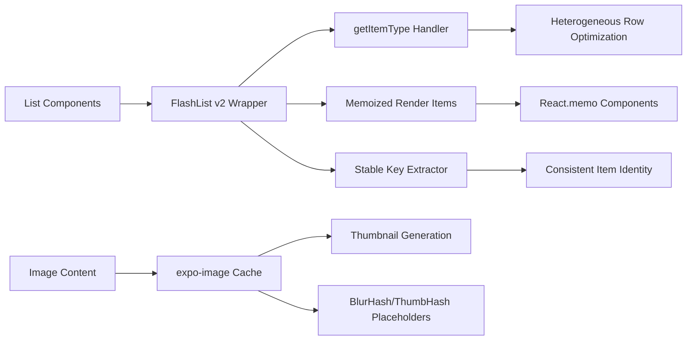
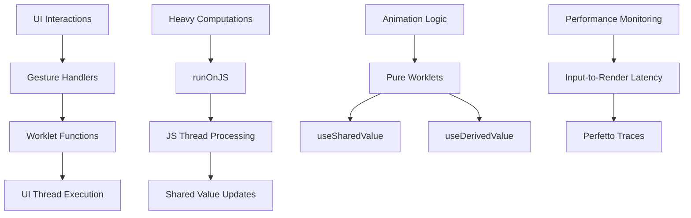

# Design Document

## Overview

This design document outlines the comprehensive performance optimization and reliability improvements for the GrowBro mobile application. The solution focuses on four key areas: FlashList v2 implementation with advanced optimization patterns, Reanimated worklets performance audit and optimization, React Native New Architecture migration, and automated CI/CD performance budgets with monitoring infrastructure.

The design ensures 60 FPS performance across all user interactions while establishing robust performance monitoring and regression prevention through automated testing and budgets.

## Architecture

### Performance Monitoring Stack

**Standardized Transaction Names:**

- `app.startup` - Application cold/warm start
- `agenda.scroll` - Calendar/agenda list scrolling
- `navigation.push:<Screen>` - Screen transitions
- `sync.pull` / `sync.push` - Data synchronization
- `ai.infer` - AI photo analysis
- `image.decode` - Image processing

**Monitoring Integration:**

- **Sentry RN Performance**: Startup/slow/frozen frame metrics, dashboards, 10% production sampling
- **@shopify/react-native-performance**: Deterministic TTI/TTFD + render passes for CI gating
- **React Navigation Instrumentation**: Enabled in release builds for transition spans
- **Android FrameTimeline**: Jank attribution on Android 12+ via Perfetto traces

```mermaid
graph TB
    A[App Runtime] --> B[Sentry RN Performance]
    A --> C[@shopify/react-native-performance]
    A --> D[React Navigation Instrumentation]

    B --> E[Sentry Dashboard - 10% Sampling]
    C --> F[CI Performance Gates]
    D --> G[Navigation Transition Spans]

    H[CI Pipeline] --> I[Performance Tests - Release Only]
    I --> J[Maestro/Detox Scripts]
    I --> K[Reassure Component Tests]

    J --> L[Perfetto FrameTimeline Traces]
    K --> M[Render Timing Baselines]

    L --> N[Performance Artifacts]
    M --> N
    E --> N
```

### FlashList v2 Integration Architecture



### Reanimated Worklets Optimization



## Components and Interfaces

### Performance Monitoring Components

#### Sentry Performance Integration

```typescript
interface SentryPerformanceConfig {
  tracesSampleRate: number;
  enableAutoInstrumentation: boolean;
  enableNavigationInstrumentation: boolean;
  enableAppStartInstrumentation: boolean;
  enableStallTracking: boolean;
}

interface PerformanceTransaction {
  name: string;
  operation: string;
  startTimestamp: number;
  endTimestamp?: number;
  spans: PerformanceSpan[];
  tags: Record<string, string>;
}
```

#### React Native Performance Integration

```typescript
interface RNPerformanceConfig {
  enableRenderPassReporting: boolean;
  enableTTIReporting: boolean;
  enableTTFDReporting: boolean;
  enableComponentRenderReporting: boolean;
}

interface PerformanceReport {
  screenName: string;
  renderPasses: RenderPass[];
  timeToInteractive: number;
  timeToFirstDisplay: number;
  componentRenderTimes: ComponentRenderTime[];
}
```

### FlashList v2 Components

#### Optimized List Wrapper

```typescript
interface OptimizedFlashListProps<T> extends FlashListProps<T> {
  itemTypes: string[];
  getItemType: (item: T, index: number) => string;
  renderItem: ListRenderItem<T>;
  keyExtractor: (item: T, index: number) => string;
  enablePerformanceMonitoring?: boolean;
}

interface ListPerformanceMetrics {
  averageFPS: number;
  droppedFrames: number;
  p95FrameTime: number;
  jankCount: number;
  blankCellCount: number;
}
```

#### Image Optimization Components

```typescript
interface OptimizedImageProps {
  source: ImageSource;
  placeholder?: BlurHashPlaceholder | ThumbHashPlaceholder;
  cachePolicy: 'memory' | 'disk' | 'none';
  thumbnailSize?: { width: number; height: number };
}

interface ImageCacheManager {
  generateThumbnail(
    source: ImageSource,
    size: { width: number; height: number }
  ): Promise<string>;
  getCachedImage(uri: string): Promise<string | null>;
  clearCache(): Promise<void>;
}
```

### Reanimated Worklets Components

#### Worklet Performance Monitor

```typescript
interface WorkletPerformanceConfig {
  enableLatencyTracking: boolean;
  enableFrameDropDetection: boolean;
  maxWorkletExecutionTime: number;
}

interface WorkletPerformanceMetrics {
  inputToRenderLatency: number;
  frameDropPercentage: number;
  workletExecutionTimes: number[];
  gestureResponseTimes: number[];
}
```

#### Optimized Animation Components

```typescript
interface OptimizedAnimationProps {
  worklet: () => void;
  dependencies: any[];
  enablePerformanceMonitoring?: boolean;
}

interface GesturePerformanceTracker {
  trackGestureStart(): void;
  trackGestureEnd(): void;
  getLatencyMetrics(): GestureLatencyMetrics;
}
```

### CI Performance Testing Components

#### Performance Budget Configuration

```typescript
interface PerformanceBudgets {
  scrolling: {
    p95FrameTime: number; // 16.7ms
    droppedFrameThreshold: number; // 1%
    averageFPSThreshold: number; // 58
  };
  startup: {
    ttiThresholds: Record<string, number>; // device-specific
    coldStartThreshold: number;
  };
  navigation: {
    transitionThreshold: number; // 250ms
  };
  sync: {
    syncThreshold: number; // 2.5s for 500 items
  };
}

interface PerformanceTestResult {
  testName: string;
  device: string;
  buildHash: string;
  metrics: PerformanceMetrics;
  passed: boolean;
  artifacts: PerformanceArtifact[];
}
```

#### Automated Testing Framework

```typescript
interface PerformanceTestSuite {
  scrollTests: ScrollPerformanceTest[];
  startupTests: StartupPerformanceTest[];
  navigationTests: NavigationPerformanceTest[];
  componentTests: ComponentPerformanceTest[];
}

interface TestArtifact {
  type: 'perfetto' | 'sentry' | 'rnperformance' | 'reassure';
  filePath: string;
  metadata: Record<string, any>;
}
```

## Data Models

### Performance Metrics Schema

```typescript
interface PerformanceMetrics {
  timestamp: number;
  buildVersion: string;
  device: DeviceInfo;
  frameMetrics: FrameMetrics;
  memoryMetrics: MemoryMetrics;
  networkMetrics: NetworkMetrics;
  userInteractionMetrics: UserInteractionMetrics;
}

interface FrameMetrics {
  averageFPS: number;
  p95FrameTime: number;
  droppedFrames: number;
  jankCount: number;
  renderPassCount: number;
}

interface MemoryMetrics {
  heapUsed: number;
  heapTotal: number;
  rssMemory: number;
  imageMemoryUsage: number;
  cacheMemoryUsage: number;
}
```

### Test Configuration Schema

```typescript
interface TestConfiguration {
  devices: DeviceConfig[];
  scenarios: TestScenario[];
  budgets: PerformanceBudgets;
  reporting: ReportingConfig;
}

interface DeviceConfig {
  name: string;
  platform: 'ios' | 'android';
  version: string;
  isPhysical: boolean;
  budgetMultiplier: number;
}
```

## Error Handling

### Performance Monitoring Error Handling

- **Sentry Integration Failures**: Graceful degradation when Sentry is unavailable; local fallback logging
- **Performance Test Failures**: Detailed error reporting with context; automatic retry mechanisms for flaky tests
- **Worklet Execution Errors**: Automatic fallback to JS thread execution; error boundary protection
- **FlashList Rendering Errors**: Fallback to FlatList with performance warnings; error reporting to monitoring

### CI Pipeline Error Handling

- **Budget Threshold Violations**: Clear failure messages with performance diff reports; links to performance artifacts
- **Test Environment Issues**: Automatic retry with different device configurations; fallback to emulator testing
- **Artifact Generation Failures**: Partial artifact collection; warning notifications without failing the build

## Testing Strategy

### Unit Testing

- **FlashList Components**: Render performance tests using Reassure; memoization validation tests
- **Worklet Functions**: Pure function testing; performance boundary testing
- **Performance Utilities**: Metric calculation accuracy tests; threshold validation tests

### Integration Testing

- **End-to-End Performance**: Maestro scripts for realistic user interactions; automated scroll performance validation
- **Cross-Platform Testing**: iOS and Android performance parity validation; device-specific optimization testing
- **Memory Leak Testing**: Extended usage scenarios; memory growth pattern validation

### Performance Testing

- **Automated CI Budgets**: Continuous performance regression detection; trend analysis and alerting
- **Load Testing**: High-volume data scenarios; stress testing with large datasets
- **Real Device Testing**: Physical device validation; network condition simulation

### Monitoring and Alerting

- **Real-time Performance Monitoring**: Sentry dashboard integration; automated alert thresholds
- **Performance Trend Analysis**: Historical performance tracking; regression detection algorithms
- **User Experience Metrics**: Real user monitoring; performance impact correlation

## Implementation Phases

### Phase 1: Foundation Setup

1. Sentry Performance and @shopify/react-native-performance integration
2. React Native New Architecture enablement and validation
3. Basic performance monitoring infrastructure

### Phase 2: FlashList v2 Migration

1. Audit and migrate all FlatList components to FlashList v2
2. Implement getItemType optimization for heterogeneous lists
3. Add image optimization with expo-image and placeholder system

### Phase 3: Reanimated Optimization

1. Audit all worklets for performance anti-patterns
2. Implement worklet performance monitoring
3. Optimize gesture handling and animation performance

### Phase 4: CI/CD Integration

1. Implement automated performance testing pipeline
2. Configure performance budgets and failure thresholds
3. Set up performance artifact collection and reporting

### Phase 5: Monitoring and Optimization

1. Deploy comprehensive performance monitoring
2. Implement performance trend analysis and alerting
3. Continuous optimization based on real-world performance data

## Performance SLAs & CI Budgets

### Concrete Performance Budgets (CI Failure Thresholds)

#### Startup Performance

- **Pixel 6a**: TTI ≤ 1.8s (cold start)
- **iPhone 12**: TTI ≤ 1.3s (cold start)
- **Measurement**: @shopify/react-native-performance + Sentry app.startup transaction

#### List Scrolling Performance

- **30-second continuous scroll over 1,000 items**:
  - Average FPS ≥ 58
  - P95 frame time ≤ 16.7ms
  - Dropped frames ≤ 1%
  - Jank count ≤ 5 per 1k frames
  - 0 blank cells observed
- **Measurement**: Perfetto FrameTimeline + RN Performance JSON

#### Navigation Performance

- **Screen transitions**: P95 ≤ 250ms
- **Native Stack preferred** (react-native-screens) for reduced memory overhead
- **Measurement**: React Navigation instrumentation spans

#### Sync Performance

- **500 item sync**: P95 ≤ 2.5s on LTE simulation
- **Measurement**: Custom sync transaction spans

### FlashList v2 Implementation Standards

**Mandatory Patterns:**

```typescript
// Use FlashList v2 for all production lists
import { FlashList } from "@shopify/flash-list";

// Required: stable keyExtractor
const keyExtractor = useCallback((item: Item) => item.id, []);

// Required: getItemType for heterogeneous rows
const getItemType = useCallback((item: Item) => item.type, []);

// Required: memoized renderItem
const renderItem = useCallback(({ item }: { item: Item }) => (
  <MemoizedItemComponent item={item} />
), []);

// expo-image mandatory for list images
<ExpoImage
  source={{ uri: item.imageUrl }}
  placeholder={item.blurHash}
  cachePolicy="memory-disk"
  style={styles.thumbnail}
/>
```

**Performance Validation:**

- CI MUST fail if `__DEV__ === true` during performance tests
- No FlatList components in production screens
- Image thumbnails ≤ 1280px longest side for feeds

### Reanimated Worklet Standards

**ESLint Rules (Enforced):**

```javascript
// ✅ Correct worklet pattern
const animatedStyle = useAnimatedStyle(() => {
  'worklet';
  return {
    transform: [{ translateX: sharedValue.value }],
  };
}, []);

// ❌ Blocked by ESLint
const badWorklet = useAnimatedStyle(() => {
  'worklet';
  console.log('No logging in worklets'); // ESLint error
  fetch('/api/data'); // ESLint error
  heavyComputation(); // ESLint error
}, []);
```

**Performance Requirements:**

- Continuous gesture P95 input→render latency ≤ 50ms
- Heavy computations MUST use `runOnJS` for scheduling
- Shared values MUST use `useSharedValue`/`useDerivedValue`

### New Architecture Validation

**EAS Build Requirements:**

- Fabric/Turbo/bridgeless enabled (Expo SDK 53)
- Build logs MUST show New Architecture enabled
- No bridge fallbacks for first-party modules
- Emergency rollback flag available

**Third-Party Library Audit:**

- Maintain compatibility table with NA support status
- Incompatible libraries MUST be upgraded or replaced
- Decision log MUST link to upstream issues/PRs

### CI Performance Testing Pipeline

**Test Harness:**

- Maestro/Detox scripts in release builds only
- One physical Android device for Perfetto ground truth
- Emulator testing for iOS and additional Android variants

**Artifact Collection:**

- RN Performance JSON reports
- Sentry transaction URLs
- Perfetto traces (Android)
- Memory usage deltas
- Device/OS/build metadata

**Trend Analysis:**

- Sentry Performance dashboards for key metrics
- 7-day moving average regression detection (>10% delta triggers investigation)
- Automated alerts for budget violations

### Memory Management Standards

**Image Memory Budget:**

- Per-screen memory ceiling enforced
- expo-image cache with disk/memory policies
- Thumbnail generation for feed content
- BlurHash/ThumbHash placeholders during loading

**Memory Leak Prevention:**

- 60-second scroll test: RSS increase ≤ 50MB
- Post-GC memory return within ≤ 10MB of baseline
- Automated memory profiling in CI

### Performance Monitoring Configuration

**Sentry Configuration:**

```typescript
Sentry.init({
  tracesSampleRate: 0.1, // 10% production sampling
  enableAutoInstrumentation: true,
  enableNavigationInstrumentation: true,
  enableAppStartInstrumentation: true,
  enableStallTracking: true,
});
```

**React Navigation Instrumentation:**

```typescript
// Enable performance spans for all navigation
const navigationIntegration = new Sentry.ReactNavigationInstrumentation();
```

**Performance Data Factory:**

- Synthetic datasets (1k+ rows with mixed types & images)
- Deterministic test scenarios for repeatable results
- Integrated with Maestro test flows
