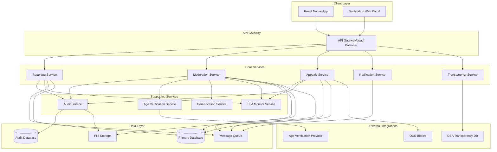

# Design Document

## Overview

The Community Moderation DSA Notice-and-Action system is a comprehensive content moderation platform designed to comply with the EU Digital Services Act while maintaining efficient, scalable operations for GrowBro's community features. The system implements a complete notice-and-action workflow from initial content reporting through appeals and transparency reporting.

The architecture follows a microservices pattern with event-driven communication, ensuring scalability, auditability, and compliance with strict SLA requirements. The system integrates seamlessly with GrowBro's existing React Native application while providing robust backend services for moderation workflows.

## DSA Compliance Mapping

This design implements specific DSA articles through dedicated system components:

| DSA Article   | Requirement             | System Component                   | Implementation                                                                                                        |
| ------------- | ----------------------- | ---------------------------------- | --------------------------------------------------------------------------------------------------------------------- |
| Art. 16       | Notice-and-Action       | Reporting Service                  | Mandatory report fields (explanation, contentLocator, reporterContact, goodFaithDeclaration), easy electronic channel |
| Art. 17       | Statement of Reasons    | Moderation Service                 | Automated SoR generation to users + Commission Transparency Database submission                                       |
| Art. 20       | Internal Complaints     | Appeals Service                    | Timely, non-discriminatory, free human review with reviewer rotation                                                  |
| Art. 21       | Out-of-Court Dispute    | Appeals Service                    | Integration with certified ODS bodies, 90-day target resolution                                                       |
| Art. 22       | Trusted Flaggers        | Moderation Service                 | Priority intake lane with distinct badges and quality analytics                                                       |
| Art. 23       | Measures Against Misuse | Audit Service + Moderation Service | Repeat offender detection, graduated enforcement, manifestly unfounded reporter tracking                              |
| Arts. 15 & 24 | Transparency Reporting  | Transparency Service               | Annual reports + real-time SoR submission to Commission DB                                                            |
| Art. 24(5)    | SoR Database Submission | Moderation Service                 | Redacted SoR export to Commission Transparency Database                                                               |
| Art. 28       | Protection of Minors    | Age Verification Service           | Privacy-preserving age verification + age-appropriate content controls                                                |

## Architecture

### High-Level System Architecture



### Service Architecture Patterns

**Event-Driven Architecture**: All services communicate through message queues to ensure loose coupling and reliable processing. Critical events (reports, decisions, appeals) are published to dedicated topics with guaranteed delivery.

**CQRS Pattern**: Separate read and write models for moderation data, with optimized read views for queue management and reporting while maintaining transactional consistency for decisions.

**Audit-First Design**: Every action generates immutable audit events before business logic execution, ensuring complete traceability even in failure scenarios.

## Components and Interfaces

### 1. Reporting Service

**Purpose**: Handles content reporting intake, validation, and initial processing.

**Key Components**:

- Report Intake API with DSA-compliant field validation
- Content Snapshot Manager for immutable evidence preservation
- Duplicate Detection Engine using content hashing
- Priority Classification Engine for trusted flaggers and illegal content

**Interfaces**:

```typescript
interface ReportingService {
  submitReport(report: ContentReport): Promise<ReportSubmissionResult>;
  getReportStatus(reportId: string): Promise<ReportStatus>;
  validateReportData(report: ContentReport): ValidationResult;
  captureContentSnapshot(contentId: string): Promise<ContentSnapshot>;
}

interface ContentReport {
  id: string;
  contentId: string;
  reportType: 'illegal' | 'policy_violation';
  legalReference?: string; // e.g., DE StGB §..., EU regulation...
  jurisdiction?: string; // required if illegal
  contentLocator: string; // permalink/ID at time of report
  explanation: string; // "sufficiently substantiated"
  reporterContact: ContactInfo; // may be pseudonymous per policy
  goodFaithDeclaration: boolean;
  evidenceUrls?: string[];
  contentHash: string; // cryptographic hash of content at report time
  // logging (minimised)
  createdAt: Date;
  updatedAt: Date;
  slaDeadline: Date;
}
```

### 2. Moderation Service

**Purpose**: Core moderation workflow management, decision-making, and action execution.

**Key Components**:

- Queue Management System with priority lanes and SLA tracking
- Decision Engine with policy catalog integration
- Action Executor for content and account actions
- Statement of Reasons Generator for DSA compliance

**Interfaces**:

```typescript
interface ModerationService {
  getModeratorQueue(
    moderatorId: string,
    filters: QueueFilters
  ): Promise<ModerationQueue>;
  claimReport(reportId: string, moderatorId: string): Promise<ClaimResult>;
  makeDecision(decision: ModerationDecision): Promise<DecisionResult>;
  generateStatementOfReasons(
    decision: ModerationDecision
  ): Promise<StatementOfReasons>;
  executeAction(action: ModerationAction): Promise<ActionResult>;
}

interface ModerationDecision {
  reportId: string;
  moderatorId: string;
  action:
    | 'no_action'
    | 'quarantine'
    | 'geo_block'
    | 'remove'
    | 'suspend_user'
    | 'rate_limit'
    | 'shadow_ban';
  policyViolations: string[];
  reasoning: string;
  evidence: string[];
  requiresSupervisorApproval: boolean;
}

interface StatementOfReasons {
  decisionId: string;
  decisionGround: 'illegal' | 'terms';
  legalReference?: string;
  contentType: 'post' | 'comment' | 'image' | 'profile' | string;
  factsAndCircumstances: string;
  automatedDetection: boolean;
  automatedDecision: boolean;
  territorialScope?: string[]; // e.g., ['DE','AT']
  redress: Array<'internal_appeal' | 'ods' | 'court'>;
  transparencyDbId?: string; // returned by EC DB
  createdAt: Date;
}
```

### 3. Appeals Service

**Purpose**: Manages the appeals process for moderated content and account actions.

**Key Components**:

- Appeal Intake System with eligibility validation
- Human Review Assignment with conflict-of-interest prevention
- Decision Reversal Engine for upheld appeals
- ODS Integration for external dispute resolution

**Interfaces**:

```typescript
interface AppealsService {
  submitAppeal(appeal: Appeal): Promise<AppealSubmissionResult>;
  getAppealStatus(appealId: string): Promise<AppealStatus>;
  assignReviewer(appealId: string): Promise<ReviewerAssignment>;
  processAppealDecision(decision: AppealDecision): Promise<AppealResult>;
  escalateToODS(appealId: string, odsBody: string): Promise<ODSEscalation>;
}

interface Appeal {
  originalDecisionId: string;
  userId: string;
  counterArguments: string;
  supportingEvidence: string[];
  appealType: 'content_removal' | 'account_action' | 'geo_restriction';
}
```

### 4. Audit Service

**Purpose**: Maintains comprehensive, immutable audit trails for all moderation activities.

**Key Components**:

- Immutable Event Logger with cryptographic signatures
- Audit Trail Query Engine for compliance reporting
- Data Retention Manager with GDPR compliance
- Access Control Logger for audit trail access

**Interfaces**:

```typescript
interface AuditService {
  logEvent(event: AuditEvent): Promise<void>;
  queryAuditTrail(query: AuditQuery): Promise<AuditTrail>;
  verifyIntegrity(eventId: string): Promise<IntegrityResult>;
  scheduleRetention(eventId: string, retentionPeriod: Duration): Promise<void>;
}

interface AuditEvent {
  eventType: string;
  actorId: string;
  targetId: string;
  timestamp: Date;
  metadata: Record<string, any>;
  signature: string;
}
```

### 5. Age Verification Service

**Purpose**: Handles privacy-preserving age verification and age-gating enforcement compatible with EU Age-Verification Blueprint and future EUDI wallet.

**Key Components**:

- Age Attribute Verifier using privacy-preserving over-18 attribute (no raw ID storage)
- Content Age-Gating Engine with safety-by-design principles
- One-time Verification Token Manager for reusable credentials
- Consent-based Fallback System (no device fingerprinting without ePrivacy consent)

**Interfaces**:

```typescript
interface AgeVerificationService {
  verifyAgeAttribute(
    userId: string,
    ageAttribute: AgeAttribute
  ): Promise<VerificationToken>;
  checkAgeGating(userId: string, contentId: string): Promise<AccessResult>;
  detectSuspiciousActivity(
    userId: string,
    signals: SuspiciousSignals,
    hasConsent: boolean
  ): Promise<void>;
  issueVerificationToken(userId: string): Promise<ReusableToken>;
}
```

### 6. Geo-Location Service

**Purpose**: Manages geographic content filtering and regional compliance with privacy-first location detection.

**Key Components**:

- IP Geolocation Engine (default, no consent required)
- GPS Location Service (explicit consent + clear user benefit only)
- Regional Content Filter with SoR-integrated geo-blocking
- Legal Compliance Manager with "why/where" user notifications

**Interfaces**:

```typescript
interface GeoLocationService {
  detectUserLocationIP(request: IPLocationRequest): Promise<LocationResult>;
  requestGPSLocation(
    userId: string,
    purpose: string,
    hasConsent: boolean
  ): Promise<LocationResult>;
  checkContentAvailability(
    contentId: string,
    location: Location
  ): Promise<AvailabilityResult>;
  applyGeoRestriction(
    contentId: string,
    restrictedRegions: string[],
    includeInSoR: boolean
  ): Promise<void>;
  notifyGeoRestriction(
    userId: string,
    contentId: string,
    regions: string[]
  ): Promise<void>;
}
```

## Data Models

### Core Entities

**Content Report**

```typescript
interface ContentReport {
  id: string;
  contentId: string;
  reporterId: string;
  reportType: 'illegal' | 'policy_violation';
  legalReference?: string; // e.g., DE StGB §..., EU regulation...
  jurisdiction?: string; // required if illegal
  contentLocator: string; // permalink/ID at time of report
  explanation: string; // "sufficiently substantiated"
  reporterContact: ContactInfo; // may be pseudonymous per policy
  goodFaithDeclaration: boolean;
  evidenceUrls?: string[];
  contentHash: string; // cryptographic hash of content at report time
  contentSnapshot: ContentSnapshot;
  status: ReportStatus;
  priority: number;
  trustedFlagger: boolean; // Art. 22 priority lane
  createdAt: Date;
  updatedAt: Date;
  slaDeadline: Date;
}
```

**Moderation Decision**

```typescript
interface ModerationDecision {
  id: string;
  reportId: string;
  moderatorId: string;
  supervisorId?: string;
  action: ModerationAction;
  policyViolations: PolicyViolation[];
  reasoning: string;
  evidence: Evidence[];
  statementOfReasons: StatementOfReasons;
  status: DecisionStatus;
  createdAt: Date;
  executedAt?: Date;
}
```

**Appeal**

```typescript
interface Appeal {
  id: string;
  originalDecisionId: string;
  userId: string;
  appealType: AppealType;
  counterArguments: string;
  supportingEvidence: Evidence[];
  reviewerId?: string;
  decision?: AppealDecision;
  status: AppealStatus;
  submittedAt: Date;
  deadline: Date;
  resolvedAt?: Date;
  odsEscalation?: ODSEscalation;
}
```

**Audit Event**

```typescript
interface AuditEvent {
  id: string;
  eventType: string;
  actorId: string;
  actorType: 'user' | 'moderator' | 'system';
  targetId: string;
  targetType: string;
  action: string;
  metadata: Record<string, any>;
  timestamp: Date;
  signature: string;
  retentionUntil: Date;
}
```

**Trusted Flagger**

```typescript
interface TrustedFlagger {
  id: string;
  organizationName: string;
  contactInfo: ContactInfo;
  specialization: string[]; // e.g., ['terrorism', 'csam', 'hate_speech']
  status: 'active' | 'suspended' | 'revoked';
  qualityMetrics: {
    accuracyRate: number;
    averageHandlingTime: number;
    totalReports: number;
    upheldDecisions: number;
  };
  certificationDate: Date;
  reviewDate: Date;
  createdAt: Date;
}
```

**Repeat Offender Tracking**

```typescript
interface RepeatOffenderRecord {
  id: string;
  userId: string;
  violationType: string;
  violationCount: number;
  escalationLevel: 'warning' | 'temporary_suspension' | 'permanent_ban';
  lastViolationDate: Date;
  suspensionHistory: SuspensionRecord[];
  manifestlyUnfoundedReports: number; // Art. 23 misuse tracking
  status: 'active' | 'suspended' | 'banned';
  createdAt: Date;
  updatedAt: Date;
}
```

**SoR Export Queue**

```typescript
interface SoRExportQueue {
  id: string;
  statementOfReasonsId: string;
  status: 'pending' | 'submitted' | 'failed' | 'dlq';
  attempts: number;
  lastAttempt?: Date;
  transparencyDbResponse?: string;
  errorMessage?: string;
  createdAt: Date;
}
```

### Database Schema Design

**Primary Database (PostgreSQL)**

- Optimized for transactional consistency and complex queries
- Partitioned by month for SoRs, audit events, and reports
- Indexed for common query patterns (user lookups, SLA monitoring, trusted flagger queries)
- Row-level security for data isolation
- Dedicated tables for trusted flaggers and repeat offender tracking (Art. 22/23)
- SoR export queue with DLQ for failed Commission DB submissions

**Audit Database (Separate PostgreSQL Instance)**

- Append-only WORM storage with object lock compatibility
- Cryptographic signatures with public hash chain for integrity proofs
- Automated backup and archival processes
- Restricted access with comprehensive logging
- PII scrubbing pipeline before SoR exports (Art. 24(5) compliance)

**File Storage (S3-Compatible)**

- Content snapshots with cryptographic hashing and immutability
- Evidence files with secure access controls
- Automated lifecycle management for retention compliance
- Encryption at rest and in transit
- Versioning for content snapshot integrity

## Error Handling

### Error Classification

**System Errors**

- Database connectivity issues
- External service failures (DSA DB, ODS bodies)
- Message queue failures
- File storage unavailability

**Business Logic Errors**

- Invalid report submissions
- Policy violation misclassifications
- SLA deadline breaches
- Appeal eligibility failures

**Compliance Errors**

- DSA submission failures
- Audit trail integrity violations
- Data retention policy breaches
- Privacy regulation violations

### Error Handling Strategies

**Circuit Breaker Pattern with SoR Exporter**

```typescript
class DSASubmissionCircuitBreaker {
  private failureCount = 0;
  private lastFailureTime?: Date;
  private state: 'closed' | 'open' | 'half-open' = 'closed';

  async submitToTransparencyDB(statement: StatementOfReasons): Promise<void> {
    // Add to export queue first (idempotent)
    await this.addToExportQueue(statement);

    if (this.state === 'open') {
      if (this.shouldAttemptReset()) {
        this.state = 'half-open';
      } else {
        // Queue for later retry, don't fail the moderation decision
        await this.markForRetry(statement.id);
        return;
      }
    }

    try {
      // PII scrubbing before submission (Art. 24(5))
      const redactedSoR = await this.scrubPII(statement);
      const response = await this.dsaClient.submit(redactedSoR);

      // Store Commission DB response ID
      await this.updateTransparencyDbId(statement.id, response.id);
      this.reset();
    } catch (error) {
      this.recordFailure();
      await this.moveToDeadLetterQueue(statement.id, error.message);
      throw error;
    }
  }

  private async scrubPII(statement: StatementOfReasons): Promise<RedactedSoR> {
    // Remove personal data per Art. 24(5) requirements
    return {
      ...statement,
      reporterContact: undefined,
      personalIdentifiers: undefined,
      // Keep only aggregated/anonymized data
    };
  }
}
```

**Retry with Exponential Backoff**

```typescript
class RetryableOperation {
  async executeWithRetry<T>(
    operation: () => Promise<T>,
    maxRetries: number = 3,
    baseDelay: number = 1000
  ): Promise<T> {
    for (let attempt = 0; attempt <= maxRetries; attempt++) {
      try {
        return await operation();
      } catch (error) {
        if (attempt === maxRetries || !this.isRetryable(error)) {
          throw error;
        }

        const delay = baseDelay * Math.pow(2, attempt);
        await this.sleep(delay);
      }
    }
  }
}
```

**Graceful Degradation**

- Queue operations continue even if transparency reporting fails
- Local audit logging maintains integrity during external service outages
- Manual fallback procedures for critical SLA-bound operations
- User notifications continue with reduced functionality during system issues

## Moderator Console

The Moderator Console is a dedicated web interface for content moderation teams, separate from the main React Native application.

### Key Features

**SoR Preview Pane**

- Real-time Statement of Reasons generation preview
- DSA compliance validation before submission
- Template selection for common violation types

**Policy Catalog Deep-Links**

- Direct links to specific policy sections from queue items
- Contextual policy guidance based on content type
- Version-controlled policy updates with change notifications

**Trusted Flagger Dashboard**

- Dedicated priority lane with distinct visual badges
- Quality analytics and performance metrics
- Periodic review workflows for trusted flagger status

**SLA Monitoring Dashboard**

- Real-time queue status with color-coded SLA indicators
- Escalation alerts at 75% and 90% SLA thresholds
- Performance metrics and compliance reporting

**Audit Trail Viewer**

- Comprehensive moderation history for each piece of content
- Immutable event logging with integrity verification
- Export capabilities for compliance reporting

## Testing Strategy

### Unit Testing

**Service Layer Testing**

```typescript
describe('ModerationService', () => {
  it('should generate DSA-compliant Statement of Reasons', async () => {
    const decision: ModerationDecision = {
      reportId: 'report-123',
      action: 'remove',
      policyViolations: ['illegal-content-terrorism'],
      reasoning: 'Content promotes terrorist activities',
    };

    const statement =
      await moderationService.generateStatementOfReasons(decision);

    expect(statement).toMatchObject({
      factsAndCircumstances: expect.any(String),
      legalGround: expect.any(String),
      automationUsed: expect.any(Boolean),
      redressOptions: expect.arrayContaining([
        'internal_appeal',
        'ods_escalation',
      ]),
    });
  });
});
```

**Data Model Validation**

```typescript
describe('ContentReport validation', () => {
  it('should require jurisdiction for illegal content reports', () => {
    const report: ContentReport = {
      reportType: 'illegal',
      explanation: 'Contains illegal content',
      // Missing jurisdiction
    };

    const validation = validateContentReport(report);
    expect(validation.isValid).toBe(false);
    expect(validation.errors).toContain(
      'jurisdiction_required_for_illegal_content'
    );
  });
});
```

### Integration Testing

**End-to-End Workflow Testing**

```typescript
describe('Notice and Action Workflow', () => {
  it('should complete full workflow from report to decision', async () => {
    // Submit report
    const report = await reportingService.submitReport(mockReport);
    expect(report.id).toBeDefined();

    // Process in moderation queue
    const queue = await moderationService.getModeratorQueue('mod-1', {});
    expect(queue.items).toContainEqual(
      expect.objectContaining({ reportId: report.id })
    );

    // Make decision
    const decision = await moderationService.makeDecision({
      reportId: report.id,
      action: 'remove',
      reasoning: 'Violates community guidelines',
    });

    // Verify audit trail
    const auditTrail = await auditService.queryAuditTrail({
      targetId: report.id,
      eventTypes: ['report_submitted', 'decision_made'],
    });
    expect(auditTrail.events).toHaveLength(2);
  });
});
```

**SLA Compliance Testing**

```typescript
describe('SLA Monitoring', () => {
  it('should alert when reports approach SLA deadlines', async () => {
    const report = await createMockReport({ priority: 'high' });

    // Fast-forward time to 75% of SLA deadline
    jest.advanceTimersByTime(18 * 60 * 60 * 1000); // 18 hours for 24-hour SLA

    const alerts = await slaMonitor.checkPendingReports();
    expect(alerts).toContainEqual(
      expect.objectContaining({
        reportId: report.id,
        alertType: 'sla_warning_75_percent',
      })
    );
  });
});
```

### Performance Testing

**Load Testing Scenarios**

- 10,000 concurrent report submissions
- 1,000 moderators accessing queues simultaneously
- Transparency report generation with 1M+ records
- Appeal processing under high load

**Stress Testing**

- Database connection pool exhaustion
- Message queue backlog handling
- File storage bandwidth limits
- External service timeout scenarios

### Security Testing

**Authentication & Authorization**

```typescript
describe('Security Controls', () => {
  it('should prevent unauthorized access to moderation queues', async () => {
    const unauthorizedUser = { id: 'user-123', role: 'regular_user' };

    await expect(
      moderationService.getModeratorQueue('mod-queue-1', {}, unauthorizedUser)
    ).rejects.toThrow('Insufficient permissions');
  });

  it('should validate audit trail integrity', async () => {
    const event = await auditService.logEvent(mockAuditEvent);

    // Attempt to tamper with event
    await database.query('UPDATE audit_events SET metadata = ? WHERE id = ?', [
      '{"tampered": true}',
      event.id,
    ]);

    const integrity = await auditService.verifyIntegrity(event.id);
    expect(integrity.isValid).toBe(false);
  });
});
```

**Data Privacy Testing**

- GDPR compliance validation
- Data minimization verification
- Consent management testing
- Cross-border data transfer validation

### Compliance Testing

**DSA Compliance Validation**

```typescript
describe('DSA Compliance', () => {
  it('should submit Statement of Reasons to Transparency Database', async () => {
    const decision = await moderationService.makeDecision(mockDecision);

    // Verify SoR was generated and submitted
    expect(mockDSAClient.submit).toHaveBeenCalledWith(
      expect.objectContaining({
        decision_ground: expect.any(String),
        content_type: expect.any(String),
        automated_detection: expect.any(Boolean),
      })
    );
  });

  it('should include all required Transparency DB fields and store response ID', async () => {
    const decision = await moderationService.makeDecision(mockDecision);
    const statement =
      await moderationService.generateStatementOfReasons(decision);

    // Verify all mandatory fields present
    expect(statement).toMatchObject({
      decisionGround: expect.stringMatching(/^(illegal|terms)$/),
      contentType: expect.any(String),
      factsAndCircumstances: expect.any(String),
      automatedDetection: expect.any(Boolean),
      automatedDecision: expect.any(Boolean),
      redress: expect.arrayContaining(['internal_appeal']),
    });

    // Verify Commission DB response ID is stored
    expect(statement.transparencyDbId).toBeDefined();
  });
});

describe('Misuse Controls (Art. 23)', () => {
  it('should detect repeat infringers and apply graduated enforcement', async () => {
    const userId = 'repeat-offender-123';

    // Simulate multiple violations
    for (let i = 0; i < 3; i++) {
      await moderationService.recordViolation(userId, 'hate_speech');
    }

    const offenderRecord =
      await moderationService.getRepeatOffenderRecord(userId);
    expect(offenderRecord.escalationLevel).toBe('temporary_suspension');
    expect(offenderRecord.suspensionHistory).toHaveLength(1);
  });

  it('should suspend users for manifestly unfounded reports', async () => {
    const reporterId = 'bad-reporter-456';

    // Simulate multiple false reports
    for (let i = 0; i < 5; i++) {
      const report = await reportingService.submitReport({
        ...mockReport,
        reporterId,
        explanation: 'False claim',
      });
      await moderationService.makeDecision({
        reportId: report.id,
        action: 'no_action',
        reasoning: 'Manifestly unfounded',
      });
    }

    const reporterStatus =
      await moderationService.getReporterStatus(reporterId);
    expect(reporterStatus.status).toBe('suspended');
    expect(reporterStatus.manifestlyUnfoundedCount).toBe(5);
  });
});

describe('Age Verification Token Security', () => {
  it('should not persist raw ID data after verification', async () => {
    const userId = 'user-789';
    const ageAttribute = { over18: true, verificationMethod: 'eudi_wallet' };

    const token = await ageVerificationService.verifyAgeAttribute(
      userId,
      ageAttribute
    );

    // Verify no raw ID data is stored
    const userRecord = await database.query(
      'SELECT * FROM users WHERE id = ?',
      [userId]
    );
    expect(userRecord.rawIdData).toBeUndefined();
    expect(userRecord.idDocument).toBeUndefined();

    // Verify reusable token is valid
    expect(token.isValid).toBe(true);
    expect(token.expiresAt).toBeInstanceOf(Date);
  });

  it('should prevent replay attacks on verification tokens', async () => {
    const token =
      await ageVerificationService.issueVerificationToken('user-789');

    // First use should succeed
    const firstUse = await ageVerificationService.validateToken(token.id);
    expect(firstUse.isValid).toBe(true);

    // Replay attempt should fail
    const replayAttempt = await ageVerificationService.validateToken(token.id);
    expect(replayAttempt.isValid).toBe(false);
    expect(replayAttempt.error).toBe('token_already_used');
  });
});
```

This comprehensive design provides a robust, scalable, and compliant foundation for implementing the DSA Notice-and-Action moderation system within GrowBro's React Native application architecture.
