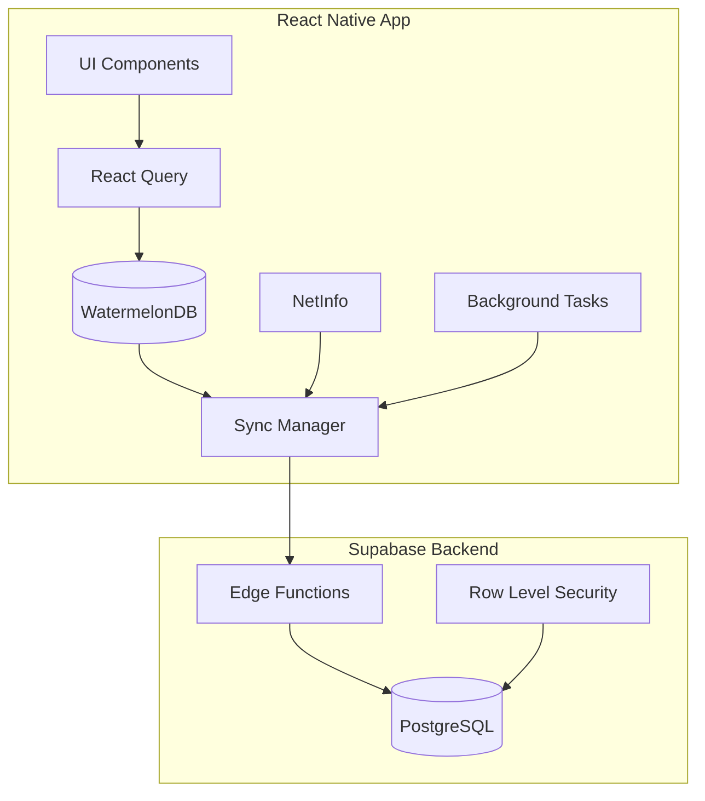

# Design Document

## Overview

The Offline-first & Sync system for GrowBro implements a robust, production-ready synchronization mechanism using WatermelonDB's proven sync protocol with Supabase as the backend. The design prioritizes real-world performance, data consistency, and user experience while handling the complexities of intermittent connectivity common in cannabis growing environments.

The system follows an offline-first architecture where all user interactions work immediately against local data, with background synchronization ensuring eventual consistency across devices. This approach provides instant responsiveness while maintaining data integrity through conflict resolution and robust error handling.

## Architecture

### High-Level Architecture



### Data Flow

1. **Write Operations**: UI → React Query → WatermelonDB (tracked internally)
2. **Read Operations**: UI → React Query → WatermelonDB (instant response)
3. **Sync Operations**: Background → Sync Manager → Edge Functions → PostgreSQL
4. **Conflict Resolution**: On push, if the server detects any record changed since lastPulledAt, it rejects the whole push transaction. The client then pulls and retries push. Resolution policy is LWW via server updated_at; the client may flag records as needs_review for UX.

### Core Components

- **WatermelonDB**: Local SQLite database with reactive queries and internal change tracking
- **Sync Manager**: Orchestrates push/pull operations following WatermelonDB protocol
- **Edge Functions**: Server-side sync endpoints with RLS enforcement and transactional push
- **Image Upload Queue**: Separate queue for image uploads (not part of DB sync)
- **expo-task-manager + expo-background-fetch**: Define background tasks with
  `expo-task-manager` and schedule opportunistic periodic fetches with
  `expo-background-fetch` (SDK 53-compatible workflow); keep a manual
  fallback for immediate syncs.

## Components and Interfaces

### 1. Sync Manager (`src/lib/sync/sync-manager.ts`)

Central orchestrator for all synchronization operations.

```typescript
interface SyncManager {
  // Core sync operations (WatermelonDB protocol)
  synchronize(): Promise<SyncResult>;
  pullChanges(params: {
    lastPulledAt: number | null;
    schemaVersion: number;
    migration?: any;
  }): Promise<{ changes: any; timestamp: number }>;
  pushChanges(params: {
    changes: any;
    lastPulledAt: number | null;
  }): Promise<void>;

  // State management
  getSyncStatus(): SyncStatus;
  hasUnsyncedChanges(): boolean; // From WatermelonDB
  getLastSyncTime(): Date | null;

  // Configuration
  configure(
    options: SyncOptions & { migrationsEnabledAtVersion?: number }
  ): void;

  // Event handling
  onSyncStart(callback: () => void): void;
  onSyncComplete(callback: (result: SyncResult) => void): void;
  onSyncError(callback: (error: SyncError) => void): void;
}

interface SyncOptions {
  pullEndpoint: string;
  pushEndpoint: string;
  batchSize: number;
  retryAttempts: number;
  backoffMultiplier: number;
  maxBackoffDelay: number;
  enableBackgroundSync: boolean;
  syncOnAppStart: boolean;
  syncOnForeground: boolean;
}
```

### 2. Network Manager (`src/lib/sync/network-manager.ts`)

Handles connectivity detection and network-aware operations. Use @react-native-community/netinfo for isConnected/isInternetReachable/type and throttle large payloads on metered networks.

```typescript
interface NetworkManager {
  // Connectivity state
  isOnline(): boolean;
  isInternetReachable(): boolean;
  isMetered(): boolean;
  getConnectionType(): ConnectionType;

  // Event listeners
  onConnectivityChange(callback: (state: NetworkState) => void): void;

  // Network-aware operations
  shouldSync(): boolean;
  canSyncLargeFiles(): boolean;
}

interface NetworkState {
  isConnected: boolean;
  isInternetReachable: boolean;
  isMetered: boolean;
  type: 'wifi' | 'cellular' | 'ethernet' | 'unknown';
  // Note: signal strength not stable across platforms
}
```

### 3. Storage Manager (`src/lib/sync/storage-manager.ts`)

Manages local storage optimization and cleanup.

```typescript
interface StorageManager {
  // Storage operations
  getStorageUsage(): Promise<StorageInfo>;
  cleanupCache(): Promise<void>;
  pruneOldData(olderThan: Date): Promise<void>;

  // Image management - Originals → documentDirectory; thumbnails/derived → cacheDirectory with LRU cap (e.g., 400 MB); periodic orphan sweep and content-addressable filenames
  storeImage(uri: string, metadata: ImageMetadata): Promise<string>;
  getImagePath(id: string, size: 'original' | 'thumbnail'): string;
  cleanupOrphanedImages(): Promise<void>;
}

interface StorageInfo {
  totalSize: number;
  cacheSize: number;
  documentSize: number;
  availableSpace: number;
  isNearCapacity: boolean;
}
```

### 4. Conflict Resolver (`src/lib/sync/conflict-resolver.ts`)

Handles data conflicts using server-side resolution with client review flagging. Per protocol, the server enforces LWW or rejects on mid-air changes. The client should re-pull and, where helpful, mark records as needs_review for UX—not attempt field-level merges by default.

```typescript
interface ConflictResolver {
  // Server-side resolution with client review flagging
  markForReview(conflicts: Conflict[]): Promise<void>;
  getResolutionStrategy(tableName: string): ResolutionStrategy;
  logConflict(conflict: Conflict): void;
}

interface Conflict {
  tableName: string;
  recordId: string;
  localRecord: any;
  remoteRecord: any;
  conflictFields: string[];
  timestamp: Date;
}

type ResolutionStrategy = 'server-lww' | 'needs-review' | 'field-level';
```

### 5. Background Sync Service (`src/lib/sync/background-sync.ts`)

Implement background sync using the SDK-53 supported pattern: define the
task handler with `expo-task-manager` (TaskManager.defineTask) and schedule
periodic fetches with `expo-background-fetch` (BackgroundFetch.registerTaskAsync).
Background execution is opportunistic (OS-scheduled); provide a manual
"Sync now" button for immediate syncs and UI to configure Wi‑Fi/charging
constraints.

Example implementation notes:

- Define the background handler with TaskManager:

```ts
import * as TaskManager from 'expo-task-manager';

TaskManager.defineTask('BACKGROUND_SYNC', async ({ data, error }) => {
  // run the same sync routine used by manual sync button
  try {
    await performSync();
  } catch (e) {
    // log and surface errors to Sync monitoring
  }
});
```

- Register/schedule periodic fetches with BackgroundFetch:

```ts
import * as BackgroundFetch from 'expo-background-fetch';

await BackgroundFetch.registerTaskAsync('BACKGROUND_SYNC', {
  minimumInterval: 15 * 60, // seconds (15 minutes) — OS may coalesce
  stopOnTerminate: false, // resume after app is terminated
  startOnBoot: true, // start after device reboot
});
```

- Keep the in-app "Sync now" button which invokes `performSync()` and
  enforce Wi‑Fi/charging constraints by checking connectivity/battery state
  before performing work in the task handler.

Notes:

- `minimumInterval` is a hint; OS may defer or coalesce actual runs.
- iOS background fetch is limited by the system; rely on manual syncs for
  immediate consistency when needed.
- Test background behavior on physical devices and with SDK 53 tooling.

```typescript
interface BackgroundSyncService {
  // Registration
  registerBackgroundTask(): Promise<void>;
  unregisterBackgroundTask(): Promise<void>;

  // Execution
  executeBackgroundSync(): Promise<void>;

  // Configuration
  setConstraints(constraints: SyncConstraints): void;
}

interface SyncConstraints {
  requiresWifi: boolean;
  requiresCharging: boolean;
  minimumBatteryLevel: number;
  maxExecutionTime: number;
}
```

## Server Contract

### Push/Pull Protocol

**Pull endpoint:** To avoid missing rows when updates share the same timestamp boundary, the server MUST read and bind a stable `server_timestamp` at the start of the pull transaction and use that bound value for the query window. Filter rows (and deleted entries) using a closed upper bound:

- Include rows where `(updated_at > lastPulledAt) AND (updated_at <= server_timestamp)`.
- Include deleted entries where `(deleted_at > lastPulledAt) AND (deleted_at <= server_timestamp)`.

Return the `server_timestamp` in the response and the client MUST use that value as the next `lastPulledAt` for subsequent pulls. Additionally, the server should expose a stable tie-breaker ordering (for example `(updated_at, id)`) when paginating results so ordering is deterministic across requests and clients. This combination prevents dropped rows at timestamp boundaries and ensures deterministic pagination.

**Push endpoint:** Applies created → updated → deleted in a single transaction; on any mid-air change, abort and return an error; include Idempotency-Key support.

**Security:** Edge Functions derive the auth context from the request's Authorization header when constructing the Supabase client so that RLS policies apply to every query.

## Data Models

### Sync Metadata Schema

All synced tables include these fields:

```sql
-- Common sync fields for all tables
created_at TIMESTAMPTZ NOT NULL DEFAULT now(),
updated_at TIMESTAMPTZ NOT NULL DEFAULT now(),
deleted_at TIMESTAMPTZ NULL
-- IMPORTANT (server contract): Timestamps MUST be authoritative on the server.
-- The server MUST enforce the following guarantees for all synced tables:
-- 1) updated_at MUST be set to NOW() on every UPDATE via a database trigger or
--    an equivalent server-side mechanism. Do NOT rely on client-provided
--    updated_at values; the server's timestamp is the canonical last-write time.
--    Example (Postgres / PLpgSQL):
--      CREATE OR REPLACE FUNCTION set_updated_at()
--      RETURNS trigger AS $$
--      BEGIN
--        NEW.updated_at = now();
--        RETURN NEW;
--      END;
--      $$ LANGUAGE plpgsql;
--      CREATE TRIGGER set_updated_at_trigger
--      BEFORE UPDATE ON your_table
--      FOR EACH ROW
--      EXECUTE FUNCTION set_updated_at();
-- 2) DELETE operations for synced rows MUST be implemented as soft-deletes.
--    The server (or edge-function layer) MUST translate client delete intents
--    into an UPDATE that sets `deleted_at = NOW()` and preserve the row.
--    The server MUST NOT perform hard deletes for rows that participate in
--    sync (i.e., never execute SQL DELETE on synced rows).
-- 3) The server MUST ignore client-supplied client-only fields such as
--    `_status` and `_changed` on push requests. These fields are local-only
--    WatermelonDB metadata and must not influence server-side timestamps or
--    deletion semantics. The server SHOULD also ignore client-supplied
--    `created_at`/`updated_at` values and always maintain its own authoritative
--    timestamps.
```

### Sync Log Schema

```sql
CREATE TABLE sync_logs (
  id UUID PRIMARY KEY DEFAULT gen_random_uuid(),
  user_id UUID NOT NULL REFERENCES auth.users(id),
  sync_type TEXT NOT NULL, -- 'pull' | 'push' | 'full'
  status TEXT NOT NULL, -- 'started' | 'completed' | 'failed'
  started_at TIMESTAMPTZ NOT NULL DEFAULT now(),
  completed_at TIMESTAMPTZ,
  records_pulled INTEGER DEFAULT 0,
  records_pushed INTEGER DEFAULT 0,
  error_message TEXT,
  metadata JSONB
);
```

### Image Upload Queue Schema (Local Only)

Note: If using WatermelonDB sync, you usually don't need a separate outbox table for DB rows—Watermelon tracks changes internally. Keep an outbox only for non-sync artifacts (e.g., image uploads, community post attachments).

```sql
CREATE TABLE image_upload_queue (
  id TEXT PRIMARY KEY,
  local_uri TEXT NOT NULL,
  remote_path TEXT,
  metadata JSONB,
  created_at INTEGER NOT NULL,
  retry_count INTEGER DEFAULT 0,
  last_error TEXT,
  status TEXT NOT NULL DEFAULT 'pending' -- 'pending' | 'uploading' | 'completed' | 'failed'
);
```

## Error Handling

### Error Classification

```typescript
enum SyncErrorType {
  NETWORK_ERROR = 'network_error',
  SERVER_ERROR = 'server_error',
  CONFLICT_ERROR = 'conflict_error',
  VALIDATION_ERROR = 'validation_error',
  STORAGE_ERROR = 'storage_error',
  AUTH_ERROR = 'auth_error',
}

interface SyncError {
  type: SyncErrorType;
  message: string;
  code: string;
  retryable: boolean;
  context: Record<string, any>;
  timestamp: Date;
}
```

### Retry Strategy

```typescript
interface RetryConfig {
  maxAttempts: number;
  baseDelay: number;
  maxDelay: number;
  backoffMultiplier: number;
  retryableErrors: SyncErrorType[];
}

// Default configuration
const DEFAULT_RETRY_CONFIG: RetryConfig = {
  maxAttempts: 5,
  baseDelay: 1000, // 1 second
  maxDelay: 900000, // 15 minutes
  backoffMultiplier: 2,
  retryableErrors: [SyncErrorType.NETWORK_ERROR, SyncErrorType.SERVER_ERROR],
};
```

### Error Recovery

1. **Network Errors**: Exponential backoff with jitter
2. **Server Errors**: Retry with backoff, escalate to manual sync
3. **Conflict Errors**: Automatic resolution with logging
4. **Validation Errors**: Log and skip, notify developers
5. **Storage Errors**: Cleanup and retry, alert user if persistent
6. **Auth Errors**: Refresh tokens, re-authenticate if needed

## Testing Strategy

### Unit Testing

- **Sync Manager**: Mock network calls, test retry logic
- **Conflict Resolver**: Test resolution strategies with various scenarios
- **Storage Manager**: Test cleanup algorithms and capacity management
- **Network Manager**: Mock connectivity states and transitions

### Integration Testing

- **End-to-End Sync**: Test complete sync cycles with real data
- **Offline Scenarios**: Test app behavior in airplane mode
- **Conflict Resolution**: Create conflicts and verify resolution
- **Background Sync**: Test background task execution

### Performance Testing

- **Large Dataset Sync**: Test with 10k+ records
- **Memory Usage**: Monitor memory during sync operations
- **Battery Impact**: Measure background sync battery consumption
- **Network Efficiency**: Test with limited bandwidth

### Test Data Setup

```typescript
// Test utilities for creating sync scenarios
interface SyncTestUtils {
  createConflictScenario(tableName: string, recordId: string): Promise<void>;
  simulateNetworkFailure(duration: number): Promise<void>;
  createLargeDataset(recordCount: number): Promise<void>;
  measureSyncPerformance(): Promise<PerformanceMetrics>;
}
```

### Automated Testing

- **CI/CD Integration**: Run sync tests on every PR
- **Device Testing**: Test on various Android/iOS devices
- **Network Conditions**: Test with different network speeds
- **Background Testing**: Verify background sync behavior

### Manual Testing Scenarios

1. **Offline Creation**: Create records offline, verify sync when online
2. **Multi-Device Conflicts**: Modify same record on different devices
3. **Intermittent Connectivity**: Test with unstable network
4. **Storage Limits**: Test behavior when storage is full
5. **Background Sync**: Test sync during app backgrounding
6. **Large File Sync**: Test image sync with various sizes

## Implementation Phases

### Phase 1: Core Sync Infrastructure

- WatermelonDB setup with sync schema
- Basic pull/push implementation
- Network connectivity detection
- Error handling and retry logic

### Phase 2: Conflict Resolution & Storage

- Server-side conflict resolution with client review flagging
- Storage management and cleanup
- Image upload queue & URI backfill (separate from DB sync)
- Performance optimization

### Phase 3: Background Sync & Monitoring

- Background task implementation
- Sync monitoring and logging
- Performance metrics collection
- User interface indicators

### Phase 4: Advanced Features & Polish

- Incremental sync optimization
- Advanced conflict resolution
- Comprehensive testing
- Documentation and debugging tools

## Technical Requirements & Constraints

### WatermelonDB & Expo Integration

- **Development build required:** WatermelonDB uses JSI only; won't work in Expo Go and disables the old remote debugger
- **Config plugin needed:** Use supported WatermelonDB config plugin for Expo SDK 52/53+
- **Schema versioning:** Every client schema change must bump schema.version and use migrations (not destructive resets)
- **Migration handling:** Tie schema changes to migrationsEnabledAtVersion during sync

### Stable Client IDs

- **UUID generation:** Clients generate UUIDs and server accepts them verbatim on upsert
- **No ID remapping:** Avoids brittle ID replacement and matches common WatermelonDB patterns
- **Idempotent operations:** If same ID arrives twice, treat as idempotent upsert

### Background Sync Constraints

- **Platform limitations:** Background execution is opportunistic (OS-scheduled) with iOS/Android constraints
- **Manual fallback:** Always provide "Sync now" button since background timing isn't guaranteed
- **Constraint configuration:** Wi-Fi/charging requirements configurable via app settings
- **API guidance:** Use `expo-task-manager` to define and register the task
  handler and `expo-background-fetch` to schedule periodic fetches. `expo-`
  background-fetch is not deprecated. When calling
  `BackgroundFetch.registerTaskAsync` configure options such as
  `minimumInterval`, `stopOnTerminate`, and `startOnBoot` to match app
  requirements.

### Storage Policies

- **File system separation:** Originals in documentDirectory (durable), thumbnails in cacheDirectory (LRU-prunable)
- **Content addressing:** Use content-addressable filenames for deduplication
- **Orphan cleanup:** Periodic sweep for unreferenced files
- **Capacity management:** LRU eviction with configurable size caps (e.g., 400 MB for cache)
