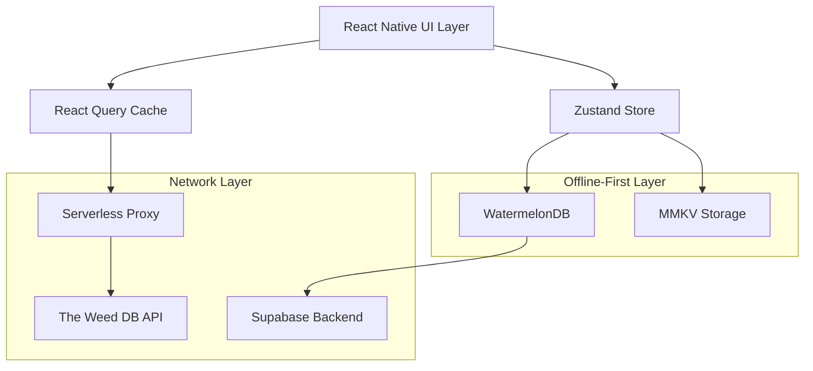

# Design Document

## Overview

The Strains Browser feature provides a comprehensive, offline-first solution for discovering and managing cannabis strain information within the GrowBro app. The design leverages React Native's performance-optimized components, implements a robust caching strategy, and ensures compliance with app store policies while maintaining educational focus.

The architecture follows the established patterns in the GrowBro app, utilizing FlashList for performance, WatermelonDB for offline-first data persistence, React Query for server state management, and Zustand for client state. The feature integrates with "The Weed DB" API through a secure serverless proxy to provide comprehensive strain data while protecting API credentials.

## Architecture

### High-Level Architecture



### Data Flow Architecture

1. **UI Layer**: FlashList-based components render strain data with infinite scrolling
2. **State Management**: React Query manages server state, Zustand handles client state
3. **Offline Storage**: WatermelonDB stores favorites and cached pages, MMKV stores ephemeral UI state
4. **Network Layer**: Serverless proxy normalizes and caches API responses
5. **Sync Layer**: Background sync between WatermelonDB and Supabase for authenticated users

### Performance Architecture

- **FlashList**: Optimized list rendering with view recycling and estimated item sizes
- **Image Caching**: Disk-based caching with LRU eviction and Cache-Control header respect
- **Query Caching**: React Query with 5-minute staleTime for lists, 24-hour for details
- **Offline Browsing**: Cached pages in WatermelonDB enable offline scroll-back functionality

## Components and Interfaces

### Core Components

#### StrainsList Component

```typescript
interface StrainsListProps {
  searchQuery?: string;
  filters?: StrainFilters;
  onStrainPress: (strain: Strain) => void;
}

const StrainsList: React.FC<StrainsListProps> = ({
  searchQuery,
  filters,
  onStrainPress
}) => {
  const {
    data,
    fetchNextPage,
    hasNextPage,
    isFetchingNextPage,
    isLoading,
    error
  } = useStrainsInfinite({ searchQuery, filters });

  const flatData = useMemo(() =>
    data?.pages.flatMap(page => page.data) || [], [data]
  );

  const renderItem = useCallback(({ item }: { item: Strain }) => (
    <StrainCard
      strain={item}
      onPress={() => onStrainPress(item)}
      testID={`strain-card-${item.id}`}
    />
  ), [onStrainPress]);

  return (
    <FlashList
      testID="strains-list"
      data={flatData}
      renderItem={renderItem}
      keyExtractor={(item) => item.id}
      estimatedItemSize={120}
      getItemType={(item) => item.type || 'strain'} // For heterogeneous items
      onEndReached={() => {
        if (hasNextPage && !isFetchingNextPage) {
          fetchNextPage();
        }
      }}
      onEndReachedThreshold={0.7}
      refreshing={isLoading}
      onRefresh={() => refetch()}
      ListEmptyComponent={<EmptyState />}
      ListFooterComponent={isFetchingNextPage ? <LoadingFooter /> : null}
      // Performance optimizations
      removeClippedSubviews={true}
      maxToRenderPerBatch={10}
      windowSize={10}
    />
  );
};
```

#### StrainCard Component

```typescript
interface StrainCardProps {
  strain: Strain;
  onPress: () => void;
  testID?: string;
}

const StrainCard: React.FC<StrainCardProps> = memo(({ strain, onPress, testID }) => {
  const { isFavorite, toggleFavorite } = useFavorites();

  return (
    <Pressable
      onPress={onPress}
      testID={testID}
      accessibilityRole="button"
      accessibilityLabel={`${strain.name}, ${strain.race}, THC ${strain.thc_display}`}
      accessibilityHint="Double-tap to open strain details"
    >
      <View className="flex-row p-4 bg-white rounded-lg shadow-sm mb-2">
        <Image
          source={{ uri: strain.imageUrl }}
          style={{ width: 64, height: 64, borderRadius: 12 }}
          placeholder={STRAIN_PLACEHOLDER_BLURHASH}
          cachePolicy="memory-disk"
          recyclingKey={strain.id}
          onError={() => console.warn(`Failed to load image for strain ${strain.id}`)}
        />
        <View className="flex-1 ml-3">
          <Text className="text-lg font-semibold">{strain.name}</Text>
          <View className="flex-row items-center mt-1">
            <RaceBadge race={strain.race} />
            <THCBadge thc={strain.thc_display} />
            <DifficultyBadge difficulty={strain.grow.difficulty} />
          </View>
        </View>
        <FavoriteButton
          isFavorite={isFavorite(strain.id)}
          onToggle={() => toggleFavorite(strain)}
          accessibilityLabel={
            isFavorite(strain.id) ? 'Remove from favorites' : 'Add to favorites'
          }
        />
      </View>
    </Pressable>
  );
});
```

#### StrainDetail Component

```typescript
interface StrainDetailProps {
  strainId: string;
}

const StrainDetail: React.FC<StrainDetailProps> = ({ strainId }) => {
  const { data: strain, isLoading, error } = useStrain(strainId);
  const { isFavorite, toggleFavorite } = useFavorites();

  if (isLoading) return <StrainDetailSkeleton />;
  if (error || !strain) return <ErrorState error={error} />;

  return (
    <ScrollView className="flex-1 bg-gray-50">
      {/* At-a-glance banner */}
      <StrainBanner strain={strain} />

      {/* Quick facts */}
      <QuickFacts strain={strain} />

      {/* Terpene section */}
      {strain.terpenes && (
        <TerpeneSection terpenes={strain.terpenes} />
      )}

      {/* Expandable descriptions */}
      <ExpandableSection title="Description">
        {strain.description.map((paragraph, index) => (
          <Text key={index} className="mb-2">{paragraph}</Text>
        ))}
      </ExpandableSection>

      {/* Growing information */}
      <GrowingInfo grow={strain.grow} />

      {/* CTA for playbook integration */}
      <PlaybookCTA strain={strain} />
    </ScrollView>
  );
};
```

### API Layer Interfaces

#### React Query Hooks

```typescript
// useStrainsInfinite.ts
interface UseStrainsInfiniteParams {
  searchQuery?: string;
  filters?: StrainFilters;
  pageSize?: number;
}

export const useStrainsInfinite = ({
  searchQuery,
  filters,
  pageSize = 20,
}: UseStrainsInfiniteParams) => {
  return useInfiniteQuery({
    queryKey: ['strains', { searchQuery, filters, pageSize }],
    queryFn: ({ pageParam = 0, signal }) =>
      strainsApi.getStrains({
        page: pageParam,
        pageSize,
        search: searchQuery,
        ...filters,
        signal,
      }),
    initialPageParam: 0,
    getNextPageParam: (lastPage, allPages) => {
      return lastPage.hasMore ? allPages.length : undefined;
    },
    placeholderData: keepPreviousData,
    staleTime: 5 * 60_000, // 5 minutes
    gcTime: 30 * 60_000, // 30 minutes
    retry: (failureCount, error) => {
      if (error.status === 429) return false; // Don't retry rate limits
      return failureCount < 3;
    },
    retryDelay: (attemptIndex) =>
      Math.min(1000 * 2 ** attemptIndex + Math.random() * 1000, 30000),
    maxPages: 10, // Limit memory usage
    select: (data) => ({
      ...data,
      pages: data.pages.map((page) => ({
        ...page,
        data: page.data.map(normalizeStrain),
      })),
    }),
  });
};

// useStrain.ts
export const useStrain = (strainId: string) => {
  return useQuery({
    queryKey: ['strain', strainId],
    queryFn: () => strainsApi.getStrain(strainId),
    staleTime: 24 * 60 * 60 * 1000, // 24 hours
    gcTime: 7 * 24 * 60 * 60 * 1000, // 7 days
    retry: 1,
  });
};
```

#### API Client Interface

```typescript
// client.ts
class StrainsApiClient {
  private baseURL: string;
  private headers: Record<string, string>;

  constructor() {
    this.baseURL = __DEV__
      ? 'https://rapidapi.com/api/the-weed-db'
      : 'https://your-proxy.supabase.co/functions/v1/strains-proxy';

    this.headers = {
      'Content-Type': 'application/json',
      ...(__DEV__ && {
        'X-RapidAPI-Key': Env.RAPIDAPI_KEY,
        'X-RapidAPI-Host': 'the-weed-db.p.rapidapi.com',
      }),
    };
  }

  async getStrains(params: GetStrainsParams): Promise<StrainsResponse> {
    const url = new URL(this.baseURL);

    // Map filters to appropriate endpoints with proper URL encoding
    if (params.search) {
      url.pathname = `/strains/search/name/${encodeURIComponent(params.search)}`;
    } else if (params.effect) {
      url.pathname = `/strains/search/effect/${encodeURIComponent(params.effect)}`;
    } else if (params.flavor) {
      url.pathname = `/strains/search/flavor/${encodeURIComponent(params.flavor)}`;
    } else if (params.race) {
      url.pathname = `/strains/search/race/${encodeURIComponent(params.race)}`;
    } else {
      url.pathname = '/strains';
    }

    // Add pagination as query params (handled by proxy)
    url.searchParams.set('page', String(params.page));
    url.searchParams.set('pageSize', String(params.pageSize));

    const response = await fetch(url.toString(), {
      headers: this.headers,
      signal: params.signal,
    });

    if (!response.ok) {
      const errorText = await response.text();
      throw new ApiError(
        response.status,
        errorText,
        response.headers.get('x-error-code') || undefined
      );
    }

    const data = await response.json();
    return {
      data: data.strains || data, // Proxy normalizes to { strains, hasMore, nextCursor }
      hasMore: data.hasMore ?? data.length === params.pageSize,
      nextCursor: data.nextCursor ?? params.page + 1,
    };
  }
}
```

### State Management Interfaces

#### Favorites Store (Zustand)

```typescript
// useFavorites.ts
interface FavoriteStrain {
  id: string;
  addedAt: number;
  snapshot: {
    id: string;
    name: string;
    imageUrl: string;
    race: string;
    thc_display: string;
  };
}

type FavoritesIndex = Record<string, FavoriteStrain>;

interface FavoritesState {
  favorites: FavoritesIndex;
  addFavorite: (strain: Strain) => Promise<void>;
  removeFavorite: (strainId: string) => Promise<void>;
  isFavorite: (strainId: string) => boolean;
  getFavorites: () => FavoriteStrain[];
  syncToCloud: () => Promise<void>;
}

export const useFavorites = create<FavoritesState>()(
  persist(
    (set, get) => ({
      favorites: {},

      addFavorite: async (strain: Strain) => {
        const favorite: FavoriteStrain = {
          id: strain.id,
          addedAt: Date.now(),
          snapshot: {
            id: strain.id,
            name: strain.name,
            imageUrl: strain.imageUrl,
            race: strain.race,
            thc_display: strain.thc_display,
          },
        };

        // Add to local state
        set((state) => ({
          favorites: { ...state.favorites, [strain.id]: favorite },
        }));

        // Persist to WatermelonDB
        await favoritesRepository.create(favorite);

        // Analytics
        analytics.track('favorite_add', { strain_id: strain.id });
      },

      // ... other methods
    }),
    {
      name: 'favorites-storage',
      storage: createJSONStorage(() => mmkvStorage),
    }
  )
);
```

## Data Models

### Core Data Types

```typescript
// types.ts
interface Strain {
  id: string;
  name: string;
  slug: string;
  synonyms: string[];
  link: string;
  imageUrl: string;
  description: string[];
  genetics: {
    parents: string[];
    lineage: string;
  };
  race: 'indica' | 'sativa' | 'hybrid';
  thc: {
    min?: number;
    max?: number;
    label?: string;
  };
  cbd: {
    min?: number;
    max?: number;
    label?: string;
  };
  effects: Effect[];
  flavors: Flavor[];
  terpenes?: Terpene[];
  grow: GrowCharacteristics;
  source: {
    provider: string;
    updated_at: string;
    attribution_url: string;
  };

  // Computed fields for display
  thc_display: string;
  cbd_display: string;
}

interface GrowCharacteristics {
  difficulty: 'beginner' | 'intermediate' | 'advanced';
  indoor_suitable: boolean;
  outdoor_suitable: boolean;
  flowering_time: {
    min_weeks?: number;
    max_weeks?: number;
    label?: string;
  };
  yield: {
    indoor?: {
      grams_per_sqm?: number;
      label?: string;
    };
    outdoor?: {
      grams_per_plant?: number;
      label?: string;
    };
  };
  height: {
    indoor_cm?: number;
    outdoor_cm?: number;
    label?: string;
  };
}

interface Effect {
  name: string;
  intensity?: 'low' | 'medium' | 'high';
}

interface Flavor {
  name: string;
  category?: string;
}

interface Terpene {
  name: string;
  percentage?: number;
  aroma_description?: string;
}
```

### WatermelonDB Schema

```typescript
// schema.ts
export const strainsSchema = appSchema({
  version: 1,
  tables: [
    tableSchema({
      name: 'favorites',
      columns: [
        { name: 'strain_id', type: 'string', isIndexed: true },
        { name: 'added_at', type: 'number' },
        { name: 'snapshot', type: 'string' }, // JSON
        { name: 'synced_at', type: 'number', isOptional: true },
        { name: 'created_at', type: 'number' },
        { name: 'updated_at', type: 'number' },
      ],
    }),
    tableSchema({
      name: 'cached_strains',
      columns: [
        { name: 'strain_id', type: 'string', isIndexed: true },
        { name: 'data', type: 'string' }, // JSON
        { name: 'page_number', type: 'number', isIndexed: true },
        { name: 'query_hash', type: 'string', isIndexed: true },
        { name: 'cached_at', type: 'number' },
        { name: 'expires_at', type: 'number' },
      ],
    }),
  ],
});

// models/Favorite.ts
export class Favorite extends Model {
  static table = 'favorites';

  @field('strain_id') strainId!: string;
  @field('added_at') addedAt!: number;
  @field('snapshot') snapshot!: string;
  @field('synced_at') syncedAt?: number;

  get parsedSnapshot(): FavoriteStrain['snapshot'] {
    return JSON.parse(this.snapshot);
  }
}
```

### Data Normalization

```typescript
// utils/strains.ts
export const normalizeStrain = (apiStrain: any): Strain => {
  return {
    id: apiStrain.id || generateId(),
    name: apiStrain.name || 'Unknown Strain',
    slug: apiStrain.slug || slugify(apiStrain.name),
    synonyms: apiStrain.synonyms || [],
    link: apiStrain.link || '',
    imageUrl: apiStrain.image || DEFAULT_STRAIN_IMAGE,
    description: Array.isArray(apiStrain.description)
      ? apiStrain.description
      : [apiStrain.description || 'No description available'],
    genetics: {
      parents: apiStrain.parents || [],
      lineage: apiStrain.lineage || '',
    },
    race: normalizeRace(apiStrain.race),
    thc: parsePercentageRange(apiStrain.thc),
    cbd: parsePercentageRange(apiStrain.cbd),
    effects: normalizeEffects(apiStrain.effects),
    flavors: normalizeFlavors(apiStrain.flavors),
    terpenes: normalizeTerpenes(apiStrain.terpenes),
    grow: normalizeGrowCharacteristics(apiStrain.grow),
    source: {
      provider: 'The Weed DB',
      updated_at: new Date().toISOString(),
      attribution_url: apiStrain.link || '',
    },
    thc_display: formatPercentageDisplay(parsePercentageRange(apiStrain.thc)),
    cbd_display: formatPercentageDisplay(parsePercentageRange(apiStrain.cbd)),
  };
};

export const parsePercentageRange = (
  value: any
): { min?: number; max?: number; label?: string } => {
  if (typeof value === 'string') {
    // Handle "17%" or "15-20%" or "High"
    const numericMatch = value.match(/(\d+(?:\.\d+)?)-?(\d+(?:\.\d+)?)?%?/);
    if (numericMatch) {
      const min = parseFloat(numericMatch[1]);
      const max = numericMatch[2] ? parseFloat(numericMatch[2]) : min;
      return { min, max };
    }
    // Qualitative values
    return { label: value };
  }

  if (typeof value === 'number') {
    return { min: value, max: value };
  }

  return {};
};

export const formatPercentageDisplay = (range: {
  min?: number;
  max?: number;
  label?: string;
}): string => {
  if (range.label) return range.label;
  if (range.min !== undefined && range.max !== undefined) {
    return range.min === range.max
      ? `${range.min}%`
      : `${range.min}-${range.max}%`;
  }
  if (range.min !== undefined) return `${range.min}%+`;
  return 'Not reported';
};
```

## Error Handling

### Error Types and Recovery

```typescript
// errors.ts
export class ApiError extends Error {
  constructor(
    public status: number,
    public message: string,
    public code?: string
  ) {
    super(message);
    this.name = 'ApiError';
  }
}

export class NetworkError extends Error {
  constructor(message: string) {
    super(message);
    this.name = 'NetworkError';
  }
}

// Error boundary component
export const StrainsErrorBoundary: React.FC<{ children: React.ReactNode }> = ({ children }) => {
  return (
    <ErrorBoundary
      FallbackComponent={({ error, resetErrorBoundary }) => (
        <ErrorState
          error={error}
          onRetry={resetErrorBoundary}
          title="Something went wrong with strains"
        />
      )}
      onError={(error, errorInfo) => {
        analytics.track('error_boundary_triggered', {
          error: error.message,
          component: 'StrainsErrorBoundary',
        });
      }}
    >
      {children}
    </ErrorBoundary>
  );
};
```

### Graceful Degradation Strategy

1. **API Unavailable**: Show cached data from WatermelonDB with offline indicator
2. **Rate Limited (429)**: Display countdown timer and queue requests
3. **Network Errors**: Retry with exponential backoff, fallback to cache
4. **Parsing Errors**: Log error, show placeholder data with "Not reported" labels
5. **Image Load Failures**: Show placeholder with retry option

## Testing Strategy

### Unit Testing

```typescript
// __tests__/strains-utils.test.ts
describe('Strain Normalization', () => {
  test('parsePercentageRange handles numeric strings', () => {
    expect(parsePercentageRange('17%')).toEqual({ min: 17, max: 17 });
    expect(parsePercentageRange('15-20%')).toEqual({ min: 15, max: 20 });
  });

  test('parsePercentageRange handles qualitative values', () => {
    expect(parsePercentageRange('High')).toEqual({ label: 'High' });
  });

  test('normalizeStrain handles missing fields gracefully', () => {
    const result = normalizeStrain({});
    expect(result.name).toBe('Unknown Strain');
    expect(result.description).toEqual(['No description available']);
  });
});

// __tests__/useStrainsInfinite.test.tsx
describe('useStrainsInfinite', () => {
  test('fetches strains with correct query key', async () => {
    const { result } = renderHook(() =>
      useStrainsInfinite({ searchQuery: 'og kush' })
    );

    await waitFor(() => {
      expect(result.current.isSuccess).toBe(true);
    });

    expect(mockFetch).toHaveBeenCalledWith(
      expect.stringContaining('/strains/name/og kush')
    );
  });
});
```

### Component Testing

```typescript
// __tests__/StrainCard.test.tsx
describe('StrainCard', () => {
  const mockStrain: Strain = {
    id: '1',
    name: 'OG Kush',
    race: 'hybrid',
    thc_display: '18-24%',
    // ... other required fields
  };

  test('renders strain information correctly', () => {
    render(<StrainCard strain={mockStrain} onPress={jest.fn()} />);

    expect(screen.getByText('OG Kush')).toBeOnTheScreen();
    expect(screen.getByText('18-24%')).toBeOnTheScreen();
  });

  test('calls onPress when tapped', () => {
    const onPress = jest.fn();
    render(<StrainCard strain={mockStrain} onPress={onPress} />);

    fireEvent.press(screen.getByTestId('strain-card-1'));
    expect(onPress).toHaveBeenCalled();
  });

  test('announces accessibility information', () => {
    render(<StrainCard strain={mockStrain} onPress={jest.fn()} />);

    expect(screen.getByLabelText(/OG Kush, hybrid, THC 18-24%/)).toBeOnTheScreen();
  });
});
```

### E2E Testing

```typescript
// e2e/strains.e2e.ts
describe('Strains Feature', () => {
  beforeEach(async () => {
    await device.reloadReactNative();
    await element(by.text('Strains')).tap();
  });

  test('should browse strains with infinite scroll', async () => {
    await expect(element(by.testID('strains-list'))).toBeVisible();

    // Scroll to trigger pagination
    await element(by.testID('strains-list')).scroll(1000, 'down');

    // Verify more items loaded
    await expect(element(by.testID('strain-card-20'))).toBeVisible();
  });

  test('should search for strains', async () => {
    await element(by.testID('search-input')).typeText('og kush');
    await element(by.testID('search-input')).tapReturnKey();

    await waitFor(element(by.text('OG Kush')))
      .toBeVisible()
      .withTimeout(5000);
  });

  test('should favorite and unfavorite strains', async () => {
    await element(by.testID('strain-card-1')).tap();
    await element(by.testID('favorite-button')).tap();

    await device.pressBack();
    await element(by.text('Favorites')).tap();

    await expect(element(by.testID('strain-card-1'))).toBeVisible();
  });

  test('should work offline', async () => {
    // Go online first to cache data
    await element(by.testID('strains-list')).scroll(500, 'down');

    // Go offline
    await device.setNetworkConnection('none');

    // Should still show cached strains
    await expect(element(by.testID('strain-card-1'))).toBeVisible();

    // Should show offline indicator
    await expect(element(by.text('Offline'))).toBeVisible();
  });
});
```

### Performance Testing

```typescript
// performance/flashlist-performance.test.ts
describe('FlashList Performance', () => {
  test('maintains 55+ FPS with 1000 items', async () => {
    const items = generateMockStrains(1000);

    const { getByTestId } = render(
      <StrainsList data={items} onStrainPress={jest.fn()} />
    );

    const flashList = getByTestId('strains-list');

    // Simulate continuous scrolling
    const frameDrops = await measureScrollPerformance(flashList, {
      duration: 10000, // 10 seconds
      scrollDistance: 5000,
    });

    expect(frameDrops.filter(drop => drop > 32).length).toBeLessThan(1);
    expect(frameDrops.reduce((a, b) => a + b) / frameDrops.length).toBeGreaterThan(55);
  });
});
```

## Design Updates and Improvements

### React Query v5 Optimizations

- **Replaced `keepPreviousData`** with `placeholderData: keepPreviousData` for v5 compatibility
- **Added AbortSignal support** for request cancellation on component unmount or new queries
- **Implemented exponential backoff** with jitter for retry logic, avoiding naive single retries
- **Added `select` option** to normalize data early in the query pipeline
- **Enhanced error handling** for rate limits (429) with no retry policy

### API Client Robustness

- **Proper URL encoding** using `encodeURIComponent` for all path parameters
- **URL construction** with `URL` and `URLSearchParams` for safer query building
- **AbortSignal integration** for request cancellation
- **Enhanced error handling** with error codes from response headers
- **Normalized response format** expecting proxy to return `{ strains, hasMore, nextCursor }`

### Image Handling with Expo Image

- **Replaced FastImage** with `expo-image` for better Expo integration and web support
- **Added BlurHash placeholders** for smooth loading transitions
- **Implemented `cachePolicy: "memory-disk"`** for optimal caching
- **Added `recyclingKey`** for proper FlashList integration
- **Enhanced error handling** with `onError` callback

### FlashList Performance Enhancements

- **Added `keyExtractor`** for stable item identification
- **Implemented `getItemType`** for heterogeneous item support
- **Added performance props** like `removeClippedSubviews`, `maxToRenderPerBatch`, `windowSize`
- **Enhanced accessibility** with proper `testID` for E2E testing

### State Management Improvements

- **Fixed Zustand persistence** by replacing `Map` with plain object for JSON serialization
- **Improved favorites indexing** using `Record<string, FavoriteStrain>` type
- **Enhanced WatermelonDB integration** with proper batch operations

### Accessibility Enhancements

- **Added `accessibilityRole="button"`** for interactive elements
- **Implemented `accessibilityHint`** for action descriptions
- **Enhanced favorite button** with `accessibilityRole="switch"` and `accessibilityState`
- **Improved screen reader support** with descriptive labels

This comprehensive design document provides the technical foundation for implementing the Strains Browser feature with proper architecture, performance optimization, error handling, and testing strategies aligned with the project's technology stack and requirements.
