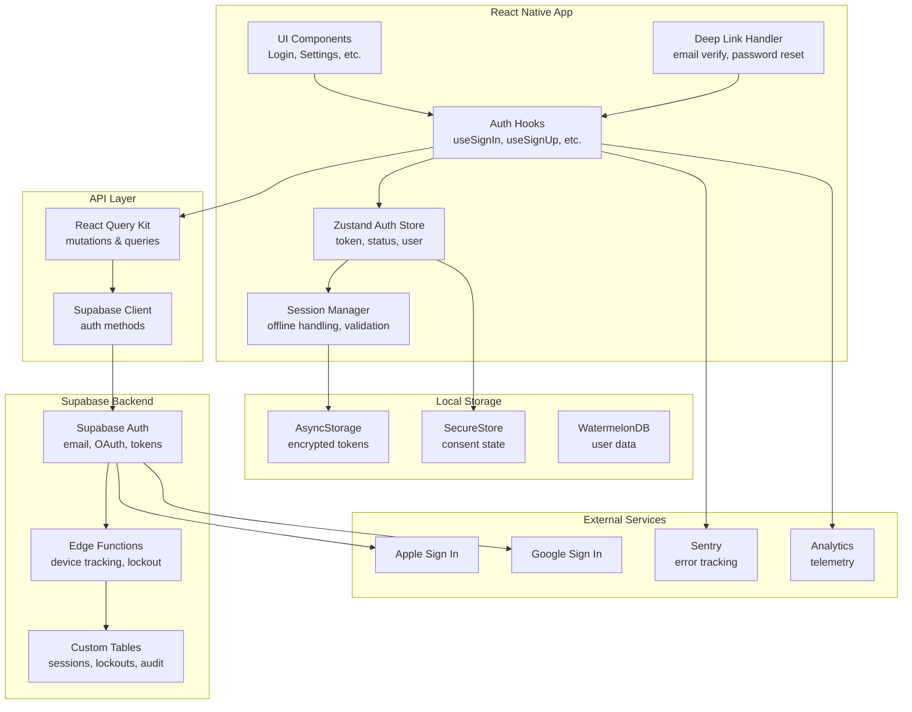

# Design Document

## Overview

This design document outlines the architecture for a comprehensive Authentication & Account Lifecycle system for GrowBro. The system extends the existing Zustand-based auth state management and Supabase client to provide full authentication capabilities including email/password, OAuth (Apple/Google), password reset, email verification, session management, device tracking, brute-force protection, and consent-aware telemetry.

### Design Principles

1. **Privacy-First**: All authentication events respect user consent preferences; no telemetry without explicit opt-in
2. **Offline-First**: Sessions persist locally and work offline for up to 30 days with graceful degradation
3. **Security-Focused**: Brute-force protection, secure token storage, PII sanitization, and session revocation
4. **User-Friendly**: Clear error messages, seamless OAuth flows, and deep link handling for email verification/password reset
5. **Compliance-Ready**: GDPR-compliant data handling, audit logging, and right-to-deletion support

### Key Design Decisions

- **Supabase Auth as Foundation**: Leverage Supabase's built-in auth capabilities (email/password, OAuth, token refresh) rather than building custom JWT handling
- **Zustand for Client State**: Continue using existing Zustand store for auth state management with enhanced session tracking
- **AsyncStorage for Persistence**: Store encrypted session tokens in AsyncStorage for offline access and auto-login
- **Custom Tables for Extensions**: Use Supabase tables for device tracking (`user_sessions`), lockout management (`auth_lockouts`), and audit logs (`auth_audit_log`)
- **Edge Functions for Business Logic**: Implement device metadata capture, lockout enforcement, and email notifications via Supabase Edge Functions
- **React Query Kit for API Layer**: Follow existing pattern with `createMutation` for auth operations (sign in, sign up, password reset)

## Architecture

### High-Level Architecture Diagram



### Component Architecture

The authentication system is organized into the following layers:

1. **UI Layer** (`src/app/`, `src/components/`)
   - Login screen (`src/app/login.tsx`)
   - Sign up screen (`src/app/sign-up.tsx`)
   - Password reset screens (`src/app/reset-password.tsx`, `src/app/reset-password-confirm.tsx`)
   - Email verification screen (`src/app/verify-email.tsx`)
   - Settings screens (`src/app/(app)/settings/security.tsx`, `src/app/(app)/settings/sessions.tsx`)
   - Auth forms (`src/components/auth/login-form.tsx`, `src/components/auth/sign-up-form.tsx`)

2. **API Layer** (`src/api/auth/`)
   - React Query Kit hooks for auth operations
   - Type definitions for auth requests/responses
   - Error handling and retry logic

3. **State Management** (`src/lib/auth/`)
   - Zustand store for auth state
   - Session manager for offline handling
   - Token utilities for secure storage
   - User utilities for auth checks

4. **Backend Layer** (`supabase/`)
   - Edge Functions for device tracking, lockout enforcement, email notifications
   - Database migrations for custom tables
   - RLS policies for security

## Components and Interfaces

### 1. Zustand Auth Store

**Location**: `src/lib/auth/index.tsx` (extend existing)

**State Shape**:

```typescript
interface AuthState {
  // Existing fields
  token: TokenType | null;
  status: 'idle' | 'signOut' | 'signIn';

  // New fields
  user: User | null;
  session: Session | null;
  lastValidatedAt: number | null;
  offlineMode: 'full' | 'readonly' | 'blocked';

  // Actions
  signIn: (session: Session, user: User) => void;
  signOut: () => void;
  hydrate: () => void;
  updateSession: (session: Session) => void;
  setOfflineMode: (mode: 'full' | 'readonly' | 'blocked') => void;
}

interface Session {
  access_token: string;
  refresh_token: string;
  expires_at: number;
  user_id: string;
}

interface User {
  id: string;
  email: string;
  email_verified: boolean;
  created_at: string;
  last_sign_in_at: string;
  app_metadata: Record<string, any>;
  user_metadata: Record<string, any>;
}
```

**Responsibilities**:

- Manage authentication state across the app
- Persist session to AsyncStorage
- Hydrate state on app start
- Emit events for analytics/telemetry (if consented)

### 2. Session Manager

**Location**: `src/lib/auth/session-manager.ts` (new)

**Interface**:

```typescript
interface SessionManager {
  // Validate session age and determine offline mode
  validateSession(): Promise<OfflineMode>;

  // Refresh tokens if needed
  refreshSession(): Promise<Session | null>;

  // Check if session is expired
  isSessionExpired(): boolean;

  // Get time until session expires
  getTimeUntilExpiry(): number;

  // Force session validation with server
  forceValidation(): Promise<boolean>;
}

type OfflineMode = 'full' | 'readonly' | 'blocked';
```

**Responsibilities**:

- Determine offline mode based on session age (0-7 days: full, 7-30: readonly, 30+: blocked)
- Automatically refresh tokens before expiry
- Handle offline session validation
- Coordinate with Supabase Auth for token refresh

### 3. Auth API Hooks

**Location**: `src/api/auth/` (new directory)

**Hooks**:

```typescript
// Sign in with email/password
export const useSignIn = createMutation<
  SignInResponse,
  SignInVariables,
  AxiosError
>({
  mutationFn: async ({ email, password }) => {
    const { data, error } = await supabase.auth.signInWithPassword({
      email,
      password,
    });
    if (error) throw error;
    return { session: data.session, user: data.user };
  },
  onSuccess: (data) => {
    useAuth.getState().signIn(data.session, data.user);
    trackAuthEvent('sign_in', { method: 'email' });
  },
});

// Sign up with email/password
export const useSignUp = createMutation<
  SignUpResponse,
  SignUpVariables,
  AxiosError
>({
  mutationFn: async ({ email, password }) => {
    const { data, error } = await supabase.auth.signUp({
      email,
      password,
    });
    if (error) throw error;
    return { session: data.session, user: data.user };
  },
});

// Sign in with OAuth (Apple/Google)
// Initiates OAuth flow; actual session is established after redirect
export const useSignInWithOAuth = createMutation<
  OAuthResponse,
  OAuthVariables,
  AxiosError
>({
  mutationFn: async ({ provider }) => {
    const { data, error } = await supabase.auth.signInWithOAuth({
      provider,
      options: {
        redirectTo: 'growbro://auth/callback',
      },
    });
    if (error) throw error;
    return data;
  },
});

// Exchange OAuth code for session (called after redirect)
export const useExchangeOAuthCode = createMutation<
  Session,
  { code: string },
  AxiosError
>({
  mutationFn: async ({ code }) => {
    const { data, error } = await supabase.auth.exchangeCodeForSession(code);
    if (error) throw error;
    return data.session;
  },
  onSuccess: (session) => {
    useAuth.getState().signIn(session, session.user);
    trackAuthEvent('sign_in', { method: 'oauth' });
  },
});

// Native OAuth with ID token (better UX, fallback to web flow)
export const useSignInWithIdToken = createMutation<
  Session,
  { provider: 'apple' | 'google'; idToken: string; nonce?: string },
  AxiosError
>({
  mutationFn: async ({ provider, idToken, nonce }) => {
    const { data, error } = await supabase.auth.signInWithIdToken({
      provider,
      token: idToken,
      nonce,
    });
    if (error) throw error;
    return data.session;
  },
  onSuccess: (session) => {
    useAuth.getState().signIn(session, session.user);
    trackAuthEvent('sign_in', { method: `${provider}_native` });
  },
});

// Password reset request
export const useResetPassword = createMutation<
  void,
  ResetPasswordVariables,
  AxiosError
>({
  mutationFn: async ({ email }) => {
    const { error } = await supabase.auth.resetPasswordForEmail(email, {
      redirectTo: 'growbro://reset-password',
    });
    if (error) throw error;
  },
});

// Password reset confirmation
// First verify the OTP to get temporary session, then update password
export const useConfirmPasswordReset = createMutation<
  void,
  ConfirmPasswordResetVariables,
  AxiosError
>({
  mutationFn: async ({ tokenHash, newPassword }) => {
    // Verify OTP to establish temporary session
    const { error: verifyError } = await supabase.auth.verifyOtp({
      type: 'recovery',
      token_hash: tokenHash,
    });
    if (verifyError) throw verifyError;

    // Update password while temporary session is active
    const { error: updateError } = await supabase.auth.updateUser({
      password: newPassword,
    });
    if (updateError) throw updateError;
  },
});

// Email verification
export const useVerifyEmail = createMutation<
  void,
  { tokenHash: string; type: 'signup' | 'email_change' },
  AxiosError
>({
  mutationFn: async ({ tokenHash, type }) => {
    const { error } = await supabase.auth.verifyOtp({
      type,
      token_hash: tokenHash,
    });
    if (error) throw error;
  },
  onSuccess: () => {
    const user = useAuth.getState().user;
    if (user) {
      useAuth.getState().updateUser({ ...user, email_verified: true });
    }
    trackAuthEvent('email_verified');
  },
});

// Resend verification email
export const useResendVerificationEmail = createMutation<
  void,
  ResendVerificationVariables,
  AxiosError
>({
  mutationFn: async ({ email }) => {
    const { error } = await supabase.auth.resend({
      type: 'signup',
      email,
    });
    if (error) throw error;
  },
});

// Sign out (local scope - current device only)
export const useSignOut = createMutation<void, void, AxiosError>({
  mutationFn: async () => {
    const { error } = await supabase.auth.signOut({ scope: 'local' });
    if (error) throw error;
  },
  onSuccess: () => {
    useAuth.getState().signOut();
    trackAuthEvent('sign_out');
  },
});

// Sign out globally (revoke all sessions across all devices)
export const useSignOutGlobal = createMutation<void, void, AxiosError>({
  mutationFn: async () => {
    const { error } = await supabase.auth.signOut({ scope: 'global' });
    if (error) throw error;
  },
  onSuccess: () => {
    useAuth.getState().signOut();
    trackAuthEvent('sign_out_global');
  },
});
```

### 4. Device & Session Tracking

**Location**: `src/api/auth/use-sessions.ts` (new)

**Hooks**:

```typescript
// Fetch active sessions
export const useSessions = createQuery<Session[], void>({
  queryKey: ['auth', 'sessions'],
  fetcher: async () => {
    const { data, error } = await supabase
      .from('user_sessions')
      .select('*')
      .order('last_active_at', { ascending: false });
    if (error) throw error;
    return data;
  },
});

// Revoke a specific session (via Edge Function using Admin API)
export const useRevokeSession = createMutation<
  void,
  RevokeSessionVariables,
  AxiosError
>({
  mutationFn: async ({ sessionKey }) => {
    const { error } = await supabase.functions.invoke('revoke-session', {
      body: { session_key: sessionKey },
    });
    if (error) throw error;
  },
  onSuccess: () => {
    queryClient.invalidateQueries(['auth', 'sessions']);
  },
});

// Revoke all other sessions (via Edge Function using Admin API)
export const useRevokeAllOtherSessions = createMutation<void, void, AxiosError>(
  {
    mutationFn: async () => {
      const currentSessionKey = deriveSessionKey(
        useAuth.getState().session?.refresh_token
      );
      const { error } = await supabase.functions.invoke(
        'revoke-all-sessions-except',
        {
          body: { current_session_key: currentSessionKey },
        }
      );
      if (error) throw error;
    },
  }
);

// Helper to derive stable session key from refresh token
function deriveSessionKey(refreshToken: string | undefined): string {
  if (!refreshToken) return '';
  // Use SHA-256 hash of refresh token as stable session identifier
  return crypto.createHash('sha256').update(refreshToken).digest('hex');
}
```

**Database Schema** (`supabase/migrations/`):

```sql
-- user_sessions table
-- session_key is SHA-256 hash of refresh token (stable identifier)
CREATE TABLE user_sessions (
  id UUID PRIMARY KEY DEFAULT gen_random_uuid(),
  user_id UUID NOT NULL REFERENCES auth.users(id) ON DELETE CASCADE,
  session_key TEXT NOT NULL UNIQUE,
  device_name TEXT,
  device_os TEXT,
  app_version TEXT,
  truncated_ip TEXT, -- /24 subnet for privacy
  user_agent TEXT,
  created_at TIMESTAMPTZ NOT NULL DEFAULT NOW(),
  last_active_at TIMESTAMPTZ NOT NULL DEFAULT NOW(),
  revoked_at TIMESTAMPTZ
);

CREATE INDEX idx_user_sessions_user_id ON user_sessions(user_id);
CREATE INDEX idx_user_sessions_session_key ON user_sessions(session_key);

-- RLS policies
ALTER TABLE user_sessions ENABLE ROW LEVEL SECURITY;

CREATE POLICY "Users can view their own sessions"
  ON user_sessions FOR SELECT
  USING (auth.uid() = user_id);

CREATE POLICY "Users can revoke their own sessions"
  ON user_sessions FOR UPDATE
  USING (auth.uid() = user_id);
```

### 5. Brute-Force Protection

**Location**: `src/lib/auth/lockout-manager.ts` (new)

**Interface**:

```typescript
interface LockoutManager {
  // Check if account is locked
  isLocked(email: string): Promise<boolean>;

  // Get remaining lockout time
  getLockoutTimeRemaining(email: string): Promise<number>;

  // Record failed login attempt
  recordFailedAttempt(email: string): Promise<void>;

  // Reset lockout counter on successful login
  resetLockout(email: string): Promise<void>;
}
```

**Database Schema**:

```sql
-- auth_lockouts table
CREATE TABLE auth_lockouts (
  id UUID PRIMARY KEY DEFAULT gen_random_uuid(),
  email TEXT NOT NULL,
  failed_attempts INT NOT NULL DEFAULT 0,
  locked_until TIMESTAMPTZ,
  created_at TIMESTAMPTZ NOT NULL DEFAULT NOW(),
  updated_at TIMESTAMPTZ NOT NULL DEFAULT NOW()
);

CREATE UNIQUE INDEX idx_auth_lockouts_email ON auth_lockouts(email);

-- RPC function to check and increment lockout
CREATE OR REPLACE FUNCTION check_and_increment_lockout(p_email TEXT)
RETURNS JSONB AS $$
DECLARE
  v_lockout RECORD;
  v_is_locked BOOLEAN := FALSE;
  v_locked_until TIMESTAMPTZ;
BEGIN
  -- Get or create lockout record
  INSERT INTO auth_lockouts (email, failed_attempts)
  VALUES (p_email, 0)
  ON CONFLICT (email) DO NOTHING;

  SELECT * INTO v_lockout FROM auth_lockouts WHERE email = p_email;

  -- Check if currently locked
  IF v_lockout.locked_until IS NOT NULL AND v_lockout.locked_until > NOW() THEN
    v_is_locked := TRUE;
    v_locked_until := v_lockout.locked_until;
  ELSE
    -- Increment failed attempts
    UPDATE auth_lockouts
    SET failed_attempts = failed_attempts + 1,
        updated_at = NOW()
    WHERE email = p_email;

    -- Lock if threshold reached
    IF v_lockout.failed_attempts + 1 >= 5 THEN
      v_locked_until := NOW() + INTERVAL '15 minutes';
      UPDATE auth_lockouts
      SET locked_until = v_locked_until
      WHERE email = p_email;
      v_is_locked := TRUE;
    END IF;
  END IF;

  RETURN jsonb_build_object(
    'is_locked', v_is_locked,
    'locked_until', v_locked_until,
    'failed_attempts', v_lockout.failed_attempts + 1
  );
END;
$$ LANGUAGE plpgsql SECURITY DEFINER;

-- RPC function to reset lockout
CREATE OR REPLACE FUNCTION reset_lockout_counter(p_email TEXT)
RETURNS VOID AS $$
BEGIN
  UPDATE auth_lockouts
  SET failed_attempts = 0,
      locked_until = NULL,
      updated_at = NOW()
  WHERE email = p_email;
END;
$$ LANGUAGE plpgsql SECURITY DEFINER;
```

### 6. Deep Link Handler

**Location**: `src/lib/auth/deep-link-handler.ts` (new)

**Interface**:

```typescript
interface DeepLinkHandler {
  // Handle email verification deep link
  handleEmailVerification(token: string, type: string): Promise<void>;

  // Handle password reset deep link
  handlePasswordReset(token: string): Promise<void>;

  // Handle OAuth callback
  handleOAuthCallback(params: URLSearchParams): Promise<void>;

  // Validate redirect parameter
  validateRedirect(redirect: string): boolean;
}
```

**Allowlist Configuration** (`src/lib/navigation/deep-link-allowlist.ts`):

```typescript
export const ALLOWED_REDIRECT_PATHS = [
  '/settings/*',
  '/plants/*',
  '/feed/*',
  '/calendar/*',
  '/notifications/*',
  '/(app)/*',
];

export const ALLOWED_AUTH_HOSTS = ['auth', 'verify-email', 'reset-password'];

export function isAllowedRedirect(path: string): boolean {
  return ALLOWED_REDIRECT_PATHS.some((pattern) => minimatch(path, pattern));
}
```

**Deep Link Handling Flow**:


## Data Models

### 1. Auth State (Zustand)

```typescript
interface AuthState {
  token: TokenType | null;
  status: 'idle' | 'signOut' | 'signIn';
  user: User | null;
  session: Session | null;
  lastValidatedAt: number | null;
  offlineMode: 'full' | 'readonly' | 'blocked';
}
```

### 2. User Session (Supabase)

```typescript
interface UserSession {
  id: string;
  user_id: string;
  session_id: string;
  device_name: string | null;
  device_os: string | null;
  app_version: string | null;
  ip_address: string | null;
  user_agent: string | null;
  created_at: string;
  last_active_at: string;
  revoked_at: string | null;
}
```

### 3. Auth Lockout (Supabase)

```typescript
interface AuthLockout {
  id: string;
  email: string;
  failed_attempts: number;
  locked_until: string | null;
  created_at: string;
  updated_at: string;
}
```

### 4. Auth Audit Log (Supabase)

```typescript
interface AuthAuditLog {
  id: string;
  user_id: string | null;
  event_type:
    | 'sign_in'
    | 'sign_up'
    | 'sign_out'
    | 'password_reset'
    | 'email_verified'
    | 'lockout'
    | 'session_revoked';
  ip_address: string | null;
  user_agent: string | null;
  metadata: Record<string, any>;
  created_at: string;
}
```

**Database Schema**:

```sql
CREATE TABLE auth_audit_log (
  id UUID PRIMARY KEY DEFAULT gen_random_uuid(),
  user_id UUID REFERENCES auth.users(id) ON DELETE SET NULL,
  event_type TEXT NOT NULL,
  ip_address INET,
  user_agent TEXT,
  metadata JSONB,
  created_at TIMESTAMPTZ NOT NULL DEFAULT NOW()
);

CREATE INDEX idx_auth_audit_log_user_id ON auth_audit_log(user_id);
CREATE INDEX idx_auth_audit_log_event_type ON auth_audit_log(event_type);
CREATE INDEX idx_auth_audit_log_created_at ON auth_audit_log(created_at DESC);

-- RLS policies (admin-only access)
ALTER TABLE auth_audit_log ENABLE ROW LEVEL SECURITY;

CREATE POLICY "Only admins can view audit logs"
  ON auth_audit_log FOR SELECT
  USING (auth.jwt() ->> 'role' = 'admin');
```

## Error Handling

### Error Mapping Strategy

Map Supabase Auth errors to localized i18n keys using status/message patterns with safe fallback:

```typescript
export function mapAuthError(error: any): string {
  const message = error?.message?.toLowerCase() || '';
  const status = error?.status;

  // Map by known patterns (Supabase error codes are not always stable)
  if (
    message.includes('invalid login credentials') ||
    message.includes('invalid email or password')
  ) {
    return 'auth.error_invalid_credentials';
  }
  if (
    message.includes('email not confirmed') ||
    message.includes('email_not_confirmed')
  ) {
    return 'auth.error_email_not_verified';
  }
  if (
    message.includes('user already registered') ||
    message.includes('user_already_exists')
  ) {
    return 'auth.error_email_exists';
  }
  if (
    message.includes('password') &&
    (message.includes('weak') || message.includes('short'))
  ) {
    return 'auth.error_password_weak';
  }
  if (message.includes('invalid') && message.includes('token')) {
    return 'auth.error_invalid_token';
  }
  if (message.includes('rate limit') || status === 429) {
    if (message.includes('email')) {
      return 'auth.error_rate_limit_email';
    }
    return 'auth.error_rate_limit';
  }
  if (status >= 500) {
    return 'auth.error_server';
  }
  if (!navigator.onLine || message.includes('network')) {
    return 'auth.error_network';
  }

  // Never reveal account existence - use generic error
  return 'auth.error_generic';
}
```

### Error Categories

1. **Validation Errors** (client-side)
   - Invalid email format
   - Password too short/weak
   - Missing required fields
   - Handled by Zod schema validation

2. **Authentication Errors** (server-side)
   - Invalid credentials
   - Email not verified
   - Account locked
   - Session expired

3. **Network Errors**
   - Connection timeout
   - No internet connection
   - Server unavailable

4. **Rate Limit Errors**
   - Too many login attempts
   - Too many email sends
   - Supabase rate limit exceeded

### Error Handling Flow


### Sentry Integration

**PII Sanitization** (`src/lib/auth/sentry-sanitizer.ts`):

```typescript
export function sanitizeAuthError(error: any): any {
  const sanitized = { ...error };

  // Redact email
  if (sanitized.email) {
    sanitized.email = hashEmail(sanitized.email);
  }

  // Redact password
  if (sanitized.password) {
    sanitized.password = '[REDACTED]';
  }

  // Truncate IP to /24 subnet
  if (sanitized.ip_address) {
    sanitized.ip_address = truncateIP(sanitized.ip_address);
  }

  // Replace device ID with session ID
  if (sanitized.device_id) {
    delete sanitized.device_id;
    sanitized.session_id = sanitized.session_id || '[ANONYMOUS]';
  }

  return sanitized;
}
```

## Testing Strategy

### Unit Tests

1. **Auth Store Tests** (`src/lib/auth/index.test.tsx`)
   - Test state transitions (idle → signIn → signOut)
   - Test token persistence to AsyncStorage
   - Test hydration on app start
   - Test offline mode transitions

2. **Session Manager Tests** (`src/lib/auth/session-manager.test.ts`)
   - Test session age calculation
   - Test offline mode determination (0-7, 7-30, 30+ days)
   - Test token refresh logic
   - Test session expiry detection

3. **Lockout Manager Tests** (`src/lib/auth/lockout-manager.test.ts`)
   - Test failed attempt counting
   - Test lockout threshold (5 attempts)
   - Test lockout duration (15 minutes)
   - Test lockout reset on successful login

4. **Deep Link Handler Tests** (`src/lib/auth/deep-link-handler.test.ts`)
   - Test email verification link parsing
   - Test password reset link parsing
   - Test redirect validation against allowlist
   - Test invalid/expired token handling

5. **Error Mapping Tests** (`src/lib/auth/error-mapper.test.ts`)
   - Test Supabase error code mapping to i18n keys
   - Test PII sanitization for Sentry
   - Test consent-aware error logging

### Integration Tests

1. **Sign In Flow** (`src/api/auth/use-sign-in.test.ts`)
   - Test successful email/password sign in
   - Test invalid credentials error
   - Test account lockout after 5 failed attempts
   - Test session persistence to AsyncStorage
   - Test auth state update in Zustand

2. **Sign Up Flow** (`src/api/auth/use-sign-up.test.ts`)
   - Test successful account creation
   - Test duplicate email error
   - Test weak password error
   - Test verification email sent

3. **OAuth Flow** (`src/api/auth/use-oauth.test.ts`)
   - Test Apple sign in redirect
   - Test Google sign in redirect
   - Test OAuth callback handling
   - Test account linking for existing email

4. **Password Reset Flow** (`src/api/auth/use-reset-password.test.ts`)
   - Test reset email sent
   - Test reset link deep link handling
   - Test password update with valid token
   - Test expired token error

5. **Session Management** (`src/lib/auth/session-manager.test.ts`)
   - Test offline session validation (0-7 days)
   - Test read-only mode (7-30 days)
   - Test forced re-auth (30+ days)
   - Test token refresh on connectivity restore

### E2E Tests (Maestro)

1. **Complete Sign Up Flow** (`.maestro/auth/sign-up.yaml`)
   - Launch app
   - Navigate to sign up screen
   - Fill email and password
   - Submit form
   - Verify success message
   - Check email verification banner

2. **Complete Sign In Flow** (`.maestro/auth/sign-in.yaml`)
   - Launch app
   - Navigate to login screen
   - Fill credentials
   - Submit form
   - Verify redirect to home screen
   - Check auth state persisted

3. **Password Reset Flow** (`.maestro/auth/password-reset.yaml`)
   - Navigate to login screen
   - Tap "Forgot Password"
   - Enter email
   - Submit form
   - Verify success message

4. **Session Revocation** (`.maestro/auth/revoke-session.yaml`)
   - Sign in on device
   - Navigate to settings → security → sessions
   - Tap revoke on a session
   - Verify session removed from list

## Security Considerations

### 1. Token Storage

- **Access tokens**: Stored in MMKV (encrypted-at-rest on Android, OS-level encryption on iOS)
- **Refresh tokens**: Stored in MMKV (encrypted-at-rest on Android, OS-level encryption on iOS)
- **Consent state**: Stored in SecureStore (hardware-backed encryption on supported devices)
- **Session metadata**: Stored in MMKV (non-sensitive)

**Rationale**: MMKV is preferred over AsyncStorage for auth storage due to better performance and encrypted-at-rest on Android. iOS relies on OS-level encryption (Data Protection API). Supabase Auth's `autoRefreshToken` and `persistSession` handle token lifecycle automatically. SecureStore is used for consent state as it's more sensitive and long-lived.

**Configuration**:

```typescript
import { MMKV } from 'react-native-mmkv';

const authStorage = new MMKV({
  id: 'auth-storage',
  encryptionKey: 'your-encryption-key',
});

export const supabase = createClient(supabaseUrl, supabaseAnonKey, {
  auth: {
    storage: {
      getItem: (key) => authStorage.getString(key) ?? null,
      setItem: (key, value) => authStorage.set(key, value),
      removeItem: (key) => authStorage.delete(key),
    },
    autoRefreshToken: true,
    persistSession: true,
    detectSessionInUrl: false,
  },
});
```

### 2. Password Requirements

Enforced via Zod schema:

- Minimum 8 characters
- At least one uppercase letter
- At least one lowercase letter
- At least one number
- Optional: special character (recommended but not required)

### 3. Brute-Force Protection

- **Client-side**: Disable submit button after 3 failed attempts (UX improvement)
- **Server-side**: Lock account after 5 failed attempts within 15 minutes
- **Lockout duration**: 15 minutes (auto-expires)
- **Email notification**: Sent on lockout to alert user of suspicious activity
- **Rate limiting**: Supabase Auth enforces 60 requests/hour per IP

### 4. Session Security

- **Token rotation**: Refresh tokens are rotated on each use (Supabase default)
- **Session expiry**: Access tokens expire after 1 hour, refresh tokens after 7 days
- **Offline grace period**: 30 days before forced re-authentication
- **Session revocation**: Users can revoke individual sessions or all sessions except current
- **Device tracking**: IP address, user agent, and device metadata logged for audit

### 5. PII Protection

- **Email hashing**: SHA-256 hash for analytics (if consented)
- **IP truncation**: Truncate to /24 subnet for logs
- **Password redaction**: Never logged or sent to analytics/Sentry
- **Device ID replacement**: Use session ID instead of device ID
- **Consent-aware logging**: No telemetry without explicit consent

### 6. Deep Link Security

- **Redirect validation**: Allowlist of permitted redirect paths
- **Token validation**: Verify token format and expiry before processing
- **Origin validation**: Only accept deep links from known sources (email, OAuth providers)
- **Open redirect prevention**: Reject redirects to external domains

### 7. OAuth Security

- **PKCE flow**: Use Proof Key for Code Exchange for OAuth (Supabase default)
- **State parameter**: Prevent CSRF attacks (Supabase handles)
- **Redirect URI validation**: Only allow registered redirect URIs
- **Token exchange**: Performed server-side via Supabase Edge Functions

## Consent & Telemetry Integration

### Consent State Management

**Location**: `src/lib/privacy-consent.ts` (existing)

**Integration Points**:

1. **Auth Event Tracking**:

```typescript
function trackAuthEvent(event: string, properties?: Record<string, any>) {
  const consent = getPrivacyConsent();
  if (!consent.telemetry) {
    return; // No-op if telemetry not consented
  }

  const analyticsClient = getAnalyticsClient();
  analyticsClient.track(event, {
    ...properties,
    timestamp: new Date().toISOString(),
    sessionId: useAuth.getState().session?.id,
  });
}
```

2. **Sentry Error Logging**:

```typescript
function logAuthError(error: Error, context?: Record<string, any>) {
  const consent = getPrivacyConsent();
  if (!consent.crashReporting) {
    return; // No-op if crash diagnostics not consented
  }

  const sanitized = sanitizeAuthError({ ...context, error });
  Sentry.captureException(error, {
    contexts: {
      auth: sanitized,
    },
  });
}
```

3. **SDK Initialization**:

```typescript
// In src/app/_layout.tsx
React.useEffect(() => {
  const consent = getPrivacyConsent();

  if (consent.telemetry) {
    SDKGate.initializeSDK('analytics');
  }

  if (consent.crashReporting) {
    SDKGate.initializeSDK('sentry');
  }
}, []);
```

### Analytics Events

**Tracked Events** (only if telemetry consented):

- `auth.sign_up` - User creates account
- `auth.sign_in` - User signs in (method: email, apple, google)
- `auth.sign_out` - User signs out
- `auth.password_reset_requested` - User requests password reset
- `auth.password_reset_completed` - User completes password reset
- `auth.email_verified` - User verifies email
- `auth.session_revoked` - User revokes a session
- `auth.lockout_triggered` - Account locked due to failed attempts

**Event Properties** (sanitized):

- `method`: 'email' | 'apple' | 'google'
- `session_id`: Hashed session ID
- `timestamp`: ISO 8601 timestamp
- `app_version`: App version string
- `platform`: 'ios' | 'android'

## Edge Functions

### 1. Device Metadata Capture

**Location**: `supabase/functions/capture-device-metadata/index.ts`

**Purpose**: Capture device information on sign in and persist to `user_sessions` table

**Trigger**: Called via Supabase Auth hook on `auth.sign_in` event

```typescript
import { serve } from 'https://deno.land/std@0.168.0/http/server.ts';
import { createClient } from 'https://esm.sh/@supabase/supabase-js@2';

serve(async (req) => {
  const { user, session } = await req.json();

  // Extract device metadata from headers
  const userAgent = req.headers.get('user-agent') || 'unknown';
  const ipAddress =
    req.headers.get('x-forwarded-for') || req.headers.get('x-real-ip');
  const appVersion = req.headers.get('x-app-version');

  // Parse device info from user agent
  const deviceInfo = parseUserAgent(userAgent);

  // Create Supabase client with service role
  const supabase = createClient(
    Deno.env.get('SUPABASE_URL')!,
    Deno.env.get('SUPABASE_SERVICE_ROLE_KEY')!
  );

  // Insert session record
  const { error } = await supabase.from('user_sessions').insert({
    user_id: user.id,
    session_id: session.id,
    device_name: deviceInfo.device,
    device_os: deviceInfo.os,
    app_version: appVersion,
    ip_address: ipAddress,
    user_agent: userAgent,
  });

  if (error) {
    console.error('Failed to capture device metadata:', error);
    return new Response(JSON.stringify({ error: error.message }), {
      status: 500,
      headers: { 'Content-Type': 'application/json' },
    });
  }

  return new Response(JSON.stringify({ success: true }), {
    status: 200,
    headers: { 'Content-Type': 'application/json' },
  });
});
```

### 2. Lockout Notification

**Location**: `supabase/functions/send-lockout-notification/index.ts`

**Purpose**: Send email notification when account is locked

**Trigger**: Called by RPC function when lockout threshold is reached

```typescript
import { serve } from 'https://deno.land/std@0.168.0/http/server.ts';
import { createClient } from 'https://esm.sh/@supabase/supabase-js@2';

serve(async (req) => {
  const { email, locked_until, ip_address } = await req.json();

  const supabase = createClient(
    Deno.env.get('SUPABASE_URL')!,
    Deno.env.get('SUPABASE_SERVICE_ROLE_KEY')!
  );

  // Send email via Supabase Auth
  const { error } = await supabase.auth.admin.sendEmail({
    email,
    type: 'email',
    subject: 'Account Security Alert - Too Many Failed Login Attempts',
    html: `
      <h2>Account Locked</h2>
      <p>Your GrowBro account has been temporarily locked due to multiple failed login attempts.</p>
      <p><strong>Locked until:</strong> ${new Date(locked_until).toLocaleString()}</p>
      <p><strong>IP Address:</strong> ${ip_address}</p>
      <p>If this wasn't you, please reset your password immediately.</p>
    `,
  });

  if (error) {
    console.error('Failed to send lockout notification:', error);
    return new Response(JSON.stringify({ error: error.message }), {
      status: 500,
      headers: { 'Content-Type': 'application/json' },
    });
  }

  return new Response(JSON.stringify({ success: true }), {
    status: 200,
    headers: { 'Content-Type': 'application/json' },
  });
});
```

### 3. Session Cleanup

**Location**: `supabase/functions/cleanup-expired-sessions/index.ts`

**Purpose**: Periodically clean up expired sessions (cron job)

**Trigger**: Scheduled via Supabase cron (daily at 2 AM UTC)

```typescript
import { serve } from 'https://deno.land/std@0.168.0/http/server.ts';
import { createClient } from 'https://esm.sh/@supabase/supabase-js@2';

serve(async (req) => {
  const supabase = createClient(
    Deno.env.get('SUPABASE_URL')!,
    Deno.env.get('SUPABASE_SERVICE_ROLE_KEY')!
  );

  // Delete sessions older than 30 days
  const { error, count } = await supabase
    .from('user_sessions')
    .delete()
    .lt(
      'last_active_at',
      new Date(Date.now() - 30 * 24 * 60 * 60 * 1000).toISOString()
    );

  if (error) {
    console.error('Failed to cleanup sessions:', error);
    return new Response(JSON.stringify({ error: error.message }), {
      status: 500,
      headers: { 'Content-Type': 'application/json' },
    });
  }

  console.log(`Cleaned up ${count} expired sessions`);

  return new Response(JSON.stringify({ success: true, deleted: count }), {
    status: 200,
    headers: { 'Content-Type': 'application/json' },
  });
});
```

## UI/UX Considerations

### 1. Login Screen

**Location**: `src/app/login.tsx` (extend existing)

**Features**:

- Email and password inputs with validation
- "Sign in with Apple" button (iOS only)
- "Sign in with Google" button
- "Forgot Password?" link
- "Don't have an account? Sign up" link
- Loading state during authentication
- Error message display
- Offline indicator if no connectivity

**Accessibility**:

- Proper labels for screen readers
- 44pt minimum touch targets
- High contrast error messages
- Keyboard navigation support

### 2. Sign Up Screen

**Location**: `src/app/sign-up.tsx` (new)

**Features**:

- Email and password inputs with real-time validation
- Password strength indicator
- Terms of service and privacy policy checkboxes
- Age gate reminder (must be 18+)
- "Sign up with Apple" button (iOS only)
- "Sign up with Google" button
- "Already have an account? Sign in" link

**Validation**:

- Email format validation
- Password requirements display
- Real-time password strength feedback
- Duplicate email check on blur

### 3. Password Reset Flow

**Screens**:

- `src/app/reset-password.tsx` - Request reset email
- `src/app/reset-password-confirm.tsx` - Enter new password

**Features**:

- Email input with validation
- Success message (always shown, even if email doesn't exist)
- Deep link handling for reset confirmation
- New password input with strength indicator
- Confirm password input with match validation

### 4. Email Verification Banner

**Location**: `src/components/auth/email-verification-banner.tsx` (new)

**Features**:

- Dismissible banner at top of screen
- "Verify your email" message
- "Resend verification email" button
- Countdown timer for resend (60 seconds)
- Success message when email verified

### 5. Security Settings

**Location**: `src/app/(app)/settings/security.tsx` (new)

**Features**:

- Change password section
- Active sessions list with device details
- "Revoke" button for each session
- "Revoke all other sessions" button
- MFA section (marked as "Coming Soon")
- Account deletion section

### 6. Active Sessions Screen

**Location**: `src/app/(app)/settings/sessions.tsx` (new)

**Features**:

- List of active sessions with:
  - Device name and OS
  - App version
  - IP address (truncated)
  - Last active timestamp
  - "Current session" badge
- Pull-to-refresh
- Swipe-to-revoke gesture
- Confirmation dialog for revocation

### 7. Offline Mode Indicator

**Location**: `src/components/auth/offline-mode-banner.tsx` (new)

**Features**:

- Banner displayed when in read-only or blocked mode
- "Offline - changes will sync later" (read-only mode)
- "Session expired - please reconnect" (blocked mode)
- "Reconnect" button to force validation
- Dismissible (but reappears on next screen)

## Migration Strategy

### Phase 1: Foundation (Week 1-2)

1. **Extend Auth Store**
   - Add user, session, lastValidatedAt, offlineMode fields
   - Update signIn/signOut actions to handle new fields
   - Add session persistence to AsyncStorage

2. **Create Session Manager**
   - Implement offline mode logic (0-7, 7-30, 30+ days)
   - Add token refresh logic
   - Add session validation

3. **Set Up Database Tables**
   - Create `user_sessions` table with RLS policies
   - Create `auth_lockouts` table with RPC functions
   - Create `auth_audit_log` table with RLS policies

### Phase 2: Core Auth Flows (Week 3-4)

1. **Implement Auth API Hooks**
   - `useSignIn` with lockout check
   - `useSignUp` with email verification
   - `useSignOut` with session cleanup
   - `useResetPassword` and `useConfirmPasswordReset`

2. **Build UI Screens**
   - Extend login screen with OAuth buttons
   - Create sign up screen
   - Create password reset screens
   - Add email verification banner

3. **Implement Error Handling**
   - Create error mapper for Supabase errors
   - Add PII sanitization for Sentry
   - Implement consent-aware logging

### Phase 3: Advanced Features (Week 5-6)

1. **Device & Session Tracking**
   - Implement `useSessions` query
   - Implement `useRevokeSession` mutation
   - Create active sessions screen
   - Build Edge Function for device metadata capture

2. **Brute-Force Protection**
   - Implement lockout manager
   - Create lockout notification Edge Function
   - Add lockout UI feedback

3. **Deep Link Handling**
   - Implement deep link handler
   - Add redirect validation
   - Test email verification and password reset flows

### Phase 4: Polish & Testing (Week 7-8)

1. **Offline Mode**
   - Implement offline mode banner
   - Add read-only mode UI (disable mutations)
   - Test offline session validation

2. **Security Settings**
   - Create security settings screen
   - Add change password functionality
   - Add account deletion flow

3. **Testing**
   - Write unit tests for all components
   - Write integration tests for auth flows
   - Create E2E tests with Maestro
   - Perform security audit

### Backward Compatibility

- Existing `TokenType` structure maintained for compatibility
- Existing `signIn`/`signOut` functions extended, not replaced
- Existing auth state hydration logic preserved
- Migration script to convert old tokens to new session format

## Performance Considerations

### 1. Token Refresh Strategy

- **Proactive refresh**: Refresh tokens 5 minutes before expiry
- **Background refresh**: Use React Query's `refetchInterval` for automatic refresh
- **Retry logic**: Exponential backoff for failed refresh attempts
- **Offline handling**: Queue refresh for when connectivity is restored

### 2. Session Validation

- **Lazy validation**: Only validate session on app start and after 24 hours
- **Cached validation**: Store `lastValidatedAt` to avoid unnecessary API calls
- **Optimistic updates**: Assume session is valid until proven otherwise

### 3. Device Metadata Capture

- **Async capture**: Don't block sign in flow waiting for metadata capture
- **Fire-and-forget**: Log errors but don't fail sign in if capture fails
- **Batch updates**: Update `last_active_at` at most once per hour

### 4. Lockout Checks

- **Client-side cache**: Cache lockout status for 1 minute to reduce RPC calls
- **Optimistic unlock**: Assume unlocked after lockout period expires
- **Rate limit**: Limit lockout checks to 1 per second per email

### 5. Session List

- **Pagination**: Load 20 sessions at a time
- **Stale-while-revalidate**: Show cached sessions immediately, refresh in background
- **Optimistic revocation**: Remove session from UI immediately, rollback on error

### 6. Analytics Events

- **Batching**: Batch analytics events and send every 30 seconds
- **Offline queue**: Queue events when offline, send when connectivity restored
- **Sampling**: Sample non-critical events (e.g., 10% of sign in events)

## Internationalization

### Translation Keys

All authentication-related strings must be internationalized in `src/translations/{en,de}.json`:

```json
{
  "auth": {
    "sign_in": "Sign In",
    "sign_up": "Sign Up",
    "sign_out": "Sign Out",
    "email": "Email",
    "password": "Password",
    "forgot_password": "Forgot Password?",
    "reset_password": "Reset Password",
    "new_password": "New Password",
    "confirm_password": "Confirm Password",
    "sign_in_with_apple": "Sign in with Apple",
    "sign_in_with_google": "Sign in with Google",
    "sign_up_with_apple": "Sign up with Apple",
    "sign_up_with_google": "Sign up with Google",
    "verify_email": "Verify Email",
    "resend_verification": "Resend Verification Email",
    "email_verified": "Email verified successfully!",
    "password_reset_sent": "Password reset email sent. Check your inbox.",
    "password_reset_success": "Password reset successfully!",
    "account_created": "Account created! Please verify your email.",
    "session_revoked": "Session revoked successfully",
    "all_sessions_revoked": "All other sessions revoked",

    "error_invalid_credentials": "Invalid email or password",
    "error_email_exists": "An account with this email already exists",
    "error_email_not_verified": "Please verify your email before signing in",
    "error_network": "Unable to connect. Please check your internet connection.",
    "error_server": "Something went wrong. Please try again later.",
    "error_invalid_token": "This link is invalid or has expired. Please request a new one.",
    "error_invalid_redirect": "Invalid redirect destination",
    "error_account_locked": "Too many failed attempts. Try again in {minutes} minutes.",
    "error_rate_limit": "Too many requests. Please try again later.",
    "error_rate_limit_email": "Too many emails sent. Please wait before requesting another.",
    "error_offline_login": "Authentication requires an internet connection",
    "error_password_min_length": "Password must be at least 8 characters",
    "error_password_uppercase": "Password must contain at least one uppercase letter",
    "error_password_lowercase": "Password must contain at least one lowercase letter",
    "error_password_number": "Password must contain at least one number",
    "error_password_weak": "Password is too weak. Please choose a stronger password.",
    "error_generic": "An error occurred. Please try again.",

    "offline_banner_readonly": "Offline - changes will sync later",
    "offline_banner_blocked": "Session expired - please reconnect to continue",
    "reconnect": "Reconnect",

    "security_settings": "Security",
    "active_sessions": "Active Sessions",
    "current_session": "Current Session",
    "revoke_session": "Revoke",
    "revoke_all_sessions": "Revoke All Other Sessions",
    "confirm_revoke_session": "Are you sure you want to revoke this session?",
    "confirm_revoke_all_sessions": "Are you sure you want to revoke all other sessions?",
    "last_active": "Last active {time}",

    "change_password": "Change Password",
    "current_password": "Current Password",
    "delete_account": "Delete Account",
    "confirm_delete_account": "Are you sure you want to delete your account? This action cannot be undone.",
    "account_deleted": "Your account has been deleted",

    "mfa_coming_soon": "Two-factor authentication coming soon"
  }
}
```

### German Translations

Corresponding German translations in `src/translations/de.json` with identical keys.

## Dependencies

### New Dependencies

None required - all functionality can be implemented with existing dependencies:

- `@supabase/supabase-js` - Already installed, provides auth methods
- `react-query-kit` - Already installed, for API hooks
- `zustand` - Already installed, for state management
- `@react-native-async-storage/async-storage` - Already installed, for token storage
- `expo-secure-store` - Already installed, for consent state
- `react-i18next` - Already installed, for translations
- `zod` - Already installed, for validation
- `react-hook-form` - Already installed, for forms
- `@sentry/react-native` - Already installed, for error tracking
- `expo-linking` - Already installed, for deep links

### Configuration Changes

1. **Supabase Auth Configuration** (`supabase/config.toml`):

```toml
[auth]
site_url = "https://growbro.app"  # Keep as HTTPS for web compatibility
additional_redirect_urls = [
  "growbro://auth/callback",
  "growbro://verify-email",
  "growbro://reset-password",
  "growbro-dev://auth/callback",  # Development scheme
  "growbro-dev://verify-email",
  "growbro-dev://reset-password"
]
enable_signup = true
email_confirm_required = true
password_min_length = 8

[auth.email]
enable_signup = true
double_confirm_changes_enabled = true
enable_confirmations = true

[auth.external.apple]
enabled = true
client_id = "com.growbro.app"
secret = "env(APPLE_CLIENT_SECRET)"

[auth.external.google]
enabled = true
client_id = "env(GOOGLE_CLIENT_ID)"
secret = "env(GOOGLE_CLIENT_SECRET)"
```

2. **Environment Variables** (`.env.example`):

```bash
# Existing
SUPABASE_URL=https://your-project.supabase.co
SUPABASE_ANON_KEY=your-anon-key

# New (optional, for OAuth)
APPLE_CLIENT_SECRET=your-apple-secret
GOOGLE_CLIENT_ID=your-google-client-id
GOOGLE_CLIENT_SECRET=your-google-secret
```

3. **App Configuration** (`app.config.cjs`):

```javascript
// Add deep link schemes
scheme: process.env.APP_ENV === 'production' ? 'growbro' : 'growbro-dev',

// iOS: Enable Apple Sign In
ios: {
  ...existingIosConfig,
  usesAppleSignIn: true,
  // Associated Domains only needed for Universal Links (not required for custom schemes)
  // associatedDomains: ['applinks:growbro.app'],
},
```
