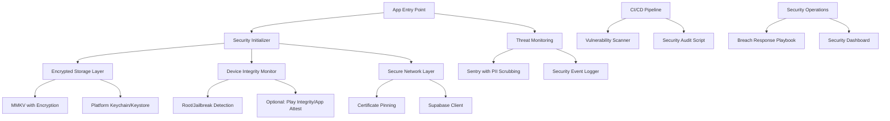
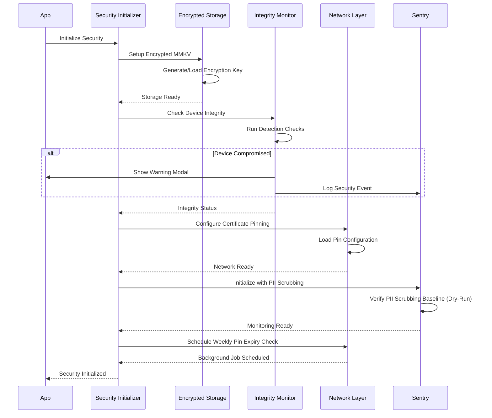

# Design Document

## Overview

This design implements a comprehensive security hardening and incident response system for the GrowBro mobile application. The architecture follows defense-in-depth principles with multiple layers of protection: encrypted storage at rest, device integrity monitoring, secure network communications, threat detection, privacy-preserving error tracking, vulnerability management automation, and structured breach response procedures.

The design prioritizes:

- **Privacy-first**: GDPR compliance with PII scrubbing and data minimization
- **Offline-capable**: Security controls work without network connectivity
- **Performance**: Minimal impact on app startup and runtime performance
- **Maintainability**: Clear separation of concerns with testable components
- **Auditability**: Comprehensive logging and reporting for compliance verification

## Architecture

**Environment Constraints**: TLS certificate pinning requires EAS prebuild or custom dev client; it is not available in Expo Go.

**Internationalization**: All user-visible security messages (warnings, errors, notifications) must originate from the i18n layer with EN/DE translations.

## Open Decisions

The following decisions require resolution before implementation:

1. **Certificate pinning library**: Must support Expo 54, RN 0.81, Hermes, and config plugin
2. **Attestation scope**: Production-only? Which endpoints require attestation token?
3. **Remote-config signature**: ed25519 vs RSA, key management location

## Design Updates Applied

### Architecture-Level Updates

1. **Environment Constraints**: Added note that TLS pinning requires EAS prebuild/custom dev client (not Expo Go)
2. **Internationalization**: All user-visible messages must use i18n layer (EN/DE)
3. **Security Initialization**: Added PII scrubbing baseline verification and weekly pin expiry check scheduling

### Component-Specific Updates

#### 1. Encrypted Storage Layer

- Key length: 32 bytes, algorithm-agnostic
- iOS: SECURE_HARDWARE with graceful fallback to SOFTWARE (log warning)
- Android: Hardware-backed keystore preferred, record fallback state in audit
- Recrypt sequencing: pause writes → recrypt → verify sentinel → resume
- Rekey on suspected compromise at next cold start
- Five MMKV instances: auth, user-data, sync-metadata, security-cache, feature-flags (all encrypted)
- Sentinel writes to assert encryption
- Key-to-domain map to detect drift
- Log encryption mode and key age (never key material)

#### 2. Device Integrity Monitor

- Library: react-native-root-detection (note false positives on OEM debug builds)
- Attestation flow: nonce request → token via Play Integrity/App Attest → backend verification
- Persist in encrypted security-cache with 24h TTL
- Force recheck on app upgrade
- Accessible localized modal (EN/DE) with screen reader labels
- Settings badge until acknowledged
- Sentry event: detectionMethod, indicators count, platform, osVersion (100% sampling for compromised)
- BLOCK_ON_COMPROMISE feature flag

#### 3. Certificate Pinning Layer

**OPEN DECISION**: Library choice for Expo 54 + RN 0.81 + Hermes compatibility

- SPKI pins of intermediate CAs preferred
- At least two backup pins
- Remote config: signature over canonical JSON with version/createdAt
- Reject stale configs (>30 days)
- Fail-closed on mismatch, fallback to bundled pins
- Weekly background job: revalidate + fetch remote config
- Sentry warnings at D-30, D-7, D-1
- Dev/stage bypass via env flag (unit test ensures production-only)

**OPEN DECISION**: Remote-config signature scheme (ed25519 vs RSA) and key management location

#### 4. Threat Monitoring & Event System

- Fixed event fields: type, severity, ts, deviceFingerprint, metadata (pre-scrubbed)
- Persist attempt counters to survive app restart
- Cap: 5 attempts per 15 minutes
- Display remaining lockout time
- Session anomaly: server responds 401/419 with error code, client clears tokens
- Sampling: critical 100%, others 10% (env override)

#### 5. Sentry PII Scrubbing System

- sendDefaultPii=false, attachScreenshot=false
- beforeSend/beforeBreadcrumb: pure and deterministic
- Redact headers (Authorization, Cookie, Set-Cookie)
- Drop request bodies for auth/profile endpoints
- Scrub EXIF if images attached
- User context: hashedId (salted, app-specific), deviceCategory only
- CI leak sentinel: patterns for emails, IPs, JWTs, UUIDs, phones
- Run for all changes touching src/lib/security or src/lib/sentry
- Generate synthetic event in test mode to assert scrubbing

#### 6. Vulnerability Management System

- pnpm audit + optional OSV scanner
- CycloneDX SBOM
- Deferral template with compensating controls for High/Medium
- Artifacts: build/reports/security/<commit>/ with timestamp
- Auto-create issues for Critical/High with labels: security, CVE, severity
- Include remediation suggestions and fixedIn versions

#### 7. Breach Response Playbook

- Define deputies for each role
- Contact escalation matrix in ops doc (not in binary)
- Evidence: freeze logs, export audit, snapshot pins/integrity cache (PII-safe)
- EN/DE templates with notification timestamps
- DPA submission metadata (jurisdiction, timestamp, reference)
- Track CWEs, map to control updates, require sign-off

#### 8. Security Audit & Reporting System

- Sign report with SHA-256, embed commit hash
- Include environment and security lib versions
- Additional checks:
  - Pinning bypass disabled in production
  - Sentry IP collection disabled
  - Integrity cache TTL validated
- Outputs: JSON and CSV to build/reports/security
- Exit non-zero on blocking failures

### Acceptance Criteria Additions

- **Encrypted Storage**: 32-byte keys, HW-backed preference recorded, recrypt tested, static/runtime audits pass, evidence JSON with instance list and encryption mode
- **Integrity Monitor**: Localized modal, cache TTL enforced, Sentry event verified, feature flag toggles
- **Certificate Pinning**: SPKI pins with backups, OTA signature verified, MITM test fails with proper UX, D-30 warnings
- **Threat Monitoring**: Backoff/cap enforced, taxonomy used, metadata redacted
- **Sentry**: sendDefaultPii=false, attachScreenshot=false, scrubbing validated, CI leak sentinel
- **Vulnerabilities**: CI artifacts archived, SBOM generated, SLA labels, auto-created issues
- **Breach Playbook**: Roles documented, templates stored, evidence scripts defined
- **Audit**: Runs locally/CI, signed report, fails on critical gaps

### High-Level Component Diagram



### Security Initialization Flow



## Components and Interfaces

### 1. Encrypted Storage Layer

**Purpose**: Provide encrypted at-rest storage for sensitive data using MMKV with platform-native key management.

**Key Components**:

- `SecureStorage`: Wrapper around react-native-mmkv with encryption
- `KeyManager`: Handles encryption key generation, storage, and rotation
- `StorageAuditor`: Validates encryption status and detects unencrypted data

**Interface**:

```typescript
// src/lib/security/secure-storage.ts
interface SecureStorageConfig {
  id: string;
  encryptionKey: string;
}

interface KeyManager {
  generateKey(): Promise<string>;
  getKey(keyId: string): Promise<string | null>;
  storeKey(keyId: string, key: string): Promise<void>;
  rotateKey(keyId: string): Promise<string>;
  deleteKey(keyId: string): Promise<void>;
}

interface SecureStorage {
  set(key: string, value: string | number | boolean): void;
  get(key: string): string | number | boolean | undefined;
  delete(key: string): void;
  clearAll(): void;
  getAllKeys(): string[];
  recrypt(newKey: string): Promise<void>;
}

interface StorageAuditor {
  verifyEncryption(): Promise<AuditResult>;
  scanForUnencryptedData(): Promise<string[]>;
  generateReport(): Promise<StorageAuditReport>;
}
```

**Implementation Details**:

- Use `react-native-mmkv` (already in project) with `encryptionKey` parameter
- Use `react-native-keychain` for secure key storage (iOS Keychain, Android Keystore)
- Generate 32-byte encryption keys using platform CSPRNG (algorithm-agnostic storage, never derive from user secrets)
- iOS: Set Keychain accessibility to `kSecAttrAccessibleAfterFirstUnlockThisDeviceOnly` and require `SECURE_HARDWARE` if available with graceful fallback to `SOFTWARE` when device lacks Secure Enclave (log warning)
- Android: Prefer hardware-backed Keystore with `setUserAuthenticationRequired(false)` for background access; record fallback state in audit report when TEE/HW unavailable
- Support key rotation via MMKV's recrypt functionality with sequencing: pause writes → recrypt → verify by reading sentinel key → resume
- On suspected compromise: rekey at next cold start and invalidate cached derived values
- Create separate MMKV instances for different security domains:
  - `auth`: Authentication tokens and session data (encrypted)
  - `user-data`: User preferences and settings (encrypted)
  - `sync-metadata`: Sync state and timestamps (encrypted)
  - `security-cache`: Integrity status and security state (encrypted for consistency)
  - `feature-flags`: Feature flag overrides (encrypted)
- StorageAuditor performs "sentinel writes" to assert encryption: attempt to initialize a temporary unencrypted MMKV and ensure no sensitive keys are present; if found, fail audit
- Provide a key-to-domain map to detect domain drift
- Log encryption mode (HW-backed vs SW) and key age (days) in audit evidence; never log key material

**Key Storage Strategy**:

```typescript
// iOS Keychain configuration
{
  service: 'com.growbro.mmkv',
  accessible: Keychain.ACCESSIBLE.AFTER_FIRST_UNLOCK_THIS_DEVICE_ONLY,
  securityLevel: Keychain.SECURITY_LEVEL.SECURE_HARDWARE
}

// Android Keystore configuration
{
  service: 'com.growbro.mmkv',
  securityLevel: Keychain.SECURITY_LEVEL.SECURE_HARDWARE,
  storage: Keychain.STORAGE_TYPE.AES
}
```

### 2. Device Integrity Monitor

**Purpose**: Detect jailbroken/rooted devices and optionally verify device integrity via platform attestation APIs.

**Key Components**:

- `IntegrityDetector`: Performs client-side jailbreak/root detection
- `AttestationService`: Optional backend-verified attestation (Play Integrity, App Attest)
- `IntegrityCache`: Stores integrity status with expiration

**Interface**:

```typescript
// src/lib/security/device-integrity.ts
interface IntegrityStatus {
  isCompromised: boolean;
  detectionMethod: 'client' | 'attestation';
  indicators: string[];
  timestamp: number;
  expiresAt: number;
}

interface IntegrityDetector {
  checkIntegrity(): Promise<IntegrityStatus>;
  isJailbroken(): Promise<boolean>;
  isRooted(): Promise<boolean>;
  getCompromiseIndicators(): Promise<string[]>;
}

interface AttestationService {
  requestAttestation(): Promise<AttestationResult>;
  verifyAttestation(token: string): Promise<boolean>;
}

interface IntegrityCache {
  get(): IntegrityStatus | null;
  set(status: IntegrityStatus): void;
  isExpired(): boolean;
  clear(): void;
}
```

**Implementation Details**:

- Use `react-native-root-detection` library for baseline checks (note: false positives possible on OEM debug builds)
- Custom checks for:
  - iOS: Cydia app, suspicious paths (`/Applications/Cydia.app`, `/private/var/lib/apt`), sandbox violations
  - Android: `su` binary, Magisk, unlocked bootloader, test-keys build
- Attestation integration (optional, feature-flagged):
  - Message flow: client requests nonce from backend → gets token via Play Integrity/App Attest → backend verifies and returns attestation verdict
  - Cache verdict and expiresAt timestamp
- Persist IntegrityStatus in encrypted `security-cache` MMKV instance with 24-hour TTL
- Force recheck on app upgrade (version change)
- Display localized warning modal (EN/DE) when compromise detected; modal must be accessible with screen reader labels
- Show "Security warning" badge in settings until user acknowledges
- Log security event to Sentry with detectionMethod, indicators count (not values), platform, and osVersion
- Sample compromised cases at 100% (critical events)
- Feature flag `BLOCK_ON_COMPROMISE` controls whether to hard-block sensitive features or warn-only

**Detection Strategy**:

```typescript
// iOS Jailbreak Indicators
const iosIndicators = [
  '/Applications/Cydia.app',
  '/Library/MobileSubstrate/MobileSubstrate.dylib',
  '/bin/bash',
  '/usr/sbin/sshd',
  '/etc/apt',
  '/private/var/lib/apt/',
];

// Android Root Indicators
const androidIndicators = [
  '/system/app/Superuser.apk',
  '/sbin/su',
  '/system/bin/su',
  '/system/xbin/su',
  '/data/local/xbin/su',
  '/data/local/bin/su',
  '/system/sd/xbin/su',
  '/system/bin/failsafe/su',
  '/data/local/su',
];
```

### 3. Certificate Pinning Layer

**Purpose**: Prevent man-in-the-middle attacks by validating server certificates against pinned SPKI hashes.

**Key Components**:

- `CertificatePinner`: Validates certificates against pinned hashes
- `PinConfigManager`: Manages pin configuration with OTA updates
- `PinningInterceptor`: Intercepts network requests for validation

**Interface**:

```typescript
// src/lib/security/certificate-pinning.ts
interface PinConfiguration {
  hostname: string;
  pins: {
    primary: string[];
    backup: string[];
  };
  includeSubdomains: boolean;
  expiresAt?: number;
}

interface CertificatePinner {
  validateCertificate(hostname: string, certificate: string): Promise<boolean>;
  getPinsForHost(hostname: string): string[];
  updatePins(config: PinConfiguration): Promise<void>;
}

interface PinConfigManager {
  loadBundledConfig(): PinConfiguration[];
  loadRemoteConfig(): Promise<PinConfiguration[]>;
  mergeConfigs(
    bundled: PinConfiguration[],
    remote: PinConfiguration[]
  ): PinConfiguration[];
  validateConfigIntegrity(config: string): boolean;
}
```

**Implementation Details**:

- Requires EAS prebuild (not compatible with Expo Go)
- **OPEN DECISION**: Choose native module with Expo config plugin compatible with Expo SDK 54, React Native 0.81, and Hermes (e.g., `react-native-ssl-pinning` or custom implementation)
- Pin by SPKI (Subject Public Key Info) hashes of intermediate CAs (preferred for stability), not leaf certificates
- Include at least two backup pins; avoid wildcard hosts if backend permits, otherwise set includeSubdomains with caution
- Bundle default pins in app, support OTA updates via remote config
- **OPEN DECISION**: Remote config signature scheme (ed25519 vs RSA) and key management location
- Remote config must include signature over canonical JSON with version and createdAt; verify signature before merge; reject stale configs (>30 days)
- Fail-closed on certificate mismatch; if remote config fails verification, fallback to bundled pins; never accept empty pinsets
- Environment-based bypass for development/staging (unit test ensures bypass only when APP_ENV != production)
- Weekly background job to revalidate pins and fetch remote config
- Log Sentry warnings at D-30, D-7, D-1 before expiry

**Pin Configuration Format**:

```typescript
// Bundled in app.config.cjs or separate JSON
const pinConfig: PinConfiguration[] = [
  {
    hostname: '*.supabase.co',
    pins: {
      primary: [
        'sha256/AAAAAAAAAAAAAAAAAAAAAAAAAAAAAAAAAAAAAAAAAAA=', // Primary intermediate CA
        'sha256/BBBBBBBBBBBBBBBBBBBBBBBBBBBBBBBBBBBBBBBBBBB=', // Backup intermediate CA
      ],
      backup: [
        'sha256/CCCCCCCCCCCCCCCCCCCCCCCCCCCCCCCCCCCCCCCCCCC=', // Root CA fallback
      ],
    },
    includeSubdomains: true,
    expiresAt: 1735689600000, // 2025-01-01
  },
];
```

**OTA Pin Rotation**:

- Remote config endpoint: `https://api.growbro.app/security/pin-config`
- Response includes signature for integrity verification
- Client validates signature before applying new pins
- Fallback to bundled pins if remote config fails validation
- Cache TTL: 7 days

### 4. Threat Monitoring & Event System

**Purpose**: Detect, log, and respond to security threats and anomalies in real-time.

**Key Components**:

- `SecurityEventLogger`: Centralized security event logging
- `ThreatDetector`: Identifies suspicious patterns and anomalies
- `AuthThrottler`: Implements exponential backoff for failed auth attempts

**Interface**:

```typescript
// src/lib/security/threat-monitoring.ts
type SecurityEventType =
  | 'auth_failed'
  | 'integrity_compromised'
  | 'pin_violation'
  | 'rate_limit_hit'
  | 'session_anomaly'
  | 'storage_rekey';

interface SecurityEvent {
  type: SecurityEventType;
  severity: 'low' | 'medium' | 'high' | 'critical';
  timestamp: number;
  metadata: Record<string, unknown>;
  deviceFingerprint: string;
}

interface SecurityEventLogger {
  logEvent(event: SecurityEvent): void;
  getRecentEvents(type?: SecurityEventType): SecurityEvent[];
  clearEvents(): void;
}

interface ThreatDetector {
  detectAnomalies(): Promise<Anomaly[]>;
  checkRateLimit(action: string): boolean;
  recordFailedAttempt(action: string): void;
}

interface AuthThrottler {
  recordFailedLogin(): void;
  canAttemptLogin(): boolean;
  getBackoffDuration(): number;
  reset(): void;
}
```

**Implementation Details**:

- Standardized event taxonomy for consistent logging
- Events logged to Sentry with dedicated category `security`
- Sampling: critical events always sampled, others at 10%
- Client-side exponential backoff: 1s, 2s, 4s, 8s, 16s, 30s (max)
- Cap login attempts at 5 per 15-minute window
- Display lockout timer to user
- Session anomaly detection requires backend (Supabase Edge Function)
- Backend tracks refresh token usage with IP/device hints
- Client reacts to server-flagged anomalies by signing out

**Exponential Backoff Algorithm**:

```typescript
function calculateBackoff(attemptCount: number): number {
  const baseDelay = 1000; // 1 second
  const maxDelay = 30000; // 30 seconds
  const delay = Math.min(baseDelay * Math.pow(2, attemptCount - 1), maxDelay);
  return delay;
}
```

### 5. Sentry PII Scrubbing System

**Purpose**: Ensure GDPR compliance by preventing PII from being sent to error tracking services.

**Key Components**:

- `SentryInitializer`: Configures Sentry with PII scrubbing
- `PIIScrubber`: Removes sensitive data from events and breadcrumbs
- `LeakDetector`: CI-based validation to detect PII leaks

**Interface**:

```typescript
// src/lib/security/sentry-config.ts
interface SentryConfig {
  dsn: string;
  environment: string;
  enablePII: boolean;
  enableScreenshots: boolean;
  beforeSend: (event: SentryEvent) => SentryEvent | null;
  beforeBreadcrumb: (breadcrumb: Breadcrumb) => Breadcrumb | null;
}

interface PIIScrubber {
  scrubEvent(event: SentryEvent): SentryEvent;
  scrubBreadcrumb(breadcrumb: Breadcrumb): Breadcrumb;
  scrubString(text: string): string;
  redactHeaders(headers: Record<string, string>): Record<string, string>;
}

interface LeakDetector {
  scanForPII(text: string): PIIMatch[];
  validateEvent(event: SentryEvent): ValidationResult;
}
```

**Implementation Details**:

- Set `sendDefaultPii: false` in Sentry initialization
- Set `attachScreenshot: false` to prevent screenshot capture
- Implement `beforeSend` hook to scrub events before transmission
- Implement `beforeBreadcrumb` hook to scrub breadcrumbs
- Scrub patterns: emails, IPv4/IPv6, JWT tokens, user IDs, cultivation data
- Mask `Authorization` headers and cookies
- Drop request bodies for auth endpoints
- User context: only include `hashedId` and device category (no PII)
- Disable IP address collection in Sentry project settings

**Scrubbing Patterns**:

```typescript
const PII_PATTERNS = {
  email: /[a-zA-Z0-9._%+-]+@[a-zA-Z0-9.-]+\.[a-zA-Z]{2,}/g,
  ipv4: /\b(?:\d{1,3}\.){3}\d{1,3}\b/g,
  ipv6: /\b(?:[0-9a-fA-F]{1,4}:){7}[0-9a-fA-F]{1,4}\b/g,
  jwt: /eyJ[a-zA-Z0-9_-]+\.eyJ[a-zA-Z0-9_-]+\.[a-zA-Z0-9_-]+/g,
  uuid: /[0-9a-f]{8}-[0-9a-f]{4}-[0-9a-f]{4}-[0-9a-f]{4}-[0-9a-f]{12}/gi,
  phone: /\+?[\d\s\-\(\)]{10,}/g,
};

function scrubString(text: string): string {
  let scrubbed = text;
  for (const [type, pattern] of Object.entries(PII_PATTERNS)) {
    scrubbed = scrubbed.replace(pattern, `[REDACTED_${type.toUpperCase()}]`);
  }
  return scrubbed;
}
```

**CI Leak Sentinel Test**:

```typescript
// tests/security/pii-leak-detector.test.ts
describe('PII Leak Detection', () => {
  it('should fail if event contains email addresses', () => {
    const event = createMockEvent({ email: 'user@example.com' });
    const leaks = detectPII(JSON.stringify(event));
    expect(leaks).toHaveLength(0);
  });

  it('should fail if event contains IP addresses', () => {
    const event = createMockEvent({ ip: '192.168.1.1' });
    const leaks = detectPII(JSON.stringify(event));
    expect(leaks).toHaveLength(0);
  });
});
```

### 6. Vulnerability Management System

**Purpose**: Automate vulnerability detection, triage, and remediation tracking.

**Key Components**:

- `VulnerabilityScanner`: Runs automated scans in CI
- `VulnerabilityTriager`: Assigns severity and SLAs
- `SBOMGenerator`: Creates Software Bill of Materials

**Interface**:

```typescript
// scripts/security/vulnerability-scanner.ts
interface Vulnerability {
  id: string;
  cve?: string;
  package: string;
  version: string;
  severity: 'critical' | 'high' | 'medium' | 'low';
  title: string;
  description: string;
  fixedIn?: string;
  references: string[];
}

interface ScanResult {
  timestamp: number;
  vulnerabilities: Vulnerability[];
  summary: {
    critical: number;
    high: number;
    medium: number;
    low: number;
  };
}

interface SBOM {
  format: 'CycloneDX';
  version: string;
  components: Component[];
  dependencies: Dependency[];
}
```

**Implementation Details**:

- Run `pnpm audit` in CI on every PR
- Integrate OSV Scanner or Dependabot for additional coverage
- Generate CycloneDX SBOM format
- Store scan results in `build/reports/security/`
- Triage SLAs:
  - Critical: 24 hours
  - High: 7 days
  - Medium: 30 days
  - Low: 90 days
- Auto-create GitHub issues for critical/high vulnerabilities
- Tag issues with CVE, ecosystem, affected versions
- Track remediation in security dashboard
- JavaScript-only fixes: deploy via Expo Updates OTA
- Native fixes: trigger expedited EAS build

**CI Integration**:

```yaml
# .github/workflows/security-scan.yml
name: Security Scan
on: [pull_request, push]
jobs:
  scan:
    runs-on: ubuntu-latest
    steps:
      - uses: actions/checkout@v3
      - uses: pnpm/action-setup@v2
      - run: pnpm install
      - run: pnpm audit --json > build/reports/security/audit.json
      - run: node scripts/security/generate-sbom.js
      - run: node scripts/security/triage-vulnerabilities.js
      - uses: actions/upload-artifact@v3
        with:
          name: security-reports
          path: build/reports/security/
```

### 7. Breach Response Playbook

**Purpose**: Provide structured procedures for handling security incidents and breaches.

**Key Components**:

- `IncidentCoordinator`: Manages incident response workflow
- `NotificationService`: Sends breach notifications to users
- `EvidenceCollector`: Preserves logs and forensic data

**Interface**:

```typescript
// docs/compliance/breach-response-playbook.md (documentation)
// src/lib/security/incident-response.ts (tooling)

interface IncidentReport {
  id: string;
  severity: 'low' | 'medium' | 'high' | 'critical';
  type: 'data_breach' | 'credential_compromise' | 'service_disruption';
  detectedAt: number;
  confirmedAt?: number;
  containedAt?: number;
  resolvedAt?: number;
  affectedUsers: number;
  dataTypes: string[];
  timeline: IncidentEvent[];
  rootCause?: string;
  cwes: string[];
}

interface IncidentCoordinator {
  createIncident(type: string, severity: string): IncidentReport;
  updateIncident(id: string, updates: Partial<IncidentReport>): void;
  assignRoles(incident: IncidentReport): void;
  trackGDPRDeadline(incident: IncidentReport): number;
}

interface NotificationService {
  notifyUsers(
    userIds: string[],
    template: string,
    locale: 'en' | 'de'
  ): Promise<void>;
  notifyDPA(report: IncidentReport): Promise<void>;
  notifyVendors(vendors: string[], report: IncidentReport): Promise<void>;
}

interface EvidenceCollector {
  exportAuditLogs(startTime: number, endTime: number): Promise<string>;
  preserveSentryEvents(issueIds: string[]): Promise<void>;
  captureIntegrityStatus(): Promise<IntegritySnapshot>;
  generateForensicReport(): Promise<string>;
}
```

**Playbook Structure**:

```markdown
# Breach Response Playbook

## Roles & Responsibilities

- **Incident Commander**: Overall coordination, decision authority
- **Technical Lead**: Investigation, containment, remediation
- **Communications Lead**: User notifications, DPA reporting, vendor coordination
- **Deputies**: Backup for each role

## Phase 1: Detection & Triage (0-1 hour)

1. Confirm incident via multiple signals
2. Assign roles and activate war room
3. Assess initial scope and severity
4. Start GDPR 72-hour clock if user data involved

## Phase 2: Containment (1-4 hours)

1. Isolate affected systems
2. Revoke compromised credentials
3. Force session invalidation if needed
4. Preserve evidence (logs, Sentry events, integrity snapshots)

## Phase 3: Investigation (4-24 hours)

1. Determine root cause
2. Identify affected users and data types
3. Map CWEs to vulnerabilities
4. Document timeline

## Phase 4: Notification (24-72 hours)

1. Notify affected users (EN/DE templates)
2. File DPA report if required
3. Coordinate with vendors (Supabase, Sentry)
4. Prepare public statement if needed

## Phase 5: Remediation (ongoing)

1. Deploy fixes (OTA or native build)
2. Update security controls
3. Conduct post-mortem
4. Update playbook with lessons learned

## Vendor Contacts

- **Supabase**: security@supabase.io, Contract ID: [TBD]
- **Sentry**: security@sentry.io, Contract ID: [TBD]
```

### 8. Security Audit & Reporting System

**Purpose**: Provide automated security audits and compliance reporting.

**Key Components**:

- `SecurityAuditor`: Runs comprehensive security checks
- `ComplianceReporter`: Generates audit reports
- `ConfigValidator`: Validates security configurations

**Interface**:

```typescript
// scripts/security/audit.ts
interface AuditResult {
  timestamp: number;
  passed: boolean;
  checks: AuditCheck[];
  summary: {
    total: number;
    passed: number;
    failed: number;
    warnings: number;
  };
}

interface AuditCheck {
  name: string;
  category: 'storage' | 'network' | 'integrity' | 'monitoring' | 'compliance';
  status: 'pass' | 'fail' | 'warning';
  message: string;
  remediation?: string;
  evidence?: unknown;
}

interface SecurityAuditor {
  runAudit(): Promise<AuditResult>;
  checkEncryption(): Promise<AuditCheck>;
  checkPinning(): Promise<AuditCheck>;
  checkPIIScrubbing(): Promise<AuditCheck>;
  checkIntegrity(): Promise<AuditCheck>;
}

interface ComplianceReporter {
  generateReport(result: AuditResult): Promise<string>;
  exportJSON(result: AuditResult): string;
  exportCSV(result: AuditResult): string;
  signReport(report: string): string;
}
```

**Audit Checks**:

1. **Encryption Status**
   - Verify MMKV instances use encryption keys
   - Check key storage in platform keychain
   - Validate no sensitive data in AsyncStorage

2. **Certificate Pinning**
   - Verify pin configuration loaded
   - Check pin expiry dates
   - Validate backup pins present

3. **PII Scrubbing**
   - Verify Sentry config (sendDefaultPii=false)
   - Check beforeSend/beforeBreadcrumb hooks
   - Run leak sentinel tests

4. **Device Integrity**
   - Check integrity detection enabled
   - Verify cache expiration logic
   - Validate warning modal localization

5. **Vulnerability Status**
   - Check for critical/high vulnerabilities
   - Verify SBOM generation
   - Validate SLA compliance

**Report Format**:

```json
{
  "version": "1.0",
  "timestamp": 1704067200000,
  "commitHash": "abc123",
  "environment": "production",
  "summary": {
    "total": 15,
    "passed": 13,
    "failed": 1,
    "warnings": 1
  },
  "checks": [
    {
      "name": "MMKV Encryption",
      "category": "storage",
      "status": "pass",
      "message": "All MMKV instances use encryption",
      "evidence": {
        "instances": ["auth", "userData", "syncMetadata"],
        "encrypted": true
      }
    }
  ],
  "signature": "sha256:..."
}
```

## Data Models

### Security Event Schema

```typescript
interface SecurityEvent {
  id: string;
  type: SecurityEventType;
  severity: 'low' | 'medium' | 'high' | 'critical';
  timestamp: number;
  deviceFingerprint: string;
  metadata: {
    [key: string]: unknown;
  };
}

type SecurityEventType =
  | 'auth_failed'
  | 'integrity_compromised'
  | 'pin_violation'
  | 'rate_limit_hit'
  | 'session_anomaly'
  | 'storage_rekey'
  | 'vulnerability_detected'
  | 'breach_detected';
```

### Integrity Status Schema

```typescript
interface IntegrityStatus {
  isCompromised: boolean;
  detectionMethod: 'client' | 'attestation';
  indicators: string[];
  timestamp: number;
  expiresAt: number;
  platform: 'ios' | 'android';
  osVersion: string;
}
```

### Pin Configuration Schema

```typescript
interface PinConfiguration {
  version: number;
  hostname: string;
  pins: {
    primary: string[]; // SPKI hashes
    backup: string[]; // SPKI hashes
  };
  includeSubdomains: boolean;
  expiresAt?: number;
  signature?: string; // For OTA updates
}
```

### Vulnerability Schema

```typescript
interface Vulnerability {
  id: string;
  cve?: string;
  package: string;
  version: string;
  severity: 'critical' | 'high' | 'medium' | 'low';
  title: string;
  description: string;
  fixedIn?: string;
  references: string[];
  discoveredAt: number;
  sla: number; // Remediation deadline timestamp
  status: 'open' | 'in_progress' | 'resolved' | 'deferred';
  compensatingControls?: string;
}
```

### Incident Report Schema

```typescript
interface IncidentReport {
  id: string;
  severity: 'low' | 'medium' | 'high' | 'critical';
  type: 'data_breach' | 'credential_compromise' | 'service_disruption';
  detectedAt: number;
  confirmedAt?: number;
  containedAt?: number;
  resolvedAt?: number;
  affectedUsers: number;
  dataTypes: string[];
  timeline: IncidentEvent[];
  rootCause?: string;
  cwes: string[];
  roles: {
    incidentCommander: string;
    technicalLead: string;
    communicationsLead: string;
  };
  notifications: {
    usersSent: boolean;
    dpaSent: boolean;
    vendorsSent: boolean;
  };
}

interface IncidentEvent {
  timestamp: number;
  actor: string;
  action: string;
  details: string;
}
```

## Error Handling

### Encryption Initialization Failures

**Scenario**: MMKV encryption key cannot be generated or retrieved from keychain.

**Handling**:

1. Display localized security-block screen with retry button
2. Log non-PII Sentry event with error code
3. Prevent access to sensitive app areas
4. Offer "Contact Support" option
5. On retry: attempt key regeneration
6. If persistent failure: suggest device restart

**User Message** (EN):

```
Security Initialization Failed

We couldn't set up secure storage on your device. This is required to protect your data.

[Retry] [Contact Support]
```

### Certificate Pinning Violations

**Scenario**: Server certificate doesn't match pinned hashes.

**Handling**:

1. Reject connection immediately
2. Log Sentry security event with hostname
3. Display localized error to user
4. Implement exponential backoff for retries
5. Suggest checking network security
6. Fallback to bundled pins if remote config suspected

**User Message** (EN):

```
Connection Security Error

We couldn't verify the security of your connection. Please check your network and try again.

Avoid using public or untrusted Wi-Fi networks.

[Retry] [Use Mobile Data]
```

### Device Integrity Compromise

**Scenario**: Jailbreak/root detected.

**Handling**:

1. Display warning modal (dismissible)
2. Log security event to Sentry
3. Store integrity status in cache
4. If feature flag enabled: disable sensitive features
5. Show warning badge in settings
6. Re-check on next app launch

**User Message** (EN):

```
Security Warning

Your device appears to be jailbroken/rooted. This may compromise the security of your data.

We recommend using GrowBro on a standard device for maximum security.

[I Understand] [Learn More]
```

### Session Anomaly Detection

**Scenario**: Backend detects token reuse from different device/IP.

**Handling**:

1. Backend flags session as anomalous
2. Client receives 401 with `session_anomaly` error code
3. Force sign-out locally
4. Clear all auth tokens
5. Display notification explaining the issue
6. Prompt user to sign in again

**User Message** (EN):

```
Session Security Alert

We detected unusual activity on your account and signed you out for security.

Please sign in again to continue.

[Sign In]
```

### Vulnerability Detection

**Scenario**: Critical vulnerability found in CI scan.

**Handling**:

1. CI fails the build
2. Auto-create GitHub issue with CVE details
3. Notify security team via Slack/PagerDuty
4. Block merge until remediation or deferral documented
5. Track SLA deadline (24h for critical)
6. Generate SBOM for audit trail

### Breach Detection

**Scenario**: Potential data breach identified.

**Handling**:

1. Activate incident response playbook
2. Assign roles (Commander, Tech Lead, Comms Lead)
3. Start GDPR 72-hour clock
4. Preserve evidence (logs, Sentry events)
5. Contain breach (revoke credentials, isolate systems)
6. Investigate root cause
7. Notify affected users within timeline
8. File DPA report if required
9. Conduct post-mortem
10. Update security controls

## Testing Strategy

### Unit Tests

**Encrypted Storage**:

- Key generation produces 32-byte keys
- Keys stored/retrieved from keychain correctly
- MMKV instances initialized with encryption
- Recrypt operation preserves data
- Audit detects unencrypted data

**Device Integrity**:

- Detection logic identifies known indicators
- Cache expiration works correctly
- Warning modal displays with correct locale
- Sentry events logged with proper metadata
- Feature flags control blocking behavior

**Certificate Pinning**:

- Pin validation logic works correctly
- Remote config merges with bundled config
- Signature verification prevents tampering
- Expiry warnings triggered at D-30
- Environment bypass works in dev/staging

**Threat Monitoring**:

- Exponential backoff calculates correctly
- Rate limiting enforces attempt caps
- Security events logged with proper severity
- PII redaction works on all event types

**PII Scrubbing**:

- beforeSend hook scrubs all PII patterns
- beforeBreadcrumb hook scrubs breadcrumbs
- Headers and cookies masked correctly
- Leak sentinel detects common PII patterns
- User context contains only non-PII

### Integration Tests

**Security Initialization Flow**:

- App initializes all security components in order
- Failures in one component don't crash app
- Security-block screen displays on init failure
- Retry logic works correctly

**Network Security**:

- Pinned requests succeed with valid certs
- Pinned requests fail with invalid certs
- Sentry events logged on pinning violations
- Fallback to bundled pins works

**Auth Flow with Throttling**:

- Failed logins trigger backoff
- Lockout timer displays correctly
- Successful login resets throttle
- Session anomaly triggers sign-out

### E2E Tests (Maestro)

**Device Integrity Warning**:

```yaml
# .maestro/security/integrity-warning.yaml
appId: com.growbro.app
---
- launchApp
- assertVisible: 'Security Warning'
- tapOn: 'I Understand'
- assertVisible: 'Home'
```

**Certificate Pinning (Lab MITM)**:

```yaml
# .maestro/security/pinning-test.yaml
# Requires MITM proxy setup
appId: com.growbro.app
---
- launchApp
- assertVisible: 'Connection Security Error'
- assertVisible: 'Retry'
```

**Auth Throttling**:

```yaml
# .maestro/security/auth-throttle.yaml
appId: com.growbro.app
---
- launchApp
- tapOn: 'Sign In'
- inputText: 'wrong@example.com'
- inputText: 'wrongpassword'
- tapOn: 'Sign In'
- repeat: 5
- assertVisible: 'Too many attempts'
- assertVisible: 'Try again in'
```

### Security Audit Tests

**Automated Audit Script**:

```bash
# Run full security audit
pnpm security:audit

# Expected output:
# ✓ MMKV Encryption: PASS
# ✓ Certificate Pinning: PASS
# ✓ PII Scrubbing: PASS
# ✓ Device Integrity: PASS
# ✗ Vulnerability Scan: FAIL (1 critical)
# ⚠ Pin Expiry: WARNING (expires in 25 days)
#
# Audit Result: FAILED
# Exit code: 1
```

**CI Integration**:

- Run audit on every PR
- Block merge if critical checks fail
- Generate audit report artifact
- Upload to security dashboard

### Penetration Testing

**Scope**:

- MITM attack simulation (certificate pinning)
- Jailbreak/root detection bypass attempts
- PII extraction from Sentry events
- Session hijacking attempts
- Encrypted storage extraction

**Frequency**: Quarterly or after major security changes

**Deliverables**:

- Penetration test report
- Remediation recommendations
- Retest results after fixes

## Implementation Considerations

### Performance Impact

**Startup Time**:

- Encryption key retrieval: ~10-50ms (keychain access)
- Integrity detection: ~50-200ms (file system checks)
- Pin configuration load: ~5-10ms (bundled config)
- Total overhead: ~100-300ms acceptable for security

**Runtime Impact**:

- MMKV encrypted reads/writes: negligible (<1ms difference)
- Certificate validation: ~10-20ms per request (cached)
- Security event logging: async, non-blocking
- Threat detection: background thread

**Optimization Strategies**:

- Cache integrity status for 24 hours
- Lazy-load attestation service (only when needed)
- Batch security events before sending to Sentry
- Use background threads for file system scans

### Platform-Specific Considerations

**iOS**:

- Keychain accessibility: `kSecAttrAccessibleAfterFirstUnlockThisDeviceOnly`
- App Attest requires iOS 14+ and backend verification
- Jailbreak detection: check for Cydia, suspicious paths
- Certificate pinning: use TrustKit or custom implementation

**Android**:

- Keystore: prefer hardware-backed with `setUserAuthenticationRequired(false)`
- Play Integrity API requires Google Play Services
- Root detection: check for su binary, Magisk, test-keys
- Certificate pinning: use OkHttp CertificatePinner or custom

### Dependency Management

**Required Libraries**:

- `react-native-mmkv`: Already in project (^3.1.0)
- `react-native-keychain`: For secure key storage (~^8.2.0)
- `react-native-root-detection`: For integrity checks (~^1.0.0)
- Certificate pinning library: TBD based on Expo compatibility

**Optional Libraries**:

- Play Integrity API wrapper (Android)
- App Attest wrapper (iOS)

**Version Pinning**:

- Pin security-critical dependencies to exact versions
- Review security advisories before updating
- Test thoroughly after security library updates

### Feature Flags

```typescript
// src/lib/feature-flags.ts
interface SecurityFeatureFlags {
  ENABLE_ENCRYPTION: boolean; // Default: true
  ENABLE_INTEGRITY_DETECTION: boolean; // Default: true
  ENABLE_ATTESTATION: boolean; // Default: false (opt-in)
  ENABLE_CERTIFICATE_PINNING: boolean; // Default: true (bypass in dev)
  BLOCK_ON_COMPROMISE: boolean; // Default: false (warn-only)
  ENABLE_THREAT_MONITORING: boolean; // Default: true
  SENTRY_SAMPLING_RATE: number; // Default: 0.1 (10%)
}
```

### Environment Configuration

```typescript
// .env.development
APP_ENV = development;
ENABLE_CERTIFICATE_PINNING = false;
ENABLE_ATTESTATION = false;
SENTRY_SAMPLING_RATE = 1.0;

// .env.staging
APP_ENV = staging;
ENABLE_CERTIFICATE_PINNING = true;
ENABLE_ATTESTATION = false;
SENTRY_SAMPLING_RATE = 0.5;

// .env.production
APP_ENV = production;
ENABLE_CERTIFICATE_PINNING = true;
ENABLE_ATTESTATION = true;
SENTRY_SAMPLING_RATE = 0.1;
```

### Monitoring & Alerting

**Sentry Alerts**:

- Critical security events: immediate Slack/PagerDuty
- High severity: 15-minute aggregation
- Medium/Low: daily digest

**Metrics to Track**:

- Integrity compromise rate
- Certificate pinning violation rate
- Auth throttle trigger rate
- Vulnerability remediation time
- Audit check failure rate

**Dashboard Widgets**:

- Security event timeline
- Vulnerability status by severity
- Integrity detection trends
- Pin expiry calendar
- Incident response status

### Documentation Requirements

**Developer Documentation**:

- Security architecture overview
- Component integration guides
- Testing procedures
- Troubleshooting common issues

**Operations Documentation**:

- Incident response playbook
- Vulnerability management workflow
- Audit procedures
- Vendor contact information

**Compliance Documentation**:

- Security control descriptions
- Audit reports
- Penetration test results
- GDPR compliance evidence

### Rollout Strategy

**Phase 1: Foundation (Week 1-2)**

- Implement encrypted storage
- Set up Sentry PII scrubbing
- Create security audit script

**Phase 2: Detection (Week 3-4)**

- Implement device integrity detection
- Set up threat monitoring
- Add security event logging

**Phase 3: Network Security (Week 5-6)**

- Implement certificate pinning
- Configure OTA pin rotation
- Test MITM scenarios

**Phase 4: Automation (Week 7-8)**

- Set up vulnerability scanning in CI
- Implement SBOM generation
- Create security dashboard

**Phase 5: Incident Response (Week 9-10)**

- Document breach response playbook
- Set up notification templates
- Conduct tabletop exercise

**Phase 6: Validation (Week 11-12)**

- Run comprehensive security audit
- Conduct penetration testing
- Generate compliance reports
- Train team on procedures
