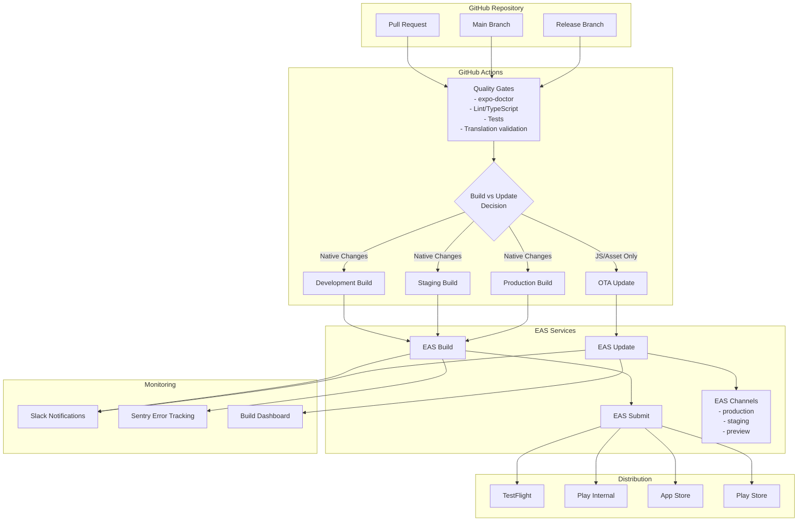

# Design Document

## Overview

The Release Pipeline (EAS) system will implement a comprehensive CI/CD pipeline using GitHub Actions, EAS Build, EAS Update, and EAS Submit to automate the build, test, and deployment process for GrowBro. The system will support multiple environments (development, staging, production) with proper channel management, automated quality gates, and intelligent build decisions.

The pipeline will distinguish between two types of deployments:

- **Binary builds** for native code changes requiring new app store submissions
- **OTA updates** for JavaScript/asset changes that can be deployed instantly

## Architecture

### High-Level Architecture



### Component Architecture

#### 1. GitHub Actions Workflows

**PR Workflow (`pr-preview.yml`)**

- Triggers on pull request creation/updates
- Uses GitHub Actions concurrency to cancel superseded runs
- Uses Expo GitHub Action for built-in auth & caching
- Runs quality gates (expo-doctor, lint, tests, translations)
- Creates development build (optional, configurable)
- Publishes EAS Update to preview channel (officially documented pattern)
- Posts build/update links and QR codes back to PR

**Staging Workflow (`staging.yml`)**

- Triggers on push to main branch
- Uses GitHub Actions concurrency to cancel superseded runs
- Uses Expo GitHub Action for built-in auth & caching
- Runs full quality gates
- Determines build vs update based on fingerprint analysis
- Creates staging build or publishes staging update
- Auto-submits to TestFlight/Play Internal with submission profiles

**Production Workflow (`production.yml`)**

- Triggers on push to release/\* branches
- Uses GitHub Actions concurrency to cancel superseded runs
- Uses Expo GitHub Action for built-in auth & caching
- Runs comprehensive quality gates + compliance checks
- Creates production build with version auto-increment
- Auto-submits to stores with staged rollout using submission profiles
- Requires manual approval for OTA updates to production
- Requires manual approval for OTA updates to production. Implementation detail: run the production OTA publish job in a protected GitHub Environment named "production" and set the job's environment to that name (use the workflow keyword `environment: production`). Protect the `production` environment in the repository settings with required reviewers (individuals or teams). This will cause GitHub Actions to pause the job and require approval from a designated reviewer or team before the job proceeds.

  Release health gates (Adjustments A13)

  - Before promotion, query Sentry Release Health metrics; block if crash-free users < 98% OR crash-free sessions < 99.5% OR ANR rate > 1%
  - On violation, auto-pause via Releases API (`POST /api/releases/{id}/pause`) with `releases:write` scope or org-admin role; annotate the run with on-call owner (Release Engineering rotation)
  - Sourcemap upload is a hard gate: fail pipeline if upload missing/fails

  Alternative (optional): if you prefer an explicit in-workflow gate instead of environment protection, add a dedicated `manual-approval` job that uses a wait-for-approval action (for example, `peter-evans/wait-for-approval@v2`) or a small workflow that requires a human to re-dispatch. Make the production publish job depend on this approval job (e.g., `needs: manual-approval`). In this pattern include the keywords `needs: manual-approval` on the production publish job so its execution is gated until an authorized approver continues the run.

  Recommended (chosen) option: use GitHub Environments with required reviewers. This is the preferred, built-in protection mechanism — set `environment: production` on the job and configure required reviewers in GitHub so approvals are enforced at the environment level.

#### 2. EAS Configuration

**Build Profiles (`eas.json`)**

```json
{
  "cli": {
    "version": ">=7.0.0"
  },
  "build": {
    "development": {
      "channel": "preview",
      "developmentClient": true,
      "env": {
        "APP_ENV": "development"
      }
    },
    "staging": {
      "channel": "staging",
      "env": {
        "APP_ENV": "staging"
      }
    },
    "production": {
      "channel": "production",
      "env": {
        "APP_ENV": "production"
      },
      "autoIncrement": "version"
    }
  },
  "update": {
    "runtimeVersion": {
      "policy": "appVersion"
    }
  },
  "submit": {
    "staging": {
      "ios": {
        "appleTeamId": "...",
        "ascAppId": "..."
      },
      "android": {
        "track": "internal"
      }
    },
    "production": {
      "ios": {
        "appleTeamId": "...",
        "ascAppId": "...",
        "releaseStatus": "completed"
      },
      "android": {
        "track": "production",
        "releaseStatus": "completed",
        "rollout": 0.1
      }
    }
  }
}
```

#### 3. Channel and Runtime Management

**Channel Strategy**

- `production` → production builds and updates
- `staging` → staging builds and updates
- `preview` → PR preview builds and updates

**Channel Guardrails**

- Add mapping check step (eas channel:view) to ensure production builds only point to production branch
- Include pre-publish check to prevent pushing to wrong channel
- Preview builds always publish to preview channel and never touch production

**Runtime Version Policy**

- Use `"policy": "appVersion"` for most teams (good default balance)
- Consider `"policy": "fingerprint"` for maximum safety against accidental native changes (requires more rebuilds)
- Every binary embeds channel + runtimeVersion; CI fails OTA publishes where runtimeVersion doesn't match
- Document when to bump app version vs. cut a new build
- Block eas update if current binary's runtimeVersion ≠ update target

## Components and Interfaces

### 1. Quality Gates Component

**Purpose**: Validate code quality before any build/deployment

**Interface**:

```typescript
interface QualityGatesResult {
  passed: boolean;
  checks: {
    expoDoctor: CheckResult;
    lint: CheckResult;
    typeCheck: CheckResult;
    tests: CheckResult;
    translations: CheckResult;
    compliance?: ComplianceResult;
  };
}

interface CheckResult {
  passed: boolean;
  errors: string[];
  warnings: string[];
}
```

**Implementation**:

- Sequential execution with fail-fast behavior
- Detailed error reporting with actionable feedback
- Caching of results to avoid redundant checks

### 2. Build Decision Engine

**Purpose**: Determine whether to create a new build or publish an OTA update

**Interface**:

```typescript
interface BuildDecision {
  action: 'build' | 'update';
  reason: string;
  fingerprint: {
    current: string;
    previous: string;
    changed: boolean;
  };
}
```

**Logic**:

1. Run `expo-doctor` and fingerprint analysis
2. Compare current fingerprint with last successful build
3. If native dependencies/config changed → build
4. If only JS/assets changed → update
5. Always build for first deployment to new environment
6. Block eas update if current binary's runtimeVersion ≠ update target
7. Require new build when policy indicates native changes (appVersion bump or fingerprint change)

### 3. Version Management Component

**Purpose**: Handle semantic versioning and build number increments

**Interface**:

```typescript
interface VersionInfo {
  semver: string;
  // Platform-specific build identifiers
  // iOS uses a string build number (CFBundleVersion)
  iosBuildNumber: string;
  // Android uses an integer version code
  androidVersionCode: number;
  runtimeVersion: string;
  gitTag: string;
  environment: 'development' | 'staging' | 'production';
}
```

**Implementation**:

- EAS remote version management with autoIncrement
- Git tag creation for production releases
- Prerelease identifiers for staging
- Commit SHA embedding for development

### 4. Compliance Checker

**Purpose**: Validate builds against store requirements

**Interface**:

```typescript
interface ComplianceResult {
  ios: {
    privacyManifest: boolean;
    requiredReasonAPIs: boolean;
    passed: boolean;
  };
  android: {
    targetSdk: number;
    restrictedPermissions: string[];
    passed: boolean;
  };
  metadata: {
    validated: boolean;
    errors: string[];
  };
}
```

**Checks**:

- iOS: Validate PrivacyInfo.xcprivacy presence + Required Reason API justifications
- Android: Enforce targetSdk 35 (Aug 31, 2025 deadline) and fail on restricted permissions (MANAGE_EXTERNAL_STORAGE, QUERY_ALL_PACKAGES, exact-alarm)
- Include remediation links for compliance failures
- Store metadata validation via EAS Metadata

### 5. Distribution Manager

**Purpose**: Handle automated submission to stores and testing platforms

**Interface**:

```typescript
interface DistributionConfig {
  platform: 'ios' | 'android';
  track: 'internal' | 'production';
  rolloutPercentage?: number;
  autoSubmit: boolean;
}
```

**Implementation**:

- EAS Submit integration with --auto-submit and submission profiles in eas.json
- Credential management via EAS credentials (ASC API key for iOS, Play service account for Android)
- CI validates submission profiles before submit
- Rollout management for staged deployments

### 6. Monitoring and Alerting

**Purpose**: Provide visibility into pipeline health and performance

**Components**:

- **EAS Webhooks** → Slack notifications for build/submit completion (include build URL + last 100 lines on failure)
- **Sentry Integration** → Error tracking with automatic native sourcemap upload on EAS Build and update sourcemaps on EAS Update
  - **Sentry Release Naming** → use platform-specific build identifiers: for iOS use `<os>-<iosBuildNumber>-<shortSHA>` and for Android use `<os>-<androidVersionCode>-<shortSHA>` format
- **Build Dashboard** → Status and metrics visualization
- **Performance Monitoring** → Build time and queue tracking
- **Pipeline fails if sourcemap upload fails**

## Data Models

### Build Metadata

```typescript
interface BuildMetadata {
  id: string;
  platform: 'ios' | 'android';
  profile: 'development' | 'staging' | 'production';
  version: VersionInfo;
  channel: string;
  runtimeVersion: string;
  gitCommit: string;
  gitBranch: string;
  buildTime: string; // ISO 8601 timestamp, e.g. "2025-08-27T14:23:00Z"
  status: 'pending' | 'building' | 'completed' | 'failed';
  artifacts: {
    url: string;
    checksum: string;
    checksumAlgorithm: string;
    size?: number;
  }[];
  message: string;
  releaseNotes?: string;
}
```

### Update Metadata

```typescript
interface UpdateMetadata {
  id: string;
  channel: string;
  runtimeVersion: string;
  platform: 'ios' | 'android';
  gitCommit: string;
  gitBranch: string;
  // All timestamps MUST be serialized as ISO 8601 strings (UTC) e.g. "2025-08-27T14:23:00Z".
  // Use `string` to represent ISO 8601 timestamp values to avoid ambiguity across
  // runtimes and serialization boundaries.
  publishTime: string;
  rolloutPercentage: number;
  message: string;
  assets: AssetInfo[];
}
```

// Asset metadata for files included in an OTA update. Define explicit fields to
// avoid ambiguous/undefined types. All timestamp fields are ISO 8601 strings.

```typescript
interface AssetInfo {
  // Name of the file as it appears in the update (e.g. "index.android.bundle", "image.png")
  filename: string;
  // MIME content type (e.g. "application/javascript", "image/png")
  contentType: string;
  // Size in bytes
  size: number;
  // Hash of the content (e.g. sha256 hex string)
  hash: string;
  // Publicly-accessible or signed URL where the asset can be fetched
  url: string;
  // Upload time serialized as ISO 8601 string (UTC)
  uploadTime: string;
}
```

### Pipeline State

```typescript
interface PipelineState {
  lastSuccessfulBuild: {
    [profile: string]: BuildMetadata;
  };
  lastFingerprint: {
    [profile: string]: string;
  };
  activeRollouts: UpdateMetadata[];
  complianceStatus: ComplianceResult;
}
```

## Security and Environment Management

### Secrets and Environment Hygiene

- **Secret Storage**: All secrets stored only in EAS Secrets/CI secrets, never in git
- **Environment Variables**: Use EXPO*PUBLIC*\* only for non-secret runtime config
- **Log Scrubbing**: Implement log-scrub check to ensure no secret values appear in build logs (masked)
- **Git History Scanning**: Automated scanning to ensure no secrets exist in git history
- **Credential Management**: Use EAS credentials manager for signing credentials with no repo storage
- **CI Secret Conventions & Rotation**: Store any ephemeral test tokens or demo-only secrets in CI/EAS secret stores and inject them at runtime. Follow a clear naming convention (e.g., GHA: "GB*<SERVICE>\_TOKEN", EAS: "EAS*<SERVICE>\_SECRET", or EXPO_SECRET-like prefixes) so pipelines can discover and document required secrets. Always mark reviewer/demo credentials as non-repository and provide demo account credentials via Google Play Console App access for reviewer use. Regularly rotate CI secrets, audit access (who/when), and ensure secrets are scoped to the minimum required permissions.

### Environment Configuration

- **Development**: Debug features enabled, development environment variables
- **Staging**: Testing features included, staging environment variables
- **Production**: Debug features disabled, production environment variables
- **Validation**: All required environment variables validated before build

## Error Handling

### Build Failures

- **Quality Gate Failures**: Detailed feedback with specific line numbers and fix suggestions
- **Build Failures**: EAS build logs with last 100 lines in Slack alerts
- **Submission Failures**: Retry logic with exponential backoff
- **Compliance Failures**: Block deployment with detailed remediation steps

### Update Failures

- **Runtime Mismatch**: Clear error messages about version compatibility
- **Channel Errors**: Validation to prevent wrong channel publishing
- **Rollback Triggers**: Automatic rollback on high error rates

### Recovery Procedures

- **Manual Override**: Ability to bypass certain checks with approval
- **OTA Rollback**: Start a rollout: `eas update --rollout-percentage <value>`; Adjust the rollout percentage: `eas update:edit`; Revert to the previous update group: `eas update:revert-update-rollout`
- **Binary Rollback**: Use Phased Release (App Store) or Staged Rollout (Play) to pause/expand/stop distribution
- **Emergency Rollback**: Fast rollback procedures documented in runbooks (executable in <5 minutes)
- **Credential Recovery**: Backup credential management procedures

## Testing Strategy

### Unit Testing

- Quality gate components
- Version management logic
- Compliance checker rules
- Build decision engine

### Integration Testing

- End-to-end workflow testing in staging environment
- EAS service integration testing
- Submission to non-production tracks (TestFlight/Play Internal) in staging

### Performance Testing

- Build time monitoring and alerting
- Queue time tracking
- Resource usage optimization

### Security Testing

- Secret masking validation
- Credential security audits
- Permission scanning accuracy

### Compliance Testing

- iOS Privacy manifest validation
- Android permission scanning
- EAS Metadata validation explicitly included
- EAS Update Debug test that validates channel→branch mapping and runtime compatibility before publish

## Implementation Phases

### Phase 1: Core Pipeline Setup

- GitHub Actions workflows
- Basic EAS Build integration
- Quality gates implementation
- Slack notifications

### Phase 2: Advanced Features

- Build vs update decision engine
- EAS Update channel management
- Version management automation
- Basic compliance checking

### Phase 3: Store Integration

- EAS Submit automation
- Advanced compliance validation
- Rollout management
- Sentry integration

### Phase 4: Monitoring and Optimization

- Comprehensive dashboard
- Performance monitoring
- Advanced alerting
- Rollback automation
