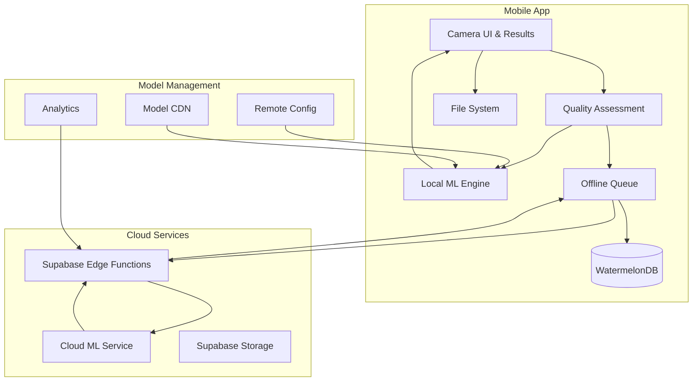

# Design Document

## Overview

The AI Photo Diagnosis feature provides an end-to-end solution for automated plant health analysis in the GrowBro mobile app. The system combines guided photo capture, automated quality assessment, on-device/cloud ML inference, and actionable guidance delivery. The architecture prioritizes offline-first functionality, user privacy, and seamless integration with existing calendar and community features.

The solution supports a predefined set of diagnosis classes used across the system (see the canonical "Diagnosis Classes" list below). The system maintains high accuracy through confidence thresholding, quality gating, and graceful fallbacks to community consultation.

## Diagnosis Classes (canonical)

This canonical list is the single source of truth for all references to diagnosis categories used by the ML models, UI, and action plan generation.

1. Healthy
2. Unknown / Out-of-Distribution (OOD)
3. Nitrogen deficiency
4. Phosphorus deficiency
5. Potassium deficiency
6. Magnesium deficiency
7. Calcium deficiency
8. Overwatering (water stress)
9. Underwatering (drought stress)
10. Light burn (excess light / heat stress)
11. Spider mites (pest)
12. Powdery mildew (pathogen)

## Architecture

### High-Level System Architecture



### Data Flow Architecture

1. **Capture Flow**: Guided camera → Quality assessment → Local storage
2. **Inference Flow**: Quality gate → On-device ML → Cloud fallback → Results
3. **Offline Flow**: Queue management → Background sync → Conflict resolution
4. **Integration Flow**: Results → Task creation → Playbook adjustments

## Components and Interfaces

### 1. Camera Capture Component

**Purpose**: Guided photo capture with quality feedback and multi-shot support

**Key Features**:

- Guided prompts for leaf positioning (top/bottom views)
- Real-time quality feedback (lighting, focus, framing)
- Support for up to 3 photos per diagnosis case
- EXIF data stripping for privacy

**Interface**:

```typescript
interface CaptureComponent {
  onPhotosCapture: (photos: CapturedPhoto[]) => void;
  maxPhotos: number;
  guidanceMode: 'leaf-top' | 'leaf-bottom' | 'whole-plant';
}

interface CapturedPhoto {
  uri: string;
  timestamp: number;
  qualityScore: QualityMetrics;
  metadata: PhotoMetadata;
}
```

### 2. Quality Assessment Engine

**Purpose**: Automated image quality validation before inference

**Quality Metrics**:

- **Blur Detection**: Variance of Laplacian with tuned kernel size (threshold >100 for acceptable sharpness)
- **Exposure Assessment**: Histogram analysis for over/under-exposure detection
- **White Balance**: Color temperature estimation and deviation check from neutral
- **Composition**: Plant matter detection and framing validation
- **Batch Rule**: Multiple photos → per-image predictions → majority vote; ties → highest calibrated confidence; all <0.70 → Unknown + CTA

**Interface**:

```typescript
interface QualityAssessment {
  assessPhoto(uri: string): Promise<QualityResult>;
  validateBatch(photos: CapturedPhoto[]): Promise<BatchQualityResult>;
}

interface QualityResult {
  score: number; // 0-100
  issues: QualityIssue[];
  acceptable: boolean;
}

interface QualityIssue {
  type: 'blur' | 'exposure' | 'white-balance' | 'composition';
  severity: 'low' | 'medium' | 'high';
  suggestion: string;
}
```

### 3. ML Inference Engine

**Purpose**: Dual-mode (device/cloud) machine learning inference with model management

**Model Architecture**:

- **On-Device**: EfficientNet-Lite0/1 or MobileNetV3-Small/Large INT8 quantized (<20MB)
- **Cloud**: EfficientNet-B4/ResNet-50 full-precision for complex cases
- **Classes (Diagnosis Classes — canonical list):**

  1.  Healthy
  2.  Unknown / Out-of-Distribution (OOD)
  3.  Nitrogen deficiency
  4.  Phosphorus deficiency
  5.  Potassium deficiency
  6.  Magnesium deficiency
  7.  Calcium deficiency
  8.  Overwatering (water stress)
  9.  Underwatering (drought stress)
  10. Light burn (excess light / heat stress)
  11. Spider mites (pest)
  12. Powdery mildew (pathogen)

- **Delegates**: NNAPI/GPU acceleration where available with CPU fallback
- **SLOs**: p95 ≤ 3.5s (device) / ≤ 5s (cloud) on Pixel 6a & Galaxy A54

**Interface**:

```typescript
interface MLInferenceEngine {
  initialize(): Promise<void>;
  predict(photos: CapturedPhoto[]): Promise<DiagnosisResult>;
  getModelInfo(): ModelInfo;
  updateModel(version: string): Promise<void>;
}

interface DiagnosisResult {
  topClass: DiagnosisClass;
  rawConfidence: number;
  calibratedConfidence: number;
  perImage: Array<{
    uri: string;
    classId: string;
    conf: number;
    quality: QualityResult;
  }>;
  aggregationMethod: 'majority-vote' | 'highest-confidence';
  processingTimeMs: number;
  mode: 'device' | 'cloud';
  modelVersion: string;
}

interface DiagnosisClass {
  id: string;
  name: string;
  category: 'nutrient' | 'stress' | 'pathogen' | 'healthy' | 'unknown';
  description: string;
  visualCues: string[];
}
```

### 4. Action Plan Generator

**Purpose**: Generate contextual, actionable guidance based on diagnosis results

**Action Plan Structure**:

- **Immediate Steps** (0-24 hours): Diagnostic checks, immediate interventions
- **Short-term Actions** (24-48 hours): Monitoring, adjustments
- **Task Integration**: One-tap task creation with prefilled details
- **Playbook Integration**: Suggested schedule adjustments

**Interface**:

```typescript
// PlantContext: basic plant identifier and optional metadata for contextual decisions
interface PlantContext {
  id: string;
  metadata?: Record<string, any>;
}

// Task: a minimal task shape useful for creating and tracking follow-up actions
interface Task {
  id: string;
  title: string;
  assignee?: string;
  status: 'todo' | 'in-progress' | 'done' | 'cancelled';
}

// TaskTemplate: template used to prefill tasks created from action plans
interface TaskTemplate {
  name: string;
  fields: Record<string, string>;
  description?: string;
}

// DiagnosticCheck: a single diagnostic check with instructions for the user
interface DiagnosticCheck {
  id: string;
  name: string;
  instructions: string;
  estimatedTimeMinutes?: number;
}

// Playbook: scheduled playbook with ordered steps for plant care
interface Playbook {
  id: string;
  name: string;
  steps: ActionStep[];
}

// PlaybookAdjustment: suggestion to modify a playbook and its expected impact
interface PlaybookAdjustment {
  description: string;
  impact: 'schedule' | 'resource' | 'instructions' | 'priority' | string;
  reason?: string;
}

interface ActionPlanGenerator {
  generatePlan(diagnosis: DiagnosisResult, context: PlantContext): ActionPlan;
  createTasks(plan: ActionPlan, plantId: string): Task[];
  suggestPlaybookAdjustments(
    plan: ActionPlan,
    playbook: Playbook
  ): PlaybookAdjustment[];
}

interface ActionPlan {
  immediateSteps: ActionStep[];
  shortTermActions: ActionStep[];
  diagnosticChecks: DiagnosticCheck[];
  warnings: string[];
  disclaimers: string[];
}

interface ActionStep {
  title: string;
  description: string;
  timeframe: string;
  priority: 'high' | 'medium' | 'low';
  taskTemplate?: TaskTemplate;
}
```

### 5. Offline Queue Manager

**Purpose**: Handle offline diagnosis requests with intelligent retry and sync

**Queue Features**:

- **Request Queuing**: Store diagnosis requests with photos and context
- **Intelligent Retry**: Exponential backoff with jitter
- **Batch Processing**: Optimize network usage with batch uploads
- **Conflict Resolution**: Handle duplicate requests and stale data

**Interface**:

```typescript
interface OfflineQueueManager {
  enqueue(request: DiagnosisRequest): Promise<string>;
  processQueue(): Promise<ProcessingResult[]>;
  getQueueStatus(): QueueStatus;
  retryFailed(): Promise<void>;
}

interface DiagnosisRequest {
  id: string;
  photos: CapturedPhoto[];
  plantContext: PlantContext;
  timestamp: number;
  retryCount: number;
  status: 'pending' | 'processing' | 'completed' | 'failed';
}
```

## Data Models

### Core Database Schema (WatermelonDB)

```typescript
// Diagnoses table
interface DiagnosisRecord {
  id: string;
  plant_id: string;
  user_id: string;

  // Request data
  images: string[]; // Local file URIs
  plant_context: PlantContext;

  // Processing data
  status: 'pending' | 'processing' | 'succeeded' | 'failed';
  inference_mode: 'device' | 'cloud';
  model_version: string;

  // Results
  predicted_class?: string;
  raw_confidence?: number;
  calibrated_confidence?: number;
  quality_scores: QualityMetrics[];
  aggregation_rule?: string;
  action_plan?: ActionPlan;

  // Performance metrics
  latency_ms?: number;
  processing_started_at?: Date;
  processing_completed_at?: Date;

  // User feedback
  helpful_vote?: boolean;
  issue_resolved?: boolean;
  feedback_notes?: string;

  // Timestamps
  created_at: Date;
  updated_at: Date;
  resolved_at?: Date;
}

// Diagnosis classes reference
interface DiagnosisClassRecord {
  id: string;
  name: string;
  category: string;
  description: string;
  visual_cues: string[];
  action_template: ActionPlan;
  created_at: Date;
}
```

### WatermelonDB Schema Implementation

**Model Classes with JSON Decorators**:

```typescript
import { Model, Q } from '@nozbe/watermelondb';
import {
  field,
  date,
  json,
  relation,
  readonly,
} from '@nozbe/watermelondb/decorators';

// Main diagnosis model with JSON-serialized complex fields
class Diagnosis extends Model {
  static table = 'diagnoses';
  static associations = {
    plants: { type: 'belongs_to', key: 'plant_id' },
    users: { type: 'belongs_to', key: 'user_id' },
    diagnosis_classes: { type: 'belongs_to', key: 'predicted_class' },
  };

  // Relational columns (normalized)
  @field('plant_id') plantId!: string;
  @field('user_id') userId!: string;
  @field('predicted_class') predictedClass?: string;
  @field('status') status!: string;
  @field('inference_mode') inferenceMode!: string;
  @field('model_version') modelVersion!: string;

  // Simple scalar fields
  @field('raw_confidence') rawConfidence?: number;
  @field('calibrated_confidence') calibratedConfidence?: number;
  @field('aggregation_rule') aggregationRule?: string;
  @field('latency_ms') latencyMs?: number;
  @field('helpful_vote') helpfulVote?: boolean;
  @field('issue_resolved') issueResolved?: boolean;
  @field('feedback_notes') feedbackNotes?: string;

  // JSON-serialized complex fields (marked with @json decorator)
  @json('images', sanitizeImages) images!: string[];
  @json('plant_context', sanitizePlantContext) plantContext!: PlantContext;
  @json('quality_scores', sanitizeQualityScores)
  qualityScores!: QualityResult[];
  @json('action_plan', sanitizeActionPlan) actionPlan?: ActionPlan;

  // Timestamps
  @readonly @date('created_at') createdAt!: Date;
  @date('updated_at') updatedAt!: Date;
  @date('processing_started_at') processingStartedAt?: Date;
  @date('processing_completed_at') processingCompletedAt?: Date;
  @date('resolved_at') resolvedAt?: Date;

  // Relations
  @relation('plants', 'plant_id') plant!: Plant;
  @relation('users', 'user_id') user!: User;
  @relation('diagnosis_classes', 'predicted_class')
  diagnosisClass?: DiagnosisClass;
}

// Normalized diagnosis classes table
class DiagnosisClass extends Model {
  static table = 'diagnosis_classes';

  @field('name') name!: string;
  @field('category') category!: string;
  @field('description') description!: string;

  // JSON fields for complex data
  @json('visual_cues', sanitizeStringArray) visualCues!: string[];
  @json('action_template', sanitizeActionPlan) actionTemplate!: ActionPlan;

  @readonly @date('created_at') createdAt!: Date;
}

// Schema definition
const diagnosisSchema = {
  name: 'diagnoses',
  columns: [
    { name: 'plant_id', type: 'string', isIndexed: true },
    { name: 'user_id', type: 'string', isIndexed: true },
    {
      name: 'predicted_class',
      type: 'string',
      isOptional: true,
      isIndexed: true,
    },
    { name: 'status', type: 'string', isIndexed: true },
    { name: 'inference_mode', type: 'string' },
    { name: 'model_version', type: 'string' },
    { name: 'raw_confidence', type: 'number', isOptional: true },
    { name: 'calibrated_confidence', type: 'number', isOptional: true },
    { name: 'aggregation_rule', type: 'string', isOptional: true },
    { name: 'latency_ms', type: 'number', isOptional: true },
    { name: 'helpful_vote', type: 'boolean', isOptional: true },
    { name: 'issue_resolved', type: 'boolean', isOptional: true },
    { name: 'feedback_notes', type: 'string', isOptional: true },
    // JSON columns for complex nested data
    { name: 'images', type: 'string' }, // JSON array of image URIs
    { name: 'plant_context', type: 'string' }, // JSON PlantContext object
    { name: 'quality_scores', type: 'string' }, // JSON array of QualityResult
    { name: 'action_plan', type: 'string', isOptional: true }, // JSON ActionPlan object
    // Timestamps
    { name: 'created_at', type: 'number' },
    { name: 'updated_at', type: 'number' },
    { name: 'processing_started_at', type: 'number', isOptional: true },
    { name: 'processing_completed_at', type: 'number', isOptional: true },
    { name: 'resolved_at', type: 'number', isOptional: true },
  ],
};

const diagnosisClassSchema = {
  name: 'diagnosis_classes',
  columns: [
    { name: 'name', type: 'string' },
    { name: 'category', type: 'string', isIndexed: true },
    { name: 'description', type: 'string' },
    { name: 'visual_cues', type: 'string' }, // JSON string array
    { name: 'action_template', type: 'string' }, // JSON ActionPlan object
    { name: 'created_at', type: 'number' },
  ],
};
```

**Data Sanitization Functions**:

```typescript
// Sanitization functions to keep JSON fields lean and PII-free
function sanitizeImages(images: string[]): string[] {
  // Keep only local file URIs, limit to 10 images max
  return images.filter((uri) => uri.startsWith('file://')).slice(0, 10);
}

function sanitizePlantContext(context: PlantContext): PlantContext {
  return {
    id: context.id,
    // Strip PII from metadata, keep only essential plant data
    metadata: context.metadata
      ? {
          strain: context.metadata.strain,
          stage: context.metadata.stage,
          setup_type: context.metadata.setup_type,
          // Exclude user-identifiable fields like location, personal notes
        }
      : undefined,
  };
}

function sanitizeQualityScores(scores: QualityResult[]): QualityResult[] {
  // Limit to 10 quality results, trim large issue descriptions
  return scores.slice(0, 10).map((score) => ({
    score: score.score,
    acceptable: score.acceptable,
    issues: score.issues.map((issue) => ({
      type: issue.type,
      severity: issue.severity,
      // Trim suggestion text to 200 chars to keep rows lean
      suggestion: issue.suggestion.substring(0, 200),
    })),
  }));
}

function sanitizeActionPlan(plan: ActionPlan): ActionPlan {
  return {
    // Limit arrays to prevent bloated rows
    immediateSteps: plan.immediateSteps.slice(0, 5),
    shortTermActions: plan.shortTermActions.slice(0, 5),
    diagnosticChecks: plan.diagnosticChecks.slice(0, 3),
    warnings: plan.warnings.slice(0, 3),
    disclaimers: plan.disclaimers.slice(0, 2),
  };
}

function sanitizeStringArray(arr: string[]): string[] {
  // Limit array size and trim individual strings
  return arr.slice(0, 10).map((str) => str.substring(0, 100));
}
```

**Model Usage Guidelines**:

- **JSON Fields**: Use `@json` decorator for complex nested objects (plant_context, quality_scores, action_plan, images array)
- **Relational Fields**: Use foreign keys with `@relation` for normalized data (user_id, plant_id, predicted_class)
- **Indexing**: Index frequently queried fields (user_id, plant_id, status, category)
- **Data Integrity**: Always sanitize JSON data before persistence to prevent PII leaks and keep row sizes manageable
- **Performance**: Query by indexed fields first, then filter JSON content in memory for complex searches

### File System Organization

```
app_documents/
├── diagnoses/
│   ├── {diagnosis_id}/
│   │   ├── original_1.jpg
│   │   ├── original_2.jpg
│   │   ├── thumbnail_1.jpg
│   │   └── thumbnail_2.jpg
│   └── cache/
│       └── temp_captures/
└── models/
    ├── plant_classifier_v1.tflite
    ├── plant_classifier_v1.json (metadata)
    └── checksums.json
```

## Error Handling

### Error Categories and Responses

1. **Capture Errors**

   - Camera permission denied → Permission request flow
   - Storage full → Cleanup suggestions and retry
   - Camera hardware failure → Fallback to gallery selection

2. **Quality Assessment Errors**

   - Poor image quality → Specific feedback and retake guidance
   - Non-plant images → Educational prompt about proper subjects
   - Extreme lighting conditions → Lighting adjustment tips

3. **Inference Errors**

   - Model loading failure → Cloud fallback or retry
   - Out of memory → Reduce image resolution and retry
   - Network timeout → Queue for offline processing
   - Unknown error → Generic error with support contact

4. **Sync Errors**
   - Network unavailable → Queue management
   - Server errors → Exponential backoff retry
   - Authentication failure → Re-authentication flow
   - Quota exceeded → Usage notification and upgrade prompt

### Error Recovery Strategies

```typescript
interface ErrorHandler {
  handleCaptureError(error: CaptureError): ErrorResponse;
  handleInferenceError(error: InferenceError): ErrorResponse;
  handleSyncError(error: SyncError): ErrorResponse;
}

interface ErrorResponse {
  userMessage: string;
  actionRequired: boolean;
  retryable: boolean;
  fallbackAction?: () => void;
  telemetryData: Record<string, any>;
  diagnosisId?: string; // For Sentry breadcrumbs (no PII)
}

// Typed error classification
type ErrorCategory = 'capture' | 'quality' | 'inference' | 'network' | 'auth';

interface TypedError {
  category: ErrorCategory;
  retryable: boolean;
  timeoutMs?: number;
  fallbackMode?: 'cloud' | 'queue' | 'community';
}
```

## Testing Strategy

### Unit Testing

1. **Quality Assessment Engine**

   - Test blur detection with synthetic blur levels
   - Validate exposure assessment with over/under-exposed samples
   - Test white balance detection with color-cast images

2. **ML Inference Engine**

   - Mock model responses for consistent testing
   - Test aggregation logic with multiple photo scenarios
   - Validate confidence thresholding and fallback logic

3. **Action Plan Generator**
   - Test plan generation for each diagnosis class
   - Validate task creation and playbook integration
   - Test safety guardrails and disclaimer inclusion

### Integration Testing

1. **End-to-End Diagnosis Flow**

   - Capture → Quality → Inference → Results → Actions
   - Test both device and cloud inference paths
   - Validate offline queue and sync behavior

2. **Cross-Feature Integration**
   - Task creation from diagnosis results
   - Playbook adjustment suggestions
   - Community post creation for uncertain diagnoses

### Performance Testing

1. **Inference Latency**

   - Device inference: p95 ≤ 3.5s on target devices
   - Cloud inference: p95 ≤ 5s end-to-end
   - Memory usage monitoring during inference

2. **Image Processing**
   - Quality assessment speed on various image sizes
   - Thumbnail generation performance
   - File system I/O optimization

### Device Testing Matrix

**Target Devices**:

- **Primary**: Pixel 6a, Galaxy A54 (mid-tier Android)
- **Secondary**: iPhone 12, iPhone SE 3rd gen
- **Edge Cases**: Low-end Android (2GB RAM), older iOS devices

**Test Scenarios**:

- Various lighting conditions (LED grow lights, natural light, low light)
- Different plant stages and leaf conditions
- Network conditions (WiFi, cellular, offline)
- Storage constraints and memory pressure

## Accessibility & Localization

### Accessibility Features

1. **Screen Reader Support**

   - Descriptive labels for camera controls and guidance
   - Result announcements with confidence levels
   - Action plan step-by-step navigation

2. **Visual Accessibility**

   - High contrast mode support for camera UI
   - Large touch targets (≥44pt) for all interactive elements
   - Alternative text for diagnosis result images

3. **Motor Accessibility**
   - Voice-over support for camera capture
   - Gesture alternatives for drag interactions
   - Timeout extensions for photo capture

### Localization Strategy

1. **Content Structure**

   - Diagnosis class names and descriptions in JSON/YAML
   - Action plan templates with parameterized steps
   - Error messages and guidance text externalized

2. **Dynamic Content**

   - Server-delivered action plans with locale support
   - Confidence level descriptions adapted to cultural context
   - Legal disclaimers per jurisdiction (DE/EU compliance)

3. **Image Considerations**
   - Text-free guidance illustrations
   - Universal plant health visual indicators
   - Cultural adaptation of UI metaphors

## Privacy & Security

### Data Protection

1. **Image Privacy**

   - EXIF stripping including GPS coordinates
   - Local-first storage with opt-in cloud backup
   - Automatic cleanup with configurable retention

2. **Model Privacy**

   - On-device inference preferred for sensitive data
   - Federated learning considerations for model improvement
   - User consent for data contribution

3. **Telemetry Privacy**
   - Anonymized performance metrics only
   - No personally identifiable information in logs
   - User control over data sharing preferences

### Security Measures

1. **Model Integrity**

   - Cryptographic signatures for model files
   - Checksum validation on download and load
   - Secure model delivery via CDN

2. **API Security**
   - JWT authentication for cloud inference
   - Rate limiting and abuse prevention
   - Input validation and sanitization

## Model Lifecycle & Confidence Calibration

### Confidence Calibration

1. **Temperature Scaling**

   - Calibrate softmax outputs offline using temperature scaling
   - Store both raw_confidence and calibrated_confidence
   - UI displays calibrated confidence for user-facing decisions
   - Threshold decisions based on calibrated confidence (0.70 cutoff)

2. **Model Versioning**

   - Ship quantized TFLite/ONNX models with checksum validation
   - Remote config for staged rollout and A/B testing
   - Shadow mode testing before flipping default model
   - Automatic rollback on error rate increases

3. **Edge Function Authentication**
   - All diagnosis CRUD via Edge Functions with JWT-based user context
   - RLS enforced on every table, never use service key for user-scoped operations
   - Derive user_id from JWT token in Edge Functions

## Performance Optimization

### Model Optimization

1. **On-Device Models**

   - Quantization to INT8 for size reduction
   - Pruning for inference speed improvement
   - Hardware acceleration (GPU/NPU) where available

2. **Cloud Models**
   - Batch processing for multiple requests
   - Model caching and warm-up strategies
   - Auto-scaling based on demand

### Image Processing Optimization

1. **Capture Optimization**

   - Progressive JPEG encoding for faster uploads
   - Automatic resolution adjustment based on network
   - Thumbnail generation with efficient algorithms

2. **Storage Optimization**
   - LRU cache management for local images
   - Compression settings balanced for quality/size
   - Background cleanup of temporary files

### Network Optimization

1. **Request Optimization**

   - Image compression before cloud upload
   - Request batching and deduplication
   - Intelligent retry with circuit breaker pattern

2. **Sync Optimization**
   - Delta sync for diagnosis updates
   - Compression for large payloads
   - Background sync scheduling
