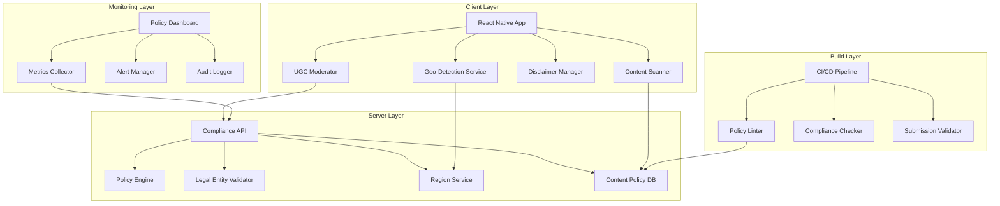
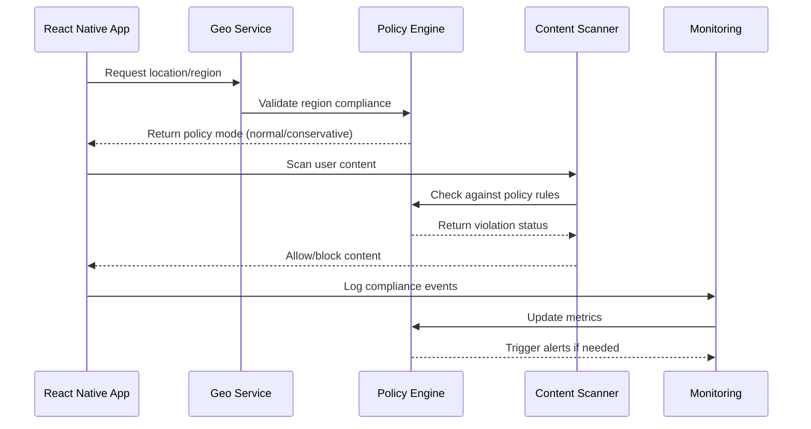

# Design Document

## Overview

The App Store Policy Guardrails system provides comprehensive compliance automation for GrowBro to ensure adherence to Apple App Store and Google Play Store policies. The system implements geo-fencing, legal entity verification, automated content scanning, educational disclaimers, and real-time compliance monitoring to prevent policy violations before they impact app store approval.

### Key Goals

1. **Reviewer Mode & Kill Switches:** Ship a single remote flag to disable Community + AI Diagnosis + sharing in one go; expose a "Reviewer Notes" screen with purpose, no commerce statement, age gate, geo toggles, privacy URL, and support email to reduce review back-and-forth.

2. **Conservative Mode Over Lockouts:** Prefer Conservative Mode (read-only community, neutral copy, stronger disclaimers) over hard app lockouts except where law/store policy forces geofencing for legal cannabis features.

3. **2025 Compliance:** Apple's App Store age tiers are 4+/9+/13+/16+/18+ with App Store Connect questionnaire deadline Jan 31, 2026. Google Play target API requirements mandate Android 15 / API 35 for new/updated apps by Aug 31, 2025 with extension to Nov 1, 2025; existing apps must target at least API 34. Google Play Photos/Videos permission guidance states READ_MEDIA_IMAGES/READ_MEDIA_VIDEO must be limited to core features and declared via Play Console with full compliance by late May 2025.

The design follows a multi-layered approach with client-side enforcement, server-side validation, build-time checks, and runtime monitoring to create a robust compliance framework that adapts to different jurisdictions and policy requirements.

## Architecture

### High-Level Architecture



### Component Interaction Flow



## Components and Interfaces

### 1. Geo-Detection Service

**Purpose:** Determines user location and applies appropriate policy restrictions without requiring sensitive location permissions.

**Interface:**

```typescript
interface GeoDetectionService {
  getCurrentRegion(): Promise<RegionInfo>;
  validateRegionCompliance(region: RegionInfo): PolicyFeatures;
  onRegionChange(callback: (old: RegionInfo, new: RegionInfo, reason: string) => void): void;
  emitRegionModeChanged(old: RegionInfo, new: RegionInfo, reason: string): void;
}

interface RegionInfo {
  // Minimal region information for logging/auditing (no raw tokens)
  code: string;              // Region code (e.g., "us-west-1", "eu-central")
  tokenIdHash: string;       // SHA-256 hash of token's jti (first 12 hex chars)
  source: 'server_token' | 'manual_reviewer';
  confidence: number;        // 0..1
  issuedAtMs: number;
  expiresAtMs: number;       // <= 24h; recommend 6–12h
  reason?: 'foreground' | 'token_refresh' | 'manual_reviewer';
}

// PASETO v4.public Token Claims Structure
interface RegionTokenClaims {
  sub: string; // Install-scoped ID: random UUID v4 generated on first run, stored in secure storage; optionally hashed with an app-specific salt. Never derive from hardware/device IDs.
  cnt: string; // Continent code (EU, NA, AS, AF, SA, OC, AN)
  cty: string; // Country code (ISO 3166-1 alpha-2)
  area: string; // Coarse geographic area (central, west, east, north, south)
  iat: number; // Issued at timestamp (Unix timestamp)
  exp: number; // Expiration timestamp (Unix timestamp, max 24h from iat)
  jti: string; // Unique token ID (UUID v4) for replay protection
}

// Example RegionInfo for logging/auditing (raw tokens never logged):
// {
//   "code": "us-west-1",
//   "tokenIdHash": "<PLACEHOLDER_TOKEN_ID_HASH>",
//   "source": "server_token",
//   "confidence": 0.95,
//   "issuedAtMs": 1699123456000,
//   "expiresAtMs": 1699209856000,
//   "reason": "token_refresh"
// }
//
// NOTE: Raw region tokens must NEVER be emitted to logs, telemetry, or audit trails.
// Only the truncated SHA-256 hash of the token's jti claim should be recorded for auditing.

interface PolicyFeatures {
  cannabis: boolean;
  communityReadOnly: boolean;
  aiInference: boolean;
  sharing: boolean;
  strongerDisclaimers: boolean;
}
```

### Security Benefits of Signed Tokens

The replacement of colon-delimited tokens with signed tokens provides several security improvements:

- **Cryptographic Integrity**: Tokens are cryptographically signed, preventing tampering
- **Authentication**: Server-only token issuance ensures authenticity
- **Replay Protection**: JTI claims prevent token reuse attacks
- **Token Binding**: App install hash binding prevents cross-device token reuse
- **Expiration Control**: Proper expiration handling with configurable TTL
- **Key Rotation**: KID support enables secure key rotation without service disruption
- **No IP Exposure**: Raw IP/ASN data never leaves the server
- **Standard Libraries**: Uses battle-tested PASETO/JWT libraries with known security properties

**Migration Path:**

- Phase 1: Deploy server-side signed token generation alongside existing format
- Phase 2: Update clients to accept and validate signed tokens
- Phase 3: Deprecate colon-delimited format after client rollout
- Phase 4: Remove legacy token support

**Implementation Strategy:**

- **MANDATE SERVER-SIDE IP→REGION RESOLUTION**: Call Region Service on server, produce coarse region token (no raw IP/ASN), return to clients
- **EXPLICITLY FORBID CLIENT IP CAPTURE**: Clients MUST NOT capture/store IP/ASN for geolocation; accept only region tokens
- **REGION TOKEN SPECIFICATIONS**:
  - **Format**: PASETO v4.public signed token (fallback to JWT with ES256/EdDSA)
  - **Server-side only issuance**: Tokens generated exclusively by server with server key
  - **Required Claims**:
    - `sub`: App install hash (binds token to specific app installation)
    - `cnt`: Continent code (e.g., "EU", "NA", "AS")
    - `cty`: Country code (e.g., "DE", "US", "GB")
    - `area`: Coarse geographic area (e.g., "central", "west", "east")
    - `iat`: Issued at timestamp (Unix timestamp)
    - `exp`: Expiration timestamp (TTL max 24h, recommend 6-12h)
    - `jti`: Unique token ID for replay protection
  - **Key Identification**:
    - **JWT**: "kid" (Key ID) field in JWT header for key rotation support
    - **PASETO**: Key identification handled via footer or server-managed key resolution (no JWT-style headers)
  - **Security Features**:
    - Cryptographic signature using server private key
    - Token binding to app install hash prevents replay attacks
    - JTI-based replay protection with server-side tracking
    - No raw IP/ASN data ever exposed in token payload
  - **TTL**: 24 hours maximum, recommend 6-12 hours for security
  - **Granularity**: Continent + country + coarse geographic area (e.g., EU:DE:central, NA:US:west)
- Re-evaluate region on app foreground and server token refresh events
- Apply policy toggles within 5 minutes (not 24 hours)
- If no signals available, default to Conservative Mode
- Emit region_mode_changed telemetry events for audit trail
- Background location requires special Play declaration - avoid unless core functionality

### Client-Side Restrictions

**MANDATORY REQUIREMENTS:**

- **NO IP CAPTURE**: Clients MUST NOT capture, store, or transmit raw IP addresses or ASN data for geolocation purposes
- **SIGNED TOKEN VALIDATION**: Clients MUST validate token signatures, expiration, issuer, and token-binding checks using standard PASETO/JWT libraries
- **TOKEN-ONLY ACCEPTANCE**: Clients MUST accept and use only server-provided signed region tokens for geolocation decisions
- **FORBIDDEN IP LOOKUPS**: Clients MUST NOT perform any IP-based geolocation lookups (GeoIP services, IP databases, etc.)
- **SERVER VALIDATION**: All region-based decisions MUST be validated server-side with audit logging
- **TOKEN BINDING VERIFICATION**: Clients MUST verify token is bound to their app install hash

### Implementation Tasks

**Phase 1: Client Cleanup**

- [ ] Remove all client-side IP capture code paths in geolocation services
- [ ] Remove any IP-based geolocation libraries or dependencies
- [ ] Install and configure PASETO library (paseto.js) or JWT library (jose) for token validation
- [ ] Update client geolocation logic to accept only signed region tokens
- [ ] Add client-side validation for token signatures, expiration, and JTI replay protection
- [ ] Add client-side validation to reject non-signed-token region sources
- [ ] Implement app install hash generation and token binding verification

**Phase 2: Server Region Service**

- [ ] Implement server-side Region Service with IP→region resolution
- [ ] Install and configure PASETO library (paseto) for token generation
- [ ] Add signed region token generation with required claims (sub, cnt, cty, area, iat, exp, jti, kid)
- [ ] Implement server-side key management for token signing
- [ ] Add JTI generation and replay protection database/storage
- [ ] Add app install hash validation and token binding
- [ ] Implement token TTL management (max 24h, recommend 6-12h)
- [ ] Add server-side caching for region lookups (with appropriate TTL)

**Phase 3: Server-Side Validation & Telemetry**

- [ ] Add server-side validation for all region-based policy decisions
- [ ] Implement server-side token validation (signature, expiration, issuer, token-binding)
- [ ] **MANDATORY SERVER-SIDE JTI PROTECTION**: Server MUST persist JTIs with TTL, reject reused JTI values, log validation attempts for audit, and expose clear error codes for replay attempts so clients only perform signature/exp/issuer/token-binding checks while the server handles replay prevention and auditing
  - **JTI Store Implementation:**
    - Deploy authoritative JTI store using Redis or database with atomic operations
    - Use atomic check-and-set operations to record JTIs on successful validation
    - Reject tokens with existing JTIs to prevent replay attacks
    - Set JTI TTL to match token expiration with ±5 minute tolerance for clock skew
    - Implement distributed locking to prevent race conditions during concurrent validations
  - **Audit & Monitoring:**
    - Log all JTI validation events (accept/reject) with timestamps, client IP, user agent, and validation context
    - Implement metrics dashboard for JTI collision rates, validation success/failure ratios, and anomaly detection
    - Alert on unusual patterns like high collision rates or geographic anomalies
  - **Revocation Pathway:**
    - Support immediate JTI revocation by marking entries as revoked or deleting them entirely
    - Implement bulk revocation capabilities for security incidents (key compromise, breach response)
    - Maintain detailed revocation audit trail with justification, approver identity, and timestamp
    - Ensure revoked JTIs fail validation even within their TTL window
- [ ] Add audit logging for region token issuance, validation, and usage
- [ ] Implement token revocation mechanism for security incidents
- [ ] Add monitoring for token validation failures and anomalies
- [ ] Add telemetry tracking for region token lifecycle (issuance, expiration, refresh)

### 2. Content Policy Scanner

**Purpose:** Scans all static content for policy violations using configurable rulesets.

**Interface:**

```typescript
interface ContentPolicyScanner {
  scanText(content: string, language: string): Promise<ScanResult>;
  scanAssets(assets: AssetManifest): Promise<ScanResult[]>;
  scanStoreContent(listing: StoreListing): Promise<ScanResult>;
  scanPushTemplates(templates: PushTemplate[]): Promise<ScanResult[]>;
  updateRuleset(version: string): Promise<void>;
  validateSubmissionContent(): Promise<ComplianceReport>;
  createWaiver(
    violation: PolicyViolation,
    justification: string,
    approver: string
  ): Promise<void>;
}

interface ScanResult {
  violations: PolicyViolation[];
  confidence: number;
  ruleset: string;
  timestamp: Date;
  humanReadableDiff?: string;
}

interface PolicyViolation {
  id?: string;
  type: 'commerce' | 'illegal_activity' | 'age_inappropriate';
  severity: 'low' | 'medium' | 'high' | 'critical';
  pattern: string;
  context: string; // file, screen, listing, push_template
  policyReference: string; // e.g., "Play > Marijuana"
  remediation: string;
  sample?: string; // offending snippet
}
```

**Scanning Surfaces & Patterns:**

- **Surfaces:** App strings (EN/DE), store descriptions, screenshot captions, release notes, push templates
- **Commerce patterns:** order/cart/checkout/pickup/delivery/price symbols/THC mg per €
- **Contact patterns:** WhatsApp/Telegram handles, phone numbers, "DM to buy"
- **Cannabis commerce:** strain prices, menu references, meet-up coordination
- **CI Integration:** Fail builds on hits with policy citations (e.g., "Play > Marijuana")
- **Waiver system:** Authorized approvers can accept risk with justification and audit trail

### 3. Legal Entity Validator

**Purpose:** Validates legal entity requirements before app store submission.

**Interface:**

```typescript
interface LegalEntityValidator {
  validateEntity(): Promise<EntityValidationResult>;
  checkSubmissionReadiness(): Promise<SubmissionChecklist>;
  generateComplianceCertificate(): Promise<ComplianceCertificate>;
  validateAppleRequirements(): Promise<AppleValidationResult>;
  validateGoogleRequirements(): Promise<GoogleValidationResult>;
}

interface EntityValidationResult {
  isLegalEntity: boolean; // Must be Organization, not Individual
  hasValidSupport: boolean;
  hasPrivacyPolicy: boolean;
  hasDUNS: boolean; // Apple requirement for highly regulated apps
  playConsoleComplete: boolean; // App Content declarations
  geoRestrictionStatement: boolean; // Required for cannabis features
  targetApiLevel: number; // Must be Android 14 (API 35) for new updates from Aug 31, 2025
  photosVideosDeclaration: boolean; // Google Play 2025 requirement
  violations: string[];
}

interface SubmissionChecklist {
  apple: AppleRequirements;
  google: GoogleRequirements;
  readyForSubmission: boolean;
  blockers: string[];
  policyReferences: string[]; // Specific policy sections that apply
}
```

### 4. Disclaimer Manager

**Purpose:** Manages contextual educational disclaimers throughout the app.

**Interface:**

```typescript
interface DisclaimerManager {
  getAgeGateDisclaimer(region: RegionInfo): AgeGateConfig;
  getContextualDisclaimer(context: DisclaimerContext): string;
  injectShareDisclaimer(content: string): string;
  trackAcknowledgment(userId: string, version: string): void;
  requiresReacknowledgment(userId: string): boolean;
  currentVersion(): string;
}

interface AgeGateConfig {
  minimumAge: number; // Use Apple's new rating tiers (13+/16+/18+)
  title: string;
  description: string;
  acceptText: string;
  rejectText: string;
  isNeutral: boolean; // No nudging per Apple 5.1.1(iv)
  gatesCannabisContent: boolean; // Block <18 from cannabis features
}

enum DisclaimerContext {
  AI_DIAGNOSIS = 'ai_diagnosis', // "Educational horticulture guidance only; not medical advice"
  PLAYBOOKS = 'playbooks',
  COMMUNITY_SHARE = 'community_share',
  CULTIVATION_CONTENT = 'cultivation_content',
}
```

### 5. UGC Moderation System

**Purpose:** Implements robust user-generated content moderation per Google Play UGC policy.

**Interface:**

```typescript
interface UGCModerationSystem {
  prePublishCheck(content: UGCContent): Promise<ModerationResult>;
  reportContent(contentId: string, reason: string): Promise<void>;
  blockUser(userId: string, reason: string): Promise<void>;
  autoHideContent(contentId: string, reportCount: number): Promise<void>;
  appealDecision(contentId: string, appeal: string): Promise<void>;
  getModerationMetrics(): Promise<ModerationMetrics>;
}

interface ModerationResult {
  approved: boolean;
  confidence: number;
  flags: ModerationFlag[]; // commerce/meetup/price/contact patterns
  undoTimeoutMs: number; // 15000 (15 seconds)
  rateLimited: boolean;
}

interface ModerationMetrics {
  totalReports: number;
  autoHides: number;
  appeals: number;
  slaBreaches: number;
  averageResponseTime: number;
  autoHideThreshold: number; // configurable (e.g., 3 reports)
}
```

### 6. Build & Release Pipeline

**Purpose:** Automated policy compliance validation during CI/CD to prevent policy violations before submission.

**Interface:**

```typescript
interface BuildPolicyValidator {
  validatePolicyCompliance(): Promise<BuildValidationResult>;
  lintContent(): Promise<PolicyLintResult>;
  validateTargetApiLevel(): Promise<ApiLevelValidationResult>;
  validatePermissionDeclarations(): Promise<PermissionValidationResult>;
  validateAgeRating(): Promise<AgeRatingValidationResult>;
}

interface BuildValidationResult {
  passed: boolean;
  violations: PolicyViolation[];
  blockers: string[];
  policyReferences: string[]; // e.g., "Play > Marijuana", "Apple 1.4.3"
}

interface PolicyLintResult {
  violations: PolicyViolation[];
  humanReadableDiff: string;
  affectedFiles: string[];
  policySection: string;
}
```

**Validation Gates:**

- **Policy Linter (CI):** Fails builds on flagged terms in app strings, store listing, and push templates
- **Target API Level:** Block release if target < Android 14 (API 35) for new updates from Aug 31, 2025
- **Permission Declarations:** Enforce Play Photos/Videos and Background Location declarations
- **Apple Age Rating:** Validate new age categories are used and match in-app gating
- **Legal Entity Check:** Ensure seller is organization with required documentation

## Data Models

### Policy Configuration

```typescript
interface PolicyConfig {
  version: string;
  regions: RegionPolicyMap;
  contentRules: ContentRuleSet;
  disclaimers: DisclaimerSet;
  features: FeatureFlagMap;
  lastUpdated: Date;
}

interface RegionPolicyMap {
  [countryCode: string]: {
    mode: PolicyMode;
    features: {
      cannabis: boolean;
      community: boolean;
      aiInference: boolean;
      sharing: boolean;
    };
    disclaimers: string[];
    ageGate: AgeGateConfig;
  };
}

interface ContentRuleSet {
  version: string;
  rules: PolicyRule[];
  languages: string[];
}

interface PolicyRule {
  id: string;
  type: 'regex' | 'keyword' | 'ml_classifier';
  pattern: string;
  severity: 'low' | 'medium' | 'high' | 'critical';
  policyReference: string;
  description: string;
  remediation: string;
}
```

### Compliance Audit Trail

```typescript
interface ComplianceEvent {
  id: string;
  timestamp: Date;
  type:
    | 'region_change'
    | 'content_violation'
    | 'policy_update'
    | 'user_action'
    | 'waiver_granted';
  userId?: string;
  region: RegionInfo;
  details: Record<string, any>;
  policyVersion: string;
}

interface ComplianceWaiver {
  id: string;
  violationId: string;
  justification: string;
  approver: string;
  timestamp: Date;
  expiresAt?: Date;
}

interface RegionModeChange {
  id: string;
  userId: string;
  oldRegion: RegionInfo;
  newRegion: RegionInfo;
  reason: string;
  timestamp: Date;
  featuresChanged: string[];
}

interface PolicyLintFinding {
  id: string;
  buildId: string;
  file: string;
  line: number;
  pattern: string;
  policyReference: string;
  severity: string;
  timestamp: Date;
}

interface ComplianceReport {
  generatedAt: Date;
  period: DateRange;
  summary: ComplianceSummary;
  violations: PolicyViolation[];
  metrics: ComplianceMetrics;
  recommendations: string[];
  auditTrail: ComplianceEvent[];
}
```

## Error Handling

### Client-Side Error Handling

1. **Region Token Failures:**

   - Fallback to manual country selection with alternatives per Apple 5.1.1(iv)
   - Default to Conservative Mode for unknown regions or token validation failures
   - Cache last known good region token with TTL expiration
   - Log all token validation failures server-side for audit trail

2. **Server Region Service Failures:**

   - Implement circuit breaker pattern for Region Service calls
   - Fallback to cached region mappings with extended TTL during outages
   - Alert monitoring systems for service degradation
   - Provide manual region override capability for critical scenarios

3. **Content Scanning Failures:**

   - Fail-safe to block content on scanner errors
   - Provide manual override for authorized users with audit trail
   - Log all scanner failures for investigation

4. **Network Connectivity Issues:**

   - Cache policy configurations locally with versioning
   - Implement offline-first compliance checks
   - Queue compliance events for sync when connectivity restored

5. **Graceful Feature Restrictions:**
   - Show clear explainers when features are disabled by region/policy
   - Keep calendar and educational content accessible (avoid "dead app" UX)
   - Apply region changes within minutes on foreground, not 24 hours

### Server-Side Error Handling

1. **Region Service Failures:**

   - Implement circuit breaker pattern for IP→region resolution
   - Fallback to cached region mappings during service outages
   - Alert monitoring systems immediately for service degradation
   - Maintain audit trail of all region resolution attempts and failures

2. **Token Generation Failures:**

   - Fallback to conservative region defaults during token generation errors
   - Log all token generation failures with IP metadata (server-side only)
   - Implement token regeneration retry logic with exponential backoff
   - Alert security team for potential token signing key issues

3. **Legal Entity Validation Errors:**
   - Block builds on validation failures
   - Provide detailed error messages with remediation steps
   - Maintain audit trail of all validation attempts

## Data & Security

### Photo Privacy & Data Minimization

**Purpose:** Implement privacy-first data handling aligned with App Privacy and Play Data Safety requirements.

**Implementation:**

```typescript
interface PhotoPrivacyManager {
  stripEXIFGPS(photo: Photo): Promise<Photo>;
  requireCloudProcessingOptIn(): Promise<boolean>;
  enableDataPurge(userId: string): Promise<void>;
  alignPrivacyDisclosures(): Promise<PrivacyAlignment>;
}

interface PrivacyAlignment {
  appPrivacyAnswers: AppPrivacyDeclaration[];
  playDataSafety: DataSafetyDeclaration[];
  aligned: boolean;
  discrepancies: string[];
}
```

**Key Requirements:**

- Strip EXIF GPS data from photos by default before any upload
- Default to local processing; require explicit opt-in for cloud processing
- Easy data revoke → purge functionality for users
- Align App Privacy answers with Play Data Safety declarations
- Follow data minimization principles for all data collection

### Audit Trail & Due Diligence

**Purpose:** Maintain comprehensive audit trails to prove due diligence during app store reviews.

**Entities:**

- `ComplianceWaiver`: Track all policy violation waivers with justification
- `RegionModeChange`: Log all region-based policy changes with reasons
- `PolicyLintFinding`: Record all build-time policy violations found
- `UGCModerationAction`: Track all content moderation decisions and appeals

## Testing Strategy

### Unit Testing

1. **Region Service Tests:**

   - Mock server-side IP→region resolution with various IP ranges
   - Test region token generation, signing, and validation
   - Validate token TTL enforcement and expiration handling
   - Test coarse granularity mapping (continent:country:area)
   - Verify no raw IP/ASN data leakage in tokens

2. **Client Token Acceptance Tests:**

   - Test client rejection of non-token region sources
   - Validate client-side token parsing and validation
   - Test token refresh logic and expiration handling
   - Verify clients never perform IP lookups for geolocation

3. **Content Scanner Tests:**

   - Test against known violation patterns
   - Validate false positive handling
   - Test ruleset updates and versioning

4. **Disclaimer Manager Tests:**
   - Test contextual disclaimer injection
   - Validate age gate configurations
   - Test acknowledgment tracking

### Integration Testing

1. **End-to-End Policy Flows:**

   - Test complete user journey in different regions
   - Validate policy mode changes and feature toggles
   - Test content moderation workflows with appeals

2. **Build Pipeline Testing:**

   - Test policy compliance checks in CI/CD with failure scenarios
   - Validate submission readiness checks for both Apple and Google
   - Test compliance certificate generation with all required fields

3. **End-to-End "Reviewer Run":**
   - Script that flips all kill switches for app store review
   - Shows Reviewer Notes screen with compliance information
   - Scrubs risky copy and demonstrates Conservative Mode

### Compliance Testing

1. **App Store Policy Validation:**

   - Test against Apple App Store Review Guidelines (1.4.3, 5.1.1(iv))
   - Validate Google Play Store policy compliance (Marijuana, UGC policies)
   - Test age-gating with Apple's new rating tiers (13+/16+/18+)
   - Validate geo-restriction features for cannabis content

2. **UGC Compliance Testing:**

   - Ensure report/block functionality works as required by Play UGC policy
   - Test auto-hide triggers and thresholds
   - Validate appeals process exists and functions
   - Test moderator tooling and SLA compliance

3. **Regional Compliance Testing:**
   - Test policy enforcement in different jurisdictions
   - Validate disclaimer accuracy and version tracking
   - Test feature availability by region with remote config

### Performance Testing

1. **Region Service Performance:**

   - Test IP→region resolution speed and accuracy across global IP ranges
   - Validate token generation and signing performance
   - Test server-side caching effectiveness for region lookups
   - Measure token validation overhead on client and server
   - Benchmark coarse granularity mapping performance

2. **Token Lifecycle Performance:**

   - Test token refresh timing and network overhead
   - Validate TTL enforcement and expiration handling
   - Measure impact of token-based approach vs. client-side IP lookups
   - Test concurrent token validation under load

3. **Content Scanning Performance:**
   - Test scanning speed for large content volumes
   - Validate memory usage during scanning
   - Test concurrent scanning operations

## Security Considerations

### Data Privacy

1. **Region Token Security:**

   - **Signing Algorithm:** Use PASETO v4.public for token signing, providing modern cryptographic security with forward secrecy and resistance to common JWT vulnerabilities
   - **Token Headers:** Require "kid" (Key ID) field in all token headers to identify the specific key used for signing/verification
   - **Key Rotation:** Implement automatic key rotation every 90 days with cryptographic key generation using secure entropy sources
   - **Key Overlap:** Maintain previous signing keys for a 24-hour grace period during rotation to validate tokens issued before the rotation event
   - **Public Key Exposure:** Expose current and previous public keys via a dedicated PASETO public-key endpoint for client-side verification
   - **Token TTL Enforcement:** Enforce maximum token Time-To-Live of 24 hours at issuance to limit exposure window
   - **Clock-Skew Tolerance:** Implement validation with ±5 minutes tolerance when checking nbf (not before), exp (expiration), and iat (issued at) claims
   - **Audit Logging:** Implement comprehensive audit logging of all key operations including generation, rotation events, and verification attempts
   - Use coarse geographic granularity to minimize privacy risks
   - Never expose raw IP addresses or ASN data to clients
   - Implement server-side audit logging for all token operations

2. **IP Data Handling (Server-Only):**

   - Minimize IP data collection and retention on server
   - Use IP→region resolution only for policy compliance
   - Implement data retention policies for IP logs
   - Encrypt IP data at rest and in transit
   - Regular security audits of IP handling procedures

3. **User Content Protection:**
   - Encrypt sensitive compliance data
   - Implement secure content scanning
   - Protect user privacy during moderation

### Access Control

1. **Administrative Functions:**

   - Role-based access for policy management
   - Audit trail for all administrative actions
   - Multi-factor authentication for sensitive operations

2. **Content Moderation:**
   - Secure moderator interfaces
   - Audit trail for moderation decisions
   - Appeal process security

## Monitoring and Alerting

### Policy Dashboard

**Purpose:** Real-time compliance monitoring with leading indicators and actionable insights.

**Key Metrics:**

1. **Compliance Metrics:**

   - Age-gate pass rate and regional variations
   - Region mode distribution (Normal/Conservative/Restricted)
   - % low-confidence AI results (forces "ask community" fallback)
   - Policy-blocked content attempts by type and severity
   - User acknowledgment rates for disclaimers by version

2. **UGC Moderation Metrics:**

   - Total reports, auto-hides, appeals processed
   - Moderation SLA compliance and breach alerts
   - Average response time for moderation decisions
   - False positive/negative rates in content detection

3. **Build & Release Metrics:**
   - Policy lint findings by build and severity
   - Submission readiness check pass/fail rates
   - Legal entity validation status and blockers

### Alert Conditions

1. **Critical Alerts:**

   - Policy violation detection in production content
   - Build compliance check failures blocking releases
   - Legal entity validation failures
   - UGC moderation SLA breaches exceeding thresholds

2. **Warning Alerts:**
   - High false positive rates in content scanning (>10%)
   - Geo-detection accuracy degradation (<95%)
   - Unusual spikes in policy-blocked content attempts
   - Disclaimer acknowledgment rates dropping below baseline

## Deployment Strategy

### Phased Rollout

1. **Phase 1: Core Infrastructure**

   - Deploy geo-detection service
   - Implement basic content scanning
   - Set up monitoring and alerting

2. **Phase 2: Policy Enforcement**

   - Enable policy mode enforcement
   - Deploy disclaimer management
   - Implement build-time compliance checks

3. **Phase 3: Advanced Features**
   - Deploy UGC moderation system
   - Enable real-time policy updates
   - Implement compliance dashboard

### Feature Flags

All compliance features will be controlled by feature flags to enable:

- Gradual rollout to user segments
- Quick rollback in case of issues
- A/B testing of compliance approaches
- Regional feature toggling

## Maintenance and Updates

### Policy Rule Updates

1. **Automated Updates:**

   - Regular sync with app store policy changes
   - Automated ruleset version management
   - Backward compatibility validation

2. **Manual Updates:**
   - Emergency policy rule deployment
   - Custom rule creation for specific violations
   - Regional policy customization

### Compliance Monitoring

1. **Continuous Monitoring:**

   - Real-time policy compliance tracking
   - Automated violation detection
   - Proactive alert generation

2. **Regular Audits:**
   - Monthly compliance report generation
   - Quarterly policy effectiveness review
   - Annual compliance strategy assessment
