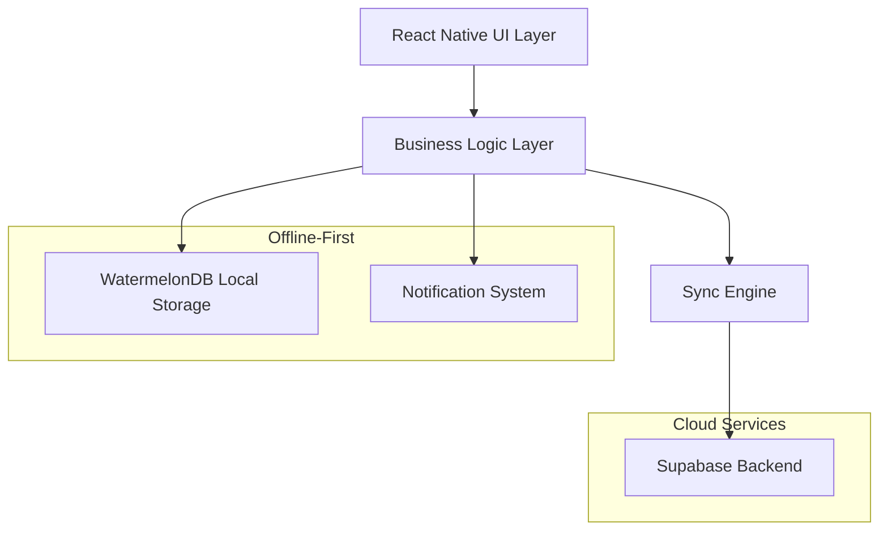
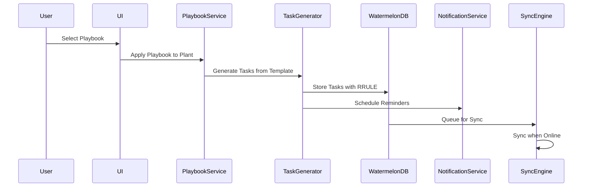

# Design Document

## Overview

The Guided Grow Playbooks feature provides a comprehensive system for cannabis cultivation guidance through structured, templated schedules that automatically generate calendar tasks. The system is built on an offline-first architecture using WatermelonDB for local storage, with robust sync capabilities to Supabase backend services.

The design emphasizes user experience through intelligent defaults, flexible customization, and seamless offline functionality while maintaining strict compliance with app store policies and cannabis regulations.

## Architecture

### High-Level Architecture



### Data Flow Architecture



## Components and Interfaces

```typescript
export type TaskStatus = 'pending' | 'completed' | 'skipped';
```

### Core Components

#### 1. PlaybookService

**Responsibility**: Manages playbook selection, application, and customization logic with idempotency and conflict handling.

```typescript
interface PlaybookService {
  // Playbook Management
  getAvailablePlaybooks(): Promise<Playbook[]>;
  getPlaybookPreview(playbookId: string): Promise<PlaybookPreview>; // Shows total weeks, phase durations, task counts
  applyPlaybookToPlant(
    playbookId: string,
    plantId: string,
    options?: {
      idempotencyKey?: string;
      allowMultiple?: boolean;
    }
  ): Promise<{ appliedTaskCount: number; durationMs: number; jobId: string }>;

  // Schedule Management
  shiftPlaybookSchedule(
    plantId: string,
    daysDelta: number,
    flags?: {
      includeCompleted?: boolean;
      includeManuallyEdited?: boolean;
    }
  ): Promise<ShiftPreview>;
  confirmScheduleShift(plantId: string, shiftId: string): Promise<void>;
  undoScheduleShift(plantId: string, shiftId: string): Promise<void>; // Restores RRULEs and notifications atomically

  // AI Integration
  suggestScheduleAdjustments(
    plantId: string,
    context: AdjustmentContext
  ): Promise<Suggestion[]>;
  applyAISuggestion(plantId: string, suggestionId: string): Promise<void>;

  // Validation
  validateOneActivePlaybookPerPlant(
    plantId: string,
    playbookId: string
  ): Promise<boolean>;
}
```

#### 2. TaskGenerator

**Responsibility**: Converts playbook templates into concrete calendar tasks with RFC 5545 compliant RRULE patterns and timezone-aware calculations.

```typescript
interface TaskGenerator {
  generateTasksFromPlaybook(playbook: Playbook, plant: Plant): Promise<Task[]>; // Batched operations
  generateRRULE(
    taskTemplate: TaskTemplate,
    startDate: Date,
    timezone: string
  ): string; // RFC 5545 compliant
  calculateTaskDueDates(
    playbook: Playbook,
    plantStartDate: Date,
    timezone: string
  ): TaskSchedule; // DST-safe
  validateRRULEPattern(
    rrule: string
  ): { valid: true } | { valid: false; reason: string }; // Uses `rrule` parser plus semantic checks (COUNT vs UNTIL, BYDAY/BYMONTHDAY)
  nextOccurrence(
    rrule: string,
    after: Date,
    timezone: string,
    dtstartIso?: string
  ): Date | null; // Timezone-aware calculation using `rrule` + `luxon`
  getAnchorDate(playbook: Playbook, plant: Plant): Date; // plant.startDate or phase.startDate
}
```

#### 3. NotificationScheduler

**Responsibility**: Manages local notification scheduling with Android/iOS compatibility, channels, and power management.

```typescript
interface NotificationScheduler {
  // Core scheduling
  scheduleTaskReminder(task: Task): Promise<string>;
  cancelTaskReminder(notificationId: string): Promise<void>;
  rescheduleTaskReminder(task: Task): Promise<void>;
  rehydrateNotifications(): Promise<void>; // Called on app start

  // Android-specific handling
  ensureChannels(): Promise<void>; // Create notification channels on startup
  canUseExactAlarms(): Promise<boolean>; // Check Android 12+ (API 31) permissions
  requestExactAlarmPermission(): Promise<boolean>;
  handleDozeMode(): Promise<void>; // Fallback strategies

  // Health monitoring
  verifyDelivery(notificationId: string): Promise<boolean>;
  getDeliveryStats(): Promise<NotificationStats>;
}
```

#### 4. SyncEngine

**Responsibility**: Handles offline-first synchronization with Supabase backend using single entry point and idempotent operations.

```typescript
interface SyncEngine {
  synchronize(): Promise<SyncResult>; // Single entry point for all sync operations
  pullChanges(lastPulledAt: number): Promise<Changes>;
  pushChanges(changes: Changes, idempotencyKey: string): Promise<PushResult>; // Idempotent with header
  handleConflicts(conflicts: Conflict[]): Promise<Resolution[]>; // LWW with user notification
  queueOfflineChanges(changes: Changes): Promise<void>;

  // Conflict resolution
  showConflictDiff(localData: any, remoteData: any): Promise<void>; // Non-blocking toast with "View changes"
  restoreLocalVersion(conflictId: string): Promise<void>; // One-tap restore to local

  // Health monitoring
  getSyncStats(): Promise<SyncStats>; // Latency, fail rate, etc.
}
```

#### 5. TrichomeHelper

**Responsibility**: Provides educational harvest timing guidance through trichome assessment with disclaimers.

```typescript
interface TrichomeHelper {
  getAssessmentGuide(): TrichomeGuide; // Educational content with disclaimers
  logTrichomeCheck(assessment: TrichomeAssessment): Promise<void>;
  suggestHarvestAdjustments(
    assessment: TrichomeAssessment
  ): Promise<HarvestSuggestion[]>; // Nudges with confirmation, no auto-moves
  getHarvestWindows(strainType: StrainType): HarvestWindow[]; // Range + disclaimer text, no product recommendations
  getMacroPhotographyTips(): PhotographyTips; // Lighting and technique guidance
}
```

### Data Models

#### Playbook Model

```typescript
interface Playbook {
  id: string;
  name: string;
  setup: 'auto_indoor' | 'auto_outdoor' | 'photo_indoor' | 'photo_outdoor';
  locale: string;
  phaseOrder: Phase[];
  steps: PlaybookStep[];
  metadata: PlaybookMetadata;
  createdAt: Date;
  updatedAt: Date;
}

interface PlaybookStep {
  id: string;
  phase: 'seedling' | 'veg' | 'flower' | 'harvest';
  title: string;
  descriptionIcu: string;
  relativeDay: number;
  rrule?: string;
  defaultReminderLocal: string; // HH:mm format
  taskType: TaskType;
  durationDays?: number;
  dependencies: string[];
}
```

#### Task Model (WatermelonDB)

```typescript
@model('tasks')
class Task extends Model {
  @field('plant_id') plantId!: string;
  @field('playbook_id') playbookId!: string;
  @field('origin_step_id') originStepId!: string; // Immutable traceability
  @field('phase_index') phaseIndex!: number; // Speed up progress queries
  @field('title') title!: string;
  @field('description') description!: string;
  @field('due_date') dueDate!: string; // YYYY-MM-DD
  @field('recurrence_rule') recurrenceRule?: string; // RFC 5545 RRULE
  @field('reminder_at') reminderAt!: string; // ISO datetime
  @field('status') status!: TaskStatus;
  @json('flags', sanitizeFlags) flags!: TaskFlags; // manualEdited, excludeFromBulkShift
  @field('notification_id') notificationId?: string; // For reliable cancel/reschedule
  @field('created_at') createdAt!: number;
  @field('updated_at') updatedAt!: number;
  @field('deleted_at') deletedAt?: number;
}

interface TaskFlags {
  manualEdited: boolean;
  excludeFromBulkShift: boolean;
}
```

## Error Handling

### Typed Error System

```typescript
// Stable error codes for analytics and user messaging
enum ErrorCode {
  RRULE_INVALID_FORMAT = 'RRULE_INVALID_FORMAT',
  RRULE_MISSING_FREQ = 'RRULE_MISSING_FREQ',
  NOTIFICATION_CHANNEL_MISSING = 'NOTIFICATION_CHANNEL_MISSING',
  NOTIFICATION_PERMISSION_DENIED = 'NOTIFICATION_PERMISSION_DENIED',
  SYNC_NETWORK_ERROR = 'SYNC_NETWORK_ERROR',
  SYNC_CONFLICT_DETECTED = 'SYNC_CONFLICT_DETECTED',
  PLAYBOOK_ALREADY_APPLIED = 'PLAYBOOK_ALREADY_APPLIED',
}

class RRULEError extends Error {
  constructor(
    public code: ErrorCode,
    message: string,
    public rrule?: string
  ) {
    super(message);
  }
}

class NotificationError extends Error {
  constructor(
    public code: ErrorCode,
    message: string,
    public taskId?: string
  ) {
    super(message);
  }
}

class SyncError extends Error {
  constructor(
    public code: ErrorCode,
    message: string,
    public retryable: boolean = true
  ) {
    super(message);
  }
}
```

### Offline Error Handling

```typescript
class OfflineErrorHandler {
  handleSyncFailure(error: SyncError): Promise<void> {
    // Queue changes for retry with exponential backoff
    // Show user-friendly offline indicator
    // Emit sync_fail_rate metric
    if (error.retryable) {
      return this.scheduleRetry(error);
    }
    return this.showPermanentError(error);
  }

  handleNotificationFailure(error: NotificationError): Promise<void> {
    // Fallback to in-app reminders
    // Log failure for analytics: notif_missed
    // Retry with WorkManager/JobScheduler on Android
    return this.createInAppReminder(error.taskId);
  }

  handleRRULEValidationError(error: RRULEError): Promise<void> {
    // Show localized error message with specific guidance
    // Provide fallback simple recurrence (daily/weekly)
    // Log for debugging with sanitized RRULE
    return this.showRRULEFallbackOptions(error);
  }
}
```

### Conflict Resolution Strategy

The system implements Last-Write-Wins (LWW) conflict resolution with user notification:

```typescript
class ConflictResolver {
  resolveTaskConflict(localTask: Task, remoteTask: Task): Resolution {
    if (remoteTask.updatedAt > localTask.updatedAt) {
      return {
        action: 'accept_remote',
        notification: 'Task updated on another device',
        showComparison: true,
      };
    }
    return { action: 'keep_local' };
  }

  showConflictNotification(conflicts: Conflict[]): void {
    // Display non-intrusive notification
    // Provide "View Changes" option
    // Allow manual resolution if needed
  }
}
```

## Testing Strategy

### Unit Testing

- **RRULE Generation**: Test all recurrence patterns (daily, weekly, custom intervals)
- **Task Generation**: Verify correct task creation from playbook templates
- **Notification Scheduling**: Mock notification system and verify scheduling logic
- **Conflict Resolution**: Test LWW logic with various timestamp scenarios
- **Schema Validation**: Validate all JSON schemas with edge cases

### Integration Testing

- **Offline Sync**: Test complete offline → online sync cycle
- **Notification Delivery**: Test on real devices with various power states
- **Performance**: Verify 60 FPS with 1k+ tasks in FlashList
- **Cross-Platform**: Test notification behavior on Android/iOS

### End-to-End Testing

```typescript
describe('Playbook E2E Flow', () => {
  test('Complete offline playbook workflow', async () => {
    // 1. Go offline
    await device.setNetworkConnection(false);

    // 2. Apply playbook
    await applyPlaybook('auto_indoor', 'plant_1');

    // 3. Shift schedule +3 days
    await shiftSchedule('plant_1', 3);

    // 4. Customize 5 tasks
    await customizeTasks(['task_1', 'task_2', 'task_3', 'task_4', 'task_5']);

    // 5. Mark 10 tasks complete
    await markTasksComplete(10);

    // 6. Go online and sync
    await device.setNetworkConnection(true);
    await waitForSync();

    // 7. Verify changes on second device
    await verifyChangesOnSecondDevice();
  });
});
```

### Performance Testing

- **FlashList Performance**: Automated frame rate monitoring
- **Memory Usage**: Monitor memory consumption with large datasets
- **Battery Impact**: Test notification scheduling impact on battery
- **Sync Performance**: Measure sync times with various data sizes

## Implementation Details

### RRULE Implementation

The system uses RFC 5545 compliant RRULE patterns with strict validation and timezone awareness:

```typescript
class RRULEGenerator {
  generateDailyRRULE(interval: number = 1): string {
    return `FREQ=DAILY;INTERVAL=${interval}`;
  }

  generateWeeklyRRULE(days: WeekDay[], interval: number = 1): string {
    const dayString = days.join(',');
    return `FREQ=WEEKLY;INTERVAL=${interval};BYDAY=${dayString}`;
  }

  generateCustomRRULE(template: TaskTemplate, timezone: string): string {
    // Handle complex recurrence patterns
    // Support timezone-aware calculations with DST handling
    // Validate against RFC 5545 spec
    const rrule = this.buildRRULE(template);
    if (!this.validateRRULEPattern(rrule)) {
      throw new RRULEError(
        ErrorCode.RRULE_INVALID_FORMAT,
        'Invalid RRULE format',
        rrule
      );
    }
    return rrule;
  }

  validateRRULEPattern(rrule: string): boolean {
    // Check FREQ appears first
    // Ensure no duplicate parts
    // Validate RFC 5545 ordering
    const parts = rrule.split(';');
    if (!parts[0].startsWith('FREQ=')) {
      return false;
    }

    const seenParts = new Set();
    for (const part of parts) {
      const [key] = part.split('=');
      if (seenParts.has(key)) {
        return false; // Duplicate part
      }
      seenParts.add(key);
    }

    return true;
  }

  nextOccurrence(rrule: string, after: Date, timezone: string): Date {
    // Timezone-aware calculation with DST handling
    // Use anchor date (plant.startDate or phase.startDate)
    // Handle spring/fall DST transitions
    return this.calculateNextInTimezone(rrule, after, timezone);
  }
}
```

The above ad-hoc validator is insufficient for full RFC 5545 compliance. We replace it with a library-backed approach (recommended: `rrule` / rrule.js) and explicit semantic checks. The implementation below shows the intended pattern using `rrule` together with `luxon` for timezone-aware DTSTART handling.

```typescript
import { RRule, rrulestr } from 'rrule';
import { DateTime } from 'luxon';

class RRULEGenerator {
  // NOTE: we use the `rrule` library (https://github.com/jakubroztocil/rrule)
  // for parsing/serializing RRULE strings and `luxon` for timezone-aware
  // DTSTART generation and conversions. This combination covers most
  // practical RFC 5545 needs while documenting known limitations below.

  generateDailyRRULE(interval: number = 1): string {
    const rule = new RRule({ freq: RRule.DAILY, interval });
    return rule.toString();
  }

  generateWeeklyRRULE(days: WeekDay[], interval: number = 1): string {
    const byweekday = days.map((d) => RRule[d as keyof typeof RRule]);
    const rule = new RRule({ freq: RRule.WEEKLY, interval, byweekday });
    return rule.toString();
  }

  generateCustomRRULE(
    template: TaskTemplate,
    timezone: string,
    startDate?: string
  ): string {
    // Build an RRule options object from the template, then validate
    // Parse/validate using rrulestr so the library surfaces syntax errors.
    const rruleString = this.buildRRULE(template);

    // Validate via library + semantic checks
    const validation = this.validateRRULEPattern(rruleString);
    if (!validation.valid) {
      throw new RRULEError(
        ErrorCode.RRULE_INVALID_FORMAT,
        validation.reason,
        rruleString
      );
    }

    // If a DTSTART (startDate) and timezone are provided, we attach DTSTART separately
    // and store it alongside the RRULE (recommended). rrule.js does not fully parse
    // TZID parameters inside RRULE strings; instead we generate a DTSTART using luxon
    // with the provided timezone and persist that value. Example storage model:
    // { recurrence_rule: 'FREQ=WEEKLY;BYDAY=MO', recurrence_start: '2025-08-26T09:00:00', timezone: 'America/Los_Angeles' }

    return rruleString;
  }

  validateRRULEPattern(
    rruleString: string
  ): { valid: true } | { valid: false; reason: string } {
    // Primary syntax validation: delegate to rrule parser which emits detailed errors
    try {
      // rrulestr will throw on invalid syntax
      const parsed = rrulestr(rruleString, { forceset: false });

      // Access options for semantic checks. The rrule instance exposes
      // `origOptions` which contains parsed rule parts in a JS-friendly form.
      // (Exact property names depend on the rrule version; this is conceptual.)
      // eslint-disable-next-line @typescript-eslint/no-explicit-any
      const opts: any =
        (parsed as any).origOptions || (parsed as any).options || {};

      // Semantic rule: COUNT and UNTIL are mutually exclusive (RFC 5545)
      if (opts.count && opts.until) {
        return {
          valid: false,
          reason: 'RRULE must not contain both COUNT and UNTIL',
        };
      }

      // Semantic rule: BYDAY and BYMONTHDAY exclusivity for our domain
      // (application-level constraint to avoid ambiguous monthly/weekly mixes)
      if (opts.byweekday && opts.bymonthday) {
        return {
          valid: false,
          reason: 'BYDAY and BYMONTHDAY must not be used together',
        };
      }

      // Ensure FREQ exists (library will normally enforce this)
      if (!opts.freq) {
        return { valid: false, reason: 'RRULE missing FREQ' };
      }

      // Enforce no duplicate rule parts (library parse already normalizes this)

      // Additional domain-specific checks can be added here (e.g., interval > 0)
      if (opts.interval !== undefined && opts.interval <= 0) {
        return { valid: false, reason: 'INTERVAL must be a positive integer' };
      }

      return { valid: true };
    } catch (err) {
      // Surface library parse errors to be handled by caller
      return {
        valid: false,
        reason: (err as Error).message || 'Invalid RRULE syntax',
      };
    }
  }

  nextOccurrence(
    rruleString: string,
    after: Date,
    timezone: string,
    dtstartIso?: string
  ): Date | null {
    // To compute timezone-aware occurrences we:
    // 1. Parse the RRULE using rrulestr
    // 2. If a DTSTART (with timezone) is provided, convert to a JS Date in UTC using luxon
    // 3. Ask the rrule instance for the next occurrence after `after` (in UTC)

    // Example (conceptual):
    try {
      const rruleObj = rrulestr(rruleString, { forceset: false }) as RRule;

      // If dtstartIso + timezone provided, convert and set as start
      if (dtstartIso) {
        const dt = DateTime.fromISO(dtstartIso, { zone: timezone }).toUTC();
        // rrule.js allows creating an RRule from options including dtstart. Re-create if needed.
        // For brevity we call rruleObj.after with a JS Date after converting `after` to UTC.
      }

      const next = (rruleObj as any).after(after, false);
      return next ? new Date(next) : null;
    } catch (err) {
      throw new RRULEError(
        ErrorCode.RRULE_INVALID_FORMAT,
        (err as Error).message,
        rruleString
      );
    }
  }
}
```

Notes about behavior and limitations:

- Chosen library: `rrule` (a.k.a. rrule.js). Rule: "LibraryChoice: rrule.js"
- Timezones: `rrule` focuses on recurrence rules and treats DTSTART as a JavaScript Date. It does not fully parse RRULE tokens with TZID parameters. We therefore generate and store DTSTART separately (ISO string) and persist a timezone identifier (IANA tz like "America/Los_Angeles"). During occurrence calculation we convert DTSTART into UTC with `luxon` and pass UTC JS Dates into `rrule` APIs.
- UNTIL vs COUNT: Enforced as mutually exclusive per RFC 5545. If both are present the rule will be rejected with an explanatory error.
- BYDAY vs BYMONTHDAY: For this product we enforce mutual exclusivity to avoid ambiguous schedules that mix monthly-by-day and weekly-by-day semantics. This is an application-level constraint (not an RFC requirement) and is documented for users.
- TZID handling in input strings: We do not accept RRULE strings that embed TZID parameters. Instead, creators must provide a DTSTART and timezone separately. When displaying or exporting rules we will serialize RRULE and the separate DTSTART/TZ fields.
- Ordering: RFC 5545 does not mandate a strict ordering for tokens; the `rrule` parser handles normalization. We will not enforce FREQ to be the first token in incoming strings — instead we rely on the parser and then normalize string output with `RRule.toString()` when saving.

Storage recommendation:

- Persist `recurrence_rule` (RRULE string), `recurrence_start` (ISO DTSTART), and `recurrence_timezone` (IANA tz) as separate columns on the `tasks` table. This avoids relying on fragile parsing of TZID inside RRULEs and makes scheduling deterministic across devices.

DTSTART/TZID generation/enforcement:

- When creating a rule from a template the system will:
  - Require an explicit start date/time (DTSTART) for recurring tasks. If the user doesn't provide one, generate a sensible default from the plant/phase anchor and the user's timezone.
  - Persist DTSTART as an ISO 8601 string together with the IANA timezone name.
  - Use `luxon` to convert DTSTART to UTC for library computations (next occurrence, serializing exception dates, etc.).

This approach centralizes timezone handling, avoids depending on non-standard TZID parsing in RRULE strings, and makes recurrence computations reproducible across clients.

### Notification System Architecture

```typescript
class NotificationManager {
  async ensureChannels(): Promise<void> {
    // Create notification channels on Android 8+
    await Notifications.setNotificationChannelAsync('tasks.reminders', {
      name: 'Task Reminders',
      importance: Notifications.AndroidImportance.HIGH,
      vibrationPattern: [0, 250, 250, 250],
      lightColor: '#FF231F7C',
    });

    await Notifications.setNotificationChannelAsync('playbooks.suggestions', {
      name: 'Playbook Suggestions',
      importance: Notifications.AndroidImportance.DEFAULT,
    });
  }

  async scheduleNotification(task: Task): Promise<string> {
    // Ensure channels exist first
    await this.ensureChannels();

    const canUseExact = await this.canUseExactAlarms();
    const trigger = this.createTrigger(
      task.reminderAt,
      task.recurrenceRule,
      canUseExact
    );

    const notificationId = await Notifications.scheduleNotificationAsync({
      content: {
        title: task.title,
        body: task.description,
        data: { taskId: task.id, plantId: task.plantId },
      },
      trigger,
    });

    // Emit analytics
    this.analytics.track('notif_scheduled', {
      taskId: task.id,
      exact: canUseExact,
    });

    return notificationId;
  }

<!-- REVIEW (lines 488-516): Verification & recommended change -->
<!--
Note: Verified against Expo Notifications (docs.expo.dev). The JS API does not accept raw RFC-5545 RRULE strings for local repeating triggers, nor is there a cross-platform JS method named canScheduleExactNotifications().

Implication: The original createTrigger/createRepeatingTrigger design that assumes native RRULE support or a reliable "exact" scheduling check is not portable.

Recommended approach (compute-next-and-reschedule):
  - Use a RRULE engine in JS (e.g., rrule.js) to compute the next occurrence from the task's recurrence rule and timezone.
  - Schedule a one-off date trigger for that next occurrence using Expo's date trigger (or daily/weekly/yearly where appropriate).
  - On delivery (or in the notification response handler), compute and schedule the following occurrence.
  - For Android 12+ exact alarms, add <uses-permission android:name="android.permission.SCHEDULE_EXACT_ALARM"/> via a config plugin or the Android manifest and fall back to inexact triggers when permission is unavailable.

Reasons:
  - Expo's triggers support date, timeInterval, daily, weekly, yearly. Complex RRULEs (monthly by rule, exceptions, BYDAY patterns) must be computed in JS.
  - Exact timing guarantees differ by OS and OEM; a request/manifest entry is necessary for Android exact alarms and iOS generally does not expose strict exact scheduling.

Suggested method replacement: replace createTrigger/createRepeatingTrigger with scheduleNext(task: Task) that computes the next date using an RRULE library and then calls Notifications.scheduleNotificationAsync with a date trigger. Keep a small retry/reschedule window to handle timezone shifts and DST.

References: Expo Notifications docs (local triggers), Android SCHEDULE_EXACT_ALARM permission, rrule.js for recurrence calculations.
-->

  private createTrigger(
    reminderAt: string,
    rrule?: string,
    useExact: boolean = false
  ): NotificationTrigger {
    if (rrule) {
      return this.createRepeatingTrigger(reminderAt, rrule, useExact);
    }

    // Use inexact alarms by default for better battery life
    return {
      date: new Date(reminderAt),
      channelId: 'tasks.reminders',
    };
  }

  async canUseExactAlarms(): Promise<boolean> {
    // Check Android 12+ (API 31) SCHEDULE_EXACT_ALARM permission
    if (Platform.OS === 'android' && Platform.Version >= 31) {
      return await Notifications.canScheduleExactNotifications();
    }
    return true;
  }

  // NOTE: Android 12+ (API 31)
  async handleDozeMode(): Promise<void> {
    // Request battery optimization exemption
    // Implement WorkManager/JobScheduler fallback
    // Monitor delivery success rates: ≥95% within ±5 min
    const stats = await this.getDeliveryStats();
    if (stats.deliveryRate < 0.95) {
      await this.implementFallbackStrategy();
    }
  }

  async rehydrateNotifications(): Promise<void> {
    // Called on app start to reschedule future notifications
    const pendingTasks = await this.database.collections
      .get<Task>('tasks')
      .query(Q.where('status', 'pending'))
      .fetch();

    for (const task of pendingTasks) {
      if (task.notificationId) {
        await this.rescheduleTaskReminder(task);
      }
    }
  }
}
```

### Sync Implementation

```typescript
class PlaybookSyncEngine {
  async pullChanges(lastPulledAt: number): Promise<Changes> {
    const response = await this.supabaseClient.rpc('sync_pull', {
      last_pulled_at: lastPulledAt,
      tables: ['playbooks', 'tasks', 'plants'],
    });

    return this.transformServerResponse(response.data);
  }

  async pushChanges(changes: Changes): Promise<PushResult> {
    const response = await this.supabaseClient.rpc('sync_push', {
      changes,
      idempotency_key: generateUUID(),
    });

    return this.handlePushResponse(response.data);
  }

  private handleConflicts(conflicts: Conflict[]): Promise<Resolution[]> {
    // Implement Last-Write-Wins
    // Show user notifications for important conflicts
    // Provide comparison UI for manual resolution
  }
}
```

### Community Template Sharing

```typescript
class CommunityTemplateService {
  async shareTemplate(playbook: Playbook): Promise<void> {
    const sanitizedTemplate = this.stripPII(playbook);
    const communityTemplate = {
      ...sanitizedTemplate,
      authorHandle: await this.getCurrentUserHandle(),
      license: 'CC-BY-SA',
      sharedAt: new Date().toISOString(),
    };

    await this.supabaseClient
      .from('community_templates')
      .insert(communityTemplate);
  }

  private stripPII(playbook: Playbook): Playbook {
    // Remove personal plant data
    // Remove identifying information
    // Keep only normalized steps schema
  }
}
```

## Security and Privacy

### Data Protection

- **PII Stripping**: Automatic removal of personal information from shared templates
- **RLS Enforcement**: Row-level security for all user data
- **Encryption**: Local database encryption for sensitive data
- **Audit Logging**: Track data access and modifications

### Compliance

- **Age Gating**: Enforce 18+ requirement
- **Content Guidelines**: Educational content only, no commercial recommendations
- **Legal Disclaimers**: Clear disclaimers on AI outputs and trichome guidance
- **Data Retention**: User-controlled data deletion with cascade to remote

## Accessibility and Internationalization

### Accessibility Implementation

```typescript
const PlaybookCard = ({ playbook }: { playbook: Playbook }) => (
  <TouchableOpacity
    accessibilityRole="button"
    accessibilityLabel={`Select ${playbook.name} playbook`}
    accessibilityHint="Double tap to apply this playbook to your plant"
    style={[styles.card, { minHeight: 48 }]} // Compose card style and 48dp minimum
  >
    <Text style={styles.title}>{playbook.name}</Text>
  </TouchableOpacity>
)
```

### Internationalization

```typescript
// Using ICU MessageFormat for complex pluralization
const taskCountMessage = formatMessage(
  {
    id: 'playbook.taskCount',
    defaultMessage:
      '{count, plural, =0 {No tasks} =1 {1 task} other {# tasks}}',
  },
  { count: taskCount }
);
```

## Performance Optimizations

### FlashList v2 Implementation

```typescript
const TaskTimeline = ({ tasks }: { tasks: Task[] }) => {
  const renderTask = useCallback(({ item }: { item: Task }) => (
    <TaskCard task={item} />
  ), [])

  return (
    <FlashList
      data={tasks}
      renderItem={renderTask}
      keyExtractor={(item) => item.id}
      // FlashList v2 advantages:
      // - No estimatedItemSize required (automatic precise sizing)
      // - Built for React Native's New Architecture
      // - Faster load times and improved scrolling performance
      // - JS-only solution with better memory management
    />
  )
}
```

### Memory Management

- **Lazy Loading**: Load playbook details on demand
- **Image Optimization**: Compress and cache trichome guide images
- **Database Optimization**: Use indexes for common queries
- **Background Processing**: Handle sync operations off main thread

This design provides a comprehensive foundation for implementing the Guided Grow Playbooks feature with robust offline capabilities, excellent user experience, and strict compliance with platform requirements.

## Analytics and Observability

### Health Metrics

The system SHALL emit the following structured analytics events:

```typescript
interface AnalyticsEvents {
  // Core playbook operations
  playbook_apply: {
    playbookId: string;
    plantId: string;
    durationMs: number;
    taskCount: number;
  };
  playbook_shift_preview: {
    plantId: string;
    daysDelta: number;
    affectedTasks: number;
  };
  playbook_shift_apply: {
    plantId: string;
    daysDelta: number;
    durationMs: number;
  };
  playbook_shift_undo: { plantId: string; restoredTasks: number };

  // Task customization
  playbook_task_customized: {
    taskId: string;
    field: string;
    playbookId: string;
  };
  playbook_saved_as_template: {
    originalPlaybookId: string;
    customizations: number;
  };

  // AI integration
  ai_adjustment_suggested: {
    plantId: string;
    reason: string;
    confidence: number;
  };
  ai_adjustment_applied: { plantId: string; suggestionId: string };
  ai_adjustment_declined: { plantId: string; suggestionId: string };

  // Trichome helper
  trichome_helper_open: { plantId: string; phase: string };
  trichome_helper_logged: {
    plantId: string;
    assessment: string;
    photoCount: number;
  };

  // Notifications
  notif_scheduled: { taskId: string; exact: boolean };
  notif_delivered: { taskId: string; deliveryLatencyMs: number };
  notif_missed: { taskId: string; reason: string };

  // Sync performance
  sync_latency_ms: { operation: 'pull' | 'push'; durationMs: number };
  sync_fail_rate: { operation: 'pull' | 'push'; errorCode: string };

  // Conflicts
  conflict_seen: { table: string; conflictType: string };
  restore_clicked: { conflictId: string; table: string };
}
```

## Enhanced Acceptance Criteria

### RRULE Conformance

- **WHEN** RRULE patterns are generated **THEN** all rules SHALL validate against RFC 5545 specification
- **WHEN** testing RRULE **THEN** unit tests SHALL include DST boundary cases (spring/fall transitions)
- **WHEN** validating RRULE **THEN** system SHALL delegate syntax validation to the `rrule` parser and enforce additional semantic checks (e.g., COUNT vs UNTIL mutual exclusion, BYDAY vs BYMONTHDAY where applicable); parser errors and semantic failures SHALL be surfaced with clear messages

### Notifications Matrix

- **WHEN** testing on Pixel 6 (Android 14), Moto G-class, and iPhone SE/13 **THEN** ≥95% of reminders SHALL be delivered within ±5 minutes
- **WHEN** device is in screen off, Doze, or Low Power mode **THEN** notifications SHALL still meet delivery targets
- **WHEN** scheduling notifications **THEN** system SHALL use inexact alarms by default with exact alarms only on user opt-in

### FlashList v2 Performance

- **WHEN** rendering timeline with 1,000+ items **THEN** list SHALL maintain 60 FPS in release mode using FlashList v2's automatic sizing
- **WHEN** scrolling through large datasets **THEN** system SHALL leverage FlashList v2's improved memory management and precise rendering
- **WHEN** testing performance **THEN** automated checks SHALL verify no dropped frames with FlashList v2's ground-up rewrite optimizations
- **WHEN** using FlashList v2 **THEN** system SHALL benefit from faster load times and improved scrolling performance without manual size estimates

### Sync Flight-Mode E2E

- **WHEN** testing offline functionality **THEN** system SHALL pass complete workflow: apply playbook → shift +3 days → customize 5 tasks → complete 10 → reconnect → verify second device parity
- **WHEN** reconnecting after offline changes **THEN** all mutations SHALL sync successfully with conflict resolution
- **WHEN** handling large datasets **THEN** sync SHALL work correctly with 1k+ tasks and power-saving modes

### Accessibility Compliance

- **WHEN** designing interactive elements **THEN** all actionable controls SHALL meet ≥44pt (iOS) / ≥48dp (Android) minimum size
- **WHEN** implementing UI **THEN** automated checks SHALL enforce minimum touch target requirements
- **WHEN** providing content **THEN** all text SHALL include proper focus order and voice labels

### Schema Validation

- **WHEN** creating playbooks **THEN** all data SHALL validate against JSON Schema 2020-12 specification
- **WHEN** building CI pipeline **THEN** schema validation SHALL be enforced with fixtures and automated tests
- **WHEN** handling invalid data **THEN** system SHALL provide clear error messages with recovery options

### Community Template Security

- **WHEN** sharing templates **THEN** system SHALL strip all PII and personal plant data
- **WHEN** accessing community content **THEN** RLS SHALL enforce public-read, owner-write permissions
- **WHEN** using Realtime **THEN** subscriptions SHALL be limited to community/shared templates only (not personal data)

### One-Active-Playbook Rule

- **WHEN** applying playbook to plant **THEN** system SHALL enforce one-active-playbook-per-plant constraint
- **WHEN** attempting to apply multiple playbooks **THEN** system SHALL require explicit allowMultiple=true flag
- **WHEN** showing preview **THEN** system SHALL display total weeks, phase durations, and task counts before application

### Idempotency and Undo

- **WHEN** performing apply/shift/customize operations **THEN** system SHALL support idempotency keys to prevent duplicate operations
- **WHEN** undoing operations **THEN** system SHALL restore RRULEs and notifications atomically
- **WHEN** conflicts occur **THEN** system SHALL provide one-tap restore to local version with diff comparison

This comprehensive design provides a robust foundation for implementing the Guided Grow Playbooks feature with enterprise-grade reliability, performance, and user experience while maintaining strict compliance with platform requirements and cannabis regulations.
