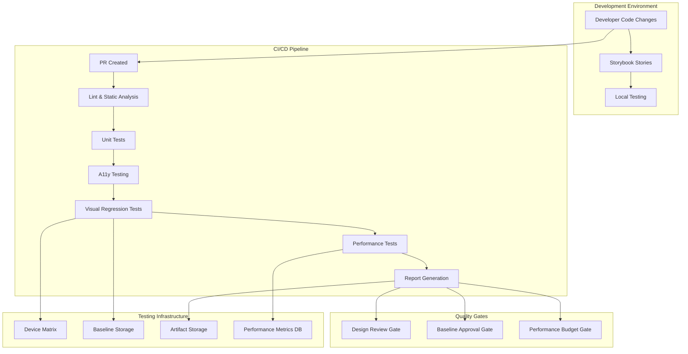

# Design Document: UI Refinement and Visual QA

## Overview

This design document outlines the architecture and implementation approach for a comprehensive UI refinement and Visual QA system for GrowBro. The system will integrate automated visual regression testing, design system compliance validation, accessibility auditing, cross-platform consistency checks, performance monitoring, and comprehensive reporting into the existing development workflow.

The solution leverages React Native ecosystem tools including Storybook for component isolation, Detox for E2E testing with screenshot capabilities, ESLint plugins for static analysis, and performance monitoring libraries to create a robust quality assurance pipeline.

## Architecture

### High-Level Architecture



### Component Architecture

The system consists of several interconnected components:

1. **Storybook Integration Layer**: Component isolation and story management
2. **Visual Testing Engine**: Screenshot capture and comparison
3. **Accessibility Auditing Engine**: WCAG compliance validation
4. **Performance Monitoring Engine**: Runtime performance metrics collection
5. **Design System Validator**: Token compliance enforcement
6. **Cross-Platform Consistency Checker**: Platform-specific validation
7. **Reporting Engine**: Comprehensive quality reports
8. **CI/CD Integration Layer**: Workflow orchestration

## Components and Interfaces

### 1. Storybook Integration Layer

**Purpose**: Provides component isolation and story management for comprehensive testing coverage.

**Key Components**:

- **Story Generator**: Automatically generates required stories for components
- **Addon Manager**: Manages Storybook addons for accessibility, viewport, and interactions
- **Story Validator**: Ensures all required component states are covered

**Interface**:

```typescript
interface StoryConfig {
  component: React.ComponentType;
  requiredStates: ComponentState[];
  propMatrix: PropCombination[];
  a11yNotes: AccessibilityNote[];
  tokenMapping: TokenMapping;
}

interface ComponentState {
  name: string;
  props: Record<string, any>;
  description: string;
  isRequired: boolean;
}
```

**Integration Points**:

- React Native components via Storybook React Native
- Design system tokens via NativeWind configuration
- Accessibility testing via @storybook/addon-a11y

### 2. Visual Testing Engine

**Purpose**: Captures screenshots and performs visual regression testing across device matrix.

**Key Components**:

- **Screenshot Orchestrator**: Manages screenshot capture across devices and configurations
- **Baseline Manager**: Handles baseline storage, versioning, and approval workflows
- **Diff Engine**: Performs visual comparisons using SSIM and pixel-diff algorithms
- **Quarantine Manager**: Handles flaky test detection and management

**Interface**:

```typescript
interface VisualTestConfig {
  deviceMatrix: DeviceConfig[];
  locales: string[];
  themes: Theme[];
  textScales: number[];
  ignoredRegions: Region[];
}

interface ScreenshotResult {
  deviceId: string;
  locale: string;
  theme: Theme;
  textScale: number;
  imagePath: string;
  metadata: ScreenshotMetadata;
}

interface ComparisonResult {
  ssimScore: number;
  pixelDiffPercentage: number;
  passed: boolean;
  diffImagePath?: string;
  quarantined: boolean;
}
```

**Integration Points**:

- Detox for device screenshot capture
- jest-image-snapshot for comparison algorithms
- GitHub API for baseline approval workflows
- Cloud storage for baseline and artifact management

### 3. Accessibility Auditing Engine

**Purpose**: Validates WCAG compliance and React Native accessibility best practices.

**Key Components**:

- **Contrast Analyzer**: Validates color contrast ratios in light and dark themes
- **Touch Target Validator**: Ensures proper touch target sizes per platform
- **Screen Reader Validator**: Checks accessibility labels, roles, and focus order
- **Dynamic Type Validator**: Tests layouts at various text scales

**Interface**:

```typescript
interface AccessibilityAudit {
  componentId: string;
  violations: A11yViolation[];
  score: number;
  recommendations: string[];
}

interface A11yViolation {
  type: 'contrast' | 'touch-target' | 'screen-reader' | 'dynamic-type';
  severity: 'blocker' | 'major' | 'minor';
  element: string;
  description: string;
  remediation: string;
}
```

**Integration Points**:

- eslint-plugin-react-native-a11y for static analysis
- @storybook/addon-a11y for runtime testing
- react-native-accessibility-engine for comprehensive auditing

### 4. Performance Monitoring Engine

**Purpose**: Measures and monitors UI performance metrics in release builds.

**Key Components**:

- **Render Time Profiler**: Measures time-to-interactive and render performance
- **Animation Profiler**: Monitors frame rates and dropped frames
- **Memory Profiler**: Tracks memory usage and garbage collection
- **List Performance Profiler**: Specialized testing for large lists and scrolling

**Interface**:

```typescript
interface PerformanceMetrics {
  timeToInteractive: number;
  renderTime: number;
  frameRate: FrameRateMetrics;
  memoryUsage: MemoryMetrics;
  scrollPerformance?: ScrollMetrics;
}

interface FrameRateMetrics {
  averageFps: number;
  droppedFramesP95: number;
  jsFrameTimeP95: number;
}

interface PerformanceBudget {
  timeToInteractiveMax: number;
  droppedFramesP95Max: number;
  jsFrameTimeP95Max: number;
  gcPauseMax: number;
}
```

**Integration Points**:

- @shopify/react-native-performance for render timing
- Sentry Performance for production monitoring
- React Native DevTools for profiling data
- Custom performance probes for specific metrics

### 5. Design System Validator

**Purpose**: Enforces design system compliance and token usage.

**Key Components**:

- **Token Validator**: Ensures only approved design tokens are used
- **Style Analyzer**: Detects inline styles and hardcoded values
- **Typography Validator**: Enforces approved text variants
- **Coverage Reporter**: Tracks token usage across components

**Interface**:

```typescript
interface DesignSystemViolation {
  file: string;
  line: number;
  column: number;
  property: string;
  value: string;
  suggestedToken: string;
  severity: 'error' | 'warning';
}

interface TokenCoverage {
  componentId: string;
  usedTokens: string[];
  missingTokens: string[];
  coveragePercentage: number;
}
```

**Integration Points**:

- Custom ESLint rules for token enforcement
- eslint-plugin-react-native/no-inline-styles
- NativeWind configuration for token mapping
- Storybook documentation generation

### 6. Cross-Platform Consistency Checker

**Purpose**: Validates UI consistency across iOS and Android platforms.

**Key Components**:

- **Layout Comparator**: Compares layout hierarchy and spacing
- **Platform Adaptation Validator**: Ensures proper platform-specific implementations
- **Safe Area Validator**: Validates edge-to-edge and insets handling
- **Responsive Layout Tester**: Tests across different screen sizes and orientations

**Interface**:

```typescript
interface PlatformConsistencyResult {
  screenId: string;
  platforms: PlatformResult[];
  inconsistencies: Inconsistency[];
  intentionalDifferences: IntentionalDifference[];
}

interface Inconsistency {
  type: 'layout' | 'spacing' | 'content' | 'safe-area';
  description: string;
  platforms: string[];
  severity: 'major' | 'minor';
}
```

**Integration Points**:

- Detox for cross-platform screenshot capture
- Platform-specific testing configurations
- Safe area and insets validation utilities

### 7. Reporting Engine

**Purpose**: Generates comprehensive quality reports with trends and actionable insights.

**Key Components**:

- **Report Generator**: Creates HTML reports with visualizations
- **Trend Analyzer**: Tracks quality metrics over time
- **Issue Tracker Integration**: Creates and manages GitHub issues
- **Notification System**: Alerts stakeholders of quality regressions

**Interface**:

```typescript
interface QualityReport {
  timestamp: Date;
  summary: QualitySummary;
  visualRegression: VisualRegressionReport;
  accessibility: AccessibilityReport;
  performance: PerformanceReport;
  designSystem: DesignSystemReport;
  trends: TrendAnalysis;
}

interface QualitySummary {
  overallScore: number;
  blockers: number;
  majorIssues: number;
  minorIssues: number;
  regressions: number;
  improvements: number;
}
```

**Integration Points**:

- GitHub API for issue creation and PR comments
- Chart.js for trend visualizations
- CI artifact storage for report hosting
- CODEOWNERS for automatic issue assignment

## Data Models

### Configuration Models

```typescript
interface UIQAConfig {
  devices: DeviceConfig[];
  locales: LocaleConfig[];
  themes: ThemeConfig[];
  textScales: number[];
  performanceBudgets: PerformanceBudget;
  baselineApprovers: string[];
  reportingConfig: ReportingConfig;
}

interface DeviceConfig {
  id: string;
  platform: 'ios' | 'android';
  name: string;
  resolution: Resolution;
  pixelRatio: number;
  safeAreaInsets: SafeAreaInsets;
}
```

### Test Result Models

```typescript
interface TestRun {
  id: string;
  timestamp: Date;
  commitSha: string;
  branch: string;
  status: 'running' | 'passed' | 'failed' | 'quarantined';
  results: TestResult[];
  artifacts: Artifact[];
}

interface TestResult {
  type: 'visual' | 'accessibility' | 'performance' | 'design-system';
  componentId: string;
  status: 'passed' | 'failed' | 'warning';
  details: any;
  artifacts: string[];
}
```

## Error Handling

### Error Categories

1. **Infrastructure Errors**: Device unavailability, network issues, storage failures
2. **Test Execution Errors**: Screenshot capture failures, timeout issues
3. **Comparison Errors**: Baseline missing, comparison algorithm failures
4. **Configuration Errors**: Invalid device configs, missing tokens
5. **Integration Errors**: GitHub API failures, CI/CD pipeline issues

### Error Handling Strategy

```typescript
interface ErrorHandler {
  handleInfrastructureError(error: InfrastructureError): Promise<void>;
  handleTestExecutionError(error: TestExecutionError): Promise<void>;
  handleComparisonError(error: ComparisonError): Promise<void>;
  handleConfigurationError(error: ConfigurationError): Promise<void>;
  handleIntegrationError(error: IntegrationError): Promise<void>;
}

class UIQAErrorHandler implements ErrorHandler {
  async handleInfrastructureError(error: InfrastructureError): Promise<void> {
    // Retry with exponential backoff
    // Fallback to alternative devices/services
    // Alert infrastructure team
  }

  async handleTestExecutionError(error: TestExecutionError): Promise<void> {
    // Retry failed tests once
    // Mark as quarantined if consistently failing
    // Collect debug artifacts
  }
}
```

### Retry and Fallback Mechanisms

- **Screenshot Capture**: Retry once with 30-second timeout, fallback to alternative device
- **Baseline Comparison**: Retry with different comparison algorithms, mark as needs-review
- **Performance Tests**: Retry with clean device state, adjust budgets for low-end devices
- **CI Integration**: Exponential backoff for API calls, graceful degradation for non-critical features

## Testing Strategy

### Unit Testing

- **Component Validators**: Test individual validation logic
- **Comparison Algorithms**: Test SSIM and pixel-diff accuracy
- **Configuration Parsers**: Test config validation and parsing
- **Report Generators**: Test report generation with mock data

### Integration Testing

- **Storybook Integration**: Test story generation and addon functionality
- **Detox Integration**: Test screenshot capture and device interaction
- **CI Pipeline**: Test end-to-end workflow with sample projects
- **GitHub Integration**: Test issue creation and PR comment functionality

### End-to-End Testing

- **Full Pipeline**: Test complete workflow from PR creation to report generation
- **Multi-Device**: Test across full device matrix with real components
- **Performance**: Test performance monitoring with actual app scenarios
- **Error Scenarios**: Test error handling and recovery mechanisms

### Test Data Management

```typescript
interface TestDataManager {
  generateMockComponents(): ComponentConfig[];
  createBaselineFixtures(): BaselineFixture[];
  setupTestDevices(): Promise<DeviceConfig[]>;
  cleanupTestArtifacts(): Promise<void>;
}
```

### Continuous Testing

- **Nightly Runs**: Full device matrix testing with comprehensive reporting
- **PR Testing**: Focused testing on changed components and dependencies
- **Release Testing**: Complete validation before production releases
- **Monitoring**: Continuous performance monitoring in production

## Implementation Phases

### Phase 1: Foundation (Weeks 1-2)

- Set up Storybook with React Native
- Implement basic screenshot capture with Detox
- Create ESLint rules for design system compliance
- Set up CI pipeline structure

### Phase 2: Core Testing (Weeks 3-4)

- Implement visual regression testing engine
- Add accessibility auditing with eslint-plugin-react-native-a11y
- Create performance monitoring with @shopify/react-native-performance
- Develop basic reporting system

### Phase 3: Advanced Features (Weeks 5-6)

- Add cross-platform consistency checking
- Implement baseline management and approval workflows
- Create comprehensive HTML reports with trends
- Add GitHub integration for issues and PR comments

### Phase 4: Optimization (Weeks 7-8)

- Optimize test execution performance
- Add quarantine management for flaky tests
- Implement advanced error handling and retry logic
- Create comprehensive documentation and training materials

## Design Enhancements and Platform-Specific Considerations

### Platform-Specific Touch Target Standards

The design implements platform-specific touch target validation:

- **iOS**: ≥44×44 pt (Apple HIG compliance)
- **Android**: ≥48×48 dp (Material Design compliance)
- **WCAG 2.2 AA Generic**: ≥24×24 CSS px with spacing exception for web surfaces

### Android 15 Edge-to-Edge Enforcement

With Android 15 (API 35) enforcing edge-to-edge by default, the design includes:

- Automatic edge-to-edge enablement in test configurations
- Insets verification for all screens
- Screenshot capture with translucent system bars
- Merge blocking if critical content overlaps system UI

### Enhanced Screenshot Strategy

**Primary Tool**: Maestro for E2E screenshots on Expo (more predictable device orchestration)
**Secondary Tool**: Detox for white-box React Native hooks when needed
**Comparison Method**:

- SSIM with failureThresholdType: 'percent' at 0.5-1.0%
- Pixelmatch fallback for color accuracy shifts
- Masked dynamic regions (time, counters, system bars, blinking cursors)

### Expanded Locale Matrix

Beyond en/de, includes:

- **Android**: en-XA/ar-XB pseudolocales for expansion and RTL testing
- **iOS**: Pseudolanguages for string expansion validation
- **Requirement**: No clipping or overlap in pseudolocales with 30-40% string expansion

### Dual Storybook Strategy

- **React Native Storybook**: Device testing and screenshot capture
- **React Native Web Storybook**: Published to CI artifacts for browser-based design review with axe-core integration
- **Requirement**: Every component visible in hosted Storybook; axe violations fail CI

### Enhanced Accessibility Auditing

**Contrast Requirements**:

- Text: ≥4.5:1 (normal), ≥3:1 (large text)
- UI components/graphics: ≥3:1
- Theme-aware validation for both light and dark modes

**Touch Target Validation**:

- Platform-specific minimums with hitSlop equivalent support
- WCAG 2.2 2.5.8 compliance with spacing exceptions

**Screen Reader Integration**:

- accessibilityRole, accessibilityLabel, accessibilityHint enforcement
- Focus order and visibility validation
- Screen reader traversal E2E testing

### Performance Monitoring Enhancements

**Measurement Tools**:

- @shopify/react-native-performance for TTI/TTFD measurement
- Sentry Performance with refresh-rate aware thresholds
- FlashList profiler utilities for list performance

**Budgets**:

- TTI cold start mid-tier Android ≤2000ms (measured in release builds with Hermes)
- dropped_frames_p95 ≤1% and js_frame_time_p95 ≤10ms per animation
- List scroll 60fps sustained with performance helper integration

### GitHub Integration Enhancement

**GitHub Checks API**: Replaces inline PR comments with consolidated Checks featuring:

- Images and annotations per story/screen
- Deep links to artifacts, diffs, a11y reports, and performance data
- Pass/fail status per component with actionable feedback
- Single consolidated Check with comprehensive quality gates

### Safe Area and Insets Handling

**Integration**: react-native-safe-area-context hooks (preferred over basic SafeAreaView)
**Testing**: Verify safe area padding/insets on notched devices in portrait and landscape
**Edge-to-Edge**: Validate proper insets with translucent system bars enabled

### Deterministic Testing Environment

**Stability Measures**:

- Seed pseudorandoms and freeze clock during screenshot capture
- Pin font set in app bundle to prevent anti-aliasing drift
- Disable animations or use "Reduce Motion" styled variants
- Pre-render hooks to remove dynamic elements before capture

### Implementation Refinements

**Error Handling**: Enhanced retry logic with exponential backoff for infrastructure failures
**Quarantine Management**: Automatic flaky test detection with tagging system
**Baseline Governance**: Design-review role enforcement with commit SHA tracking
**Artifact Management**: Masked and raw diff storage with 30-day retention

This enhanced design provides a production-ready foundation for comprehensive UI refinement and Visual QA that aligns with current iOS/Android platform standards, WCAG 2.2 guidelines, and modern React Native ecosystem best practices.
