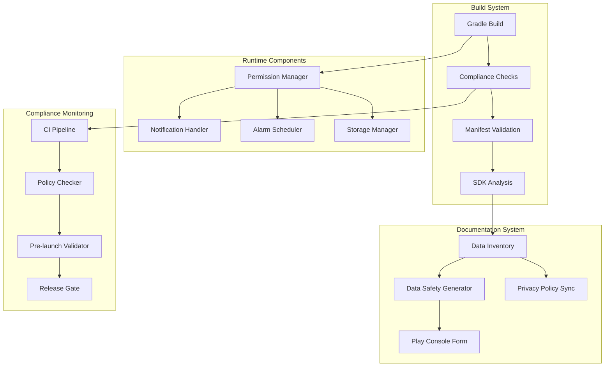
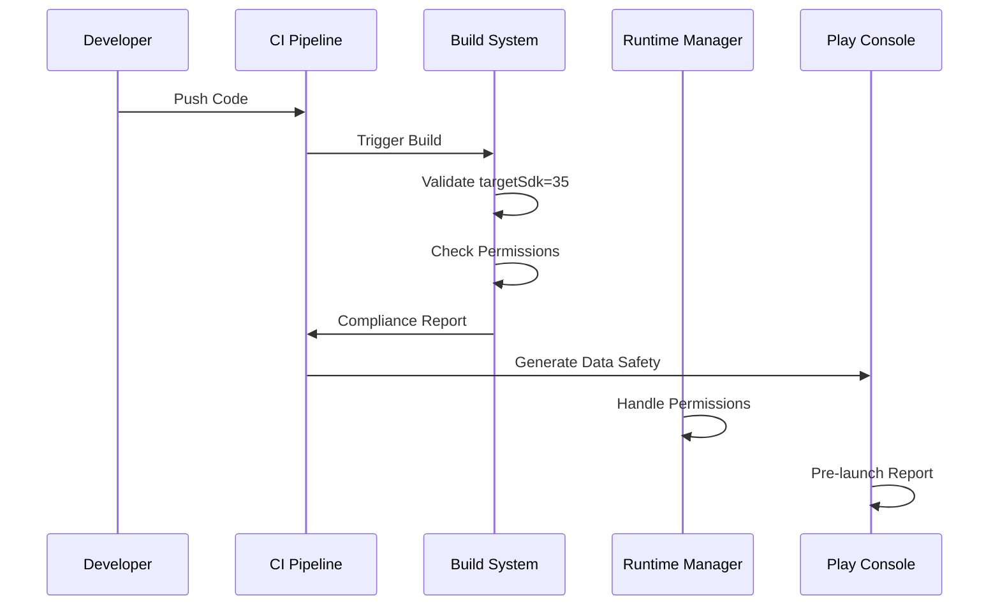
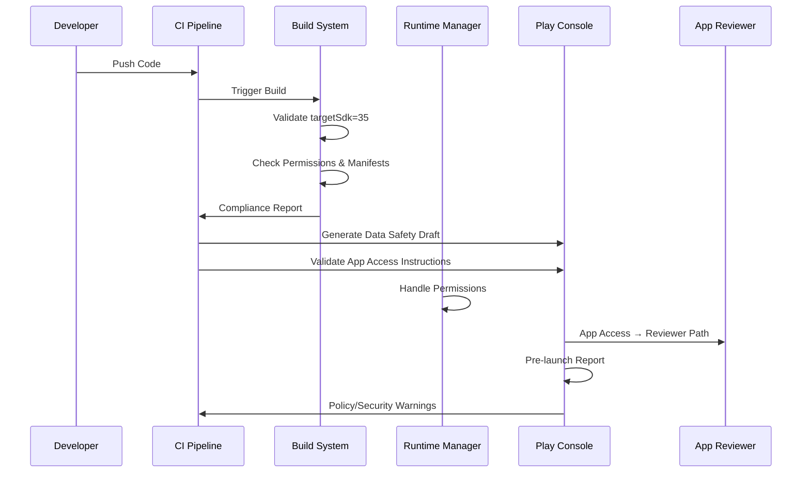

# Design Document

## Overview

The Android Store Compliance feature ensures GrowBro meets all Google Play Store requirements for successful publication and ongoing maintenance. This design addresses targetSdk 35 migration, automated compliance checking, Play Store documentation completion, and cannabis policy adherence. The solution implements a multi-layered approach combining build-time validation, runtime permission handling, automated documentation generation, and comprehensive testing.

## Architecture

### High-Level Architecture



### Component Interaction Flow



## Components and Interfaces

### 1. Build System Compliance

#### Gradle Configuration Manager

```typescript
interface GradleComplianceConfig {
  targetSdk: number;
  requiredPermissions: string[];
  restrictedPermissions: string[];
  sdkVersionValidation: boolean;
}

interface ComplianceValidator {
  validateTargetSdk(): ComplianceResult;
  validateMergedManifestsForTargetSdk(min: number): ComplianceResult;
  checkPermissions(): PermissionReport;
  validateManifest(): ManifestReport;
  scanForRestrictedPermissions(): RestrictedPermissionReport;
  generateComplianceReport(): ComplianceReport;
}
```

#### Implementation Strategy

- Use the Android Gradle Plugin (AGP) Variant API / DSL rather than parsing merged manifest outputs. Manifest-merge is an implementation detail and can be influenced by plugin order, library manifests, or late build-time transforms; the Variant API gives deterministic access to the resolved configuration for each variant.

- Provide a Gradle plugin that registers a verification task (for example, `verifyTargetSdkCompliance`) which iterates all application variants via the AGP Variant API. The task should:

  - Read the effective targetSdk for each variant from the Variant API (prefer `variant.mergedFlavor` when available for your AGP version). When `mergedFlavor` is not available, compute the effective value by applying overlay precedence: `productFlavors` and `buildTypes` override `defaultConfig`.
  - Only enforce the rule for release-like variants (configurable; default to `release`/`production`) — skip debug/dev variants unless explicitly enabled.
  - Fail the task (and therefore the build/CI) when any enforced variant's effective targetSdk != 35.
  - Emit per-variant, machine-readable compliance reports at `build/reports/target-sdk-compliance/<variant>.json` containing: variant name, effectiveTargetSdk, expectedTargetSdk (35), status (pass/fail), source (which config contributed the value), remediation link, and enforcement deadline.
  - Emit a human-friendly text/HTML report in the same folder and print a concise summary path to the console when failures occur.

- Hook the verification task into the Android build lifecycle so CI and local builds fail fast on non-compliance. Examples:

  - Make `preBuild` or `check` depend on `verifyTargetSdkCompliance` for release variants.
  - Ensure `./gradlew assembleRelease` and `./gradlew check` execute the verification task so pipelines that run standard Gradle lifecycle tasks will fail on policy violations.

- AGP compatibility and fallbacks:

  - Detect AGP features at runtime. If `variant.mergedFlavor` is present, prefer it. If not, reconstruct the effective targetSdk from `defaultConfig`, `productFlavors`, and `buildTypes` using the same overlay rules AGP applies.
  - For older AGP versions that can't expose sufficient Variant API data, emit a clear warning and a best-effort check (do not silently pass). Recommend upgrading AGP and document the minimum supported AGP version.

- Rationale: reading the Variant API makes checks deterministic and aligned with Gradle’s configuration model. It enables per-variant enforcement and reporting and prevents relying on manifest-merge outputs which vary depending on tooling and plugin ordering.

### 2. Runtime Permission Management

#### Permission Manager Interface

```typescript
interface PermissionManager {
  requestNotificationPermission(): Promise<PermissionResult>;
  handleExactAlarmPermission(): Promise<AlarmPermissionResult>;
  checkStoragePermissions(): StoragePermissionStatus;
  requestSelectedPhotosAccess(): Promise<PermissionResult>;
  showMediaReselectionUI(): void;
  needsExactAlarms(): boolean;
  requestExactAlarmIfJustified(): Promise<AlarmPermissionResult>;
  provideFallbackExperience(permission: string): void;
}

interface NotificationHandler {
  isNotificationPermissionGranted(): boolean;
  createChannelsAfterGrant(): void;
  showInAppBadge(): void;
  suppressNotifications(): void;
  requestPermissionWithPrimer(): Promise<boolean>;
}
```

#### Permission Flow Design

- **Notification Permissions**: No notification channels created or posted until POST_NOTIFICATIONS granted; denial/revoke → suppress and show in-app badge only
- **Exact Alarms**: Default to WorkManager/inexact; only request SCHEDULE_EXACT_ALARM/USE_EXACT_ALARM for user-visible, time-critical functions with Play Console declaration
- **Photo/Video Permissions**: Default to Android Photo Picker; use Selected Photos Access (READ*MEDIA_VISUAL_USER_SELECTED) with re-selection UI; avoid broad READ_MEDIA*\* unless justified
- **Storage Access**: Use scoped storage, reject QUERY_ALL_PACKAGES unless justified, prefer specific <queries> intents
- **Graceful Degradation**: Maintain functionality when permissions denied with clear fallback paths

### 3. Data Safety Documentation System

#### Data Inventory Manager

```typescript
interface DataInventoryItem {
  feature: string;
  dataType: string;
  purpose: string;
  retention: string;
  sharedWith: string[];
  sdkSource?: string;
}

interface DataSafetyGenerator {
  generateInventory(): DataInventoryItem[];
  validateAgainstSDKIndex(): ValidationResult;
  createDraftFromInventory(): PlayDataSafetyForm;
  validateSdkDisclosuresWithSdkIndex(): ValidationResult;
  syncWithPrivacyPolicy(): SyncResult;
}
```

#### Documentation Automation

- **Machine-Readable Inventory**: JSON-based data mapping
- **SDK Integration**: Automatic detection of third-party SDK data practices
- **Form Generation**: Auto-populate Play Console Data Safety form
- **Policy Sync**: Ensure privacy policy matches disclosures

### 4. UGC Moderation System

#### Moderation Interface

```typescript
interface ModerationManager {
  reportContent(contentId: string, reason: string): Promise<ReportResult>;
  blockUser(userId: string): Promise<BlockResult>;
  muteUser(userId: string): Promise<MuteResult>;
  deleteOwnContent(contentId: string): Promise<DeleteResult>;
  reportGeneratedContent(refId: string, reason: string): Promise<ReportResult>;
}

interface ModerationQueue {
  processReport(report: ContentReport): Promise<void>;
  auditAction(action: ModerationAction): void;
  escalateToHuman(report: ContentReport): void;
}
```

#### Moderation Flow

- **User Actions**: Report, Block, Mute, Delete accessible from all content
- **Server Processing**: 5-second SLA for report submission
- **Audit Trail**: Complete logging of moderation actions
- **Appeal Process**: Clear escalation path for disputed actions

### 5. Account and Data Deletion System

#### Deletion Manager Interface

```typescript
interface DeletionManager {
  deleteAccountInApp(): Promise<DeletionResult>;
  requestDeletionViaWeb(userId: string): Promise<WebDeletionResult>;
  validateDeletionPathAccessibility(): AccessibilityResult;
  updateDataSafetyWithDeletionMethods(): void;
}

interface DeletionFlow {
  isAccessibleInThreeTaps(): boolean;
  provideWebDeletionUrl(): string;
  processAccountDeletion(userId: string): Promise<void>;
  auditDeletionRequest(request: DeletionRequest): void;
}
```

#### Deletion Implementation

- **In-App Path**: Account deletion accessible in ≤3 taps from Profile/Settings
- **Web URL**: Public web deletion request page for external access
- **Data Safety Integration**: Both methods referenced in Play Console Data Safety form
- **Release Gate**: CI blocks release if deletion paths not implemented

### 6. App Access and Review System

#### App Access Manager Interface

```typescript
interface AppAccessManager {
  provideTestCredentials(): TestCredentials;
  generateDemoFlow(): DemoFlowInstructions;
  validateAccessToGatedFeatures(): AccessValidationResult;
  createReviewerInstructions(): ReviewerGuide;
}

interface ReviewerGuide {
  testCredentials: TestCredentials;
  stepsToReachDiagnosis: string[];
  stepsToReachCommunity: string[];
  stepsToReachReminders: string[];
  deepLinkEntryPoints: string[];
}
```

#### App Access Implementation

- **Test Credentials**: Demo account with access to all gated features
- **Clear Instructions**: Step-by-step guide to reach diagnosis, community, reminders
- **Deep Links**: Scripted crawler entry points for automated testing
- **Release Gate**: Rejected builds block release if App Access missing

### 7. Cannabis Policy Compliance

#### Content Compliance Manager

```typescript
interface ComplianceChecker {
  validateContent(content: string): ComplianceResult;
  checkForCommerceLanguage(text: string): CommerceViolation[];
  enforceAgeGate(): AgeGateResult;
  addEducationalDisclaimers(): void;
}

interface PolicyValidator {
  scanStoreListingCopy(): PolicyViolation[];
  validateAppFeatures(): FeatureComplianceReport;
  checkForSalesFeatures(): SalesFeatureReport;
  scanForCommerceLanguage(text: string): CommerceViolation[];
  validateExternalLinks(): LinkComplianceReport;
}

// NOTE (CI integration):
// - Implement a build/CI scanner that runs before publishing and inspects
//   resource strings, store-listing JSON, and localized copy for commerce
//   verbs (e.g., "buy", "order", "delivery", "pickup") using a
//   configurable regex denylist and per-domain allowlist. Fail-fast on
//   violations and emit a machine-readable report (JSON) under
//   build/reports/compliance/ with: file, key, matchedText, ruleId,
//   suggestedRemediation. Produce a human-friendly HTML/markdown
//   summary alongside the JSON artifact for reviewers.
// - Block external links to vendor domains at CI unless the domain is
//   explicitly whitelisted; include a whitelist management workflow and
//   an override reviewer approval step (audit trail required).
// - Make the scanner deterministic and language-aware: run against all
//   localized resources and store listing variants; keep rules per-locale
//   so phrasing differences are covered. Provide a quick CLI to run
//   locally (e.g., `yarn compliance:scan`) that mirrors CI behavior.
```

#### Policy Implementation

- **Age Gate**: 18+ verification before any cannabis content access
- **Educational Disclaimers**: Clear labeling of all cannabis content
- **Commerce Prevention**: Automated scanning for sales/delivery language
- **Store Listing Review**: Pre-submission policy compliance check

## Data Models

### Compliance Configuration

```typescript
interface ComplianceConfig {
  targetSdk: number;
  permissions: {
    required: string[];
    restricted: string[];
    runtime: string[];
  };
  policies: {
    cannabis: CannabisPolicy;
    dataRetention: DataRetentionPolicy;
    ageRestriction: AgeRestrictionPolicy;
  };
  thirdPartySDKs: SDKInventory[];
}
```

### Data Safety Model

```typescript
interface DataSafetyForm {
  dataCollection: DataCollectionItem[];
  dataSharing: DataSharingItem[];
  securityPractices: SecurityPractice[];
  dataRetention: RetentionPolicy;
  userControls: UserControl[];
}
```

### Compliance Report Model

```typescript
interface ComplianceReport {
  timestamp: string;
  targetSdkCompliant: boolean;
  permissionCompliant: boolean;
  policyCompliant: boolean;
  violations: ComplianceViolation[];
  recommendations: string[];
  preLaunchStatus: 'green' | 'yellow' | 'red';
}
```

## Error Handling

### Build-Time Error Handling

- **Gradle Failures**: Clear error messages with remediation steps
- **Manifest Conflicts**: Detailed conflict resolution guidance
- **Permission Issues**: Specific permission requirement explanations
- **SDK Conflicts**: Version compatibility recommendations

### Runtime Error Handling

- **Permission Denials**: Graceful fallback with user education
- **Network Failures**: Offline-capable compliance checking
- **API Errors**: Retry logic with exponential backoff
- **Data Corruption**: Automatic recovery and validation

### Compliance Error Recovery

```typescript
interface ErrorRecoveryStrategy {
  handlePermissionDenial(permission: string): FallbackStrategy;
  recoverFromBuildFailure(error: BuildError): RecoveryAction[];
  resolveManifestConflict(conflict: ManifestConflict): Resolution;
  escalateComplianceViolation(violation: ComplianceViolation): EscalationAction;
}
```

## Testing Strategy

### Automated Testing Approach

#### Unit Tests

- **Permission Manager**: Test all permission request flows and fallbacks
- **Data Safety Generator**: Validate inventory generation and form creation
- **Compliance Checker**: Test policy validation and violation detection
- **Build System**: Test gradle plugin and manifest validation

#### Integration Tests

- **End-to-End Flows**: Complete user journeys with permission scenarios
- **CI Pipeline**: Full compliance check pipeline testing
- **Store Integration**: Mock Play Console API interactions
- **Cross-Platform**: Android version compatibility testing

#### Compliance Testing Matrix

```typescript
interface ComplianceTestSuite {
  permissionTests: {
    notificationDenied: TestCase;
    exactAlarmDenied: TestCase;
    storageRestricted: TestCase;
  };
  policyTests: {
    cannabisContentCheck: TestCase;
    ageGateEnforcement: TestCase;
    commerceLanguageDetection: TestCase;
  };
  buildTests: {
    targetSdkValidation: TestCase;
    manifestMerging: TestCase;
    sdkCompatibility: TestCase;
  };
}
```

### Manual Testing Requirements

- **Device Matrix**: Test across Android 13, 14, 15 devices
- **Permission Scenarios**: Manual verification of all permission flows
- **Store Submission**: End-to-end submission process validation
- **Policy Review**: Human review of cannabis content compliance

### Pre-Launch Testing

- **Automated Pre-launch Report**: Integration with Play Console testing
- **Policy Warning Detection**: Automated scanning for policy violations
- **Performance Testing**: Ensure compliance features don't impact performance
- **Accessibility Testing**: Verify compliance UI meets accessibility standards

## Implementation Phases

### Phase 1: Build System Compliance (Week 1-2)

- Implement Gradle plugin for targetSdk validation
- Add manifest validation and permission checking
- Create CI pipeline integration
- Establish compliance reporting

### Phase 2: Runtime Permission Management (Week 3-4)

- Implement notification permission handling
- Add exact alarm permission management
- Create storage permission compliance
- Build fallback experience systems

### Phase 3: Documentation Automation (Week 5-6)

- Build data inventory system
- Create Data Safety form generator
- Implement privacy policy synchronization
- Add third-party SDK tracking

### Phase 4: UGC and Policy Compliance (Week 7-8)

- Implement moderation tools and flows
- Add cannabis policy validation
- Create age gate enforcement
- Build store listing compliance checker

### Phase 5: Testing and Validation (Week 9-10)

- Complete automated test suite
- Perform manual testing across device matrix
- Validate Play Console integration
- Execute pre-launch report validation

## Security Considerations

### Data Protection

- **PII Handling**: Ensure no PII in compliance logs or reports
- **Secure Storage**: Encrypt sensitive compliance configuration
- **Access Control**: Limit compliance data access to authorized personnel
- **Audit Logging**: Complete audit trail for all compliance actions

### Privacy Compliance

- **Data Minimization**: Collect only necessary compliance data
- **User Consent**: Proper consent flows for analytics and diagnostics
- **Regional Compliance**: Handle GDPR, CCPA, and other regional requirements
- **Transparency**: Clear disclosure of all data practices

### Cannabis Policy Security

- **Age Verification**: Secure and privacy-preserving age gate
- **Content Filtering**: Robust filtering to prevent policy violations
- **Access Logging**: Monitor access to cannabis-related content
- **Legal Compliance**: Regular legal review of policy implementation

## Enhanced Testing Requirements

### Permission Testing Updates

- **Notifications**: First-run opt-in flow, denial handling, revoke scenarios, zero notifications before grant assertion
- **Exact Alarms**: Denied permission → inexact fallback still provides time-window reminders
- **Photo/Video**: Photo Picker integration, Selected Photos Access initial/partial grant, re-selection flow
- **Package Visibility**: Validate <queries> specific intents instead of QUERY_ALL_PACKAGES

### Policy Testing Updates

- **UGC Moderation**: Report/Block/Mute visible on every post/comment, appeal link present in Help/Policy
- **Cannabis Compliance**: Commerce verb scanner flags order/delivery/pickup/buy language, external vendor link blocking
- **App Access**: Completeness check before submission with test credentials and feature access paths

### Documentation Testing Updates

- **Data Safety**: Data inventory ↔ SDK Index cross-check, CI fails if out of date
- **Privacy Policy**: Sync validation with Data Safety form answers
- **Account Deletion**: In-app path (≤3 taps) and web URL accessibility testing

### Pre-Launch Report Integration

- **Deep Link Testing**: Scripted crawler entry points navigate past age-gate/login
- **Policy Warning Gate**: Any policy/security warning blocks release
- **Device Matrix**: Cross-platform testing with permission scenarios

## Additional Design Considerations

### Sequence Diagram Update

The component interaction flow should include:



### Error Handling Updates

- **Selected Photos Access**: Reselection failed → prompt reselection flow (Android 14+ behavior)
- **Permission Denials**: Specific fallback strategies for each permission type
- **Policy Violations**: Automated remediation suggestions with policy links
- **Build Failures**: Clear error messages with Play Console policy references

### Security Updates

- **PII Redaction**: Crash/analytics events exclude PII by default with Settings toggle
- **Data Minimization**: Collect only necessary compliance data
- **Audit Logging**: Complete trail for all compliance actions and policy decisions
