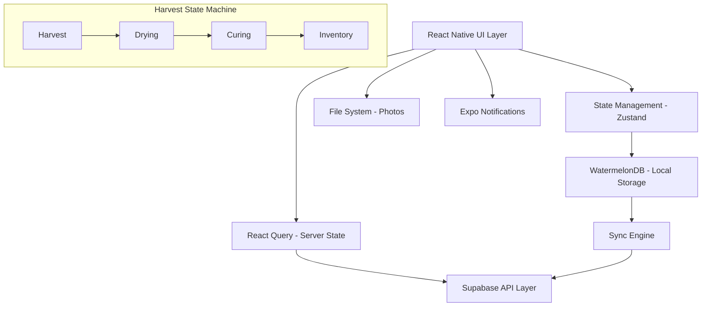
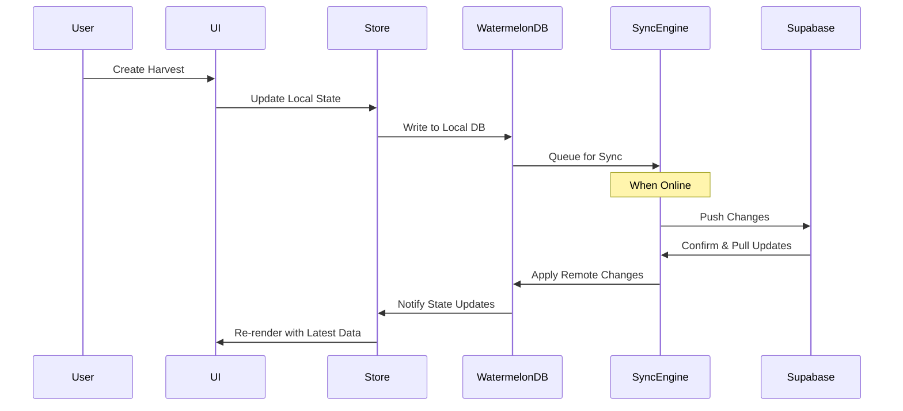
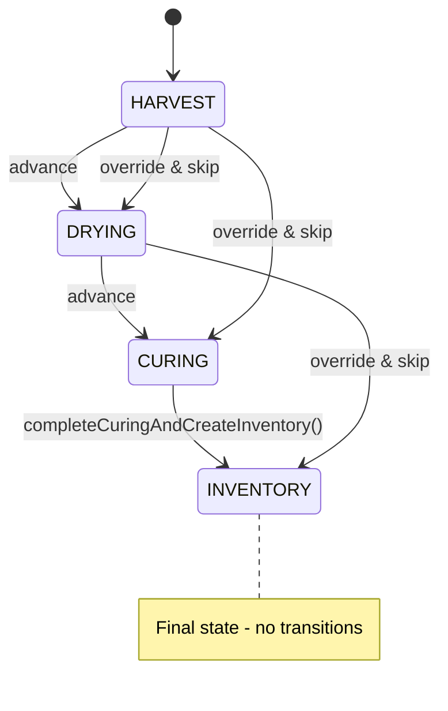

# Design Document

## Overview

The Harvest Workflow feature implements a comprehensive post-harvest tracking system that guides users through the critical stages of cannabis cultivation: Harvest → Drying → Curing → Inventory. The design emphasizes offline-first architecture, atomic operations, and robust state management to ensure data integrity throughout the harvest process.

The system uses a finite state machine approach with proper validation, timing guidance, and visual documentation capabilities. All operations are designed to work seamlessly offline with reliable synchronization when connectivity is restored.

## Architecture

### High-Level Architecture



### Data Flow Architecture



## Components and Interfaces

### Harvest State Machine

The harvest workflow implements a finite state machine with the following rules:

**Allowed Transitions**: HARVEST → DRYING → CURING → INVENTORY (forward only)

**Stage Management**:

- `stage_started_at`: Set on stage entry (server UTC timestamp)
- `stage_completed_at`: Set on stage exit (server UTC timestamp)
- All timestamps displayed in user locale

**Undo/Revert Rules**:

- **Soft Undo**: 15-second window for immediate undo without audit trail
- **Revert Stage**: After 15s, requires explicit audit note and reason
- **Override & Skip**: Allows skipping stages with mandatory reason (logged)

**State Transitions**:



### FlashList v2 Integration

All list components MUST use FlashList v2 defaults:

- **No size estimates**: Remove `estimatedItemSize`, `estimatedListSize`, `estimatedFirstItemOffset`
- **maintainVisibleContentPosition**: Enabled by default
- **masonry**: Use `masonry` prop when needed
- **RN New Architecture**: Target new architecture compatibility
- **Performance**: Lists render at 60fps with proper memoization

```typescript
<FlashList
  data={items}
  renderItem={Row}
  maintainVisibleContentPosition={{ startRenderingFromBottom: true }}
  onStartReached={loadOlder}
  getItemType={(item) => item.type} // When layouts vary
/>
```

### Core Components

#### 1. HarvestWorkflowScreen

- **Purpose**: Main container for harvest workflow management
- **Props**: `plantId: string, harvestId?: string`
- **State**: Current harvest, stage progression, validation errors
- **Key Features**: Stage navigation, progress indicators, offline status

#### 2. HarvestModal

- **Purpose**: Input form for harvest data entry
- **Props**: `isVisible: boolean, onSubmit: (data) => void, initialData?: HarvestData`
- **Validation**: Weight validation, required fields, unit conversion
- **Features**: Photo capture, notes input, metric/imperial toggle

#### 3. StageTracker

- **Purpose**: Visual representation of harvest stages with progression
- **Props**: `currentStage: HarvestStage, stages: StageConfig[], onStageAdvance: (stage) => void`
- **Features**: Progress visualization, timing guidance, undo functionality

#### 4. WeightChart

- **Purpose**: Line chart displaying weight changes over time
- **Props**: `data: ChartData[], timeRange: TimeRange, plantId?: string`
- **Performance**: Downsampling for large datasets on device, FlashList v2 integration
- **Fallback**: Tabular view on render errors
- **FlashList v2**: Uses defaults with no size estimates, maintainVisibleContentPosition enabled, masonry via prop, targets RN New Architecture

#### 5. PhotoCapture

- **Purpose**: Camera integration and photo management
- **Props**: `onPhotoCapture: (uri) => void, maxPhotos?: number`
- **Features**: Generate 3 variants (original, resized ~1280px, thumbnail), content-addressable storage (hash+ext), LRU cleanup with orphan detection

#### 6. InventorySync

- **Purpose**: Atomic inventory record creation and management
- **Props**: `harvestId: string, finalWeight: number, idempotencyKey: string`
- **Features**: Single transactional API call (completeCuringAndCreateInventory), idempotency via UUID key, server timestamp return for checkpointing

### Data Models

#### Harvest Model

```typescript
interface Harvest {
  id: string;
  plant_id: string;
  user_id: string;
  stage: HarvestStage;
  wet_weight_g: number | null;
  dry_weight_g: number | null;
  trimmings_weight_g: number | null;
  notes: string;
  stage_started_at: Date;
  stage_completed_at: Date | null;
  photos: string[]; // File URIs
  created_at: Date;
  updated_at: Date;
  deleted_at: Date | null;
  conflict_seen: boolean;
}

enum HarvestStage {
  HARVEST = 'harvest',
  DRYING = 'drying',
  CURING = 'curing',
  INVENTORY = 'inventory',
}
```

#### Inventory Model

```typescript
interface Inventory {
  id: string;
  plant_id: string;
  harvest_id: string;
  user_id: string;
  final_weight_g: number;
  harvest_date: Date;
  total_duration_days: number;
  created_at: Date;
  updated_at: Date;
  deleted_at: Date | null;
}
```

#### Stage Configuration

```typescript
interface StageConfig {
  stage: HarvestStage;
  name: string;
  description: string;
  target_duration_days: number;
  min_duration_days: number;
  max_duration_days: number;
  required_fields: string[];
  optional_fields: string[];
}
```

### Expo Notifications Integration

**Local Notifications Flow**:

- On stage entry: Schedule local notification for target duration
- If elapsed > max duration: Schedule gentle reminder notification
- On app start: Rehydrate scheduled notifications from database records
- Fully local operation: No push token or network required

**Implementation**:

```typescript
interface NotificationService {
  scheduleStageReminder(
    harvestId: string,
    stage: HarvestStage,
    targetDuration: number
  ): Promise<string>;
  cancelStageReminder(notificationId: string): Promise<void>;
  rehydrateNotifications(): Promise<void>; // Called on app start
}
```

### Photo Storage & File System

**Storage Architecture**:

- **3 Variants**: Original, resized (~1280px long edge), thumbnail
- **Content-Addressable**: Files stored as `hash+extension` for deduplication
- **Database**: Stores only URIs + sanitized metadata (whitelisted EXIF fields only), not binary data
- **Location**: App cache directories managed by application
- **Privacy**: EXIF/GPS data stripped by default; only configurable whitelist of metadata fields persisted

**LRU Cleanup Strategy**:

- **Triggers**: App start + storage threshold crossings
- **Orphan Detection**: DB row missing → file cleanup
- **User Action**: "Free up space" button for manual cleanup
- **Retention**: Recent harvest photos prioritized

**Implementation**:

```typescript
interface PhotoStorageService {
  captureAndStore(
    harvestId: string,
    stage: HarvestStage
  ): Promise<PhotoVariants>;
  generateVariants(originalUri: string): Promise<PhotoVariants>;
  runLRUCleanup(): Promise<CleanupResult>;
  detectOrphans(): Promise<string[]>; // Returns orphaned file paths
}

interface PhotoVariants {
  original: string;
  resized: string;
  thumbnail: string;
  metadata: ExifData;
}
```

### API Interfaces

#### Harvest API

```typescript
interface HarvestAPI {
  createHarvest(data: CreateHarvestRequest): Promise<Harvest>;
  updateHarvest(id: string, data: UpdateHarvestRequest): Promise<Harvest>;
  advanceStage(
    id: string,
    stage: HarvestStage,
    notes?: string
  ): Promise<Harvest>;
  undoStageAdvance(id: string): Promise<Harvest>; // 15s window only
  revertStage(id: string, auditNote: string): Promise<Harvest>; // After 15s
  overrideAndSkipStage(
    id: string,
    targetStage: HarvestStage,
    reason: string
  ): Promise<Harvest>;
  completeCuringAndCreateInventory(
    id: string,
    input: { final_weight_g: number; notes?: string; idempotencyKey: string }
  ): Promise<{
    harvest: Harvest;
    inventory: Inventory;
    server_timestamp: number;
  }>;
  getHarvestHistory(plantId: string): Promise<Harvest[]>;
  getHarvestChartData(
    plantId: string,
    timeRange: TimeRange
  ): Promise<ChartData[]>;
}
```

### Idempotency ledger and RPC behavior

To guarantee true idempotency for critical operations (such as completing curing and creating an inventory record) the server persists idempotency metadata in a dedicated ledger table `public.sync_idempotency`.

Schema (summary):

- Table: `public.sync_idempotency`
  - `id` bigserial PRIMARY KEY
  - `user_id` uuid NOT NULL
  - `idempotency_key` text NOT NULL
  - `operation_type` text -- e.g. 'complete_curing_and_create_inventory'
  - `status` text DEFAULT 'pending' -- 'pending' | 'success' | 'failed'
  - `response_payload` jsonb NULL -- the stored RPC response to return on retries
  - `resource_ids` jsonb NULL -- e.g. {"harvest_id": "...", "inventory_id": "..."}
  - `before_snapshot` jsonb NULL -- optional snapshot before the operation
  - `after_snapshot` jsonb NULL -- optional snapshot after the operation
  - `error_message` text NULL
  - `performed_at` timestamptz DEFAULT now()
  - `created_at`, `updated_at` timestamptz maintained by triggers

Indexes: a unique index on `(user_id, idempotency_key)` and a covering index on `(user_id, operation_type, idempotency_key)` are used to ensure fast lookup and uniqueness.

RPC behavior (upsert-or-return-existing):

- When a client calls `completeCuringAndCreateInventory(harvestId, { final_weight_g, notes, idempotencyKey })`:
  1. The server attempts to INSERT a row into `public.sync_idempotency` with `(user_id, idempotency_key, operation_type='complete_curing_and_create_inventory', status='pending')` using a unique constraint on `(user_id, idempotency_key)`.
  2. If the INSERT succeeds (we "won" the key), the server proceeds to perform the transactional work inside the same database transaction: update the `harvests` row (set `stage='inventory'`, set `stage_completed_at`, possibly set `dry_weight_g`), create the `inventory` row, and collect any snapshots required.
     - On success the server updates the `sync_idempotency` row setting `status='success'`, writes `response_payload` (the canonical RPC result JSON), `resource_ids` (linking `harvest_id` and `inventory_id`) and `after_snapshot`, then returns the payload to the client.
     - On failure the server updates `status='failed'` with `error_message` and rolls back any partial business writes (transaction rollback). The client receives an error.
  3. If the INSERT fails due to an existing `(user_id, idempotency_key)`, the server reads the existing `sync_idempotency.response_payload`:
     - If a `response_payload` is present (previous run completed successfully), return that payload to the client (HTTP 200 semantics for idempotent retry).
     - If no `response_payload` is present but `status='pending'`, treat as in-progress and return a 409/conflict-like error (or a retry-after indicator); clients may re-try after a short delay.

Notes:

- The ledger is used across sync and ad-hoc RPCs to provide a single place to detect and prevent duplicate apply operations.
- The inventory table retains a UNIQUE(harvest_id) constraint as a second line of defense against duplicate inventory rows.
- RLS policies allow users to read their own idempotency rows and the service_role to operate across rows when necessary.

Example: the server-side Postgres function `public.complete_curing_and_create_inventory(harvest_id, final_weight_g, notes, idempotency_key)` implements the above pattern (insert-or-return-existing, transactional work, update ledger with response payload) so clients can safely retry with the same idempotency key without risk of duplicate inventory creation.

#### Backward compatibility

If clients omit an `idempotencyKey`, the sync and RPC layers may generate a deterministic key from the request payload (or fall back to a random UUID), but true retry-safety requires the client to supply a stable idempotency key for retriable operations.

#### Security & privacy

Idempotency metadata contains resource identifiers and snapshots; these are protected by the same RLS policies as other user data. Snapshots SHOULD avoid saving sensitive blobs (photos). Use `performed_at` and `user_id` to audit who initiated an operation.

#### Privacy, Consent, and Telemetry

##### Explicit Consent Model

The application implements an explicit, granular consent model where users must actively opt-in to telemetry collection and processing. Consent is collected through a dedicated privacy settings screen with clear language about what data is collected, how it's used, and retention policies.

**Consent Scopes:**

- `analytics`: Basic usage analytics and feature adoption metrics
- `performance`: App performance and crash reporting data
- `health_tracking`: Plant health assessment and growth tracking data
- `device_info`: Device and OS information for debugging
- `location`: Optional location data for regional insights (when explicitly enabled)

**Consent Versioning:**

- Each consent record includes a `consent_version` field to track policy updates
- When privacy policies are updated, users must re-consent to continue data collection
- Version upgrades are enforced through feature gates that check consent currency

##### Event Taxonomy

Telemetry events follow a structured taxonomy to ensure consistent data collection and analysis:

**Event Categories:**

- `app_lifecycle`: App launch, background/foreground transitions
- `user_interaction`: Button taps, screen navigation, feature usage
- `performance`: Load times, memory usage, crash reports
- `business`: Harvest completion, inventory updates, workflow progress
- `health_assessment`: Plant analysis results, photo processing metrics

**Event Properties:**

- Standardized property names (e.g., `screen_name`, `action_type`, `duration_ms`)
- Size-capped properties to prevent excessive data collection
- Automatic PII sanitization before storage

##### PII Minimization and Sanitization

All telemetry data undergoes automatic PII minimization:

**Sanitization Rules:**

- User emails, names, and identifiers are hashed or replaced with anonymous IDs
- Location data is aggregated to city/region level unless explicit consent given
- Photos and sensitive blobs are never included in telemetry
- Device IDs are hashed using a one-way function
- IP addresses are not collected or stored

**Anonymous ID Generation:**

- Anonymous IDs are generated using cryptographically secure random functions
- IDs are stable per device but cannot be traced back to users
- Rotation policy: IDs are regenerated on consent revocation or major version updates

##### Retention and DSR Handling

**Retention Policies:**

- Analytics data: 12 months retention with automatic archival
- Performance data: 6 months retention
- Health tracking data: 24 months retention (for longitudinal analysis)
- All data includes `retention_until` timestamp for automated cleanup

**Data Subject Rights (DSR):**

- **Access**: Users can request export of all their telemetry data
- **Deletion**: Consent revocation triggers immediate cessation of new data collection
- **Deletion with history purge**: Optional complete deletion of historical telemetry data
- **Portability**: Data export in machine-readable format

**Retention Implementation:**

- Database triggers automatically set `retention_until` based on data category
- Periodic cleanup jobs (daily) remove expired telemetry data
- Archival process compresses old data for long-term storage before deletion

##### Feature Gate Integration

Consent checks are integrated throughout the application via feature gates:

```typescript
// Core consent checking function
function canSend(
  eventType: TelemetryEventType,
  scope: ConsentScope,
  consent: UserConsent
): boolean {
  // Check if user has consented to the required scope
  if (!consent.scopes[scope]) return false;

  // Check if consent version is current
  if (consent.version < CURRENT_CONSENT_VERSION) return false;

  // Check if consent hasn't expired
  if (consent.expires_at && new Date() > consent.expires_at) return false;

  // Additional scope-specific checks
  return validateScopeSpecificRules(eventType, scope, consent);
}
```

**Integration Points:**

- All telemetry collection points call `canSend()` before sending data
- Failed consent checks result in silent failure (no user notification)
- Consent changes immediately affect all telemetry streams
- Feature flags can override consent for debugging purposes

##### Database Schema

**Consent Ledger Table:**

```sql
CREATE TABLE public.user_privacy_consent (
  id bigserial PRIMARY KEY,
  user_id uuid NOT NULL REFERENCES auth.users(id) ON DELETE CASCADE,
  consent_version integer NOT NULL DEFAULT 1,
  scopes jsonb NOT NULL DEFAULT '{}', -- e.g., {"analytics": true, "performance": true}
  granted_at timestamptz NOT NULL DEFAULT now(),
  expires_at timestamptz NULL, -- for time-limited consents
  revoked_at timestamptz NULL,
  revocation_reason text NULL,
  created_at timestamptz NOT NULL DEFAULT now(),
  updated_at timestamptz NOT NULL DEFAULT now()
);

-- Indexes for efficient lookup
CREATE UNIQUE INDEX idx_user_privacy_consent_current
ON public.user_privacy_consent(user_id, consent_version)
WHERE revoked_at IS NULL;

CREATE INDEX idx_user_privacy_consent_user_timeline
ON public.user_privacy_consent(user_id, granted_at DESC);
```

**Telemetry Events Table:**

```sql
CREATE TABLE public.telemetry_events (
  id bigserial PRIMARY KEY,
  anon_id text NOT NULL, -- Anonymous device identifier
  user_id uuid NULL REFERENCES auth.users(id) ON DELETE SET NULL,
  event_type text NOT NULL,
  event_category text NOT NULL,
  properties jsonb NOT NULL DEFAULT '{}',
  properties_size_bytes integer GENERATED ALWAYS AS (pg_column_size(properties)) STORED,
  retention_until timestamptz NOT NULL,
  created_at timestamptz NOT NULL DEFAULT now()
) PARTITION BY RANGE (created_at);

-- Indexes for query performance
CREATE INDEX idx_telemetry_events_anon_lookup
ON public.telemetry_events(anon_id, created_at DESC);

CREATE INDEX idx_telemetry_events_user_lookup
ON public.telemetry_events(user_id, created_at DESC)
WHERE user_id IS NOT NULL;

CREATE INDEX idx_telemetry_events_category_time
ON public.telemetry_events(event_category, created_at);

CREATE INDEX idx_telemetry_events_retention
ON public.telemetry_events(retention_until)
WHERE retention_until < now();

-- Size constraint to prevent excessive properties
ALTER TABLE public.telemetry_events
ADD CONSTRAINT check_properties_size
CHECK (properties_size_bytes <= 8192); -- 8KB limit
```

##### Consent Revocation and DSR

**Revocation Process:**

1. User revokes consent through privacy settings
2. Immediate cessation of all telemetry collection
3. Optional: Queue historical data for deletion
4. Update consent record with `revoked_at` timestamp

**DSR Implementation:**

```sql
-- Function to handle consent revocation
CREATE OR REPLACE FUNCTION revoke_user_consent(
  p_user_id uuid,
  p_revoke_historical boolean DEFAULT false
) RETURNS void AS $$
BEGIN
  -- Mark current consent as revoked
  UPDATE public.user_privacy_consent
  SET revoked_at = now(),
      updated_at = now()
  WHERE user_id = p_user_id
    AND revoked_at IS NULL;

  -- Optionally delete historical telemetry
  IF p_revoke_historical THEN
    DELETE FROM public.telemetry_events
    WHERE user_id = p_user_id;
  END IF;

  -- Update anonymous events to remove user linkage
  UPDATE public.telemetry_events
  SET user_id = NULL
  WHERE user_id = p_user_id;
END;
$$ LANGUAGE plpgsql SECURITY DEFINER;
```

##### Monitoring and Compliance

**Privacy Metrics:**

- Consent rate tracking by version and scope
- Data retention compliance monitoring
- PII sanitization effectiveness checks
- DSR request processing times

**Audit Trail:**

- All consent changes are logged with timestamps
- Telemetry collection attempts (allowed/denied) are tracked
- Privacy policy version changes are recorded
- DSR actions are fully auditable

#### Location of server-side implementation

The server implements the idempotent RPC as a Postgres function so the operation is fully transactional and respects RLS policies. See `supabase/migrations/20250918_create_complete_curing_and_create_inventory_rpc.sql` for a reference implementation.

#### Rationale

Persisting idempotency metadata server-side ensures retries from flaky networks or duplicated client work (e.g., offline queue replays) do not create duplicate business objects. It also provides an audit trail to diagnose failed or retried operations.

#### Monitoring

Track counts of `sync_idempotency` rows by `operation_type`/`status` and alert on high rates of `failed` or long-lived `pending` entries.

#### Example client behavior

- Client generates a UUID per user-visible operation and sends it as `idempotencyKey`.
- On network failure or 5xx responses the client re-sends the same key; successful retries receive the original stored response.

#### Existing migration

There is an existing `public.sync_idempotency` table (used by the sync path) which is extended to support RPCs; migrations add the metadata columns and indexes. The RPC function uses the same ledger to achieve idempotency.

#### Sync API

**WatermelonDB Integration**:

- Uses `synchronize()` with `pullChanges`/`pushChanges` functions
- Push order: `created → updated → deleted`
- Maintains `last_pulled_at` checkpoint for incremental sync
- **Server-controlled timestamps**: LWW conflicts resolved by server-managed `updated_at`; clients cannot spoof timestamps
- **Database triggers**: Automatic `updated_at` triggers on INSERT/UPDATE prevent client timestamp manipulation
- **API layer protection**: Client-supplied `updated_at` values are rejected/ignored; server sets authoritative timestamps
- Client marks `conflict_seen = true` on conflict detection

**Telemetry Tracking**:

- Sync duration, queued mutations, rejection rate per table
- Checkpoint age and sync frequency metrics

```typescript
interface SyncAPI {
  pullChanges(
    lastPulledAt: number,
    tables: string[]
  ): Promise<SyncPullResponse>;
  pushChanges(changes: SyncPushRequest): Promise<SyncPushResponse>;
}

interface SyncPullResponse {
  server_timestamp: number;
  changes: {
    harvests: {
      created: Harvest[];
      updated: Harvest[];
      deleted: { id: string; deleted_at: Date }[];
    };
    inventory: {
      created: Inventory[];
      updated: Inventory[];
      deleted: { id: string; deleted_at: Date }[];
    };
  };
  has_more: boolean;
  next_cursor: string | null;
}

interface SyncPushRequest {
  last_pulled_at: number;
  changes: {
    harvests: {
      created: Harvest[];
      updated: Harvest[];
      deleted: { id: string; deleted_at_client: Date }[];
    };
    inventory: {
      created: Inventory[];
      updated: Inventory[];
      deleted: { id: string; deleted_at_client: Date }[];
    };
  };
}

interface SyncPushResponse {
  server_timestamp: number;
  applied: {
    harvests: { created: number; updated: number; deleted: number };
    inventory: { created: number; updated: number; deleted: number };
  };
  rejected: {
    harvests: { id: string; reason: string }[];
    inventory: { id: string; reason: string }[];
  };
  conflicts: {
    harvests: string[]; // IDs with conflicts
    inventory: string[];
  };
}
```

#### React Query Integration

**Server State Management**:

- React Query v5 for server state caching and mutations
- Invalidate RQ caches on WatermelonDB sync completion
- Handle paused mutations with `resumePausedMutations()` on app start
- Keep mutations in WatermelonDB outbox, not RQ, for offline reliability

```typescript
// Invalidate queries after sync
const onSyncComplete = () => {
  queryClient.invalidateQueries({ queryKey: ['harvests'] });
  queryClient.invalidateQueries({ queryKey: ['inventory'] });
};
```

## Data Models

### Database Schema

#### Harvests Table

```sql
CREATE TABLE harvests (
  id UUID PRIMARY KEY DEFAULT gen_random_uuid(),
  plant_id UUID NOT NULL REFERENCES plants(id) ON DELETE NO ACTION,
  user_id UUID NOT NULL REFERENCES auth.users(id) ON DELETE NO ACTION,
  stage VARCHAR(20) NOT NULL CHECK (stage IN ('harvest', 'drying', 'curing', 'inventory')),
  wet_weight_g INTEGER CHECK (wet_weight_g >= 0 AND wet_weight_g <= 100000),
  dry_weight_g INTEGER CHECK (dry_weight_g >= 0 AND dry_weight_g <= 100000),
  trimmings_weight_g INTEGER CHECK (trimmings_weight_g >= 0 AND trimmings_weight_g <= 100000),
  notes TEXT DEFAULT '',
  stage_started_at TIMESTAMPTZ NOT NULL DEFAULT now(),
  stage_completed_at TIMESTAMPTZ,
  photos JSONB DEFAULT '[]',
  created_at TIMESTAMPTZ NOT NULL DEFAULT now(),
  updated_at TIMESTAMPTZ NOT NULL DEFAULT now(),
  deleted_at TIMESTAMPTZ,
  conflict_seen BOOLEAN DEFAULT false,

  CONSTRAINT valid_weights CHECK (
    (wet_weight_g IS NULL OR dry_weight_g IS NULL) OR
    (dry_weight_g <= wet_weight_g)
  )
);

-- Indexes for performance
CREATE INDEX idx_harvests_user_updated ON harvests(user_id, updated_at);
CREATE INDEX idx_harvests_plant ON harvests(plant_id);
CREATE INDEX idx_harvests_stage ON harvests(stage) WHERE deleted_at IS NULL;

-- Updated_at trigger function for harvests
CREATE OR REPLACE FUNCTION public.update_harvests_updated_at()
RETURNS TRIGGER AS $$
BEGIN
  NEW.updated_at = now();
  RETURN NEW;
END;
$$ LANGUAGE plpgsql;

-- Updated_at trigger for harvests
CREATE TRIGGER trg_harvests_updated_at
  BEFORE UPDATE ON public.harvests
  FOR EACH ROW
  EXECUTE FUNCTION public.update_harvests_updated_at();
```

-- Enforce same-owner ownership at the database level for harvests
-- (prevents creating a harvest that references a plant owned by a different user)

```sql
-- Function: public.check_harvest_owner()
CREATE OR REPLACE FUNCTION public.check_harvest_owner()
RETURNS trigger
LANGUAGE plpgsql AS $$
DECLARE
  plant_owner uuid;
BEGIN
  -- Only check when plant_id or user_id is being changed (INSERT or meaningful UPDATE)
  IF (TG_OP = 'INSERT') OR (TG_OP = 'UPDATE' AND (NEW.plant_id IS DISTINCT FROM OLD.plant_id OR NEW.user_id IS DISTINCT FROM OLD.user_id)) THEN
    SELECT user_id INTO plant_owner FROM public.plants WHERE id = NEW.plant_id;
    IF NOT FOUND OR plant_owner IS NULL OR plant_owner <> NEW.user_id THEN
      RAISE EXCEPTION 'harvests must reference a plant owned by the same user (plant_id=% / plant_owner=% / new_user=%)', NEW.plant_id, plant_owner, NEW.user_id;
    END IF;
  END IF;
  RETURN NEW;
END;
$$;

-- Trigger: trg_check_harvest_owner
DO $$
BEGIN
  EXECUTE 'DROP TRIGGER IF EXISTS trg_check_harvest_owner ON public.harvests;';
  EXECUTE 'CREATE TRIGGER trg_check_harvest_owner BEFORE INSERT OR UPDATE ON public.harvests FOR EACH ROW EXECUTE FUNCTION public.check_harvest_owner();';
EXCEPTION WHEN OTHERS THEN
  RAISE NOTICE 'Skipping creation of trg_check_harvest_owner: %', SQLERRM;
END$$;
```

#### Inventory Table

```sql
CREATE TABLE inventory (
  id UUID PRIMARY KEY DEFAULT gen_random_uuid(),
  plant_id UUID NOT NULL REFERENCES plants(id) ON DELETE NO ACTION,
  harvest_id UUID NOT NULL REFERENCES harvests(id) ON DELETE NO ACTION,
  user_id UUID NOT NULL REFERENCES auth.users(id) ON DELETE NO ACTION,
  final_weight_g INTEGER NOT NULL CHECK (final_weight_g >= 0),
  harvest_date DATE NOT NULL,
  total_duration_days INTEGER NOT NULL CHECK (total_duration_days >= 0),
  created_at TIMESTAMPTZ NOT NULL DEFAULT now(),
  updated_at TIMESTAMPTZ NOT NULL DEFAULT now(),
  deleted_at TIMESTAMPTZ,

  UNIQUE(harvest_id)
);

-- Indexes
CREATE INDEX idx_inventory_user_updated ON inventory(user_id, updated_at);
CREATE INDEX idx_inventory_plant ON inventory(plant_id);

-- Updated_at trigger function for inventory
CREATE OR REPLACE FUNCTION public.update_inventory_updated_at()
RETURNS TRIGGER AS $$
BEGIN
  NEW.updated_at = now();
  RETURN NEW;
END;
$$ LANGUAGE plpgsql;

-- Updated_at trigger for inventory
CREATE TRIGGER trg_inventory_updated_at
  BEFORE UPDATE ON public.inventory
  FOR EACH ROW
  EXECUTE FUNCTION public.update_inventory_updated_at();
```

#### Server-Controlled Timestamps

**Database-Level Protection**:

- All `updated_at` columns use `DEFAULT now()` for INSERT operations
- Automatic UPDATE triggers set `updated_at = now()` on every row modification
- Client-supplied `updated_at` values are ignored during INSERT/UPDATE operations
- Server timestamps are authoritative for conflict resolution and ordering

**API Layer Protection**:

```typescript
// API endpoint implementation (server-side)
interface HarvestUpdateRequest {
  // Note: updated_at is NOT included in client requests
  stage?: HarvestStage;
  wet_weight_g?: number;
  dry_weight_g?: number;
  notes?: string;
  // ... other fields
}

// Server-side validation ignores client timestamps
const updateHarvest = async (id: string, data: HarvestUpdateRequest) => {
  // Server sets timestamp, client values are rejected
  const result = await supabase
    .from('harvests')
    .update({
      ...data,
      updated_at: supabase.raw('now()'), // Server-controlled
    })
    .eq('id', id);

  return result;
};
```

**Security Benefits**:

- Prevents timestamp spoofing by malicious clients
- Ensures consistent conflict resolution using server time
- Eliminates clock skew issues between client devices
- Maintains data integrity for audit trails and synchronization

-- Enforce same-owner ownership at the database level for inventory
-- (prevents creating inventory that references a harvest or plant owned by a different user)

```sql
-- Function: public.check_inventory_owner()
CREATE OR REPLACE FUNCTION public.check_inventory_owner()
RETURNS trigger
LANGUAGE plpgsql AS $$
DECLARE
  harvest_owner uuid;
  plant_owner uuid;
BEGIN
  -- Only check when harvest_id, plant_id or user_id is being changed
  IF (TG_OP = 'INSERT') OR (TG_OP = 'UPDATE' AND (NEW.harvest_id IS DISTINCT FROM OLD.harvest_id OR NEW.user_id IS DISTINCT FROM OLD.user_id OR NEW.plant_id IS DISTINCT FROM OLD.plant_id)) THEN
    -- verify harvest exists and is owned by same user
    SELECT user_id INTO harvest_owner FROM public.harvests WHERE id = NEW.harvest_id;
    IF NOT FOUND OR harvest_owner IS NULL OR harvest_owner <> NEW.user_id THEN
      RAISE EXCEPTION 'inventory must reference a harvest owned by the same user (harvest_id=% / harvest_owner=% / new_user=%)', NEW.harvest_id, harvest_owner, NEW.user_id;
    END IF;

    -- If inventory references a plant_id, also ensure plant is owned by same user
    IF NEW.plant_id IS NOT NULL THEN
      SELECT user_id INTO plant_owner FROM public.plants WHERE id = NEW.plant_id;
      IF NOT FOUND OR plant_owner IS NULL OR plant_owner <> NEW.user_id THEN
        RAISE EXCEPTION 'inventory must reference a plant owned by the same user (plant_id=% / plant_owner=% / new_user=%)', NEW.plant_id, plant_owner, NEW.user_id;
      END IF;
    END IF;
  END IF;
  RETURN NEW;
END;
$$;

-- Trigger: trg_check_inventory_owner
DO $$
BEGIN
  EXECUTE 'DROP TRIGGER IF EXISTS trg_check_inventory_owner ON public.inventory;';
  EXECUTE 'CREATE TRIGGER trg_check_inventory_owner BEFORE INSERT OR UPDATE ON public.inventory FOR EACH ROW EXECUTE FUNCTION public.check_inventory_owner();';
EXCEPTION WHEN OTHERS THEN
  RAISE NOTICE 'Skipping creation of trg_check_inventory_owner: %', SQLERRM;
END$$;
```

### Row Level Security (RLS)

```sql
-- Harvests RLS
ALTER TABLE harvests ENABLE ROW LEVEL SECURITY;

-- Read operations (SELECT, DELETE)
CREATE POLICY "Users can read their own harvests" ON harvests
  FOR SELECT USING (auth.uid() = user_id);

CREATE POLICY "Users can delete their own harvests" ON harvests
  FOR DELETE USING (auth.uid() = user_id);

-- Write operations (INSERT, UPDATE) with ownership enforcement
CREATE POLICY "Users can insert their own harvests" ON harvests
  FOR INSERT WITH CHECK (auth.uid() = user_id);

CREATE POLICY "Users can update their own harvests" ON harvests
  FOR UPDATE USING (auth.uid() = user_id) WITH CHECK (auth.uid() = user_id);

-- Inventory RLS
ALTER TABLE inventory ENABLE ROW LEVEL SECURITY;

-- Read operations (SELECT, DELETE)
CREATE POLICY "Users can read their own inventory" ON inventory
  FOR SELECT USING (auth.uid() = user_id);

CREATE POLICY "Users can delete their own inventory" ON inventory
  FOR DELETE USING (auth.uid() = user_id);

-- Write operations (INSERT, UPDATE) with ownership enforcement
CREATE POLICY "Users can insert their own inventory" ON inventory
  FOR INSERT WITH CHECK (auth.uid() = user_id);

CREATE POLICY "Users can update their own inventory" ON inventory
  FOR UPDATE USING (auth.uid() = user_id) WITH CHECK (auth.uid() = user_id);

-- Plants RLS (required for referential integrity)
ALTER TABLE plants ENABLE ROW LEVEL SECURITY;

-- Read operations (SELECT, DELETE)
CREATE POLICY "Users can read their own plants" ON plants
  FOR SELECT USING (auth.uid() = user_id);

CREATE POLICY "Users can delete their own plants" ON plants
  FOR DELETE USING (auth.uid() = user_id);

-- Write operations (INSERT, UPDATE) with ownership enforcement
CREATE POLICY "Users can insert their own plants" ON plants
  FOR INSERT WITH CHECK (auth.uid() = user_id);

CREATE POLICY "Users can update their own plants" ON plants
  FOR UPDATE USING (auth.uid() = user_id) WITH CHECK (auth.uid() = user_id);
```

-- Performance indexes for RLS
CREATE INDEX idx_plants_user_updated ON plants(user_id, updated_at);

````

## Error Handling

### Error Classification and Handling Strategy

#### 1. Input Validation Errors

- **Type**: Client-side validation failures
- **Handling**: Inline error messages, prevent form submission
- **Examples**: Invalid weights, missing required fields
- **Recovery**: User corrects input and resubmits

#### 2. Network and Sync Errors

- **Type**: Connectivity issues, server timeouts
- **Handling**: Exponential backoff retry, offline queue
- **Examples**: Request timeout, server unavailable
- **Recovery**: Automatic retry with user notification

#### 3. Business Logic Errors

- **Type**: State machine violations, constraint failures
- **Handling**: Clear error messages with corrective actions
- **Examples**: Skipping stages, invalid stage transitions
- **Recovery**: Guided user actions to resolve state

#### 4. Data Consistency Errors

- **Type**: Sync conflicts, concurrent modifications
- **Handling**: Last-Write-Wins with conflict notification
- **Examples**: Same harvest edited on multiple devices
- **Recovery**: User review and manual resolution if needed

### Error Handling Implementation

```typescript
class HarvestErrorHandler {
  static handleValidationError(error: ValidationError): void {
    // Show inline validation messages
    // Prevent form submission
    // Highlight problematic fields
  }

  static handleSyncError(error: SyncError): void {
    if (error.isRetryable) {
      // Queue for retry with exponential backoff
      SyncQueue.enqueue(error.operation, error.retryCount + 1);
    } else {
      // Show persistent error banner
      NotificationService.showError(error.message, {
        actions: ['Retry Now', 'View Details'],
      });
    }
  }

  static handleBusinessLogicError(error: BusinessLogicError): void {
    // Map error codes to user-friendly messages
    const message = ErrorMessages[error.code] || error.message;

    // Provide corrective actions
    const actions = this.getCorrectiveActions(error.code);

    AlertService.show(message, actions);
  }
}
````

### Server Error Mapping

```typescript
const SERVER_ERROR_MAPPING = {
  401: { action: 'RE_AUTH', message: 'Please sign in again' },
  403: { action: 'PERMISSION_DENIED', message: 'Access denied' },
  413: { action: 'SPLIT_UPLOAD', message: 'Data too large, splitting...' },
  422: { action: 'VALIDATION_ERROR', message: 'Invalid data provided' },
  500: { action: 'RETRY', message: 'Server error, retrying...' },
};
```

## Testing Strategy

### Unit Testing

#### Component Testing

- **HarvestModal**: Form validation, weight conversion, photo handling
- **StageTracker**: State transitions, timing calculations, undo functionality
- **WeightChart**: Data rendering, downsampling, fallback behavior
- **PhotoCapture**: File operations, variant generation, cleanup

#### Service Testing

- **HarvestService**: CRUD operations, state machine logic
- **SyncService**: Conflict resolution, retry logic, queue management
- **ValidationService**: Weight validation, constraint checking
- **NotificationService**: Scheduling, rehydration, cleanup

### Integration Testing

#### Offline-First Testing

```typescript
describe('Offline Harvest Workflow', () => {
  beforeEach(() => {
    // Simulate offline mode
    NetworkService.setOffline(true);
  });

  it('should create harvest offline and sync when online', async () => {
    // Create harvest while offline
    const harvest = await HarvestService.createHarvest(testData);
    expect(harvest).toBeDefined();
    expect(SyncQueue.getPendingOperations()).toHaveLength(1);

    // Go online and verify sync
    NetworkService.setOffline(false);
    await SyncService.processQueue();
    expect(SyncQueue.getPendingOperations()).toHaveLength(0);
  });

  it('should handle stage transitions offline', async () => {
    const harvest = await HarvestService.createHarvest(testData);
    await HarvestService.advanceStage(harvest.id, HarvestStage.DRYING);

    expect(harvest.stage).toBe(HarvestStage.DRYING);
    expect(SyncQueue.getPendingOperations()).toHaveLength(2);
  });
});
```

#### Conflict Resolution Testing

```typescript
describe('Sync Conflict Resolution', () => {
  it('should resolve conflicts using Last-Write-Wins', async () => {
    // Simulate concurrent edits
    const harvest1 = await HarvestService.updateHarvest(id, {
      notes: 'Device 1',
    });
    const harvest2 = await HarvestService.updateHarvest(id, {
      notes: 'Device 2',
    });

    // Sync and verify LWW resolution
    await SyncService.resolveConflicts([harvest1, harvest2]);

    const resolved = await HarvestService.getHarvest(id);
    expect(resolved.conflict_seen).toBe(true);
    expect(resolved.notes).toBe('Device 2'); // Later timestamp wins
  });
});
```

### End-to-End Testing

#### Happy Path Testing

1. **Complete Harvest Flow**: Create harvest → Advance through all stages → Verify inventory creation
2. **Photo Documentation**: Capture photos at each stage → Verify storage and retrieval
3. **Weight Tracking**: Enter weights → View charts → Verify calculations
4. **Offline Workflow**: Complete entire flow offline → Sync when online

#### Edge Case Testing

1. **Multiple Harvests**: Create overlapping harvests → Verify conflict handling
2. **Back-dated Edits**: Edit historical stages → Verify duration recalculation
3. **Missing Data**: Attempt to finalize without required fields → Verify blocking and guidance
4. **Storage Limits**: Fill photo storage → Verify LRU cleanup

### Performance Testing

#### Chart Performance

```typescript
describe('Chart Performance', () => {
  it('should render 365-day dataset smoothly', async () => {
    const largeDataset = generateTestData(365);
    const startTime = performance.now();

    render(<WeightChart data={largeDataset} />);

    const renderTime = performance.now() - startTime;
    expect(renderTime).toBeLessThan(100); // 100ms threshold
  });

  it('should downsample large datasets', async () => {
    const hugeDataset = generateTestData(1000);
    const chart = render(<WeightChart data={hugeDataset} />);

    // Verify downsampling occurred
    expect(chart.getByTestId('chart-points').children).toHaveLength(365);
  });
});
```

#### List Performance

```typescript
describe('FlashList Performance', () => {
  it('should maintain 60fps with large harvest lists', async () => {
    const largeHarvestList = generateHarvests(1000);
    const performanceMonitor = new PerformanceMonitor();

    render(<HarvestHistoryList data={largeHarvestList} />);

    // Simulate scrolling
    fireEvent.scroll(screen.getByTestId('harvest-list'), {
      nativeEvent: { contentOffset: { y: 5000 } }
    });

    expect(performanceMonitor.getAverageFPS()).toBeGreaterThan(55);
  });
});
```

### Security Testing

#### RLS Testing

```typescript
describe('Row Level Security', () => {
  it('should prevent cross-user data access', async () => {
    const user1Harvest = await createHarvestAsUser(user1Id, testData);

    // Attempt to access as different user
    await expect(
      HarvestService.getHarvest(user1Harvest.id, user2Id)
    ).rejects.toThrow('Access denied');
  });

  it('should enforce ownership on updates', async () => {
    const harvest = await createHarvestAsUser(user1Id, testData);

    await expect(
      HarvestService.updateHarvest(harvest.id, { notes: 'hacked' }, user2Id)
    ).rejects.toThrow('Permission denied');
  });
});
```

### Accessibility Testing

```typescript
describe('Accessibility', () => {
  it('should provide proper labels for screen readers', () => {
    render(<StageTracker currentStage="drying" />);

    expect(screen.getByLabelText('Advance to Curing stage')).toBeInTheDocument();
    expect(screen.getByLabelText('Current stage: Drying')).toBeInTheDocument();
  });

  it('should meet minimum touch target sizes', () => {
    render(<HarvestModal />);

    const buttons = screen.getAllByRole('button');
    buttons.forEach(button => {
      const { width, height } = button.getBoundingClientRect();
      expect(Math.min(width, height)).toBeGreaterThanOrEqual(44);
    });
  });
});
```

### Minimum Test Scenarios (Must Pass)

#### Critical Path Testing

1. **Happy Path**: Harvest → Drying → Curing → Inventory with final weight & atomic inventory creation
2. **Undo Flow**: Stage advance + Undo within 15s; audit & timestamps correct
3. **Offline Complete**: Entire flow (including photos) in airplane mode; later sync without duplicates
4. **Conflict Resolution**: Same record edited on two devices; LWW applies; client shows "Updated elsewhere"
5. **Transactional Failure**: Inventory write fails; transactional rollback; automatic retry/backoff; user notified
6. **Chart Performance**: 365-day dataset renders smoothly; downsampling kicks in; table fallback works
7. **Security**: RLS prevents cross-user reads/writes; storage objects restricted to owner

#### Acceptance Criteria Validation

- "Lists render at 60fps with FlashList v2 defaults; no size estimates used"
- "Completing Curing triggers a single transactional API call that also creates inventory; retriable via Idempotency-Key"
- "Local stage notifications are scheduled and rehydrated on app start; no network required"
- "Sync uses WatermelonDB synchronize() with server-controlled LWW timestamps; database triggers prevent client spoofing; conflicts mark conflict_seen"
- "Photos generate 3 variants with content-addressable storage and LRU cleanup"

### Additional Design Considerations

#### Server-Authoritative Timing

- All stage and updated timestamps are server UTC via database triggers
- Client displays timestamps in user locale
- Prevents clock skew issues during conflict resolution with LWW
- **Security**: Database triggers automatically set `updated_at` on INSERT/UPDATE, preventing client spoofing
- **API Protection**: Client-supplied `updated_at` values are rejected/ignored at the API layer
- **Triggers**: Automatic `updated_at` triggers for both `harvests` and `inventory` tables ensure server control

#### Edge Case Handling

- **Multiple Harvests**: Support multiple harvests per plant with explicit override for overlapping open harvests
- **Back-dated Edits**: Recompute derived durations consistently when historical stages are edited
- **Missing Weights**: Allow wet-only at start; require dry weight to finalize inventory
- **Device Clock Skew**: Server timestamps authoritative for ordering and conflict resolution

#### Performance Optimizations

- **Chart Downsampling**: Large series downsample on device; table fallback on render errors
- **FlashList Performance**: Feels slower in dev; prioritize memoized props and production builds during testing
- **Zustand Persistence**: Document persist middleware and storage adapter for UI preferences (units, filters)

#### RLS Refinements

- Owner-only SELECT/INSERT/UPDATE/DELETE policies with `auth.uid()`
- Partial indexes on `(user_id, updated_at)` to keep RLS performant
- Separate read and write policies for clarity
- Supabase Storage policies restrict object access to owner with explicit permissions

-- Bucket: harvest-photos
create policy "owner can read" on storage.objects
for select using (auth.uid() = owner);
create policy "owner can write" on storage.objects
for insert with check (auth.uid() = owner);
create policy "owner can update/delete" on storage.objects
for update using (auth.uid() = owner)
with check (auth.uid() = owner);
