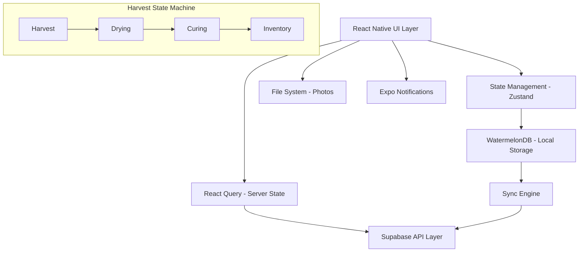
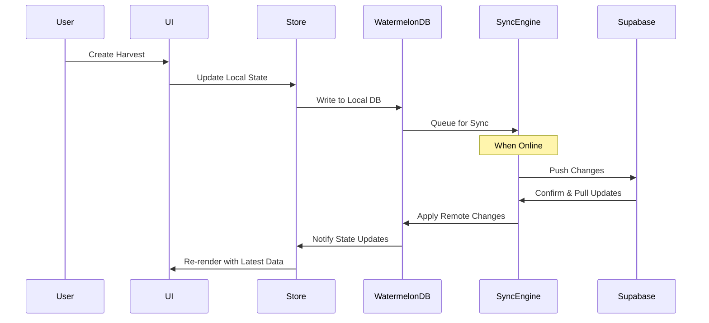
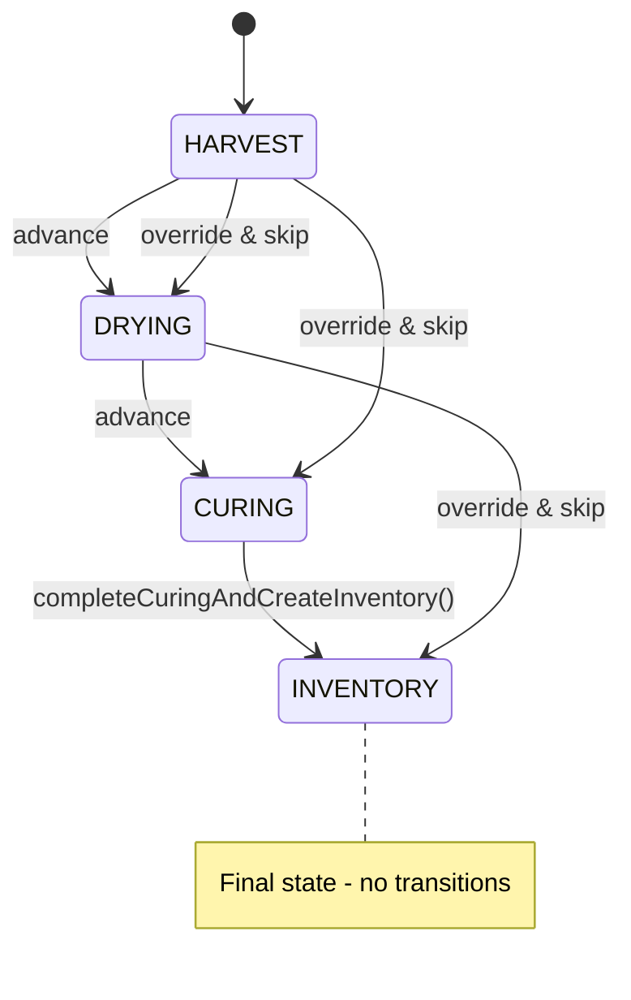

# Design Document

## Overview

The Harvest Workflow feature implements a comprehensive post-harvest tracking system that guides users through the critical stages of cannabis cultivation: Harvest → Drying → Curing → Inventory. The design emphasizes offline-first architecture, atomic operations, and robust state management to ensure data integrity throughout the harvest process.

The system uses a finite state machine approach with proper validation, timing guidance, and visual documentation capabilities. All operations are designed to work seamlessly offline with reliable synchronization when connectivity is restored.

## Architecture

### High-Level Architecture



### Data Flow Architecture



## Components and Interfaces

### Harvest State Machine

The harvest workflow implements a finite state machine with the following rules:

**Allowed Transitions**: HARVEST → DRYING → CURING → INVENTORY (forward only)

**Stage Management**:

- `stage_started_at`: Set on stage entry (server UTC timestamp)
- `stage_completed_at`: Set on stage exit (server UTC timestamp)
- All timestamps displayed in user locale

**Undo/Revert Rules**:

- **Soft Undo**: 15-second window for immediate undo without audit trail
- **Revert Stage**: After 15s, requires explicit audit note and reason
- **Override & Skip**: Allows skipping stages with mandatory reason (logged)

**State Transitions**:



### FlashList v2 Integration

All list components MUST use FlashList v2 defaults:

- **No size estimates**: Remove `estimatedItemSize`, `estimatedListSize`, `estimatedFirstItemOffset`
- **maintainVisibleContentPosition**: Enabled by default
- **masonry**: Use `masonry` prop when needed
- **RN New Architecture**: Target new architecture compatibility
- **Performance**: Lists render at 60fps with proper memoization

```typescript
<FlashList
  data={items}
  renderItem={Row}
  maintainVisibleContentPosition={{ startRenderingFromBottom: true }}
  onStartReached={loadOlder}
  getItemType={(item) => item.type} // When layouts vary
/>
```

### Core Components

#### 1. HarvestWorkflowScreen

- **Purpose**: Main container for harvest workflow management
- **Props**: `plantId: string, harvestId?: string`
- **State**: Current harvest, stage progression, validation errors
- **Key Features**: Stage navigation, progress indicators, offline status

#### 2. HarvestModal

- **Purpose**: Input form for harvest data entry
- **Props**: `isVisible: boolean, onSubmit: (data) => void, initialData?: HarvestData`
- **Validation**: Weight validation, required fields, unit conversion
- **Features**: Photo capture, notes input, metric/imperial toggle

#### 3. StageTracker

- **Purpose**: Visual representation of harvest stages with progression
- **Props**: `currentStage: HarvestStage, stages: StageConfig[], onStageAdvance: (stage) => void`
- **Features**: Progress visualization, timing guidance, undo functionality

#### 4. WeightChart

- **Purpose**: Line chart displaying weight changes over time
- **Props**: `data: ChartData[], timeRange: TimeRange, plantId?: string`
- **Performance**: Downsampling for large datasets on device, FlashList v2 integration
- **Fallback**: Tabular view on render errors
- **FlashList v2**: Uses defaults with no size estimates, maintainVisibleContentPosition enabled, masonry via prop, targets RN New Architecture

#### 5. PhotoCapture

- **Purpose**: Camera integration and photo management
- **Props**: `onPhotoCapture: (uri) => void, maxPhotos?: number`
- **Features**: Generate 3 variants (original, resized ~1280px, thumbnail), content-addressable storage (hash+ext), LRU cleanup with orphan detection

#### 6. InventorySync

- **Purpose**: Atomic inventory record creation and management
- **Props**: `harvestId: string, finalWeight: number, idempotencyKey: string`
- **Features**: Single transactional API call (completeCuringAndCreateInventory), idempotency via UUID key, server timestamp return for checkpointing

### Data Models

#### Harvest Model

```typescript
interface Harvest {
  id: string;
  plant_id: string;
  user_id: string;
  stage: HarvestStage;
  wet_weight_g: number | null;
  dry_weight_g: number | null;
  trimmings_weight_g: number | null;
  notes: string;
  stage_started_at: Date;
  stage_completed_at: Date | null;
  photos: string[]; // File URIs
  created_at: Date;
  updated_at: Date;
  deleted_at: Date | null;
  conflict_seen: boolean;
}

enum HarvestStage {
  HARVEST = 'harvest',
  DRYING = 'drying',
  CURING = 'curing',
  INVENTORY = 'inventory',
}
```

#### Inventory Model

```typescript
interface Inventory {
  id: string;
  plant_id: string;
  harvest_id: string;
  user_id: string;
  final_weight_g: number;
  harvest_date: Date;
  total_duration_days: number;
  created_at: Date;
  updated_at: Date;
  deleted_at: Date | null;
}
```

#### Stage Configuration

```typescript
interface StageConfig {
  stage: HarvestStage;
  name: string;
  description: string;
  target_duration_days: number;
  min_duration_days: number;
  max_duration_days: number;
  required_fields: string[];
  optional_fields: string[];
}
```

### Expo Notifications Integration

**Local Notifications Flow**:

- On stage entry: Schedule local notification for target duration
- If elapsed > max duration: Schedule gentle reminder notification
- On app start: Rehydrate scheduled notifications from database records
- Fully local operation: No push token or network required

**Implementation**:

```typescript
interface NotificationService {
  scheduleStageReminder(
    harvestId: string,
    stage: HarvestStage,
    targetDuration: number
  ): Promise<string>;
  cancelStageReminder(notificationId: string): Promise<void>;
  rehydrateNotifications(): Promise<void>; // Called on app start
}
```

### Photo Storage & File System

**Storage Architecture**:

- **3 Variants**: Original, resized (~1280px long edge), thumbnail
- **Content-Addressable**: Files stored as `hash+extension` for deduplication
- **Database**: Stores only URIs + metadata (EXIF), not binary data
- **Location**: App cache directories managed by application

**LRU Cleanup Strategy**:

- **Triggers**: App start + storage threshold crossings
- **Orphan Detection**: DB row missing → file cleanup
- **User Action**: "Free up space" button for manual cleanup
- **Retention**: Recent harvest photos prioritized

**Implementation**:

```typescript
interface PhotoStorageService {
  captureAndStore(
    harvestId: string,
    stage: HarvestStage
  ): Promise<PhotoVariants>;
  generateVariants(originalUri: string): Promise<PhotoVariants>;
  runLRUCleanup(): Promise<CleanupResult>;
  detectOrphans(): Promise<string[]>; // Returns orphaned file paths
}

interface PhotoVariants {
  original: string;
  resized: string;
  thumbnail: string;
  metadata: ExifData;
}
```

### API Interfaces

#### Harvest API

```typescript
interface HarvestAPI {
  createHarvest(data: CreateHarvestRequest): Promise<Harvest>;
  updateHarvest(id: string, data: UpdateHarvestRequest): Promise<Harvest>;
  advanceStage(
    id: string,
    stage: HarvestStage,
    notes?: string
  ): Promise<Harvest>;
  undoStageAdvance(id: string): Promise<Harvest>; // 15s window only
  revertStage(id: string, auditNote: string): Promise<Harvest>; // After 15s
  overrideAndSkipStage(
    id: string,
    targetStage: HarvestStage,
    reason: string
  ): Promise<Harvest>;
  completeCuringAndCreateInventory(
    id: string,
    input: { final_weight_g: number; notes?: string; idempotencyKey: string }
  ): Promise<{
    harvest: Harvest;
    inventory: Inventory;
    server_timestamp: number;
  }>;
  getHarvestHistory(plantId: string): Promise<Harvest[]>;
  getHarvestChartData(
    plantId: string,
    timeRange: TimeRange
  ): Promise<ChartData[]>;
}
```

#### Sync API

**WatermelonDB Integration**:

- Uses `synchronize()` with `pullChanges`/`pushChanges` functions
- Push order: `created → updated → deleted`
- Maintains `last_pulled_at` checkpoint for incremental sync
- LWW conflicts by server `updated_at`; client marks `conflict_seen = true`

**Telemetry Tracking**:

- Sync duration, queued mutations, rejection rate per table
- Checkpoint age and sync frequency metrics

```typescript
interface SyncAPI {
  pullChanges(
    lastPulledAt: number,
    tables: string[]
  ): Promise<SyncPullResponse>;
  pushChanges(changes: SyncPushRequest): Promise<SyncPushResponse>;
}

interface SyncPullResponse {
  server_timestamp: number;
  changes: {
    harvests: {
      created: Harvest[];
      updated: Harvest[];
      deleted: { id: string; deleted_at: Date }[];
    };
    inventory: {
      created: Inventory[];
      updated: Inventory[];
      deleted: { id: string; deleted_at: Date }[];
    };
  };
  has_more: boolean;
  next_cursor: string | null;
}

interface SyncPushRequest {
  last_pulled_at: number;
  changes: {
    harvests: {
      created: Harvest[];
      updated: Harvest[];
      deleted: { id: string; deleted_at_client: Date }[];
    };
    inventory: {
      created: Inventory[];
      updated: Inventory[];
      deleted: { id: string; deleted_at_client: Date }[];
    };
  };
}

interface SyncPushResponse {
  server_timestamp: number;
  applied: {
    harvests: { created: number; updated: number; deleted: number };
    inventory: { created: number; updated: number; deleted: number };
  };
  rejected: {
    harvests: { id: string; reason: string }[];
    inventory: { id: string; reason: string }[];
  };
  conflicts: {
    harvests: string[]; // IDs with conflicts
    inventory: string[];
  };
}
```

#### React Query Integration

**Server State Management**:

- React Query v5 for server state caching and mutations
- Invalidate RQ caches on WatermelonDB sync completion
- Handle paused mutations with `resumePausedMutations()` on app start
- Keep mutations in WatermelonDB outbox, not RQ, for offline reliability

```typescript
// Invalidate queries after sync
const onSyncComplete = () => {
  queryClient.invalidateQueries({ queryKey: ['harvests'] });
  queryClient.invalidateQueries({ queryKey: ['inventory'] });
};
```

## Data Models

### Database Schema

#### Harvests Table

```sql
CREATE TABLE harvests (
  id UUID PRIMARY KEY DEFAULT gen_random_uuid(),
  plant_id UUID NOT NULL REFERENCES plants(id),
  user_id UUID NOT NULL REFERENCES auth.users(id),
  stage VARCHAR(20) NOT NULL CHECK (stage IN ('harvest', 'drying', 'curing', 'inventory')),
  wet_weight_g INTEGER CHECK (wet_weight_g >= 0 AND wet_weight_g <= 100000),
  dry_weight_g INTEGER CHECK (dry_weight_g >= 0 AND dry_weight_g <= 100000),
  trimmings_weight_g INTEGER CHECK (trimmings_weight_g >= 0 AND trimmings_weight_g <= 100000),
  notes TEXT DEFAULT '',
  stage_started_at TIMESTAMPTZ NOT NULL DEFAULT now(),
  stage_completed_at TIMESTAMPTZ,
  photos JSONB DEFAULT '[]',
  created_at TIMESTAMPTZ NOT NULL DEFAULT now(),
  updated_at TIMESTAMPTZ NOT NULL DEFAULT now(),
  deleted_at TIMESTAMPTZ,
  conflict_seen BOOLEAN DEFAULT false,

  CONSTRAINT valid_weights CHECK (
    (wet_weight_g IS NULL OR dry_weight_g IS NULL) OR
    (dry_weight_g <= wet_weight_g)
  )
);

-- Indexes for performance
CREATE INDEX idx_harvests_user_updated ON harvests(user_id, updated_at);
CREATE INDEX idx_harvests_plant ON harvests(plant_id);
CREATE INDEX idx_harvests_stage ON harvests(stage) WHERE deleted_at IS NULL;
```

#### Inventory Table

```sql
CREATE TABLE inventory (
  id UUID PRIMARY KEY DEFAULT gen_random_uuid(),
  plant_id UUID NOT NULL REFERENCES plants(id),
  harvest_id UUID NOT NULL REFERENCES harvests(id),
  user_id UUID NOT NULL REFERENCES auth.users(id),
  final_weight_g INTEGER NOT NULL CHECK (final_weight_g >= 0),
  harvest_date DATE NOT NULL,
  total_duration_days INTEGER NOT NULL CHECK (total_duration_days >= 0),
  created_at TIMESTAMPTZ NOT NULL DEFAULT now(),
  updated_at TIMESTAMPTZ NOT NULL DEFAULT now(),
  deleted_at TIMESTAMPTZ,

  UNIQUE(harvest_id)
);

-- Indexes
CREATE INDEX idx_inventory_user_updated ON inventory(user_id, updated_at);
CREATE INDEX idx_inventory_plant ON inventory(plant_id);
```

### Row Level Security (RLS)

```sql
-- Harvests RLS
ALTER TABLE harvests ENABLE ROW LEVEL SECURITY;

CREATE POLICY "Users can manage their own harvests" ON harvests
  FOR ALL USING (auth.uid() = user_id);

-- Inventory RLS
ALTER TABLE inventory ENABLE ROW LEVEL SECURITY;

CREATE POLICY "Users can manage their own inventory" ON inventory
  FOR ALL USING (auth.uid() = user_id);
```

## Error Handling

### Error Classification and Handling Strategy

#### 1. Input Validation Errors

- **Type**: Client-side validation failures
- **Handling**: Inline error messages, prevent form submission
- **Examples**: Invalid weights, missing required fields
- **Recovery**: User corrects input and resubmits

#### 2. Network and Sync Errors

- **Type**: Connectivity issues, server timeouts
- **Handling**: Exponential backoff retry, offline queue
- **Examples**: Request timeout, server unavailable
- **Recovery**: Automatic retry with user notification

#### 3. Business Logic Errors

- **Type**: State machine violations, constraint failures
- **Handling**: Clear error messages with corrective actions
- **Examples**: Skipping stages, invalid stage transitions
- **Recovery**: Guided user actions to resolve state

#### 4. Data Consistency Errors

- **Type**: Sync conflicts, concurrent modifications
- **Handling**: Last-Write-Wins with conflict notification
- **Examples**: Same harvest edited on multiple devices
- **Recovery**: User review and manual resolution if needed

### Error Handling Implementation

```typescript
class HarvestErrorHandler {
  static handleValidationError(error: ValidationError): void {
    // Show inline validation messages
    // Prevent form submission
    // Highlight problematic fields
  }

  static handleSyncError(error: SyncError): void {
    if (error.isRetryable) {
      // Queue for retry with exponential backoff
      SyncQueue.enqueue(error.operation, error.retryCount + 1);
    } else {
      // Show persistent error banner
      NotificationService.showError(error.message, {
        actions: ['Retry Now', 'View Details'],
      });
    }
  }

  static handleBusinessLogicError(error: BusinessLogicError): void {
    // Map error codes to user-friendly messages
    const message = ErrorMessages[error.code] || error.message;

    // Provide corrective actions
    const actions = this.getCorrectiveActions(error.code);

    AlertService.show(message, actions);
  }
}
```

### Server Error Mapping

```typescript
const SERVER_ERROR_MAPPING = {
  401: { action: 'RE_AUTH', message: 'Please sign in again' },
  403: { action: 'PERMISSION_DENIED', message: 'Access denied' },
  413: { action: 'SPLIT_UPLOAD', message: 'Data too large, splitting...' },
  422: { action: 'VALIDATION_ERROR', message: 'Invalid data provided' },
  500: { action: 'RETRY', message: 'Server error, retrying...' },
};
```

## Testing Strategy

### Unit Testing

#### Component Testing

- **HarvestModal**: Form validation, weight conversion, photo handling
- **StageTracker**: State transitions, timing calculations, undo functionality
- **WeightChart**: Data rendering, downsampling, fallback behavior
- **PhotoCapture**: File operations, variant generation, cleanup

#### Service Testing

- **HarvestService**: CRUD operations, state machine logic
- **SyncService**: Conflict resolution, retry logic, queue management
- **ValidationService**: Weight validation, constraint checking
- **NotificationService**: Scheduling, rehydration, cleanup

### Integration Testing

#### Offline-First Testing

```typescript
describe('Offline Harvest Workflow', () => {
  beforeEach(() => {
    // Simulate offline mode
    NetworkService.setOffline(true);
  });

  it('should create harvest offline and sync when online', async () => {
    // Create harvest while offline
    const harvest = await HarvestService.createHarvest(testData);
    expect(harvest).toBeDefined();
    expect(SyncQueue.getPendingOperations()).toHaveLength(1);

    // Go online and verify sync
    NetworkService.setOffline(false);
    await SyncService.processQueue();
    expect(SyncQueue.getPendingOperations()).toHaveLength(0);
  });

  it('should handle stage transitions offline', async () => {
    const harvest = await HarvestService.createHarvest(testData);
    await HarvestService.advanceStage(harvest.id, HarvestStage.DRYING);

    expect(harvest.stage).toBe(HarvestStage.DRYING);
    expect(SyncQueue.getPendingOperations()).toHaveLength(2);
  });
});
```

#### Conflict Resolution Testing

```typescript
describe('Sync Conflict Resolution', () => {
  it('should resolve conflicts using Last-Write-Wins', async () => {
    // Simulate concurrent edits
    const harvest1 = await HarvestService.updateHarvest(id, {
      notes: 'Device 1',
    });
    const harvest2 = await HarvestService.updateHarvest(id, {
      notes: 'Device 2',
    });

    // Sync and verify LWW resolution
    await SyncService.resolveConflicts([harvest1, harvest2]);

    const resolved = await HarvestService.getHarvest(id);
    expect(resolved.conflict_seen).toBe(true);
    expect(resolved.notes).toBe('Device 2'); // Later timestamp wins
  });
});
```

### End-to-End Testing

#### Happy Path Testing

1. **Complete Harvest Flow**: Create harvest → Advance through all stages → Verify inventory creation
2. **Photo Documentation**: Capture photos at each stage → Verify storage and retrieval
3. **Weight Tracking**: Enter weights → View charts → Verify calculations
4. **Offline Workflow**: Complete entire flow offline → Sync when online

#### Edge Case Testing

1. **Multiple Harvests**: Create overlapping harvests → Verify conflict handling
2. **Back-dated Edits**: Edit historical stages → Verify duration recalculation
3. **Missing Data**: Attempt to finalize without required fields → Verify blocking and guidance
4. **Storage Limits**: Fill photo storage → Verify LRU cleanup

### Performance Testing

#### Chart Performance

```typescript
describe('Chart Performance', () => {
  it('should render 365-day dataset smoothly', async () => {
    const largeDataset = generateTestData(365);
    const startTime = performance.now();

    render(<WeightChart data={largeDataset} />);

    const renderTime = performance.now() - startTime;
    expect(renderTime).toBeLessThan(100); // 100ms threshold
  });

  it('should downsample large datasets', async () => {
    const hugeDataset = generateTestData(1000);
    const chart = render(<WeightChart data={hugeDataset} />);

    // Verify downsampling occurred
    expect(chart.getByTestId('chart-points').children).toHaveLength(365);
  });
});
```

#### List Performance

```typescript
describe('FlashList Performance', () => {
  it('should maintain 60fps with large harvest lists', async () => {
    const largeHarvestList = generateHarvests(1000);
    const performanceMonitor = new PerformanceMonitor();

    render(<HarvestHistoryList data={largeHarvestList} />);

    // Simulate scrolling
    fireEvent.scroll(screen.getByTestId('harvest-list'), {
      nativeEvent: { contentOffset: { y: 5000 } }
    });

    expect(performanceMonitor.getAverageFPS()).toBeGreaterThan(55);
  });
});
```

### Security Testing

#### RLS Testing

```typescript
describe('Row Level Security', () => {
  it('should prevent cross-user data access', async () => {
    const user1Harvest = await createHarvestAsUser(user1Id, testData);

    // Attempt to access as different user
    await expect(
      HarvestService.getHarvest(user1Harvest.id, user2Id)
    ).rejects.toThrow('Access denied');
  });

  it('should enforce ownership on updates', async () => {
    const harvest = await createHarvestAsUser(user1Id, testData);

    await expect(
      HarvestService.updateHarvest(harvest.id, { notes: 'hacked' }, user2Id)
    ).rejects.toThrow('Permission denied');
  });
});
```

### Accessibility Testing

```typescript
describe('Accessibility', () => {
  it('should provide proper labels for screen readers', () => {
    render(<StageTracker currentStage="drying" />);

    expect(screen.getByLabelText('Advance to Curing stage')).toBeInTheDocument();
    expect(screen.getByLabelText('Current stage: Drying')).toBeInTheDocument();
  });

  it('should meet minimum touch target sizes', () => {
    render(<HarvestModal />);

    const buttons = screen.getAllByRole('button');
    buttons.forEach(button => {
      const { width, height } = button.getBoundingClientRect();
      expect(Math.min(width, height)).toBeGreaterThanOrEqual(44);
    });
  });
});
```

### Minimum Test Scenarios (Must Pass)

#### Critical Path Testing

1. **Happy Path**: Harvest → Drying → Curing → Inventory with final weight & atomic inventory creation
2. **Undo Flow**: Stage advance + Undo within 15s; audit & timestamps correct
3. **Offline Complete**: Entire flow (including photos) in airplane mode; later sync without duplicates
4. **Conflict Resolution**: Same record edited on two devices; LWW applies; client shows "Updated elsewhere"
5. **Transactional Failure**: Inventory write fails; transactional rollback; automatic retry/backoff; user notified
6. **Chart Performance**: 365-day dataset renders smoothly; downsampling kicks in; table fallback works
7. **Security**: RLS prevents cross-user reads/writes; storage objects restricted to owner

#### Acceptance Criteria Validation

- "Lists render at 60fps with FlashList v2 defaults; no size estimates used"
- "Completing Curing triggers a single transactional API call that also creates inventory; retriable via Idempotency-Key"
- "Local stage notifications are scheduled and rehydrated on app start; no network required"
- "Sync uses WatermelonDB synchronize() with LWW; conflicts mark conflict_seen"
- "Photos generate 3 variants with content-addressable storage and LRU cleanup"

### Additional Design Considerations

#### Server-Authoritative Timing

- All stage and updated timestamps are server UTC
- Client displays timestamps in user locale
- Prevents clock skew issues during conflict resolution with LWW

#### Edge Case Handling

- **Multiple Harvests**: Support multiple harvests per plant with explicit override for overlapping open harvests
- **Back-dated Edits**: Recompute derived durations consistently when historical stages are edited
- **Missing Weights**: Allow wet-only at start; require dry weight to finalize inventory
- **Device Clock Skew**: Server timestamps authoritative for ordering and conflict resolution

#### Performance Optimizations

- **Chart Downsampling**: Large series downsample on device; table fallback on render errors
- **FlashList Performance**: Feels slower in dev; prioritize memoized props and production builds during testing
- **Zustand Persistence**: Document persist middleware and storage adapter for UI preferences (units, filters)

#### RLS Refinements

- Owner-only SELECT/INSERT/UPDATE/DELETE policies with `auth.uid()`
- Partial indexes on `(user_id, updated_at)` to keep RLS performant
- Separate read and write policies for clarity
- Supabase Storage policies restrict object access to owner with explicit permissions
