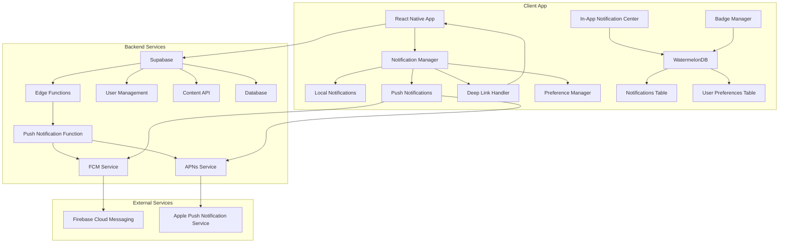
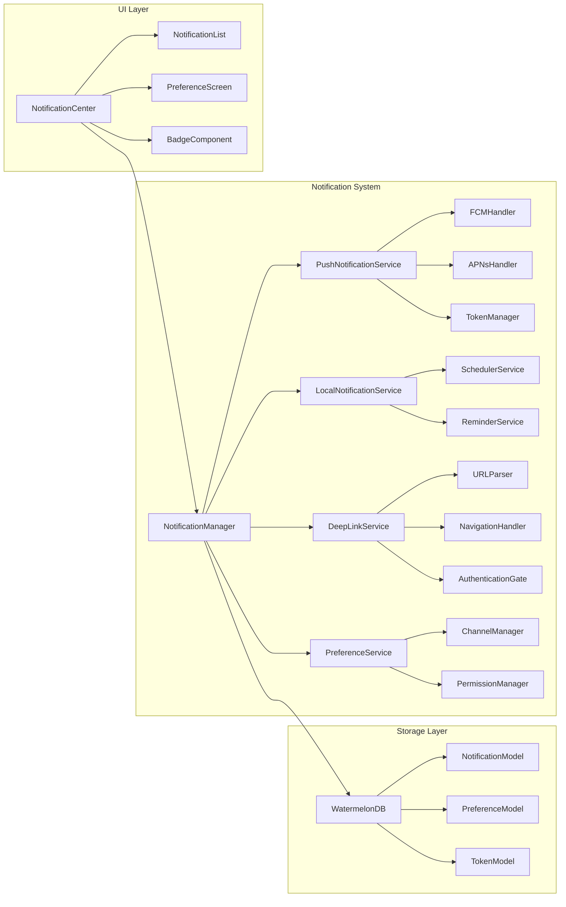

# Design Document

## Overview

The notifications and deep links system for GrowBro implements a comprehensive, offline-first notification architecture that handles push notifications, local notifications, deep linking, and user preference management. The system is built on React Native with Expo using **expo-notifications** with **Supabase Edge Functions** for push notification delivery via FCM/APNs, WatermelonDB for offline storage, and Supabase for backend services.

## SDK Decision: Expo + Supabase Approach

We use **expo-notifications** for unified notification handling with **Supabase Edge Functions** managing push notification delivery to FCM/APNs. This provides out-of-the-box support for categories, channels, and Universal Links while leveraging Supabase's backend infrastructure for user management, preferences, and delivery tracking.

The architecture follows platform-specific best practices for iOS and Android, ensuring reliable delivery, proper permission handling, and seamless deep link navigation while maintaining the app's offline-first philosophy.

## Architecture

### High-Level System Architecture



### Component Architecture



## Components and Interfaces

### Core Services

#### NotificationManager

Central orchestrator for all notification-related functionality.

```typescript
interface NotificationManager {
  // Initialization
  initialize(): Promise<void>;
  setupChannels(): Promise<void>;

  // Push notifications
  registerForPushNotifications(): Promise<string | null>;
  handlePushNotification(notification: PushNotification): Promise<void>;

  // Local notifications
  scheduleLocalNotification(
    notification: LocalNotificationRequest
  ): Promise<string>;
  cancelLocalNotification(id: string): Promise<void>;

  // Deep links
  handleDeepLink(url: string): Promise<void>;

  // Preferences
  updatePreferences(preferences: NotificationPreferences): Promise<void>;
  getPreferences(): Promise<NotificationPreferences>;
}
```

#### PushNotificationService

Handles FCM and APNs integration with platform-specific logic.

```typescript
interface PushNotificationService {
  // Token management
  getDeviceToken(): Promise<string | null>;
  refreshToken(): Promise<string | null>;
  syncTokenWithServer(token: string): Promise<void>;

  // Message handling
  handleForegroundMessage(
    message: FirebaseMessagingTypes.RemoteMessage
  ): Promise<void>;
  handleBackgroundMessage(
    message: FirebaseMessagingTypes.RemoteMessage
  ): Promise<void>;

  // Platform-specific
  setupAndroidChannels(): Promise<void>;
  setupiOSCategories(): Promise<void>;

  // Analytics
  trackNotificationDelivery(messageId: string): Promise<void>;
  trackNotificationOpened(messageId: string): Promise<void>;
}
```

#### LocalNotificationService

Manages local notifications and reminders with platform-specific scheduling.

```typescript
interface LocalNotificationService {
  // Scheduling
  scheduleNotification(request: LocalNotificationRequest): Promise<string>;
  scheduleRepeatingNotification(
    request: RepeatingNotificationRequest
  ): Promise<string>;
  cancelNotification(id: string): Promise<void>;
  cancelAllNotifications(): Promise<void>;

  // iOS-specific
  manageNotificationLimit(): Promise<void>; // Handle 64 notification limit

  // Android-specific
  requestExactAlarmPermission(): Promise<boolean>;
  scheduleExactNotification(request: ExactNotificationRequest): Promise<string>;
}
```

#### DeepLinkService

Handles Universal Links, App Links, and custom scheme deep links.

```typescript
interface DeepLinkService {
  // URL handling
  parseURL(url: string): DeepLinkData | null;
  handleURL(url: string): Promise<void>;

  // Navigation
  navigateToContent(linkData: DeepLinkData): Promise<void>;
  deferNavigation(linkData: DeepLinkData): Promise<void>;

  // Authentication
  authenticateAndNavigate(linkData: DeepLinkData): Promise<void>;

  // Validation
  validateURL(url: string): boolean;
  isProtectedContent(linkData: DeepLinkData): boolean;
}
```

### Data Models

#### Notification Model (WatermelonDB)

```typescript
class NotificationModel extends Model {
  static table = 'notifications';

  @field('id') id!: string;
  @field('type') type!: NotificationType;
  @field('title') title!: string;
  @field('body') body!: string;
  @field('data') data!: string; // JSON string
  @field('deep_link') deepLink?: string;
  @field('read_at') readAt?: number;
  @field('created_at') createdAt!: number;
  @field('expires_at') expiresAt?: number;
  @field('message_id') messageId?: string;
}
```

#### Preference Model (WatermelonDB)

```typescript
class PreferenceModel extends Model {
  static table = 'notification_preferences';

  @field('user_id') userId!: string;
  @field('community_interactions') communityInteractions!: boolean;
  @field('community_likes') communityLikes!: boolean;
  @field('cultivation_reminders') cultivationReminders!: boolean;
  @field('system_updates') systemUpdates!: boolean;
  @field('quiet_hours_enabled') quietHoursEnabled!: boolean;
  @field('quiet_hours_start') quietHoursStart?: string;
  @field('quiet_hours_end') quietHoursEnd?: string;
  @field('updated_at') updatedAt!: number;
}
```

### Platform-Specific Implementations

#### Android Channel Configuration

**CRITICAL**: Channels are immutable after creation. Importance and sound cannot be changed programmatically - only users can modify these settings. Channel IDs and defaults are locked for production.

```typescript
const ANDROID_CHANNELS = {
  COMMUNITY_INTERACTIONS: {
    id: 'community.interactions.v1', // v1 suffix for future migration
    name: 'Community Interactions',
    description: 'Replies and comments on your posts',
    importance: AndroidImportance.DEFAULT,
    sound: 'default',
    vibration: true,
    lights: true,
    groupId: 'community',
  },
  COMMUNITY_LIKES: {
    id: 'community.likes.v1',
    name: 'Community Likes',
    description: 'Likes on your posts and comments',
    importance: AndroidImportance.LOW,
    sound: 'default',
    vibration: false,
    lights: true,
    groupId: 'community',
  },
  CULTIVATION_REMINDERS: {
    id: 'cultivation.reminders.v1',
    name: 'Cultivation Reminders',
    description: 'Task reminders and grow schedule alerts',
    importance: AndroidImportance.HIGH,
    sound: 'default',
    vibration: true,
    lights: true,
    groupId: 'cultivation',
  },
  SYSTEM_UPDATES: {
    id: 'system.updates.v1',
    name: 'System Updates',
    description: 'App updates and important announcements',
    importance: AndroidImportance.DEFAULT,
    sound: 'default',
    vibration: false,
    lights: true,
    groupId: 'system',
  },
};

// Migration strategy for future channel changes
const CHANNEL_MIGRATION = {
  // When changing channel properties, create new channel with incremented version
  // Example: 'community.interactions.v2' with new settings
  // Keep old channels for backward compatibility
};
```

#### iOS Category Configuration

```typescript
const IOS_CATEGORIES = {
  COMMUNITY_INTERACTIONS: {
    identifier: 'COMMUNITY_INTERACTIONS',
    actions: [
      {
        identifier: 'REPLY_ACTION',
        title: 'Reply',
        options: [UNNotificationActionOptions.Foreground],
        textInput: {
          buttonTitle: 'Send',
          placeholder: 'Type your reply...',
        },
      },
      {
        identifier: 'VIEW_PROFILE_ACTION',
        title: 'View Profile',
        options: [UNNotificationActionOptions.Foreground],
      },
    ],
    intentIdentifiers: [],
    options: [UNNotificationCategoryOptions.CustomDismissAction],
  },
  CULTIVATION_REMINDERS: {
    identifier: 'CULTIVATION_REMINDERS',
    actions: [
      {
        identifier: 'MARK_COMPLETE_ACTION',
        title: 'Mark Complete',
        options: [],
      },
      {
        identifier: 'SNOOZE_ACTION',
        title: 'Snooze 1h',
        options: [],
      },
    ],
    intentIdentifiers: [],
    options: [],
  },
};
```

## Data Models

### Database Schema (WatermelonDB)

```typescript
// notifications table
const notificationsSchema = tableSchema({
  name: 'notifications',
  columns: [
    { name: 'id', type: 'string', isIndexed: true },
    { name: 'type', type: 'string', isIndexed: true },
    { name: 'title', type: 'string' },
    { name: 'body', type: 'string' },
    { name: 'data', type: 'string' }, // JSON
    { name: 'deep_link', type: 'string', isOptional: true },
    { name: 'read_at', type: 'number', isOptional: true, isIndexed: true },
    { name: 'created_at', type: 'number', isIndexed: true },
    { name: 'expires_at', type: 'number', isOptional: true, isIndexed: true },
    { name: 'message_id', type: 'string', isOptional: true, isIndexed: true },
  ],
});

// notification_preferences table
const preferencesSchema = tableSchema({
  name: 'notification_preferences',
  columns: [
    { name: 'user_id', type: 'string', isIndexed: true },
    { name: 'community_interactions', type: 'boolean' },
    { name: 'community_likes', type: 'boolean' },
    { name: 'cultivation_reminders', type: 'boolean' },
    { name: 'system_updates', type: 'boolean' },
    { name: 'quiet_hours_enabled', type: 'boolean' },
    { name: 'quiet_hours_start', type: 'string', isOptional: true },
    { name: 'quiet_hours_end', type: 'string', isOptional: true },
    { name: 'updated_at', type: 'number' },
  ],
});

// device_tokens table
const tokensSchema = tableSchema({
  name: 'device_tokens',
  columns: [
    { name: 'token', type: 'string', isIndexed: true },
    { name: 'platform', type: 'string' },
    { name: 'user_id', type: 'string', isIndexed: true },
    { name: 'created_at', type: 'number' },
    { name: 'last_used_at', type: 'number' },
    { name: 'is_active', type: 'boolean', isIndexed: true },
  ],
});
```

### Supabase Backend Schema

```sql
-- Push notification tokens
CREATE TABLE push_tokens (
  id UUID PRIMARY KEY DEFAULT gen_random_uuid(),
  user_id UUID REFERENCES auth.users(id) ON DELETE CASCADE,
  token TEXT NOT NULL,
  platform TEXT NOT NULL CHECK (platform IN ('ios', 'android')),
  created_at TIMESTAMP WITH TIME ZONE DEFAULT NOW(),
  last_used_at TIMESTAMP WITH TIME ZONE DEFAULT NOW(),
  is_active BOOLEAN DEFAULT true,
  UNIQUE(user_id, token)
);

-- Notification queue for delivery tracking
CREATE TABLE notification_queue (
  id UUID PRIMARY KEY DEFAULT gen_random_uuid(),
  user_id UUID REFERENCES auth.users(id) ON DELETE CASCADE,
  message_id TEXT UNIQUE NOT NULL,
  type TEXT NOT NULL,
  payload JSONB NOT NULL,
  scheduled_at TIMESTAMP WITH TIME ZONE DEFAULT NOW(),
  sent_at TIMESTAMP WITH TIME ZONE,
  delivered_at TIMESTAMP WITH TIME ZONE,
  opened_at TIMESTAMP WITH TIME ZONE,
  status TEXT DEFAULT 'pending' CHECK (status IN ('pending', 'sent', 'delivered', 'opened', 'failed')),
  error_message TEXT,
  created_at TIMESTAMP WITH TIME ZONE DEFAULT NOW()
);

-- User notification preferences
CREATE TABLE notification_preferences (
  id UUID PRIMARY KEY DEFAULT gen_random_uuid(),
  user_id UUID REFERENCES auth.users(id) ON DELETE CASCADE UNIQUE,
  community_interactions BOOLEAN DEFAULT true,
  community_likes BOOLEAN DEFAULT true,
  cultivation_reminders BOOLEAN DEFAULT true,
  system_updates BOOLEAN DEFAULT true,
  quiet_hours_enabled BOOLEAN DEFAULT false,
  quiet_hours_start TIME,
  quiet_hours_end TIME,
  updated_at TIMESTAMP WITH TIME ZONE DEFAULT NOW()
);
```

## Error Handling

### Error Categories and Responses

```typescript
enum NotificationErrorType {
  PERMISSION_DENIED = 'PERMISSION_DENIED',
  TOKEN_REFRESH_FAILED = 'TOKEN_REFRESH_FAILED',
  DELIVERY_FAILED = 'DELIVERY_FAILED',
  DEEP_LINK_INVALID = 'DEEP_LINK_INVALID',
  CHANNEL_CREATION_FAILED = 'CHANNEL_CREATION_FAILED',
  SCHEDULING_FAILED = 'SCHEDULING_FAILED',
  NETWORK_ERROR = 'NETWORK_ERROR',
}

interface NotificationError {
  type: NotificationErrorType;
  message: string;
  originalError?: Error;
  context?: Record<string, any>;
}
```

### Error Handling Strategies

1. **Permission Denied**: Show educational modal with benefits and settings deep link
2. **Token Refresh Failed**: Retry with exponential backoff, fallback to in-app notifications
3. **Delivery Failed**: Queue for retry, track failure metrics, alert if rate exceeds threshold
4. **Deep Link Invalid**: Show error toast, navigate to home screen, log for analysis
5. **Channel Creation Failed**: Use default channel, log error for debugging
6. **Scheduling Failed**: Show user-friendly error, suggest manual reminder
7. **Network Error**: Queue operations for retry when online, show offline indicator

### Graceful Degradation

```typescript
class NotificationFallbackService {
  // When push notifications fail
  async fallbackToPushFailure(notification: NotificationData): Promise<void> {
    // Store in local database for in-app display
    await this.storeInAppNotification(notification);

    // Update badge count
    await this.updateBadgeCount();

    // Show local notification if permissions allow
    if (await this.hasLocalNotificationPermission()) {
      await this.showLocalNotification(notification);
    }
  }

  // When deep links fail
  async fallbackToDeepLinkFailure(url: string): Promise<void> {
    // Parse what we can from the URL
    const fallbackData = this.extractFallbackData(url);

    // Show error message
    this.showErrorToast('Link could not be opened');

    // Navigate to relevant section if possible
    if (fallbackData.section) {
      await this.navigateToSection(fallbackData.section);
    } else {
      await this.navigateToHome();
    }
  }
}
```

## Testing Strategy

### Unit Testing

1. **Service Layer Testing**

   - Mock Firebase messaging and Expo notifications
   - Test notification scheduling and cancellation
   - Test deep link parsing and validation
   - Test preference management

2. **Model Testing**

   - Test WatermelonDB model operations
   - Test data validation and constraints
   - Test sync operations

3. **Utility Testing**
   - Test URL parsing and validation
   - Test permission checking logic
   - Test platform-specific code paths

### Integration Testing

1. **End-to-End Notification Flow**

   - Test push notification delivery and handling
   - Test local notification scheduling and display
   - Test deep link navigation from notifications
   - Test preference changes affecting behavior

2. **Platform-Specific Testing**

   - Test Android channel creation and management
   - Test iOS category setup and action handling
   - Test permission flows on both platforms
   - Test background/foreground state handling

3. **Offline/Online Testing**
   - Test notification queuing when offline
   - Test sync when coming back online
   - Test local notification fallbacks
   - Test data consistency

### Device Testing Matrix

```typescript
const TESTING_SCENARIOS = [
  // App states
  'cold_start',
  'background',
  'foreground',
  'killed_app',

  // System states
  'dnd_enabled',
  'focus_mode',
  'doze_mode',
  'battery_saver',
  'low_power_mode',

  // Permission states
  'permissions_granted',
  'permissions_denied',
  'permissions_revoked',
  'provisional_permissions',

  // Network states
  'online',
  'offline',
  'poor_connection',

  // User scenarios
  'first_install',
  'app_update',
  'reinstall',
  'multi_device',
  'multi_account',
];
```

### Performance Testing

1. **Notification Latency**

   - Measure end-to-end delivery time
   - Test under various network conditions
   - Monitor battery impact

2. **Database Performance**

   - Test notification storage and retrieval
   - Test large notification history handling
   - Test sync performance

3. **Memory Usage**
   - Monitor notification service memory usage
   - Test for memory leaks in background processing
   - Test notification cleanup

### Security Testing

1. **Deep Link Security**

   - Test URL validation and sanitization
   - Test protection against open redirects
   - Test authentication bypass attempts

2. **Data Privacy**

   - Test PII handling in notifications
   - Test data encryption in local storage
   - Test token security and rotation

3. **Permission Security**
   - Test permission escalation attempts
   - Test notification spoofing protection
   - Test cross-app notification interference

## Implementation Notes

### Platform-Specific Considerations

#### iOS Implementation

- Use `@react-native-async-storage/async-storage` for token persistence
- Implement rolling notification scheduler for 64 notification limit
- Handle provisional authorization properly
- Use `UNNotificationServiceExtension` for rich notifications
- Implement proper background processing with time limits

#### Android Implementation

- Create notification channels before first use
- Handle Android 13+ POST_NOTIFICATIONS permission
- Implement proper foreground service for background processing
- Use WorkManager for reliable background tasks
- Handle Doze mode and battery optimization

### Performance Optimizations

1. **Lazy Loading**: Load notification center content on demand
2. **Pagination**: Implement cursor-based pagination for notification history
3. **Caching**: Cache frequently accessed preferences and tokens
4. **Debouncing**: Debounce preference updates to avoid excessive API calls
5. **Background Sync**: Use efficient sync strategies to minimize battery usage

### Monitoring and Analytics

```typescript
interface NotificationMetrics {
  // Delivery metrics
  pushNotificationsSent: number;
  pushNotificationsDelivered: number;
  pushNotificationsOpened: number;

  // Engagement metrics
  notificationClickRate: number;
  notificationDismissRate: number;
  inAppNotificationViews: number;

  // Performance metrics
  averageDeliveryTime: number;
  tokenRefreshRate: number;
  deepLinkSuccessRate: number;

  // Error metrics
  permissionDenialRate: number;
  deliveryFailureRate: number;
  deepLinkFailureRate: number;
}
```

This design provides a comprehensive, production-ready notification system that handles the complexity of modern mobile notification requirements while maintaining the offline-first architecture of GrowBro.

## Platform-Specific Constraints & Implementation Details

### Android 12+ Notification Trampoline Restrictions

**CRITICAL**: Notification taps must launch an Activity directly via `PendingIntent.getActivity()`. No BroadcastReceiver or Service hops allowed. Deep link handlers must be implemented as Activities.

### Android 15 Background Activity Launch (BAL) Rules

Apps must explicitly opt-in for background activity launches. Implement proper foreground service patterns for background notification processing.

### iOS 64 Local Notification Limit

Implement rolling scheduler that maintains maximum 32-48 pending notifications, refreshing on app start/resume and after each notification fires.

```typescript
class iOSNotificationScheduler {
  private readonly MAX_PENDING = 48;

  async scheduleRollingNotifications(tasks: TaskReminder[]): Promise<void> {
    // Cancel existing notifications
    await Notifications.cancelAllScheduledNotificationsAsync();

    // Sort by due date and take next N
    const upcoming = tasks
      .sort((a, b) => a.dueDate.getTime() - b.dueDate.getTime())
      .slice(0, this.MAX_PENDING);

    // Schedule the batch
    for (const task of upcoming) {
      await this.scheduleTaskReminder(task);
    }
  }
}
```

### Android Exact Alarms (Calendar Use Case)

For precise task reminders, implement SCHEDULE_EXACT_ALARM permission flow with fallback to WorkManager:

```typescript
class AndroidExactAlarmService {
  async requestExactAlarmPermission(): Promise<boolean> {
    if (Platform.OS !== 'android' || Platform.Version < 31) return true;

    const hasPermission = await this.checkExactAlarmPermission();
    if (!hasPermission) {
      // Show educational modal explaining calendar-class app benefits
      await this.showExactAlarmEducation();
      // Open system settings for user to grant permission
      await this.openExactAlarmSettings();
    }
    return hasPermission;
  }

  async scheduleTaskReminder(task: TaskReminder): Promise<void> {
    const hasExactPermission = await this.checkExactAlarmPermission();

    if (hasExactPermission) {
      // Use exact alarm for precise timing
      await this.scheduleExactAlarm(task);
    } else {
      // Fallback to WorkManager with tolerance
      await this.scheduleInexactReminder(task);
      // Show in-app reminder as backup
      await this.addInAppReminder(task);
    }
  }
}
```

## Notification Payload Contracts

### Supabase Edge Function → FCM (Android)

The Supabase Edge Function receives notification requests and formats them for FCM delivery:

```typescript
// Supabase Edge Function input
const notificationRequest = {
  userId: 'user_123',
  type: 'community.reply',
  postId: 'post_456',
  replyId: 'reply_789',
  title: 'New reply',
  body: 'Reply preview text...',
  deepLink: 'https://growbro.app/post/456',
};

// Edge Function formats for FCM
const fcmPayload = {
  message: {
    token: userToken, // Retrieved from Supabase database
    android: {
      collapse_key: `post_${postId}`,
      notification: {
        title: notificationRequest.title,
        body: notificationRequest.body,
        channel_id: 'community.interactions.v1',
      },
      ttl: '21600s',
    },
    data: {
      deeplink: notificationRequest.deepLink,
      type: notificationRequest.type,
      message_id: `msg_${crypto.randomUUID()}`,
      post_id: notificationRequest.postId,
      reply_id: notificationRequest.replyId,
    },
  },
};
```

### Supabase Edge Function → APNs (iOS)

```typescript
// Edge Function formats for APNs via FCM
const apnsPayload = {
  message: {
    token: userToken,
    apns: {
      headers: {
        'apns-collapse-id': `post_${postId}`,
        'apns-priority': '10',
      },
      payload: {
        aps: {
          alert: {
            title: notificationRequest.title,
            body: notificationRequest.body,
          },
          'thread-id': `post_${postId}`,
          category: 'COMMUNITY_INTERACTIONS',
          sound: 'default',
        },
      },
    },
    data: {
      deeplink: notificationRequest.deepLink,
      type: notificationRequest.type,
      message_id: `msg_${crypto.randomUUID()}`,
      post_id: notificationRequest.postId,
      reply_id: notificationRequest.replyId,
    },
  },
};
```

### Notification Grouping Implementation

```typescript
class NotificationGroupingService {
  async handleCommunityNotification(
    notification: CommunityNotification
  ): Promise<void> {
    if (Platform.OS === 'android') {
      await this.handleAndroidGrouping(notification);
    } else {
      await this.handleiOSThreading(notification);
    }
  }

  private async handleAndroidGrouping(
    notification: CommunityNotification
  ): Promise<void> {
    const groupKey = `post_${notification.postId}`;

    // Create or update group summary
    await Notifications.presentNotificationAsync({
      title: 'Community Activity',
      body: `${this.getGroupCount(groupKey)} new interactions`,
      data: { groupKey, type: 'summary' },
      android: {
        group: groupKey,
        groupSummary: true,
        channelId: 'community.interactions.v1',
      },
    });

    // Present individual notification
    await Notifications.presentNotificationAsync({
      title: notification.title,
      body: notification.body,
      data: notification.data,
      android: {
        group: groupKey,
        channelId: 'community.interactions.v1',
      },
    });
  }
}
```

## Deep Link Security & Validation

### URL Validation & Sanitization

```typescript
class DeepLinkValidator {
  private readonly ALLOWED_HOSTS = [
    'growbro.app',
    'staging.growbro.app',
    'dev.growbro.app',
  ];

  private readonly ALLOWED_PATHS = [
    '/post/:id',
    '/profile/:id',
    '/grow/:id',
    '/task/:id',
    '/feed',
    '/calendar',
  ];

  validateURL(url: string): boolean {
    try {
      const parsed = new URL(url);

      // Only allow HTTPS and custom scheme
      if (!['https:', 'growbro:'].includes(parsed.protocol)) {
        return false;
      }

      // Validate host for HTTPS URLs
      if (
        parsed.protocol === 'https:' &&
        !this.ALLOWED_HOSTS.includes(parsed.hostname)
      ) {
        return false;
      }

      // Validate path pattern
      if (!this.isAllowedPath(parsed.pathname)) {
        return false;
      }

      // Reject external redirects
      if (
        parsed.searchParams.has('redirect') ||
        parsed.searchParams.has('url')
      ) {
        return false;
      }

      return true;
    } catch {
      return false;
    }
  }

  sanitizeParams(params: Record<string, string>): Record<string, string> {
    const sanitized: Record<string, string> = {};

    for (const [key, value] of Object.entries(params)) {
      // Only allow alphanumeric, hyphens, underscores
      if (/^[a-zA-Z0-9_-]+$/.test(key) && /^[a-zA-Z0-9_-]+$/.test(value)) {
        sanitized[key] = value;
      }
    }

    return sanitized;
  }
}
```

## Universal Links & App Links Configuration

### Apple App Site Association (AASA)

```json
{
  "applinks": {
    "apps": [],
    "details": [
      {
        "appID": "TEAM_ID.com.growbro.app",
        "paths": [
          "/post/*",
          "/profile/*",
          "/grow/*",
          "/task/*",
          "/feed",
          "/calendar"
        ]
      }
    ]
  }
}
```

### Android Asset Links

```json
[
  {
    "relation": ["delegate_permission/common.handle_all_urls"],
    "target": {
      "namespace": "android_app",
      "package_name": "com.growbro.app",
      "sha256_cert_fingerprints": [
        "SHA256_FINGERPRINT_PRODUCTION",
        "SHA256_FINGERPRINT_STAGING"
      ]
    }
  }
]
```

### Web Fallback Implementation

```html
<!doctype html>
<html>
  <head>
    <meta
      name="apple-itunes-app"
      content="app-id=APPLE_APP_ID, app-argument=https://growbro.app/post/123"
    />
    <meta name="google-play-app" content="app-id=com.growbro.app" />
    <script>
      // Attempt app launch, fallback to store
      setTimeout(() => {
        if (navigator.userAgent.includes('iPhone')) {
          window.location = 'https://apps.apple.com/app/growbro/idAPPLE_APP_ID';
        } else {
          window.location =
            'https://play.google.com/store/apps/details?id=com.growbro.app';
        }
      }, 2000);
    </script>
  </head>
  <body>
    <h1>Opening GrowBro...</h1>
    <p>
      If the app doesn't open automatically,
      <a href="#" onclick="openStore()">download it here</a>.
    </p>
  </body>
</html>
```

## Background Processing Constraints

### iOS Background Limitations

```typescript
class iOSBackgroundService {
  async handleSilentPush(notification: any): Promise<void> {
    // Silent pushes are best-effort only
    // Don't rely on execution - use for sync hints only

    try {
      // Quick sync operation (< 30 seconds)
      await this.syncCriticalData();

      // Update local notifications if needed
      await this.refreshLocalNotifications();
    } catch (error) {
      // Fail gracefully - data will sync on next app open
      console.log('Background sync failed, will retry on foreground');
    }
  }

  // Background processing is throttled based on:
  // - App usage patterns
  // - Battery level and Low Power Mode
  // - Background App Refresh setting
  // - Force-quit status
}
```

### Android Background Processing

```typescript
class AndroidBackgroundService {
  async handleDataMessage(
    message: FirebaseMessagingTypes.RemoteMessage
  ): Promise<void> {
    // Use foreground service for longer operations
    if (this.requiresLongProcessing(message)) {
      await this.startForegroundService();
    }

    // Respect Doze mode and battery optimization
    if (await this.isInDozeMode()) {
      // Queue for later processing
      await this.queueForLaterProcessing(message);
      return;
    }

    await this.processMessage(message);
  }
}
```

## Analytics & Delivery Tracking

### Realistic Delivery Tracking

```typescript
interface DeliveryMetrics {
  // What we CAN track
  messagesSent: number; // Server-side count
  messagesOpened: number; // Client-side tracking
  deepLinksClicked: number; // Client-side tracking

  // Platform-specific limitations
  androidDelivered?: number; // FCM BigQuery export only
  iosDeliveryRate?: number; // Apple Push Console aggregates only

  // Engagement metrics
  notificationDismissed: number; // Android only (deleteIntent)
  inAppNotificationViews: number; // Always trackable
}

class AnalyticsService {
  async trackNotificationOpened(
    messageId: string,
    source: 'push' | 'in-app'
  ): Promise<void> {
    // This is reliably trackable on both platforms
    await this.analytics.track('notification_opened', {
      message_id: messageId,
      source,
      platform: Platform.OS,
      timestamp: Date.now(),
    });
  }

  async trackDelivery(messageId: string): Promise<void> {
    // Limited tracking capability - document expectations
    if (Platform.OS === 'android') {
      // Requires FCM BigQuery export setup
      await this.trackAndroidDelivery(messageId);
    } else {
      // iOS: No per-message delivery receipts
      // Use Apple Push Console for aggregate metrics
      console.log('iOS delivery tracking via Apple Push Console only');
    }
  }
}
```

## Supabase Edge Function Implementation

### Push Notification Edge Function

```typescript
// supabase/functions/send-push-notification/index.ts
import { serve } from 'https://deno.land/std@0.168.0/http/server.ts';
import { createClient } from 'https://esm.sh/@supabase/supabase-js@2';

interface NotificationRequest {
  userId: string;
  type:
    | 'community.reply'
    | 'community.like'
    | 'cultivation.reminder'
    | 'system.update';
  title: string;
  body: string;
  data: Record<string, any>;
  deepLink?: string;
  collapseKey?: string;
  threadId?: string;
}

serve(async (req) => {
  try {
    const {
      userId,
      type,
      title,
      body,
      data,
      deepLink,
      collapseKey,
      threadId,
    }: NotificationRequest = await req.json();

    // Initialize Supabase client
    const supabase = createClient(
      Deno.env.get('SUPABASE_URL') ?? '',
      Deno.env.get('SUPABASE_SERVICE_ROLE_KEY') ?? ''
    );

    // Get user's push tokens and preferences
    const { data: tokens } = await supabase
      .from('push_tokens')
      .select('token, platform')
      .eq('user_id', userId)
      .eq('is_active', true);

    const { data: preferences } = await supabase
      .from('notification_preferences')
      .select('*')
      .eq('user_id', userId)
      .single();

    // Check if user has opted into this notification type
    if (!isNotificationAllowed(type, preferences)) {
      return new Response(
        JSON.stringify({ success: false, reason: 'User opted out' }),
        {
          headers: { 'Content-Type': 'application/json' },
          status: 200,
        }
      );
    }

    // Send notifications to all user's devices
    const results = await Promise.all(
      tokens.map((token) =>
        sendToDevice(
          token,
          type,
          title,
          body,
          data,
          deepLink,
          collapseKey,
          threadId
        )
      )
    );

    // Track delivery attempt
    await supabase.from('notification_queue').insert({
      user_id: userId,
      message_id: data.message_id,
      type,
      payload: { title, body, data },
      status: 'sent',
    });

    return new Response(JSON.stringify({ success: true, results }), {
      headers: { 'Content-Type': 'application/json' },
      status: 200,
    });
  } catch (error) {
    return new Response(JSON.stringify({ error: error.message }), {
      headers: { 'Content-Type': 'application/json' },
      status: 500,
    });
  }
});

async function sendToDevice(
  tokenData: { token: string; platform: string },
  type: string,
  title: string,
  body: string,
  data: Record<string, any>,
  deepLink?: string,
  collapseKey?: string,
  threadId?: string
) {
  const messageId = `msg_${crypto.randomUUID()}`;

  // For Expo apps, use Expo Push Service instead of direct FCM
  const payload = {
    to: tokenData.token,
    title,
    body,
    data: {
      ...data,
      deeplink: deepLink,
      type,
      message_id: messageId,
    },
    // Platform-specific configuration
    ...(tokenData.platform === 'android'
      ? {
          channelId: getChannelId(type),
          collapseKey,
          ttl: 21600, // 6 hours
        }
      : {
          categoryId: getCategoryId(type),
          threadId,
          sound: 'default',
          priority: 'default',
        }),
  };

  const response = await fetch('https://exp.host/--/api/v2/push/send', {
    method: 'POST',
    headers: {
      'Content-Type': 'application/json',
    },
    body: JSON.stringify(payload),
  });

  return {
    success: response.ok,
    messageId,
    platform: tokenData.platform,
  };
}

function getChannelId(type: string): string {
  const channelMap = {
    'community.reply': 'community.interactions.v1',
    'community.like': 'community.likes.v1',
    'cultivation.reminder': 'cultivation.reminders.v1',
    'system.update': 'system.updates.v1',
  };
  return channelMap[type] || 'system.updates.v1';
}

function getCategoryId(type: string): string {
  const categoryMap = {
    'community.reply': 'COMMUNITY_INTERACTIONS',
    'community.like': 'COMMUNITY_LIKES',
    'cultivation.reminder': 'CULTIVATION_REMINDERS',
    'system.update': 'SYSTEM_UPDATES',
  };
  return categoryMap[type] || 'SYSTEM_UPDATES';
}

function isNotificationAllowed(type: string, preferences: any): boolean {
  if (!preferences) return true; // Default to allowed if no preferences set

  const typeMap = {
    'community.reply': preferences.community_interactions,
    'community.like': preferences.community_likes,
    'cultivation.reminder': preferences.cultivation_reminders,
    'system.update': preferences.system_updates,
  };

  return typeMap[type] ?? true;
}
```

### Database Trigger for Automatic Notifications

```sql
-- Trigger function for community replies
CREATE OR REPLACE FUNCTION notify_post_reply()
RETURNS TRIGGER AS $$
BEGIN
  -- Call Edge Function to send notification
  PERFORM
    net.http_post(
      url := 'https://your-project.supabase.co/functions/v1/send-push-notification',
      headers := jsonb_build_object(
        'Content-Type', 'application/json',
        -- ⚠️ SECURITY WARNING: Avoid using current_setting('app.service_role_key')
        -- This pattern exposes service credentials in SQL and encourages insecure practices.
        -- RECOMMENDED ALTERNATIVES:
        -- 1. Queue notifications in a table under RLS, then process via Edge Function/Cron
        --    with service credentials stored in function environment variables
        -- 2. Call an internal webhook secured by signed JWTs instead of direct HTTP calls
        'Authorization', 'Bearer ' || current_setting('app.service_role_key')
      ),
      body := jsonb_build_object(
        'userId', (SELECT user_id FROM posts WHERE id = NEW.post_id),
        'type', 'community.reply',
        'title', 'New reply',
        'body', substring(NEW.content, 1, 100) || '...',
        'data', jsonb_build_object(
          'post_id', NEW.post_id,
          'reply_id', NEW.id
        ),
        'deepLink', 'https://growbro.app/post/' || NEW.post_id,
        'collapseKey', 'post_' || NEW.post_id,
        'threadId', 'post_' || NEW.post_id
      )
    );

  RETURN NEW;
END;
$$ LANGUAGE plpgsql;

-- Create trigger
CREATE TRIGGER post_reply_notification
  AFTER INSERT ON post_replies
  FOR EACH ROW
  EXECUTE FUNCTION notify_post_reply();
```

This updated design addresses all the critical platform constraints and provides concrete implementation patterns using Supabase Edge Functions that will prevent common pitfalls during development.
