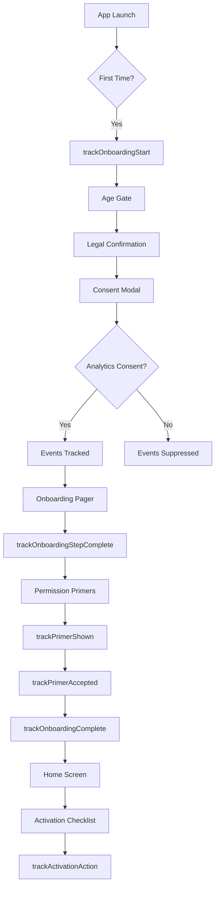

# Onboarding & Activation Analytics Events

This document describes the analytics taxonomy for the onboarding and activation flow. All events are **consent-gated** and will only fire if the user has granted analytics consent.

## Privacy & Consent

- **Consent Required**: All onboarding analytics events require `analytics` consent
- **No PII**: Events contain no personally identifiable information
- **Data Minimization**: Only essential metrics are tracked
- **Opt-Out**: Users can withdraw consent at any time in Settings

## Event Taxonomy

### Onboarding Flow Events

#### `onboarding_start`

Fired when the onboarding flow begins.

**Payload:**

```typescript
{
  version: number; // Onboarding version (e.g., 1)
  source: 'first_run' | 'version_bump' | 'manual';
}
```

**Triggers:**

- First app launch after age gate + legal acceptance
- Major onboarding version bump
- Manual trigger from Settings → About → Rewatch onboarding

**Example:**

```typescript
trackOnboardingStart('first_run');
```

---

#### `onboarding_complete`

Fired when the user completes the onboarding flow.

**Payload:**

```typescript
{
  version: number;          // Onboarding version
  duration_ms?: number;     // Total time spent in onboarding (optional)
  steps_completed: number;  // Number of steps completed (default: 4)
}
```

**Triggers:**

- User taps "Done" on final onboarding slide
- User completes all required onboarding steps

**Example:**

```typescript
trackOnboardingComplete(12000, 4);
```

---

#### `onboarding_skipped`

Fired when the user skips onboarding.

**Payload:**

```typescript
{
  version: number;          // Onboarding version
  current_step: string;     // Step where skip occurred (e.g., 'slide_2')
  reason?: 'user_skip' | 'error' | 'navigation';
}
```

**Triggers:**

- User taps "Skip" button
- Navigation away from onboarding
- Error during onboarding

**Example:**

```typescript
trackOnboardingSkipped('slide_1', 'user_skip');
```

---

#### `onboarding_step_complete`

Fired when the user completes an individual onboarding step.

**Payload:**

```typescript
{
  version: number;          // Onboarding version
  step: string;             // Step identifier (e.g., 'slide_0', 'age-gate')
  step_duration_ms?: number; // Time spent on this step (optional)
}
```

**Triggers:**

- User scrolls to next onboarding slide
- User completes age gate, legal, or consent step

**Example:**

```typescript
trackOnboardingStepComplete('slide_0', 3000);
```

---

### Permission Primer Events

#### `primer_shown`

Fired when a permission primer screen is displayed.

**Payload:**

```typescript
{
  type: 'notifications' | 'photos' | 'camera';
}
```

**Triggers:**

- Notification permission primer screen mounts
- Camera permission primer screen mounts
- Photos permission primer screen mounts

**Example:**

```typescript
trackPrimerShown('notifications');
```

---

#### `primer_accepted`

Fired when the user interacts with a permission primer (allow or decline).

**Payload:**

```typescript
{
  type: 'notifications' | 'photos' | 'camera';
  permission_granted: boolean; // true if permission granted, false if denied/skipped
}
```

**Triggers:**

- User taps "Allow" and grants permission
- User taps "Allow" but denies permission in system dialog
- User taps "Not Now" to skip permission

**Example:**

```typescript
trackPrimerAccepted('notifications', true);
```

---

### Activation Events

#### `activation_action`

Fired when the user completes an activation action from the checklist.

**Payload:**

```typescript
{
  action: 'create-task' | 'open-playbook' | 'try-ai-diagnosis' | 'explore-strains';
  completed: boolean;       // true if action completed successfully
  context?: string;         // Optional context (e.g., 'activation_checklist', 'home')
}
```

**Triggers:**

- User creates their first calendar task
- User adopts a playbook template
- User views a strain detail page
- User bookmarks a strain
- User captures a photo for AI diagnosis

**Example:**

```typescript
trackActivationAction('create-task', true, 'activation_checklist');
```

---

#### `activation_checklist_dismissed`

Fired when the user dismisses the activation checklist widget.

**Payload:**

```typescript
{
  completed_count: number; // Number of actions completed when dismissed
  screen: string; // Screen where dismissed (e.g., 'home')
}
```

**Triggers:**

- User taps "Dismiss" button on activation checklist
- Auto-dismissed after 2+ actions completed

**Example:**

```typescript
analytics.track('activation_checklist_dismissed', {
  completed_count: 2,
  screen: 'home',
});
```

---

## Success Metrics

The following metrics are derived from these events:

### Activation Rate

**Definition**: Percentage of users who complete any 2 of 3 core actions on day 0

**Core Actions:**

1. Creates first calendar item OR adopts a playbook template
2. Views a strains detail OR bookmarks a favorite
3. Captures or selects a plant photo for AI diagnosis

**Calculation:**

```typescript
activationRate = (usersWithTwoOrMoreActions / totalNewUsers) * 100;
```

---

### Time-to-First-Value (TTFV)

**Definition**: Median time from first launch to first core action

**Target**: ≤ 2 minutes

**Calculation:**

```typescript
ttfv = median(firstCoreActionTimestamp - onboardingStartTimestamp);
```

---

### Early Retention

**Definition**: Percentage of users who return on day 1

**Target**: ≥ 45%

**Calculation:**

```typescript
earlyRetention = (usersReturningDay1 / totalNewUsers) * 100;
```

---

## Implementation Details

### Consent Gating

All tracking functions automatically check for analytics consent via the analytics registry:

```typescript
import { getAnalyticsClient } from '@/lib/analytics-registry';

function getClient() {
  return getAnalyticsClient();
}

export function trackOnboardingStart(
  source: 'first_run' | 'version_bump' | 'manual'
): void {
  getClient().track('onboarding_start', {
    version: ONBOARDING_VERSION,
    source,
  });
}
```

The `getAnalyticsClient()` returns a consent-gated client that:

1. Checks if user has granted `analytics` consent
2. Returns `NoopAnalytics` if consent not granted
3. Returns wrapped analytics client if consent granted

### Event Flow



---

## Testing

Comprehensive unit tests are available in:

```
src/lib/compliance/__tests__/onboarding-telemetry.test.ts
```

**Test Coverage:**

- ✅ Consent gating (events suppressed without consent)
- ✅ All event types with correct payloads
- ✅ Event sequences (complete flow, skipped flow)
- ✅ Edge cases (missing optional fields, default values)

**Run Tests:**

```bash
pnpm test onboarding-telemetry
```

---

## Privacy Compliance

### GDPR Compliance

- ✅ Explicit consent required before tracking
- ✅ Clear purpose explanation in consent modal
- ✅ Easy opt-out via Settings
- ✅ Data minimization (no PII)
- ✅ Right to withdraw consent

### App Store Requirements

- ✅ No tracking before consent (iOS ATT compliance)
- ✅ Privacy manifest includes analytics purposes
- ✅ Age-gated (18+ only)
- ✅ Educational focus (no commerce)

---

## Related Documentation

- [Onboarding State Management](../compliance/onboarding-state.md)
- [Activation Checklist](../features/activation-checklist.md)
- [Permission Primers](../features/permission-primers.md)
- [Analytics Registry](../analytics/analytics-registry.md)
- [Privacy & Consent](../privacy/consent-management.md)
